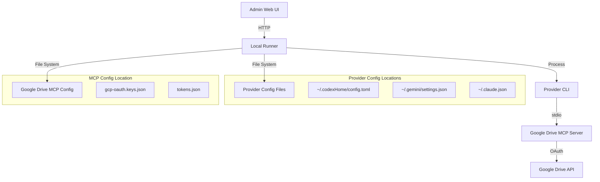
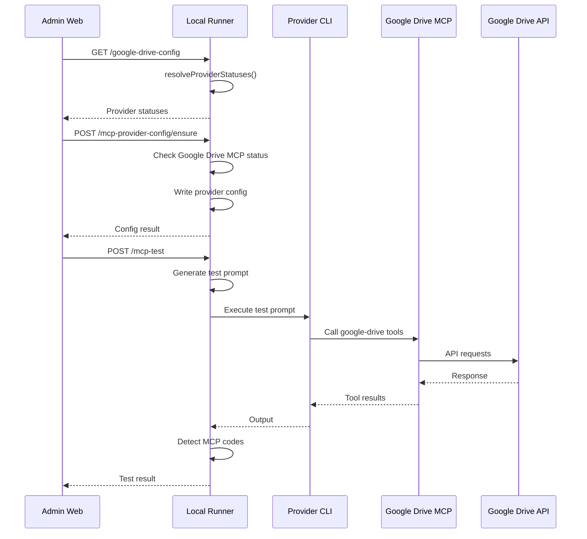
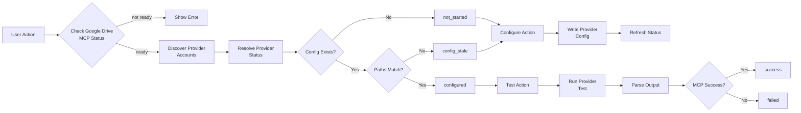

# Design Document: Phase A Completion - Google Drive MCP Provider Integration

## Overview

This document specifies the design for completing Phase A of the CP-05-03 Google Drive MCP Provider Configuration system. Phase A is currently 67% complete with backend foundation in place. This design addresses the 4 critical gaps that prevent Phase A from being truly complete per section 11.23 specification:

1. **Provider-Driven MCP Test**: Verify AI providers can actually use Google Drive MCP tools during workflow execution
2. **Provider Config Status Visibility**: Display which AI providers are configured for Google Drive MCP
3. **Provider Account Discovery**: Auto-discover provider account home paths
4. **Stale Config Detection**: Notify users when provider configuration becomes outdated

### Design Principles

- **Provider CLI Ownership**: AI provider CLIs (Claude, Codex, Gemini) own MCP tool calls, not the runner
- **Runner as Orchestrator**: Runner manages setup, preflight checks, prompt building, and orchestration
- **Idempotent Operations**: All operations can be safely repeated without side effects
- **Account-Home Isolation**: Respect provider account home paths for configuration storage
- **Fail-Fast Preflight**: Block operations early when prerequisites are missing

### Success Criteria

Phase A is complete when:
- Providers can be configured for Google Drive MCP with one click
- Provider configuration status is visible in the UI
- Provider-driven tests verify actual integration paths
- Stale configuration is detected and reported clearly
- All operations are idempotent and safe

## Architecture

### System Context



### Component Interactions



### Data Flow



## Components and Interfaces

### 1. Provider Config Status Resolver

**Responsibility**: Determine configuration status for each provider

**Interface**:
```go
// resolveGoogleDriveMcpProviderStatuses checks provider config status
func (r *Runner) resolveGoogleDriveMcpProviderStatuses() ([]GoogleDriveMcpProviderConfigStatus, error)
```

**Logic**:
1. Get Google Drive MCP runtime config (credential/token paths)
2. Discover provider accounts and home paths
3. For each provider (codex, gemini, claude):
   - Determine config file path based on account home
   - Check if config file exists
   - If exists, parse and validate
   - Check if paths match current MCP runtime config
   - Determine status: not_started, configured, config_stale, failed

**Status Values**:
- `not_started`: Provider config was never checked or doesn't exist
- `configured`: Provider config contains google-drive server with correct paths
- `config_stale`: Provider config exists but credential/token paths differ from current runtime
- `failed`: Provider config file is invalid or unreadable

**Config Path Logic**:
```
Codex:  <accountHomePath>/config.toml
Gemini: <accountHomePath>/.gemini/settings.json
Claude: <accountHomePath>/.claude.json
```

**Stale Detection Logic**:
```go
// Compare config paths with runtime paths
configCredPath := serverConfig.Env["GOOGLE_DRIVE_OAUTH_CREDENTIALS"]
configTokenPath := serverConfig.Env["GOOGLE_DRIVE_MCP_TOKEN_PATH"]

if configCredPath != runtimeConfig.CredentialPath ||
   configTokenPath != runtimeConfig.TokenPath {
    status = "config_stale"
}
```

### 2. Provider Account Discovery

**Responsibility**: Discover provider account home paths automatically

**Interface**:
```go
// Provider inventory already exposes accounts
type Provider struct {
    // ... existing fields
    Accounts []ProviderAccount `json:"accounts,omitempty"`
}

type ProviderAccount struct {
    ID       string `json:"id"`
    HomePath string `json:"homePath"`
    Label    string `json:"label,omitempty"`
}
```

**Detection Strategy**:

**Codex**:
- Check `CODEX_HOME` environment variable
- Check default paths: `~/.codexHome`, `~/codex-accounts/*`
- Validate by checking for `config.toml` or `.codex/` directory

**Gemini**:
- Check `~/.gemini/settings.json` (user config)
- Check `.gemini/settings.json` (workspace config)
- Check `GEMINI_HOME` if set

**Claude**:
- Check `~/.claude.json` (user config)
- Check `.mcp.json` (project config)
- Check account-specific paths if multiple accounts exist

**Implementation**:
```go
func (r *Runner) discoverProviderAccountHomes(providerKey string) ([]string, error) {
    switch providerKey {
    case "codex":
        return discoverCodexAccountHomes()
    case "gemini":
        return discoverGeminiAccountHomes()
    case "claude":
        return discoverClaudeAccountHomes()
    default:
        return nil, fmt.Errorf("unsupported provider: %s", providerKey)
    }
}
```

### 3. Provider-Driven MCP Test

**Responsibility**: Verify providers can use Google Drive MCP tools

**Extended Request Type**:
```go
type McpTestRequest struct {
    // Existing fields
    BackendKey    string `json:"backendKey"`
    ProviderType  string `json:"providerType"`
    ProjectID     string `json:"projectId"`
    IntegrationID string `json:"integrationId"`
    Prompt        string `json:"prompt"`
    TimeoutMs     int    `json:"timeoutMs"`
    
    // New fields for provider-driven tests
    UseProviderCLI  bool   `json:"useProviderCli"`
    AIProviderKey   string `json:"aiProviderKey,omitempty"`
    AIModelName     string `json:"aiModelName,omitempty"`
    AccountHomePath string `json:"accountHomePath,omitempty"`
    WorkingDirectory string `json:"workingDirectory,omitempty"`
}
```

**Test Execution Flow**:

1. **Preflight Check**:
   - Verify Google Drive MCP status is configured
   - Verify provider CLI is installed
   - Verify provider account exists
   - Verify provider config contains google-drive server

2. **Prompt Generation**:
   ```go
   prompt := InjectRequiredMcpInstructions(
       basePrompt,
       []string{"google_drive"},
       providerKey,
       false, // read-only
   )
   ```

3. **Provider CLI Execution**:
   ```go
   // Use existing ExecutePrompt logic
   result := r.ExecutePrompt(ctx, PromptExecutionRequest{
       ProviderKey:      testRequest.AIProviderKey,
       ModelName:        testRequest.AIModelName,
       Prompt:           augmentedPrompt,
       AccountHomePath:  testRequest.AccountHomePath,
       WorkingDirectory: testRequest.WorkingDirectory,
       TimeoutMs:        testRequest.TimeoutMs,
   })
   ```

4. **Output Analysis**:
   ```go
   // Detect MCP failure codes in output
   codes := []string{
       "MCP_UNAVAILABLE",
       "MCP_AUTH_REQUIRED",
       "MCP_TOOL_BLOCKED",
       "MCP_TOOL_FAILED",
       "DRIVE_CONTENT_NOT_FOUND",
   }
   
   for _, code := range codes {
       if strings.Contains(result.StdoutSummary, code) ||
          strings.Contains(result.OutputMarkdown, code) {
           return failedResult(code)
       }
   }
   ```

5. **Artifact Storage**:
   ```
   .flowpilot/mcp-tests/{runID}/
   ├── request.json          # Original request
   ├── prompt.txt            # Generated prompt with MCP instructions
   ├── stdout.txt            # Provider CLI stdout
   ├── stderr.txt            # Provider CLI stderr
   ├── output.md             # Parsed output markdown
   └── result.json           # Test result summary
   ```

**Verification Prompt Template**:
```markdown
This is a FlowPilot MCP verification task.

Use the MCP server named `google-drive`.
Call the Google Drive MCP auth/status diagnostic tool if available.
If that tool is unavailable, list up to 3 files from the Drive root folder.

Return only:
- MCP server used
- tool used
- status
- any error message

If the MCP server or tool is unavailable, say `MCP_UNAVAILABLE` and explain the exact cause.
Do not invent Drive content.
```

### 4. Stale Config Detection

**Responsibility**: Detect when provider config needs updating

**Detection Points**:

1. **In resolveProviderStatuses()**:
   - Compare saved config paths with current runtime paths
   - Return `config_stale` status if paths differ

2. **In PreflightGoogleDriveMcp()**:
   - Check provider config before workflow execution
   - Return clear error if stale

**Stale Detection Logic**:
```go
func (r *Runner) detectStaleConfig(
    providerKey string,
    configPath string,
    runtimeConfig googleDriveMcpRuntimeConfig,
) (bool, error) {
    // Load provider config
    serverConfig, err := loadProviderMcpServerConfig(providerKey, configPath)
    if err != nil {
        return false, err
    }
    
    // Check credential path
    configCredPath := serverConfig.Env["GOOGLE_DRIVE_OAUTH_CREDENTIALS"]
    if configCredPath != runtimeConfig.CredentialPath {
        return true, nil
    }
    
    // Check token path
    configTokenPath := serverConfig.Env["GOOGLE_DRIVE_MCP_TOKEN_PATH"]
    if configTokenPath != runtimeConfig.TokenPath {
        return true, nil
    }
    
    return false, nil
}
```

**Error Messages**:
- Status response: `"Provider has stale Google Drive MCP config"`
- Preflight check: `"Provider has stale Google Drive MCP config. Re-run Configure Providers."`
- UI tooltip: `"Configuration is outdated. Credential or token paths have changed. Click Configure Providers to update."`

**Update in PreflightGoogleDriveMcp**:
```go
func (r *Runner) PreflightGoogleDriveMcp(providerKey string, accountHomePath string) MCPPreflightCheck {
    // ... existing checks ...
    
    // Add stale detection
    if configExists {
        isStale, err := r.detectStaleConfig(providerKey, configPath, mcpStatus)
        if err == nil && isStale {
            result.ErrorMessage = "Provider has stale Google Drive MCP config. Re-run Configure Providers."
            return result
        }
    }
    
    // ... rest of logic ...
}
```

## Data Models

### Extended Types

**GoogleDriveWorkspaceConfigResponse** (extended):
```go
type GoogleDriveWorkspaceConfigResponse struct {
    ArtifactSync    GoogleDriveArtifactSyncStatus           `json:"artifactSync"`
    MCP             GoogleDriveMcpStatus                    `json:"mcp"`
    ProviderConfigs []GoogleDriveMcpProviderConfigStatus    `json:"providerConfigs"` // NEW
    RunnerReachable bool                                    `json:"runnerReachable"`
    LastError       string                                  `json:"lastError,omitempty"`
    UpdatedAt       string                                  `json:"updatedAt,omitempty"`
}
```

**GoogleDriveMcpProviderConfigStatus**:
```go
type GoogleDriveMcpProviderConfigStatus struct {
    ProviderKey     string `json:"providerKey"`     // "codex", "gemini", "claude"
    AccountHomePath string `json:"accountHomePath"` // Full path to account home
    ConfigPath      string `json:"configPath"`      // Full path to config file
    Status          string `json:"status"`          // not_started, configured, config_stale, failed
    LastCheckedAt   string `json:"lastCheckedAt,omitempty"`
    LastError       string `json:"lastError,omitempty"`
}
```

**McpTestResult** (extended):
```go
type McpTestResult struct {
    // Existing fields
    Status         string   `json:"status"`
    RunID          string   `json:"runId"`
    BackendKey     string   `json:"backendKey"`
    ProviderType   string   `json:"providerType"`
    ProjectID      string   `json:"projectId"`
    IntegrationID  string   `json:"integrationId"`
    Command        string   `json:"command"`
    StdoutSummary  string   `json:"stdoutSummary"`
    StderrSummary  string   `json:"stderrSummary"`
    OutputMarkdown string   `json:"outputMarkdown"`
    ArtifactPaths  []string `json:"artifactPaths"`
    StartedAt      string   `json:"startedAt"`
    CompletedAt    string   `json:"completedAt"`
    ErrorMessage   string   `json:"errorMessage"`
    
    // New fields
    AIProviderKey   string `json:"aiProviderKey,omitempty"`   // Provider used for test
    AIModelName     string `json:"aiModelName,omitempty"`     // Model used for test
    McpServerName   string `json:"mcpServerName,omitempty"`   // MCP server name used
    McpToolUsed     string `json:"mcpToolUsed,omitempty"`     // First tool called
    McpFailureCode  string `json:"mcpFailureCode,omitempty"`  // Failure code if any
}
```

### TypeScript Types (admin-web)

**HttpLocalRunnerGateway** additions:
```typescript
interface GoogleDriveWorkspaceConfigResponse {
  artifactSync: GoogleDriveArtifactSyncStatus;
  mcp: GoogleDriveMcpStatus;
  providerConfigs?: GoogleDriveMcpProviderConfigStatus[]; // NEW
  runnerReachable: boolean;
  lastError?: string;
  updatedAt?: string;
}

interface GoogleDriveMcpProviderConfigStatus {
  providerKey: string;
  accountHomePath: string;
  configPath: string;
  status: 'not_started' | 'configured' | 'config_stale' | 'failed';
  lastCheckedAt?: string;
  lastError?: string;
}

interface GoogleDriveMcpProviderConfigRequest {
  providerKey: string;
  accountHomePath: string;
  scope: 'account' | 'workspace';
  mode: 'read_only' | 'read_write';
}

interface GoogleDriveMcpProviderConfigResponse {
  providerKey: string;
  serverName: string;
  status: string;
  changed: boolean;
  configPath: string;
  lastError?: string;
}
```

**Gateway method**:
```typescript
async ensureGoogleDriveMcpProviderConfig(
  request: GoogleDriveMcpProviderConfigRequest
): Promise<GoogleDriveMcpProviderConfigResponse> {
  const response = await this.post(
    '/google-drive-config/mcp-provider-config/ensure',
    request
  );
  return response.json();
}
```

## Error Handling

### Error Categories

1. **Prerequisite Errors**: Block operations when prerequisites missing
2. **Configuration Errors**: Config file invalid or unreadable
3. **Stale Config Errors**: Config exists but paths don't match
4. **Provider CLI Errors**: Provider binary missing or execution failed
5. **MCP Errors**: MCP server unavailable or tools blocked

### Error Messages

**Prerequisite Blocking**:
```
"Google Drive MCP must be configured and authenticated before configuring providers (current status: {status})"

"Google Drive MCP credential JSON is missing. Upload the Desktop OAuth JSON first."

"Google Drive MCP auth is incomplete. Run Start Auth, complete sign-in, then refresh status."
```

**Config Errors**:
```
"Failed to read {provider} config: {error}"

"Existing {provider} config is invalid {format}: {error}"

"Provider config file is invalid or unreadable"
```

**Stale Config**:
```
"Provider has stale Google Drive MCP config. Re-run Configure Providers."

"Configuration is outdated. Credential or token paths have changed."
```

**Provider CLI Errors**:
```
"Provider CLI binary is not installed: {provider}"

"Provider execution failed: {error}"
```

**MCP Errors**:
```
"MCP server 'google-drive' is unavailable to {provider}"

"MCP authentication required: {details}"

"MCP tool '{tool}' was blocked by provider policy"

"MCP tool execution failed: {error}"
```

### Error Recovery

**User Actions**:
1. **needs_input** → Upload Desktop OAuth JSON
2. **needs_auth** → Run Start Auth flow
3. **not_started** → Click Configure Providers
4. **config_stale** → Re-run Configure Providers
5. **failed** → Check error message, fix config manually or delete and retry

**Automatic Recovery**:
- Idempotent operations allow safe retry
- Config preservation prevents data loss
- Clear error messages guide user action

## Testing Strategy

### Unit Tests

**Test Coverage**:
1. Provider status resolution
2. Provider account discovery
3. Stale config detection
4. Error message generation
5. Prerequisite checking

**Test Cases**:

```go
func TestResolveProviderStatuses_AllProviders(t *testing.T)
func TestResolveProviderStatuses_StaleConfig(t *testing.T)
func TestResolveProviderStatuses_NoConfig(t *testing.T)
func TestDetectStaleConfig_PathMismatch(t *testing.T)
func TestDetectStaleConfig_PathsMatch(t *testing.T)
func TestDiscoverProviderAccounts_Codex(t *testing.T)
func TestDiscoverProviderAccounts_Gemini(t *testing.T)
func TestDiscoverProviderAccounts_Claude(t *testing.T)
func TestPreflightCheck_StaleConfig(t *testing.T)
```

### Integration Tests

**Test Scenarios**:
1. End-to-end provider configuration
2. Provider-driven MCP test execution
3. Stale config detection and recovery
4. Multi-provider configuration
5. Config preservation on update

**Test Flow**:
```
1. Setup: Configure Google Drive MCP
2. Action: Configure Codex provider
3. Verify: Config file contains google-drive server
4. Action: Change Google Drive MCP credential path
5. Verify: Provider status shows config_stale
6. Action: Re-configure provider
7. Verify: Status returns to configured
8. Action: Run provider-driven test
9. Verify: Test succeeds and artifacts saved
```

### Manual Testing

**Checklist**:
- [ ] UI displays provider status badges
- [ ] Configure Providers button disabled until MCP ready
- [ ] Click Configure Providers updates all providers
- [ ] Provider statuses refresh after configuration
- [ ] Stale config displays warning icon
- [ ] Re-configure updates stale config
- [ ] Provider test executes through provider CLI
- [ ] Test artifacts saved correctly
- [ ] MCP failure codes detected correctly
- [ ] Error messages are actionable

### Test Data

**Mock Configurations**:
```toml
# Codex config.toml with correct paths
[mcp_servers.google-drive]
command = "npx"
args = ["-y", "@piotr-agier/google-drive-mcp"]
enabled = true

[mcp_servers.google-drive.env]
GOOGLE_DRIVE_OAUTH_CREDENTIALS = "/home/user/.config/google-drive-mcp/gcp-oauth.keys.json"
GOOGLE_DRIVE_MCP_TOKEN_PATH = "/home/user/.config/google-drive-mcp/tokens.json"

# Codex config.toml with stale paths
[mcp_servers.google-drive.env]
GOOGLE_DRIVE_OAUTH_CREDENTIALS = "/old/path/gcp-oauth.keys.json"
GOOGLE_DRIVE_MCP_TOKEN_PATH = "/old/path/tokens.json"
```

**Test Provider Output**:
```
# Success output
Using MCP server: google-drive
Tool called: authGetStatus
Status: authenticated
Account: user@example.com

# Failure output with code
MCP_UNAVAILABLE: Server 'google-drive' not found in provider config
```

---

## Property-Based Testing Assessment

**PBT Applicability**: ❌ **NOT APPROPRIATE**

This feature is **not suitable for property-based testing** because:

1. **Infrastructure Configuration**: Tests infrastructure setup (provider config files, file system operations, process execution)
2. **External Process Interaction**: Depends on provider CLI binaries and their execution behavior
3. **File System State**: Tests file existence, parsing, and modification operations
4. **Deterministic Behavior**: Config validation doesn't vary meaningfully with randomized inputs
5. **One-Shot Operations**: Many operations are one-time checks (file exists, binary available)

**Alternative Testing Strategies**:
- **Unit tests** for status resolution logic and stale detection
- **Integration tests** with mock file systems and provider configs
- **Example-based tests** for specific config formats (Codex TOML, Gemini JSON, Claude JSON)
- **Manual tests** for end-to-end UI workflows

**Why Example-Based Tests Are Better**:
- Config file formats are fixed (TOML, JSON)
- Provider config schemas are deterministic
- File path validation has specific edge cases (not infinite input space)
- Running 100+ iterations doesn't reveal more bugs than 2-3 well-chosen examples
- Most logic is "check if X exists and matches Y" which is binary, not parameterized

