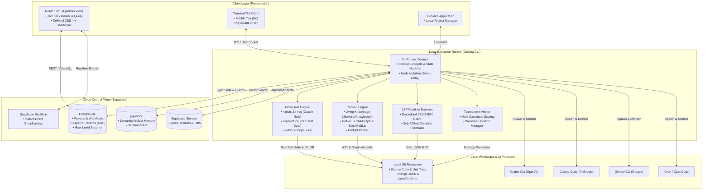

# 🚀 FlowPilot: The AI-Assisted Engineering Operating Layer & Defensive Harness

<p align="center">
  
  
  
  
  
</p>

<p align="center">
  <b>FlowPilot</b> is an enterprise-grade AI-assisted software engineering platform. Rather than acting as a simple, stateless chat wrapper, FlowPilot serves as a durable, execution-controlled <b>harness operating layer</b> around real-world codebases. It enforces strict development discipline, eliminates regression loops, preserves project memory across devices, and bridges cloud collaboration with local developer workspaces.
</p>

---

## 📑 Table of Contents

- [The Core Problem: Why Raw AI Fails in Production](#-the-core-problem-why-raw-ai-fails-in-production)
- [The 7 Architectural Superpowers](#-the-7-architectural-superpowers)
  - [1. The Oracle Rule, Reproduce-First & Defensive Gateways](#1-️-the-oracle-rule-reproduce-first--defensive-gateways)
  - [2. Two-Tier Code Intelligence (Macro Knowledge Graph + Micro LSP Runtime)](#2--two-tier-code-intelligence-macro-graph--micro-lsp-runtime)
  - [3. Living Knowledge Base & Pluggable Context Engine](#3--living-knowledge-base--pluggable-context-engine)
  - [4. Multi-Candidate Tournament & Deterministic Arbitration](#4-️-multi-candidate-tournament--deterministic-arbitration)
  - [5. Crash-Resilient 8-State CAS Dispatch & Linearized Stop](#5--crash-resilient-8-state-cas-dispatch--linearized-stop)
  - [6. Dual Working Modes & Standalone Autonomous TUI](#6--dual-working-modes--standalone-autonomous-tui)
  - [7. Cross-Device & Cross-Provider Continuity](#7--cross-device--cross-provider-continuity)
- [System Architecture](#-system-architecture)
- [Feature Comparison Matrix](#-feature-comparison-matrix)
- [Quick Start Guide](#-quick-start-guide)
- [Monorepo Project Structure](#-monorepo-project-structure)
- [License](#-license)

---

## 💥 The Core Problem: Why Raw AI Fails in Production

Using raw LLM chats or stateless coding assistants in real-world software engineering introduces critical failure modes:

1. **The Regression Trap & Test Tampering**: When code breaks, an LLM's natural instinct is often to rewrite assertions in existing unit tests to make the test command exit green. Caught regressions are silently converted into shipped bugs.
2. **Context Amnesia & "Lost in the Middle"**: Dumping raw files into a prompt exceeds token windows, degrades reasoning, and loses critical decisions made across past sessions or different machines.
3. **Unbounded Agent Loops**: Multi-agent setups without formal stopping contracts enter circular apology loops (*"I apologize, let me fix that..."*), burning tokens without converging.
4. **Lack of Infrastructure Enforcement**: Telling an agent *"please do not modify this file"* in a prompt is a polite suggestion; without transport-level isolation, agents frequently overwrite out-of-scope files.
5. **Loss of Memory Across Devices**: Moving from an office desktop to a home laptop typically resets project context and conversational history when relying on local-only coding CLIs.

**FlowPilot** transforms AI usage from fragile prompt engineering into deterministic **Harness Engineering**.

---

## ⚡ The 7 Architectural Superpowers

### 1. 🛡️ The Oracle Rule, Reproduce-First & Defensive Gateways

FlowPilot prevents AI hallucinations and silent test corruption through an automated, runner-owned **Flow Gate Engine**:

*   **The Oracle Rule**: Pre-existing unit and integration tests are an absolute ground truth (Oracle). When an agent modifies code, the runner captures test outcomes against a baseline. If a pre-existing test fails, the runner fires an **un-downgradable hard block**. Agents are physically barred from weakening or modifying pre-existing tests to force a green status.
*   **The Reproduce-First Defect Engine (`r-reproduce`)**: When addressing a bug report or regression, the agent is physically locked out of editing production code until it authors an executable reproduction test that compiles cleanly and fails via an assertion error. Once verified RED by the runner, the test file is locked read-only during the coder's turn to prevent retroactive tampering.
*   **Comprehensive Flow Gate Suite**:
    *   **Regression & Test Integrity**: `r-tests` (suite verification), `r-reg` (regression detection vs. baseline), `r-reproduce` (mandatory red test prior to fix), `r-additive-tests` (detects tampering with existing test files), and `r-newtest` (forces newly added unit tests for new production code).
    *   **Scope & Intent Contracts**: `r-contract` (forces the agent to declare an intended change contract before editing), `r-scope` (detects edits landing outside the declared file/symbol scope), `r-spec-drift`, and `r-code-drift` (flags divergence between code implementation and canonical specifications).
    *   **Engineering Governance**: `r-dod-present` (mandates a binary checkbox Definition of Done for every task/bugfix), `r-dod-complete` (blocks task completion unless all items are checked or formally explained), `r-ca` (mandates machine-parseable Change-Audit notes), and `r-fk` (enforces verified feature keys in commits).
    *   **Specification Guard**: `r-requirement` (monitors test signatures against locked requirements in autonomous modes).
*   **Schema-First 4 Tiers (T0–T3)**: The engine never parses natural language prose to make routing decisions:
    - `T0 (Deterministic)`: Pure Go code, regex, AST inspection, and Git diff analysis (0-token cost).
    - `T1 (Transport Schema)`: Enforced via Tool-call JSON Schemas (e.g., per-AC review verdicts with `file:line` citations).
    - `T2 (Validation & Reprompt)`: Runner validation with at most one corrective retry.
    - `T3 (Fail-Closed)`: Suspends execution and surfaces a structured decision card to the operator.
*   **Node Isolation (Silent-Deny)**: Reviewer, Scout, and Owner agents run under a hardware-level read-only posture where write tool calls are intercepted and rejected before touching the disk.

---

### 2. 🔬 Two-Tier Code Intelligence (Macro Graph + Micro LSP Runtime)

FlowPilot bridges architectural understanding with real-time compiler feedback through a coordinated two-tier intelligence model:

```text
┌─────────────────────────────────────────────────────────────────────────────┐
│                   TIER 1: MACRO PLANE (KNOWLEDGE GRAPH)                     │
│  - Full-repo symbol indexing, blast-radius risk scoring (Low/Med/High/Crit) │
│  - 300+ mapped business execution flows across modules                      │
│  - Used during: Planning, Architecture, Gate Scope Enforcement              │
└──────────────────────────────────────┬──────────────────────────────────────┘
                                       │
                         Scope & Architecture Boundaries
                                       │
                                       ▼
┌─────────────────────────────────────────────────────────────────────────────┐
│                    TIER 2: MICRO PLANE (LSP RUNTIME)                        │
│  - Embedded JSON-RPC client running over standard I/O (stdin/stdout)        │
│  - Talks directly to native language servers (gopls, vtsls, pyright, clangd)│
│  - In-memory AST analysis delivering compiler diagnostics in <200ms         │
│  - Used during: Live Editing, Pre-Gate Compiler Verification                │
└─────────────────────────────────────────────────────────────────────────────┘
```

*   **Sub-200ms Compiler Feedback**: Immediately following a file edit, the embedded LSP client evaluates in-memory syntax and type correctness. Compiler errors are injected into the agent's feedback loop before expensive test suites run, eliminating up to 80% of token waste caused by basic typos or missing imports.
*   **Zero-Dependency Transport**: Operates entirely over local OS standard I/O pipes (stdin/stdout) with standard `Content-Length` framing—requiring no local open ports, avoiding firewall popups, and eliminating port collisions.

---

### 3. 🧠 Living Knowledge Base & Pluggable Context Engine

FlowPilot replaces simple file dumps with a dynamic, self-maintaining knowledge repository:

```text
┌─────────────────────────────────────────────────────────────────────────────┐
│                    FLOWPILOT PLUGGABLE CONTEXT CATALOG                      │
├───────────────────────────────┬─────────────────────────────────────────────┤
│ 1. Living Knowledge Flows     │ Pre-distilled execution flows (.flowpilot/) │
│ 2. Project Conventions        │ Guidelines, architecture rules (repo-config)│
│ 3. Canonical Intent Head      │ Authoritative spec statement & digital SHA  │
│ 4. Negative Knowledge         │ Superseding records: rejected alternatives   │
│ 5. Change Ledger              │ Commit-indexed, feature-tagged history      │
│ 6. Code Structure & AST       │ Call-graphs & blast-radius analysis         │
│ 7. Locus-Anchored Excerpts    │ Code snippets tightly scoped to change locus│
│ 8. Sprint Handoff Artifacts   │ Passing "why" context across sequential runs│
│ 9. Semantic Artifact Memory   │ Vector RAG search via pgvector on past runs │
└───────────────────────────────┴─────────────────────────────────────────────┘
```

*   **Living Knowledge Base (`.flowpilot/knowledge/`)**: Distills complex, multi-module execution paths into concise Markdown summaries (`system-overview.md`, `execution-flows.md`, `data-models.md`). The runner deterministically extracts the relevant flow trace based on the target locus and injects it into planning nodes—saving 30,000–50,000 tokens of blind file exploration per session.
*   **Incremental Audit Maintenance**: Knowledge briefs are updated automatically during the final `audit` node of every flow after changes have been verified and approved.
*   **Negative Knowledge & Decision Records**: When a feature churns through multiple attempts ($A \to B \to C \to A$), FlowPilot collapses positive churn while promoting rejected alternatives and their failure reasons, preventing repetitive mistakes.
*   **Sprint Handoff Artifacts (`sprint_handoff.v1`)**: The terminal stage of each sprint exports an immutable handoff artifact. The next sprint consumes this artifact as high-priority context, preserving technical rationale across sprints.

---

### 4. ⚔️ Multi-Candidate Tournament & Deterministic Arbitration

To prevent models from falling into repetitive, patched-over failure loops (*cognitive lock-in*) when tackling difficult algorithmic bugs or race conditions, FlowPilot provides a parallel competitive harness:

```text
                                [ DIFFICULT TASK / CAP STALL ]
                                              │
                         ┌────────────────────┼────────────────────┐
                         ▼ (Isolated Worktree)▼ (Isolated Worktree)▼ (Isolated Worktree)
                       Claude                Codex                Grok
                    Candidate A          Candidate B          Candidate C
                         │                    │                    │
                         └────────────────────┼────────────────────┘
                                              ▼
                                 [ TOURNAMENT ARBITER ]
                     Deterministic Score = (0.50 × TestPassRate)
                                         + (0.30 × LSPCleanliness)
                                         + (0.20 × MinimalBlastRadius)
                                              │
                                              ▼
                                    [ AUTOMATIC WINNER ]
                                  (Merged to Main Branch)
```

*   **Dual Integration Modes**: Available as a standalone pipeline (`tournament-harness`) for designated high-complexity tasks, and as an automated **Escalation Fallback** triggered when standard review loops exceed their retry cap (`review_cap_exceeded`).
*   **Isolated Git Worktrees**: Each candidate operates within a dedicated temporary worktree (`.flowpilot/worktrees/candidate-<id>`), guaranteeing zero file-system cross-contamination.
*   **Zero-Hallucination Arbitration**: The winning patch is selected via deterministic mathematical scoring—evaluating regression outcomes, compiler cleanliness, and blast radius—without relying on subjective LLM consensus.

---

### 5. 🔄 Crash-Resilient 8-State CAS Dispatch & Linearized Stop

*   **Forward-Only State Machine**: Transitions through 8 explicit states: `prepared -> send_claimed -> send_started -> provider_accepted -> terminal_*` with Compare-And-Swap (CAS) on `Revision`.
*   **Linearization Point**: Eliminates race conditions when a user hits **STOP**. If stopped before `send_started`, zero bytes reach the provider. If stopped after, a graceful cancellation signal propagates to the provider process.
*   **Fail-Closed Error Recovery**: Network drops, power failures, or corrupted storage never cause duplicate dispatches. The run enters an explicit `uncertain` or `repair_required` state that halts automation and presents a resolvable card to the operator.

---

### 6. 👥 Dual Working Modes & Standalone Autonomous TUI

FlowPilot provides complete operational flexibility across environments:

#### Dev Mode vs. Vibe Mode
*   **Dev Mode (`--mode=dev`)**: Interactive developer-in-the-loop operation. Structured decision cards pause execution at key gates, allowing human operators to approve, revise, or redirect.
*   **Vibe Mode (`--mode=vibe`)**: Autonomous multi-sprint delivery from a single specification document. Employs upfront **SS-Lock** to anchor business requirements, followed by automated **2-Owner Debate** (`Owner_1 ∥ Owner_2 -> Hub`) to resolve intermediate decisions.

#### Standalone Autonomous Terminal Experience (TUI)
Built with Go and Bubble Tea, the terminal client (`flowpilot chat`) provides a complete, keyboard-driven engineering cockpit without requiring a running desktop application:
*   **Interactive Project Wizard**: Automatic project platform detection (Go, TypeScript/Next.js, Python, Rust, Android), automatic git status checks, and instant workspace binding.
*   **Autonomous Onboarding Modals**: Built-in modals for authentication and Supabase configuration (`/login`, `/setup`, `/supabase`, `/project`).
*   **Dual Mode Statusline & Slash Navigation**: Direct visibility into agent turns, token consumption, gate verdicts, and execution flow nodes.

---

### 7. 🌐 Cross-Device & Cross-Provider Continuity

FlowPilot decouples engineering execution from physical workstations and individual AI providers:

*   **Cloud Control Plane & Cross-Device Sync**: Project settings, workflow run histories, specifications, and artifact memory are centralized in Supabase (PostgreSQL + pgvector + Realtime + Storage). Seamlessly transition from a desktop workstation to a laptop in the field without losing conversation state, open review cards, or workflow progress.
*   **Chat Continuity & Provider Handoff (SSOT)**: Conversation logs are stored as linearized, immutable turn histories in a provider-agnostic format. Switch between Claude 3.7 Sonnet, OpenAI Codex/o3, Google Gemini Flash, and Grok on the fly without prompt amnesia or vendor lock-in.
*   **Decoupled Local Execution**: The cloud control plane never accesses private source code directly. All compiler interactions, git operations, file system reads/writes, and test runner executions remain strictly local within the Go-Runner daemon.

---

## 📐 System Architecture

FlowPilot operates on a decoupled 3-tier architecture:



---

## 📊 Feature Comparison Matrix

| Feature / Capability | Raw LLM Chat (ChatGPT, Web) | Inline Copilots (Copilot, Supermaven) | Autonomous CLI (Aider, Claude Code) | **FlowPilot** |
| :--- | :---: | :---: | :---: | :---: |
| **State Persistence** | Ephemeral | None (editor state) | Local session only | **Cloud + Local Sync (Durable DB)** |
| **Cross-Device Continuity** | Chat text only | None | ❌ Lost when changing PCs | ✅ **Full Memory & Workspace Bindings** |
| **The Oracle Rule (Test Guard)** | ❌ Modifies tests | ❌ Modifies tests | ⚠️ Soft warning in prompt | ✅ **Hard-Block Infrastructure Gate** |
| **Reproduce-First Defect Engine** | ❌ None | ❌ None | ❌ None | ✅ **Mandatory Red Test Gate (`r-reproduce`)** |
| **Two-Tier Code Intelligence** | ❌ None | ⚠️ Single file | ⚠️ Grep / ctags | ✅ **Macro Graph + Micro LSP (<200ms)** |
| **Living Knowledge Base** | ❌ None | ❌ None | ❌ Blind file exploration | ✅ **Distilled Execution Flows (`knowledge.flow`)** |
| **Multi-Candidate Tournament** | ❌ None | ❌ None | ❌ None | ✅ **Parallel Rollout + Deterministic Arbiter** |
| **Comprehensive Gateways** | ❌ None | ❌ None | ❌ None | ✅ **Suite of 20+ Automated Rules** |
| **Pluggable Context Sources** | Manual copy-paste | Local file buffer | Repository search / grep | ✅ **Conventions, Head, AST & Ledger** |
| **Multi-Agent Orchestration** | ❌ None | ❌ None | Single agent loops | ✅ **Hub-and-Spoke + 2-Owner Debate** |
| **Persistent Approval Gates** | ❌ None | ❌ None | Prompt confirmation | ✅ **Auditable DB Gates (`WAITING_APPROVAL`)** |
| **Cross-Provider Switch** | ❌ Must restart | ❌ Tied to vendor | ❌ Provider-locked | ✅ **Linearized Chat-SSOT Handoff** |
| **Standalone Autonomous TUI** | ❌ None | ❌ None | ⚠️ CLI without wizard | ✅ **Bubble Tea Cockpit + Auto Onboarding** |
| **Non-Tech Auto Sprints** | ❌ None | ❌ None | ❌ Complex CLI | ✅ **Vibe Mode (SS-Lock + Auto TDD)** |


---

## 🚀 Quick Start & Installation

### 📦 Option 1: Instant CLI Installation (Recommended)

Choose your preferred package manager or one-line script:

#### macOS & Linux (via Homebrew)
```bash
brew install dattien96/flowpilot
flowpilot chat .
```

#### macOS & Linux (One-line Shell Script)
```bash
curl -fsSL https://raw.githubusercontent.com/dattien96/flowpilot/main/scripts/install.sh | bash
```

#### Windows (PowerShell)
```powershell
irm https://raw.githubusercontent.com/dattien96/flowpilot/main/scripts/install.ps1 | iex
```

#### Go Native Install
```bash
go install github.com/dattien96/flowpilot/apps/local-runner/cmd/flowpilot@latest
```

---

### 🛠️ Option 2: Local Development Setup (Full Stack)

If you are developing or contributing to the FlowPilot monorepo (Admin Web + Runner + Desktop):

#### Prerequisites
- **Go**: `1.22+`
- **Node.js**: `20+` and `npm` / `pnpm`
- **Just**: Command runner (`cargo install just`, `brew install just`, or `choco install just`)
- **Git**: Installed and configured
- **Supabase**: Local Supabase CLI or a free Cloud project

#### 1. Clone the Repository
```bash
git clone https://github.com/dattien96/flowpilot.git
cd flowpilot
```

#### 2. Configure Environment
Copy the sample environment file and configure your credentials:
```bash
cp .env.example .env
```
Set your `SUPABASE_URL` and `SUPABASE_ANON_KEY`, and ensure your local AI CLI tools (`claude`, `codex`, `gemini`) are authenticated in your terminal.

#### 3. Start the Full Stack (`just dev`)
Start the **Admin Web**, **Local Runner daemon**, and **Desktop Application** together in a single command:
```bash
just dev
```
The supervisor orchestrates all three components, auto-wiring the Desktop interface to the live Local Runner over HTTP/SSE.

#### 4. Start the Terminal TUI Client (`just chat-dev`)
For a fast, keyboard-driven terminal experience running directly against any target project:
```bash
just chat-dev /path/to/your/project
```
*(Example: `just chat-dev C:/working/my-android-app` or `just chat-dev /Users/me/backend-service`)*

---

## 📂 Monorepo Project Structure

```text
flowpilot/
├── apps/
│   ├── admin-web/             # React 19 + TanStack Router + Tailwind 4 dashboard
│   ├── local-runner/          # Go Cobra daemon, state machine, and TUI client
│   │   ├── cmd/               # Runner and TUI main entrypoints
│   │   ├── internal/runner/   # FlowGate, CAS Dispatch, Node Isolation, Drift Pause
│   │   ├── internal/skillpack/# Bundled engineering skills and prompt packs
│   │   └── internal/tui/      # Bubble Tea interactive terminal UI
├── requirements/              # System specifications and technical designs
│   ├── learn/                 # AI Engineering & Technical Interview Playbook
│   └── reviews/               # Kill-Review closed-claim records
├── change-audit/              # Machine-parseable audit records per code change
└── supabase/                  # Database migrations, RLS policies, and Edge Functions
```

---

## 📄 License

FlowPilot is distributed under the terms of the **MIT License**.  
See [LICENSE](./LICENSE) for details.