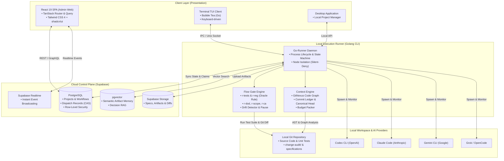

# 🚀 FlowPilot: The AI-Assisted Engineering Operating Layer & Defensive Harness

<p align="center">
  
  
  
  
  
</p>

<p align="center">
  <b>FlowPilot</b> is an enterprise-grade AI-assisted software engineering platform. Rather than acting as a simple, stateless chat wrapper, FlowPilot serves as a durable, execution-controlled <b>harness operating layer</b> around real-world codebases. It enforces strict development discipline, eliminates regression loops, preserves project memory across devices, and bridges cloud collaboration with local developer workspaces.
</p>

---

## 📑 Table of Contents

- [The Core Problem: Why Raw AI Fails in Production](#-the-core-problem-why-raw-ai-fails-in-production)
- [The 5 Architectural Superpowers](#-the-5-architectural-superpowers)
  - [1. The Oracle Rule & Defensive Gateways](#1-️-the-oracle-rule--comprehensive-defensive-gateways)
  - [2. Multi-Source Context Engine & Intelligence](#2--pluggable-context-engine--situational-awareness)
  - [3. Crash-Resilient 8-State CAS Dispatch](#3--crash-resilient-8-state-cas-dispatch--linearized-stop)
  - [4. Dual Working Modes: Dev vs. Vibe](#4--dual-working-modes-dev-mode-vs-vibe-mode)
  - [5. Cross-Device & Cross-Provider Continuity](#5--cross-device--cross-provider-continuity)
- [System Architecture](#-system-architecture)
- [Feature Comparison Matrix](#-feature-comparison-matrix)
- [Quick Start Guide](#-quick-start-guide)
- [Monorepo Project Structure](#-monorepo-project-structure)
- [Learn & Interview Playbook](#-learn--interview-playbook)
- [License](#-license)

---

## 💥 The Core Problem: Why Raw AI Fails in Production

Using raw LLM chats or stateless coding assistants in real-world software engineering introduces critical failure modes:

1. **The Regression Trap & Test Tampering**: When code breaks, an LLM's natural instinct is often to rewrite assertions in existing unit tests to make the test command exit green. Caught regressions are silently converted into shipped bugs.
2. **Context Amnesia & "Lost in the Middle"**: Dumping raw files into a prompt exceeds token windows, degrades reasoning, and loses critical decisions made across past sessions or different machines.
3. **Unbounded Agent Loops**: Multi-agent setups without formal stopping contracts enter circular apology loops (*"I apologize, let me fix that..."*), burning tokens without converging.
4. **Lack of Infrastructure Enforcement**: Telling an agent *"please do not modify this file"* in a prompt is a polite suggestion; without transport-level isolation, agents frequently overwrite out-of-scope files.
5. **Loss of Memory Across Devices**: Moving from an office desktop to a home laptop typically resets project context and conversational history when relying on local-only coding CLIs.

**FlowPilot** transforms AI usage from fragile prompt engineering into deterministic **Harness Engineering**.

---

## ⚡ The 5 Architectural Superpowers

### 1. 🛡️ The Oracle Rule & Comprehensive Defensive Gateways

FlowPilot prevents AI hallucinations from contaminating codebases through an automated, runner-owned **Flow Gate Engine**:

*   **The Oracle Rule**: Pre-existing unit and integration tests are an absolute ground truth (Oracle). When an agent modifies code, the runner captures test outcomes against a baseline. If a pre-existing test fails, the runner fires an **un-downgradable hard block**. Agents are physically barred from weakening or modifying pre-existing tests to force a green status.
*   **Comprehensive Flow Gate Suite**:
    *   **Regression & Test Integrity**: `r-tests` (suite verification), `r-reg` (regression detection vs. baseline), `r-additive-tests` (detects tampering with existing test files), and `r-newtest` (forces newly added unit tests for new production code).
    *   **Scope & Intent Contracts**: `r-contract` (forces the agent to declare an intended change contract before editing), `r-scope` (detects edits landing outside the declared file/symbol scope), `r-spec-drift`, and `r-code-drift` (flags divergence between code implementation and canonical specifications).
    *   **Engineering Governance**: `r-dod-present` (mandates a binary checkbox Definition of Done for every task/bugfix), `r-dod-complete` (blocks task completion unless all items are checked or formally explained), `r-ca` (mandates machine-parseable Change-Audit notes), and `r-fk` (enforces verified feature keys in commits).
    *   **Specification Guard**: `r-requirement` (monitors test signatures against locked requirements in autonomous modes).
*   **Schema-First 4 Tiers (T0–T3)**: The engine never parses natural language prose to make routing decisions:
    - `T0 (Deterministic)`: Pure Go code, regex, AST inspection, and Git diff analysis (0-token cost).
    - `T1 (Transport Schema)`: Enforced via Tool-call JSON Schemas (e.g., per-AC review verdicts with `file:line` citations).
    - `T2 (Validation & Reprompt)`: Runner validation with at most one corrective retry.
    - `T3 (Fail-Closed)`: Suspends execution and surfaces a structured decision card to the operator.
*   **Node Isolation (Silent-Deny)**: Reviewer, Scout, and Owner agents run under a hardware-level read-only posture where write tool calls are intercepted and rejected before touching the disk.

---

### 2. 🧠 Pluggable Context Engine & Situational Awareness

FlowPilot replaces simple file dumps with a pluggable **Context Catalog** that packs precise, relevant intelligence into every turn:

```text
┌─────────────────────────────────────────────────────────────────────────────┐
│                    FLOWPILOT PLUGGABLE CONTEXT CATALOG                      │
├───────────────────────────────┬─────────────────────────────────────────────┤
│ 1. Project Conventions        │ Guidelines, architecture rules (repo-config)│
│ 2. Canonical Intent Head      │ Authoritative spec statement & digital SHA  │
│ 3. Negative Knowledge         │ Superseding records: rejected alternatives   │
│ 4. Change Ledger              │ Commit-indexed, feature-tagged history      │
│ 5. Code Structure & AST       │ GitNexus call-graphs & blast-radius analysis│
│ 6. Locus-Anchored Excerpts    │ Code snippets tightly scoped to change locus│
│ 7. Sprint Handoff Artifacts   │ Passing "why" context across sequential runs│
│ 8. External MCP Context       │ Jira tickets, Figma specs, Crashlytics logs │
│ 9. Semantic Artifact Memory   │ Vector RAG search via pgvector on past runs │
└───────────────────────────────┴─────────────────────────────────────────────┘
```

*   **Negative Knowledge & Decision Records**: When a feature churns through multiple attempts ($A \to B \to C \to A$), FlowPilot collapses positive churn while promoting rejected alternatives and their failure reasons. The AI learns what *not* to do, preventing repetitive mistakes.
*   **Budget Packer**: Packs prompt context into bounded token allocations per section, substituting compact summaries for raw files when limits approach.
*   **Sprint Handoff Artifacts (`sprint_handoff.v1`)**: The terminal stage of each sprint exports an immutable handoff artifact. The next sprint consumes this artifact as high-priority context, preserving technical rationale across sprints.

---

### 3. 🔄 Crash-Resilient 8-State CAS Dispatch & Linearized Stop

*   **Forward-Only State Machine**: Transitions through 8 explicit states: `prepared -> send_claimed -> send_started -> provider_accepted -> terminal_*` with Compare-And-Swap (CAS) on `Revision`.
*   **Linearization Point**: Eliminates race conditions when a user hits **STOP**. If stopped before `send_started`, zero bytes reach the provider. If stopped after, a graceful cancellation signal propagates to the provider process.
*   **Fail-Closed Error Recovery**: Network drops, power failures, or corrupted storage never cause duplicate dispatches. The run enters an explicit `uncertain` or `repair_required` state that halts automation and presents a resolvable card to the operator.

---

### 4. 👥 Dual Working Modes: Dev Mode vs. Vibe Mode

FlowPilot supports two distinct operational modes over the same underlying runner:

#### Dev Mode (`--mode=dev`)
Tailored for hands-on software developers who want fine-grained control:
```text
User Request ──> Plan ──> [Gate 1: Tech Spec] ──> TDD ──> [Gate 2: Code Review] ──> Audit
                                   │                                 │
                             Dev Card: 1/2/3                   Dev Card: 1/2/3
```
- Every gate pauses execution and displays a structured decision card in the Desktop/TUI.
- Choose: `1. Approve and proceed`, `2. Request revision with feedback`, or `3. Abort`.

#### Vibe Mode (`--mode=vibe`)
Designed for autonomous sprint-by-sprint delivery from a single requirement document:
```text
Requirement Spec ──> [SS-Lock Gate: User Confirms] ──> Auto Sprints (TDD -> Code -> Validate)
                                                                │
                                                    2-Owner Autonomous Debate
                                                    (Owner_1 ∥ Owner_2 -> Hub)
```
- **SS-Lock Gate**: Pauses once upfront to lock business requirements (protecting against specification hallucination).
- **Autonomous Resolution via 2-Owner Debate**: Intermediate gates are evaluated and resolved automatically through structured debate between two isolated Owner agents (`Owner_1` and `Owner_2`).
- The user is only notified if code changes conflict with the locked specification (`r-requirement`).

---

### 5. 🌐 Cross-Device & Cross-Provider Continuity

FlowPilot decouples project state from individual physical machines and specific AI providers:

*   **Cross-Device Workspace Continuity**:
    *   Project metadata, workflow definitions, run histories, and generated artifacts reside durably in the cloud (Supabase + Google Drive).
    *   Local directory paths are mapped dynamically per machine via workspace bindings.
    *   Start a workflow run at the office on your desktop, leave it overnight, open your laptop at home, bind the local folder, and resume the run with complete context intact.
*   **Chat Continuity SSOT (Cross-Provider Handoff)**:
    *   Decouples the long-lived chat identity (`chatId`) from short-lived physical provider executions (`runId`).
    *   Switch seamlessly between **Claude (Anthropic)**, **Codex / GPT (OpenAI)**, **Gemini (Google)**, and **Grok (xAI)** in the middle of a session.
    *   The runner executes a 3-phase linearized handoff, packaging past conversation turns, tool calls, and decisions into an optimized handoff envelope so the new provider resumes without amnesia.

---

## 📐 System Architecture

FlowPilot operates on a decoupled 3-tier architecture:



---

## 📊 Feature Comparison Matrix

| Feature / Capability | Raw LLM Chat (ChatGPT, Web) | Inline Copilots (Copilot, Supermaven) | Autonomous CLI (Aider, Claude Code) | **FlowPilot** |
| :--- | :---: | :---: | :---: | :---: |
| **State Persistence** | Ephemeral | None (editor state) | Local session only | **Cloud + Local Sync (Durable DB)** |
| **Cross-Device Continuity** | Chat text only | None | ❌ Lost when changing PCs | ✅ **Full Memory & Workspace Bindings** |
| **The Oracle Rule (Test Guard)** | ❌ Modifies tests | ❌ Modifies tests | ⚠️ Soft warning in prompt | ✅ **Hard-Block Infrastructure Gate** |
| **Comprehensive Gateways** | ❌ None | ❌ None | ❌ None | ✅ **Suite of 20+ Automated Rules** |
| **Pluggable Context Sources** | Manual copy-paste | Local file buffer | Repository search / grep | ✅ **Conventions, Head, AST & Ledger** |
| **Multi-Agent Orchestration** | ❌ None | ❌ None | Single agent loops | ✅ **Hub-and-Spoke + 2-Owner Debate** |
| **Persistent Approval Gates** | ❌ None | ❌ None | Prompt confirmation | ✅ **Auditable DB Gates (`WAITING_APPROVAL`)** |
| **Cross-Provider Switch** | ❌ Must restart | ❌ Tied to vendor | ❌ Provider-locked | ✅ **Linearized Chat-SSOT Handoff** |
| **Non-Tech Auto Sprints** | ❌ None | ❌ None | ❌ Complex CLI | ✅ **Vibe Mode (SS-Lock + Auto TDD)** |

---

## 🚀 Quick Start & Installation

### 📦 Option 1: Instant CLI Installation (Recommended)

Choose your preferred package manager or one-line script:

#### macOS & Linux (via Homebrew Tap)
```bash
brew install dattien96/tap/flowpilot
flowpilot chat .
```

#### macOS & Linux (One-line Shell Script)
```bash
curl -fsSL https://raw.githubusercontent.com/dattien96/flowpilot/main/scripts/install.sh | bash
```

#### Windows (PowerShell)
```powershell
irm https://raw.githubusercontent.com/dattien96/flowpilot/main/scripts/install.ps1 | iex
```

#### Go Native Install
```bash
go install github.com/dattien96/flowpilot/apps/local-runner/cmd/flowpilot@latest
```

---

### 🛠️ Option 2: Local Development Setup (Full Stack)

If you are developing or contributing to the FlowPilot monorepo (Admin Web + Runner + Desktop):

#### Prerequisites
- **Go**: `1.22+`
- **Node.js**: `20+` and `npm` / `pnpm`
- **Just**: Command runner (`cargo install just`, `brew install just`, or `choco install just`)
- **Git**: Installed and configured
- **Supabase**: Local Supabase CLI or a free Cloud project

#### 1. Clone the Repository
```bash
git clone https://github.com/dattien96/flowpilot.git
cd flowpilot
```

#### 2. Configure Environment
Copy the sample environment file and configure your credentials:
```bash
cp .env.example .env
```
Set your `SUPABASE_URL` and `SUPABASE_ANON_KEY`, and ensure your local AI CLI tools (`claude`, `codex`, `gemini`) are authenticated in your terminal.

#### 3. Start the Full Stack (`just dev`)
Start the **Admin Web**, **Local Runner daemon**, and **Desktop Application** together in a single command:
```bash
just dev
```
The supervisor orchestrates all three components, auto-wiring the Desktop interface to the live Local Runner over HTTP/SSE.

#### 4. Start the Terminal TUI Client (`just chat-dev`)
For a fast, keyboard-driven terminal experience running directly against any target project:
```bash
just chat-dev /path/to/your/project
```
*(Example: `just chat-dev C:/working/my-android-app` or `just chat-dev /Users/me/backend-service`)*

---

## 📂 Monorepo Project Structure

```text
flowpilot/
├── apps/
│   ├── admin-web/             # React 19 + TanStack Router + Tailwind 4 dashboard
│   ├── local-runner/          # Go Cobra daemon, state machine, and TUI client
│   │   ├── cmd/               # Runner and TUI main entrypoints
│   │   ├── internal/runner/   # FlowGate, CAS Dispatch, Node Isolation, Drift Pause
│   │   ├── internal/skillpack/# Bundled engineering skills and prompt packs
│   │   └── internal/tui/      # Bubble Tea interactive terminal UI
├── requirements/              # System specifications and technical designs
│   ├── learn/                 # AI Engineering & Technical Interview Playbook
│   └── reviews/               # Kill-Review closed-claim records
├── change-audit/              # Machine-parseable audit records per code change
└── supabase/                  # Database migrations, RLS policies, and Edge Functions
```

---

## 📄 License

FlowPilot is distributed under the terms of the **MIT License**.  
See [LICENSE](./LICENSE) for details.