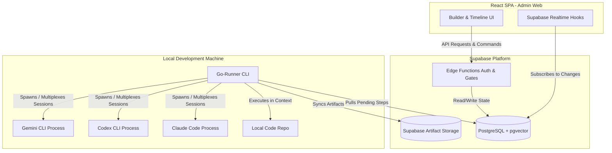

# 🚀 FlowPilot: The AI-Assisted Engineering Operating Layer

**FlowPilot** is an enterprise-ready, AI-assisted engineering platform. Rather than acting as a simple, stateless chat assistant, FlowPilot serves as a durable, execution-controlled **operating layer** around software engineering workflows. It bridges the gap between high-level project intentions and local IDE workspace development.

---

## 🎯 The Four Superpowers of FlowPilot

FlowPilot is structurally designed to solve the critical gaps in standard AI coding tools (such as Claude Code, Codex, Copilot, or raw LLM chats). We center the platform around four core pillars:

### 1. 🛡️ Guaranteed Rule Adherence (Step-by-Step Runner Enforcer)
*   **The AI Problem**: In standard tools, you write a single markdown instruction file containing steps 1, 2, and 3. The AI often skips guidelines, overlooks rules in the middle of long prompts, or drifts off-track entirely.
*   **The FlowPilot Solution**: We define structured workflows containing distinct, isolated step definitions. Each step is individually loaded, executed, and controlled by our **Go-Runner CLI**. The AI is physically restricted to executing the current active step's scope; it cannot advance, ignore, or bypass the rules of the pipeline.

### 2. 🔒 Un-bypassable Safe Gates (Durable Human-in-the-Loop)
*   **The AI Problem**: Autonomous agents can confidently execute critical operations, overwrite codebases, or run destructive tasks without verifying readiness or obtaining true validation.
*   **The FlowPilot Solution**: Approval gates are hard-coded constraints managed by the database and runner. For critical tasks (e.g. tech design validation, database migrations, or production releases), the runner pauses and enters a blocked state. This safe gate **cannot be bypassed** by the AI and requires explicit, authenticated human confirmation to proceed.

### 3. 🧠 Advanced Context Harnessing (The Context Engine)
*   **The AI Problem**: Standard sessions require manual code copy-pasting, causing developers to hit token limits or receive irrelevant answers because of excessive noise or missing dependencies.
*   **The FlowPilot Solution**: FlowPilot automates the collection, management, syncing, and saving of all project context and generated artifacts:
    *   **Multi-Source Context Ingestion**: Combines workspace files, user inputs, and external MCP integrations (e.g. Jira tickets, Figma designs, and codebase call-graphs via GitNexus).
    *   **Context Optimization**: Employs pgvector RAG semantic search (`match_artifact_memories`) to filter and retrieve the *correct and enough* context needed for the active session.
    *   **Redundancy Pruning**: Automatically analyzes and shrinks the token payload, cutting out duplicate or irrelevant context to minimize token consumption and maximize response quality.

### 4. 🤖 Autonomous Execution & Self-Correction
*   **The AI Problem**: Fully autonomous flows get stuck in loops, repeatedly output circular statements (such as *"you are absolutely right"*), or replicate the same coding mistakes across runs.
*   **The FlowPilot Solution**: FlowPilot provides robust autonomy backed by guardrails:
    *   **YOLO Mode**: Run entire multi-step development pipelines fully automatically for trusted tasks.
    *   **Mistake-to-Skill Conversion**: Learns from execution feedback and errors, distilling lessons into permanent `.md` skill guidelines so future runs inherit the correct habits.
    *   **Wrong-Way Detection**: Monitors interactive terminal sessions to detect circular logic or off-track implementations and automatically triggers course corrections or execution rollbacks.

---

## 📐 System Architecture

FlowPilot bridges local file execution with cloud persistence:

---

## 💻 Technical Stack

*   **Frontend SPA**: React 19 SPA bootstrapped with Vite, type-safe routing via **TanStack Router**, server-state syncing using **TanStack Query**, and styled with **Tailwind CSS 4** + **shadcn/ui**.
*   **Backend & DB**: Supabase (PostgreSQL with RLS policy enforcement, pgvector embeddings, Realtime triggers, Storage buckets, and TypeScript Edge Functions).
*   **Local Runtime**: Go (Cobra CLI) for lightweight OS process orchestration, process-group controls, stdin/stdout piping, and shell session multiplexing.
*   **AI Providers Supported**: Claude (Anthropic), GPT Models (OpenAI/Codex), and Gemini (Google).

---

## 📈 Business Use Cases & ROI

*   **For Solo Developers**: Elevates productivity by running the full software lifecycle. Takes a vague feature brief and converts it into specs, code, unit tests, and post-release validation autonomously.
*   **For Engineering Leaders**: Introduces strict quality gates. Prevents architectural drift and security vulnerabilities by ensuring specs, designs, and code changes require human sign-off. Provides an auditable change log.
*   **For Product Managers**: Seamlessly traces business intent to code changes. Challenges PRDs by automatically identifying conflicting logic or missing edge cases before code is written.