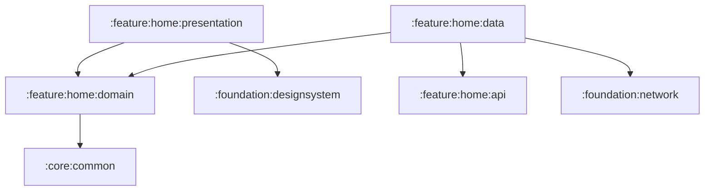

# Ví dụ Cấu trúc Module Thực Tế (Home Feature)

Tài liệu này minh họa cấu trúc thư mục và file `build.gradle.kts` cho một feature phức tạp (Home), áp dụng chuẩn kiến trúc Superapp.

## Cây thư mục

```text
feature/home/
├── api/                   # Interface cho các feature khác gọi vào Home
│   ├── build.gradle.kts
│   └── src/main/java/.../home/api/HomeNavigator.kt
├── presentation/          # Màn hình Compose, ViewModel
│   ├── build.gradle.kts
│   └── src/main/java/.../home/presentation/HomeScreen.kt
├── domain/                # UseCase, Entity, Repository Interfaces
│   ├── build.gradle.kts
│   └── src/main/java/.../home/domain/GetHomeFeedsUseCase.kt
├── data/                  # Repository Impl, Database cục bộ
│   ├── build.gradle.kts
│   └── src/main/java/.../home/data/HomeRepositoryImpl.kt
└── build.gradle.kts       # (Optional) Kịch bản nếu Home là một Gradle Composite riêng
```

## Khai báo Dependencies (`build.gradle.kts`)

### 1. `:feature:home:api`
```kotlin
// feature/home/api/build.gradle.kts
plugins {
    id("superapp.android.library")
}

dependencies {
    // API module phải cực kỳ nhẹ, không chứa UI, không Hilt.
    // Chỉ chứa Kotlin standard library và các model cơ bản.
}
```

### 2. `:feature:home:domain`
```kotlin
// feature/home/domain/build.gradle.kts
plugins {
    id("superapp.android.library")
    id("superapp.hilt") // Chỉ nếu cần inject UseCases
}

dependencies {
    // KHÔNG phụ thuộc vào Data hoặc Presentation!
    
    // Core/Foundation nếu cần các base models
    implementation(project(":core:common"))
    implementation(project(":foundation:analytics"))
}
```

### 3. `:feature:home:data`
```kotlin
// feature/home/data/build.gradle.kts
plugins {
    id("superapp.android.library")
    id("superapp.hilt")
}

dependencies {
    // Tuân thủ Dependency Inversion: Data biết về Domain.
    implementation(project(":feature:home:domain"))
    
    // Nếu data cần implement API interface
    implementation(project(":feature:home:api"))
    
    // Network, DB
    implementation(project(":foundation:network"))
    implementation(project(":foundation:database"))
    
    // Dagger Hilt compiler
    ksp("com.google.dagger:hilt-compiler:...")
}
```

### 4. `:feature:home:presentation`
```kotlin
// feature/home/presentation/build.gradle.kts
plugins {
    id("superapp.android.feature") // Custom plugin bao gồm Compose + Hilt
}

dependencies {
    // Presentation biết về Domain để gọi UseCases
    implementation(project(":feature:home:domain"))
    
    // Giao tiếp với các Feature khác qua API của chúng (không phụ thuộc Implementation)
    implementation(project(":feature:cart:api"))
    implementation(project(":feature:profile:api"))
    
    // Sử dụng Design System
    implementation(project(":foundation:designsystem"))
}
```

## Biểu đồ phụ thuộc nội bộ của Home


