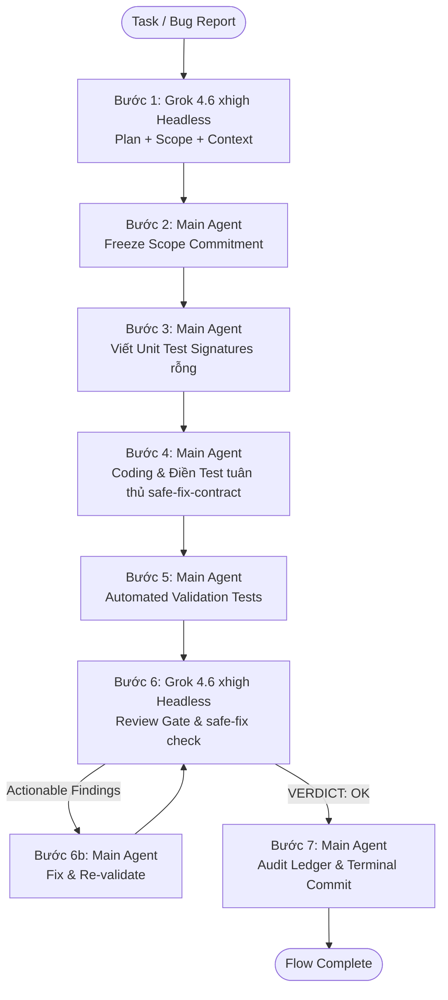

# Flow Mode Orchestrator (FlowPilot Emulated Lifecycle)

Use this skill to execute a governed, closed-loop engineering workflow that emulates FlowPilot's **Flow Mode** (`rag-harness` + `review-loop`) while FlowPilot's native execution engine is under active development.

---

## 1. Architectural Philosophy & Engine Model

In FlowPilot, **Flow Mode** differs fundamentally from Normal Chat by enforcing **Preflight Commitment, Scope Enforcement, Locus Context Synthesis, Automated Validation, Independent Review, and Deferred Canonical Finalization**.

### ⚠️ MANDATORY RULE: Strict `/safe-fix-contract` Compliance
Mọi phiên làm việc theo Flow Mode **BẮT BUỘC** phải tuân thủ nghiêm ngặt hợp đồng `/safe-fix-contract`:
1. **R1 — Giữ nguyên bộ test cũ (Fail → Report → Stop)**: Tuyệt đối **KHÔNG SỬA** hoặc làm yếu các unit test cũ đang có sẵn để pass CI. Nếu test cũ fail, phải sửa production code; nếu không thể, phải DỪNG LẠI và báo cáo người dùng.
2. **R2 — Bình đẳng 3 Provider (Claude + Codex + Grok Parity)**: Bất kỳ thay đổi nào liên quan đến provider, stream, session, TUI hay gate hooks đều phải kiểm chứng hoạt động đồng nhất trên cả 3 provider **Claude, Codex, và Grok**.
3. **R3 — Additive Tests Matrix**: Chỉ **thêm mới** test (`additive-tests-only`), phủ đầy đủ ma trận các trường hợp biên (re-entry, restart, multi-round, park, error paths), không chỉ viết 1 happy path.
4. **Context & Oracle Rule**: Tìm nguyên nhân ở code production (`oracle-rule`), dựa trên tri thức từ `change-audit/FEATURE-KEYS.md` và các CA notes trước đó (`context-discipline`).

This skill orchestrates two engines:
1. **Grok 4.6 (`--reasoning-effort xhigh`) (Headless CLI)**: Serves as the independent **Contract Planner**, **Context Synthesizer**, and **Adversarial Review Gate**.
2. **Main Agent (Current Model)**: Serves as the **Developer & Implementer** (Code writing, test execution, remediation, and audit commit).

---

## 2. Phase & Role Matrix

| Step | Phase Name | Execution Engine | Mode | Responsibility | Output Artifact |
| :--- | :--- | :--- | :--- | :--- | :--- |
| **1** | **Preflight Plan & Context** | **Grok 4.6 (xhigh)** | Headless CLI (`grok --single`) | Read-only analysis, resolve `feature_key` in `FEATURE-KEYS.md`, locus retrieval, define `declared_paths`, write Implementation Plan | `[Change Contract]` + Plan |
| **2** | **Contract Freeze (Soft Gate)** | **Main Agent** | Interactive | Commit to `declared_paths`. Lock scope before writing code | Scope Locked |
| **3** | **TDD Test Signatures** | **Main Agent** | Interactive | Tạo trước khung/chữ ký hàm test (Test Signatures / Cases) cho toàn bộ kịch bản trong plan (chưa viết body logic) | Unit Test Signatures |
| **4** | **Implementation & Full Tests** | **Main Agent** | Interactive | Viết code logic VÀ hoàn thiện đầy đủ toàn bộ body/assertions cho các test signatures đã tạo (Tuân thủ `/safe-fix-contract`) | Production Code + Full Tests |
| **5** | **Automated Validation** | **Main Agent** | Local Shell | Run local test suites (`go test`, `npm test`, builds) | Green Test Results |
| **6** | **Review Gate & Loop** | **Grok 4.6 (xhigh)** | Headless CLI (`grok --single`) | Critical adversarial review for safe-fix compliance, scope drift, logic bugs, regressions, test coverage | `review_result.md` (OK / Findings) |
| **6b** | **Remediation Loop** | **Main Agent** | Interactive | Fix confirmed findings, re-validate, re-invoke Grok until `VERDICT: OK` | Clean Verified Code |
| **7** | **Audit & Terminal Acceptance** | **Main Agent** | Interactive | Write `change-audit/CA-NNN.md` with change ledger, update `FEATURE-KEYS.md`, commit with standard tag | Git Commit & Terminal Done |

---

## 3. Step-by-Step Workflow Execution



---

### Step 1: Preflight Planning & Context Synthesis (Grok 4.6 xhigh Headless)

Invoke Grok in headless mode to inspect the task, resolve the feature key, check history, and define the contract:

```bash
grok --single "You are FlowPilot's read-only Contract Planner and Context Synthesizer.
Task Request: <USER_REQUEST>

Instructions:
1. Analyze the codebase, inspect relevant files, and check change-audit/FEATURE-KEYS.md to find or propose the exact feature_key.
2. Search change-audit/CA-*.md for related past changes on this feature locus.
3. Formulate the exact Change Contract with declared_paths (only files that need modification or creation, including test files).
4. Provide a clear, actionable Step-by-Step Implementation Plan with test strategy following /safe-fix-contract.

Format your response exactly as:
[Change Contract]
feature_key: <key>
intent: <intent summary>
declared_paths:
  - <path1>
  - <path2>

## Implementation Plan
<Detailed plan with exact function/file references and verification steps>" --model grok-4.6 --reasoning-effort xhigh --permission-mode acceptEdits
```

---

### Step 2: Contract Freeze & Scope Commitment (Main Agent)

The Main Agent reviews Grok's output and freezes the scope:
1. Confirm `feature_key` is registered in `change-audit/FEATURE-KEYS.md`.
2. Confirm `declared_paths` covers all necessary files (including test files) without over-scoping.
3. **Soft Gate Enforcement**: Main Agent commits to modifying **ONLY** files listed in `declared_paths` (plus `change-audit/CA-*.md` and `requirements/`).

---

### Step 3: TDD Test Signatures (Main Agent)

**TRƯỚC KHI VIẾT CODE LOGIC**, Main Agent tạo khung định nghĩa chữ ký hàm cho toàn bộ các unit test cases được vạch ra trong plan:
1. Tạo hoặc mở file test trong `declared_paths` (ví dụ `feature_test.go`).
2. Viết chữ ký hàm test (`func TestFeature_ScenarioName(t *testing.T)`) với mô tả rõ ràng kịch bản kiểm thử, input và output kỳ vọng.
3. **Quy tắc**: Chỉ khai báo khung test, chưa viết thân hàm (assertions/mock/logic phức tạp).
4. **Mục tiêu**: Đóng đinh danh sách các ca kiểm thử cần pass trước khi bắt đầu code.

---

### Step 4: Implementation & Complete Tests (Main Agent)

1. Main Agent tiến hành viết source code trong `declared_paths` để hiện thực hóa tính năng/bugfix.
2. **Điền đầy đủ Test (Bắt buộc)**:
   - Quay lại các test signature đã tạo ở Step 3, **viết toàn bộ body, assertions, mock và logic test hoàn chỉnh**.
   - Không được để lại test case rỗng, test bị comment, hoặc `t.Skip` không có lý do.
3. **🚨 BẮT BUỘC: Tuân thủ `/safe-fix-contract` (Nhắc lại tại bước Coding)**:
   - **R1 (Không phá test cũ)**: Tuyệt đối không chỉnh sửa file test cũ hoặc thay đổi assertions của test cũ để ép pass. Nếu test cũ fail → **STOP**, xác định lỗi ở code production và sửa code production.
   - **R2 (Parity 3 Provider)**: Nếu sửa đổi touch vào adapter, orchestrator, TUI, event stream hay session state → code phải hoạt động bình đẳng trên **Claude**, **Codex**, và **Grok**.
   - **R3 (Additive Tests)**: Toàn bộ test mới viết ở Step 3 & 4 phải là **additive tests**, bao phủ cả trường hợp biên (error handling, timeout, park/resume, invalid payload).
   - **Oracle Rule**: Test fail là chỉ báo code sai, sửa code chứ không sửa test.

---

### Step 5: Automated Validation (Main Agent)

Run local verification commands to ensure zero compile errors and green test suite:
- Go runner: `go test -count=1 ./internal/...` hoặc focused suite `go test -count=1 ./internal/<pkg>/ -run="..."`
- Admin Web: `npm test` (in `apps/admin-web/`)
- Desktop: `npm run typecheck` (in `apps/desktop-flowpilot/`)

All tests (cả test cũ lẫn toàn bộ test mới vừa fill ở Step 4) MUST be green before proceeding to Step 6.

---

### Step 6: Adversarial Review Gate & Review Loop (Grok 4.6 xhigh Headless)

Invoke Grok in headless mode to review the diff against the declared plan, scope, test completeness, and **`/safe-fix-contract` compliance**:

```bash
grok --single "You are FlowPilot's Adversarial Review Gate.
Task: <USER_REQUEST>
Declared Contract:
feature_key: <FEATURE_KEY>
declared_paths:
<DECLARED_PATHS>

Instructions:
1. Inspect the current git diff and changed files in the workspace.
2. 🚨 STRICT AUDIT ON /safe-fix-contract RULES:
   - R1: Were any pre-existing tests modified, weakened, or deleted? (If YES -> FAIL immediately, old tests must remain untouched).
   - R2: If provider/runtime behavior was touched, is there parity across Claude, Codex, and Grok?
   - R3: Are new tests truly additive and comprehensive (covering edge cases, not just 1 happy path)?
   - Test Completeness: Are all unit test signatures from Step 3 fully implemented with real assertions (no empty/stubbed tests)?
3. Check for:
   - Scope Drift: Were any files modified outside declared_paths? (Note: change-audit/*.md and requirements/*.md are allowed).
   - Logic bugs, edge cases, nil pointer / off-by-one errors.
   - Regressions or breaks in existing behavior.
4. Output format:
   - If completely clean with no blocking issues, output:
     VERDICT: OK (No blocking issues)
   - If issues are found, output:
     VERDICT: ACTIONABLE FINDINGS
     1. [File:Line] <Issue description and recommended fix>
     2. ..." --model grok-4.6 --reasoning-effort xhigh --permission-mode acceptEdits
```

#### Remediation Loop:
- If Grok returns **ACTIONABLE FINDINGS**:
  1. Main Agent addresses each confirmed finding.
  2. Main Agent re-runs Validation (Step 5).
  3. Main Agent re-invokes Grok Review (Step 6).
  4. Repeat until Grok outputs `VERDICT: OK`.

---

### Step 7: Audit Logging & Terminal Acceptance (Main Agent)

Once Grok outputs `VERDICT: OK`:
1. **Create Audit Note**: Create `change-audit/CA-<NNN>-<title>.md` containing the `flowpilot:change-ledger` block.
2. **Update Registry**: If a new feature key was created, register it in `change-audit/FEATURE-KEYS.md`.
3. **Commit Change**: Commit with strict FlowPilot format:
   ```bash
   [Type]: [feature_key] <Short imperative summary under 72 chars>
   ```
   *(e.g., `[BugFix]: [change-contract] Exempt manifest & CA, stamp node, settle done`)*
4. **Terminal Report**: Summarize the completed flow: Feature Key, Declared Scope, Review Rounds, Verification Results, and Commit SHA.

---

## 4. Operational Rules Summary

- **Never bypass Step 1-3**: Always have Grok produce the preflight contract and plan before Main Agent writes code.
- **Never bypass Step 6 Review**: The flow is only complete when Grok explicitly gives a clean `VERDICT: OK`.
- **Preserve Scope Discipline**: Treat `declared_paths` as a hard constraint. If unexpected files must be changed, update the contract first.
- **Durable Ledger Mandatory**: Every completed change must have a corresponding `change-audit/CA-*.md`.
