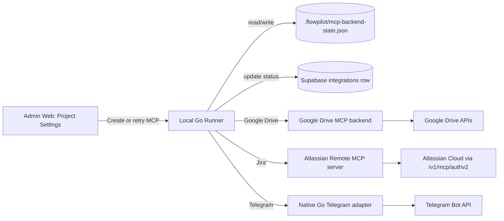
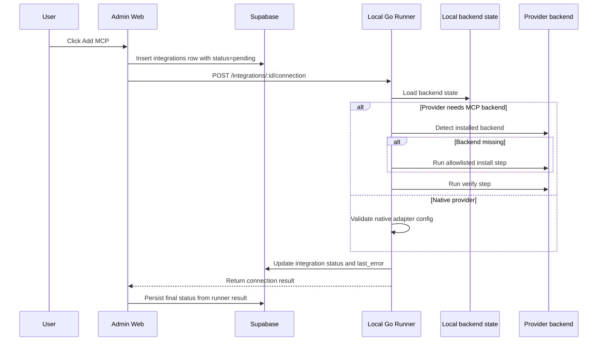

# SD-11: MCP Connection Flows

**Purpose:** Explain what happens under the hood when a user presses `Add MCP`, with provider-specific install and connection behavior.

This document covers three MCP-related integrations in FlowPilot:

- Google Drive via a third-party MCP backend
- Jira via Atlassian's official remote MCP server
- Telegram via a native Go integration

---

## 1. System Overview

FlowPilot treats MCP setup as a runner-owned workflow.

- Admin Web owns the project settings UI.
- The local Go runner owns backend detection, install/verify orchestration, and status reporting.
- Supabase stores the project integration row and the user-visible connection state.
- Third-party MCP servers are only used when the provider actually needs them.

---

## 2. What Happens When User Clicks `Add MCP`

This is the end-to-end runtime sequence.

The important point is that the UI does not guess success.
It asks the runner, then writes the runner result back to the integration row.

---

## 3. Provider Strategies

### 3.1 Google Drive

Google Drive is the third-party MCP path.

Current intent:

- use the allowlisted `google-drive-mcp` backend
- detect local launcher availability first
- if missing, perform the documented install step
- verify the backend before marking the integration usable
- complete Google Drive OAuth after backend preparation

Under the hood:

1. user clicks `Add MCP`
2. UI creates the integration row
3. runner checks whether the Google Drive backend is already prepared
4. if not, runner runs the allowlisted install step
5. runner verifies the backend
6. runner completes OAuth / resource verification
7. runner updates `connected` or `failed`

Reference repo:

- [google-drive-mcp](https://github.com/piotr-agier/google-drive-mcp)

### 3.2 Jira

Jira uses Atlassian's official remote MCP server.

Current official endpoint:

- `https://mcp.atlassian.com/v1/mcp/authv2`

Flow:

1. user clicks `Add MCP`
2. UI creates the Jira integration row
3. runner detects whether the local MCP proxy tooling is present
4. if missing, runner prepares the allowlisted local proxy path
5. runner connects through Atlassian's official remote MCP server
6. browser-based OAuth is triggered when needed
7. runner verifies access to Jira data the user is allowed to see
8. runner writes back `connected`, `awaiting_oauth`, or `failed`

Important detail:

- the local machine still needs Node.js for the proxy path
- the Atlassian server is remote and hosted by Atlassian
- FlowPilot should treat this as an official remote MCP connection, not as a generic package install

Reference docs:
- https://support.atlassian.com/atlassian-rovo-mcp-server/docs/getting-started-with-the-atlassian-remote-mcp-server/
- [Atlassian Rovo MCP getting started](https://support.atlassian.com/atlassian-rovo-mcp-server/docs/getting-started-with-the-atlassian-remote-mcp-server/)
- [Atlassian remote MCP server](https://www.atlassian.com/platform/remote-mcp-server)

### 3.3 Telegram

Telegram does not use a third-party MCP server in the MVP design.

Instead, FlowPilot should use a native Go adapter because the user goal is notification and data push/pull behavior, not a separate hosted MCP backend.

Flow:

1. user clicks `Add MCP`
2. UI creates the Telegram integration row
3. runner validates the bot token and destination channel/chat
4. runner performs a lightweight native API check
5. runner stores the result and marks the integration accordingly

This path does not need an MCP backend install step.

---

## 4. Backend Install and Verify Semantics

The runner distinguishes three states:

- `missing`: no supported launcher is available
- `launcher_available`: launcher exists, but backend is not yet prepared
- `installed`: backend has already been prepared and persisted

This matters because the UI must not show a false connected state.

### 4.1 Install

Install means:

- the runner resolves the local launcher
- the runner runs the allowlisted install command for that provider
- the runner persists backend state after success

Install is provider-specific:

- Google Drive uses the third-party backend install path
- Jira uses Atlassian's official remote MCP setup path through the local proxy
- Telegram skips this step because it is native Go

### 4.2 Verify

Verify means:

- the runner runs the allowlisted verification command
- the runner confirms the backend is usable before declaring success
- the runner updates the integration row based on the result

The key rule is that install and verify are not the same operation.

---

## 5. What The User Sees

When the user opens Project Settings:

- the page shows the integration editor
- the page shows MCP backend status cards
- the page shows `installed`, `launcher_available`, or `missing`
- the page shows `awaiting_oauth`, `connected`, or `failed` for the integration row

That means the settings page is both:

- the creation/edit surface for project-scoped MCP contexts
- the status dashboard for runner-managed backend readiness

---

## 6. Implementation Boundary

Do not move provider secrets into normal project config.

Recommended split:

- Supabase stores project configuration and user-visible integration state
- local runner stores backend readiness and any secure provider credential material
- third-party MCP backends are only used where they match the provider model

This keeps the UI simple and prevents false success states.

---

## 7. Summary

If the user presses `Add MCP`:

- FlowPilot creates the project integration record
- the local runner checks the provider path
- Google Drive may install and verify a third-party MCP backend
- Jira connects through Atlassian's official remote MCP server at `/v1/mcp/authv2`
- Telegram uses native Go without a third-party MCP backend install
- the runner returns the real state
- the UI writes that state back to Supabase

