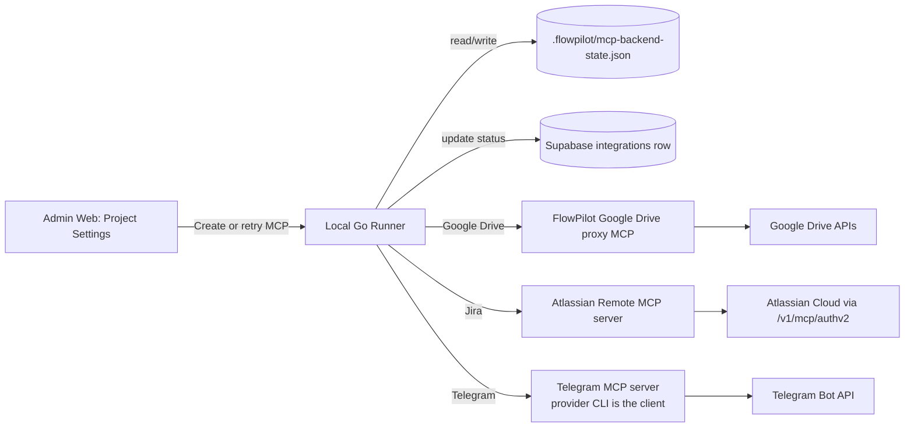
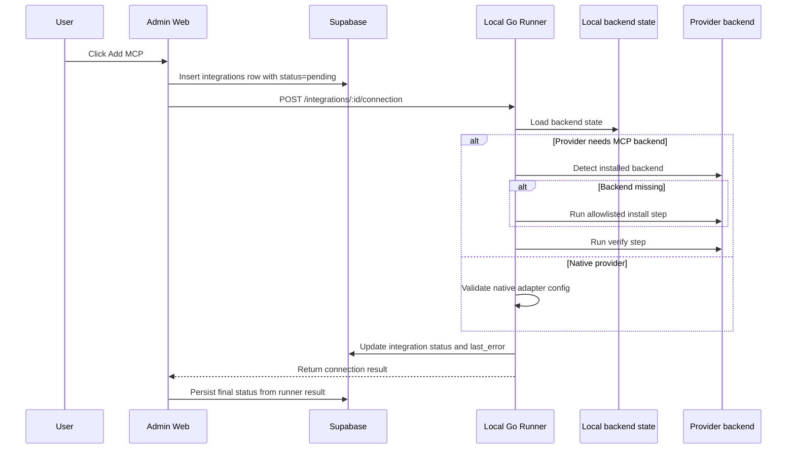

# SD-11: MCP Connection Flows

**Purpose:** Explain what happens under the hood when a user presses `Add MCP`, with provider-specific install and connection behavior.

This document covers three MCP-related integrations in FlowPilot:

- Google Drive via the FlowPilot-owned proxy MCP plus runner-local account OAuth and optional artifact folder binding
- Jira via Atlassian's official remote MCP server
- Telegram via an MCP-backed output notification artifact (`telegram.v1`): the AI provider CLI calls a Telegram MCP tool to send. Native Go adapter retained only as a fallback. **(Amended 2026-07-13 — see §3.3 and [CP-05-05](../07-Coding-Plan/done/CP-05-05-Tele-Mcp.md).)**

---

## 1. System Overview

FlowPilot treats MCP setup as a runner-owned workflow.

- Admin Web owns the project settings UI.
- The local Go runner owns backend detection, install/verify orchestration, and status reporting.
- Supabase stores the project integration row and the user-visible connection state.
- Third-party MCP servers are only used when the provider actually needs them.

---

## 2. What Happens When User Clicks `Add MCP`

This is the end-to-end runtime sequence.

The important point is that the UI does not guess success.
It asks the runner, then writes the runner result back to the integration row.

---

## 3. Provider Strategies

### 3.1 Google Drive

Google Drive is the FlowPilot proxy MCP path.

Current intent:

- use the FlowPilot proxy MCP launcher path
- store Google OAuth state in the local runner, keyed by connected Google account
- allow artifact sync to bind `projectId -> accountId -> folderId`
- let MCP read tools use the selected account token without filtering reads to the artifact folder
- keep the third-party Desktop OAuth JSON path only as a legacy fallback while raw MCP support remains available

Under the hood:

1. user clicks `Add MCP`
2. UI creates the integration row
3. runner checks whether the FlowPilot or Go launcher path for the proxy MCP is available
4. runner completes or refreshes Google account OAuth locally
5. runner verifies the selected account scopes and token refresh path
6. if artifact sync is enabled for the project, runner verifies the selected Drive folder binding
7. runner updates account, proxy MCP, and artifact-binding status independently

### 3.2 Jira

Jira uses Atlassian's official remote MCP server.

Current official endpoint:

- `https://mcp.atlassian.com/v1/mcp/authv2`

Flow:

1. user clicks `Add MCP`
2. UI creates the Jira integration row
3. runner detects whether the local MCP proxy tooling is present
4. if missing, runner prepares the allowlisted local proxy path
5. runner connects through Atlassian's official remote MCP server
6. browser-based OAuth is triggered when needed
7. runner verifies access to Jira data the user is allowed to see
8. runner writes back `connected`, `awaiting_oauth`, or `failed`

Important detail:

- the local machine still needs Node.js for the proxy path
- the Atlassian server is remote and hosted by Atlassian
- FlowPilot should treat this as an official remote MCP connection, not as a generic package install

Reference docs:
- https://support.atlassian.com/atlassian-rovo-mcp-server/docs/getting-started-with-the-atlassian-remote-mcp-server/
- [Atlassian Rovo MCP getting started](https://support.atlassian.com/atlassian-rovo-mcp-server/docs/getting-started-with-the-atlassian-remote-mcp-server/)
- [Atlassian remote MCP server](https://www.atlassian.com/platform/remote-mcp-server)

### 3.3 Telegram

> **Amendment (2026-07-13).** The original MVP design below made Telegram a **native Go adapter with no MCP server**. That is superseded: Telegram is now an **MCP-backed OUTPUT notification artifact** (`telegram.v1`) — the AI provider CLI calls a Telegram MCP tool (`send_message`) during its turn, consistent with the artifact framework ([SD-23](./SD-23-Generic-Artifact-Framework.md) `D-8`/`D-11`) and the "provider CLI owns MCP" principle (CP-05-03 §11). Owner decision recorded in [CP-05-05](../07-Coding-Plan/done/CP-05-05-Tele-Mcp.md) (`Q-1`). The native Go adapter (original text, preserved below) is retained **only as a documented fallback** if no reliable Telegram MCP server is available (CP-05-05 `Q-3`).

Current (amended) design:

1. **Connection (per-project):** user clicks `Add MCP`, UI creates the Telegram integration row, runner validates the bot token + destination channel/chat via a lightweight Bot API check and marks status. The bot token is stored in the runner keyring, never in Supabase (§6).
2. **Server:** FlowPilot configures a Telegram MCP server for the selected provider account (community MCP or a FlowPilot-owned proxy wrapping the Telegram Bot API — chosen in CP-05-05 `Q-2`), the same way Google Drive MCP is injected into each provider CLI config.
3. **Send (per-run):** a flow step binds a `telegram.v1` artifact as **output**; the runner injects a write-contract prompt instructing the AI to send the final notification via the Telegram MCP tool. The send happens inside the AI's tool loop.
4. **Verify + approve:** because sending a message is an irreversible outward-facing action, the send is **approval-gated** by default, and a flow-gate verifies the tool call occurred (tool-call detection, not filesystem existence).

Fallback (original MVP design — native Go, kept if MCP path proves unreliable):

1. user clicks `Add MCP`
2. UI creates the Telegram integration row
3. runner validates the bot token and destination channel/chat
4. runner performs a lightweight native API check
5. runner stores the result and marks the integration accordingly

The native-Go fallback does not need an MCP backend install step.

---

## 4. Backend Install and Verify Semantics

The runner distinguishes three states:

- `missing`: no supported launcher is available
- `launcher_available`: launcher exists, but backend is not yet prepared
- `installed`: backend has already been prepared and persisted

This matters because the UI must not show a false connected state.

### 4.1 Install

Install means:

- the runner resolves the local launcher
- the runner runs the allowlisted install command for that provider
- the runner persists backend state after success

Install is provider-specific:

- Google Drive uses the FlowPilot proxy MCP launcher path and runner-local OAuth state
- Jira uses Atlassian's official remote MCP setup path through the local proxy
- Telegram configures a Telegram MCP server for the provider CLI (amended 2026-07-13, §3.3); the native-Go fallback would skip this step

### 4.2 Verify

Verify means:

- the runner runs the allowlisted verification command
- the runner confirms the backend is usable before declaring success
- the runner updates the integration row based on the result

The key rule is that install and verify are not the same operation.

---

## 5. What The User Sees

When the user opens Project Settings:

- the page shows the integration editor
- the page shows MCP backend status cards
- the page shows `installed`, `launcher_available`, or `missing`
- the page shows `awaiting_oauth`, `connected`, or `failed` for the integration row

That means the settings page is both:

- the creation/edit surface for project-scoped MCP contexts
- the status dashboard for runner-managed backend readiness

---

## 6. Implementation Boundary

Do not move provider secrets into normal project config.

Recommended split:

- Supabase stores project configuration and user-visible integration state
- local runner stores backend readiness, Google account credentials, proxy account selection, and any secure provider credential material
- third-party MCP backends are only used where they match the provider model

This keeps the UI simple and prevents false success states.

---

## 7. Summary

If the user presses `Add MCP`:

- FlowPilot creates the project integration record
- the local runner checks the provider path
- Google Drive connects a runner-local account, validates proxy MCP readiness, and optionally validates a project folder binding
- Jira connects through Atlassian's official remote MCP server at `/v1/mcp/authv2`
- Telegram sends via a Telegram MCP tool called by the provider CLI (`telegram.v1` output artifact, approval-gated; amended 2026-07-13, §3.3); native Go is a fallback
- the runner returns the real state
- the UI writes that state back to Supabase
