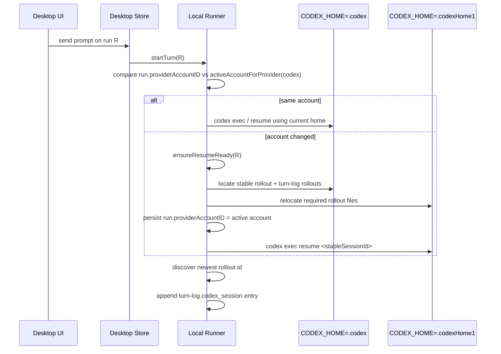
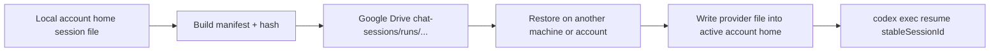

# Metadata

- Document ID: `SD-14`
- Title: `Codex Cross-Account Chat Resume And Home Sync`
- Phase: `tech_design`
- Status: `draft`
- Owner: `DatNguyen`
- Reviewers: `—`
- Created: `2026-06-18`
- Last Updated: `2026-06-19`
- Parent Documents: [SS-11: Workflow With Session](../05-System-Specs/SS-11-Workflow-With_Session.md)
- Child Documents: `—`
- Related Documents: [SD-12: Refactor Workflow With Session](./SD-12-Refactor-Workflow-With_Session.md), [Task-069: Cross-PC Sync for Non-Supabase Users](../08-Task/todo/Task-069-Cross-PC-Sync-Non-Supabase-Sessions-Ndjson.md), [Task-070: History Supabase Reader Production Fix](../08-Task/done/Task-070-History-Supabase-Reader-Production-Fix.md), [Task-071: Cross-Account Chat Resume Definition of Done Checklist](../08-Task/todo/Task-071-Cross-Account-Chat-Resume-DOD-Checklist.md), [Task-072: Cross-Account Chat Resume Test Signatures](../08-Task/todo/Task-072-Cross-Account-Chat-Resume-Test-Signatures.md), [Task-073: Cross-PC Non-Supabase Chat Sync Definition of Done Checklist](../08-Task/todo/Task-073-Cross-PC-Non-Supabase-Chat-Sync-DOD-Checklist.md), [Task-074: Cross-PC Non-Supabase Chat Sync Test Signatures](../08-Task/todo/Task-074-Cross-PC-Non-Supabase-Chat-Sync-Test-Signatures.md), [Task-075: Cross-Account And Cross-PC Chat E2E Test Guide](../08-Task/todo/Task-075-Cross-Account-And-Cross-PC-Chat-E2E-Test-Guide.md), [Task-076: Replay User Prompts On Chat Transcript Resume](../08-Task/todo/Task-076-Replay-User-Prompts-On-Chat-Transcript-Resume.md), [BUG-082: Desktop History Chat Open Fails On Legacy Default Account](../09-BugFix/done/BUG-082-Desktop-History-Chat-Open-Fails-On-Legacy-Default-Account.md), [BUG-091: Drive Restore Rejects Same-Session Prefix Extension As Conflict](../09-BugFix/done/BUG-091-Drive-Restore-Rejects-Same-Session-Prefix-Extension-As-Conflict.md), [CA-099: Fix Desktop Legacy Default Account Chat Resume](../../change-audit/CA-099-fix-desktop-legacy-default-account-chat-resume.md), [CA-101: Fix Chat Resume Composed Prompt And Codex Multi-Rollout](../../change-audit/CA-101-fix-chat-resume-composed-prompt-and-codex-multi-rollout.md)
- Replaces: `—`
- Tags: `codex, provider-account, desktop-chat, resume, session, local-runner, google-drive`

## AI Quick View

### Summary

- FlowPilot does not merge Codex chats through a remote conversation API; it keeps resume working by moving provider-owned rollout files between Codex home folders and rebinding the run to the active account.
- For Codex, one visible chat normally keeps **one** stable rollout id for its entire life: `codex exec resume <id>` extends the same rollout file instead of minting a new id per turn. FlowPilot stores that stable resume handle plus a turn-log sidecar that, in the normal resume flow, records exactly that one id. A second id only appears in the rare case a turn starts a fresh rollout instead of resuming.
- Switching the active Codex account alone does not copy files. The copy happens lazily when the next turn starts or when a history run is reopened under the newly active account.
- Optional cross-PC sharing uses Google Drive to upload the provider session file plus a manifest; local account switching remains a separate file-relocation flow.

### Current Ask

- Explain the exact runtime behavior for a single Codex chat that starts on account A, continues on account B, then returns to account A.
- Show what changes under `/Users/tiendat/.codex` and `/Users/tiendat/.codexHome1` at each user step.

### Key Decisions

- `D-1` Use provider-owned Codex rollout files as the source of truth for continuation instead of trying to reconstruct a provider session from FlowPilot-only metadata.
- `D-2` Trigger cross-account relocation lazily on resume/next-turn, not on account-switch UI action.
- `D-3` Keep a stable persisted Codex resume handle while separately logging Codex rollout ids in a turn-log sidecar for transcript replay and future relocation; in the normal resume flow this records exactly one id equal to the stable handle.
- `D-4` Treat same-home source and destination as a successful no-op relocation, then rebind the stored account id to the active account id.

### Constraints

- Codex session continuity is only valid within the Codex provider; this design must not imply cross-provider session reuse.
- Provider files must not be overwritten when destination content belongs to a different session.
- Desktop chat history must remain unified; the UI must not expose account-specific history lanes.
- The design must support legacy rows whose `provider_account_id` was `default`.

### Open Questions

- None for the current local cross-account flow.

### Source Refs

- `apps/local-runner/internal/runner/interactive_service.go`
- `apps/local-runner/internal/runner/interactive_resume.go`
- `apps/local-runner/internal/runner/session_file_locator.go`
- `apps/local-runner/internal/runner/chat_session_sync.go`
- `apps/local-runner/internal/runner/turn_log.go`
- `apps/local-runner/internal/runner/cross_account_resume_test.go`
- [Task-069](../08-Task/todo/Task-069-Cross-PC-Sync-Non-Supabase-Sessions-Ndjson.md)
- [Task-070](../08-Task/done/Task-070-History-Supabase-Reader-Production-Fix.md)
- [Task-071](../08-Task/todo/Task-071-Cross-Account-Chat-Resume-DOD-Checklist.md)
- [Task-072](../08-Task/todo/Task-072-Cross-Account-Chat-Resume-Test-Signatures.md)
- [Task-073](../08-Task/todo/Task-073-Cross-PC-Non-Supabase-Chat-Sync-DOD-Checklist.md)
- [Task-074](../08-Task/todo/Task-074-Cross-PC-Non-Supabase-Chat-Sync-Test-Signatures.md)
- [Task-075](../08-Task/todo/Task-075-Cross-Account-And-Cross-PC-Chat-E2E-Test-Guide.md)
- [Task-076](../08-Task/todo/Task-076-Replay-User-Prompts-On-Chat-Transcript-Resume.md)

## 1. Goal

Describe how FlowPilot keeps one desktop Codex chat usable while the user changes the active Codex account between:

- account A: `/Users/tiendat/.codex`
- account B: `/Users/tiendat/.codexHome1`

This design focuses on:

- local same-machine account switching
- how FlowPilot prepares the next turn under the newly active account
- how provider files and FlowPilot sidecar files evolve over time
- how optional Google Drive sync differs from local account switching

## 2. Input Documents

- [SS-11: Workflow With Session](../05-System-Specs/SS-11-Workflow-With_Session.md)
- `SS-11 §6 Follow-Up Prompt Behavior`
- `SS-11 §7.1 Codex`
- [SD-12: Refactor Workflow With Session](./SD-12-Refactor-Workflow-With_Session.md)
- [Task-069: Cross-PC Sync for Non-Supabase Users](../08-Task/todo/Task-069-Cross-PC-Sync-Non-Supabase-Sessions-Ndjson.md)
- [Task-070: History Supabase Reader Production Fix](../08-Task/done/Task-070-History-Supabase-Reader-Production-Fix.md)
- [Task-071: Cross-Account Chat Resume Definition of Done Checklist](../08-Task/todo/Task-071-Cross-Account-Chat-Resume-DOD-Checklist.md)
- [Task-072: Cross-Account Chat Resume Test Signatures](../08-Task/todo/Task-072-Cross-Account-Chat-Resume-Test-Signatures.md)
- [Task-073: Cross-PC Non-Supabase Chat Sync Definition of Done Checklist](../08-Task/todo/Task-073-Cross-PC-Non-Supabase-Chat-Sync-DOD-Checklist.md)
- [Task-074: Cross-PC Non-Supabase Chat Sync Test Signatures](../08-Task/todo/Task-074-Cross-PC-Non-Supabase-Chat-Sync-Test-Signatures.md)
- [Task-075: Cross-Account And Cross-PC Chat E2E Test Guide](../08-Task/todo/Task-075-Cross-Account-And-Cross-PC-Chat-E2E-Test-Guide.md)
- [Task-076: Replay User Prompts On Chat Transcript Resume](../08-Task/todo/Task-076-Replay-User-Prompts-On-Chat-Transcript-Resume.md)
- [BUG-082: Desktop History Chat Open Fails On Legacy Default Account](../09-BugFix/done/BUG-082-Desktop-History-Chat-Open-Fails-On-Legacy-Default-Account.md)
- [CA-101: Fix Chat Resume Composed Prompt And Codex Multi-Rollout](../../change-audit/CA-101-fix-chat-resume-composed-prompt-and-codex-multi-rollout.md)

## 3. Architecture Decision

- `D-1` Codex local continuity is implemented as file-backed resume.
  - Alternatives considered:
    - rebuild provider state from FlowPilot history only
    - keep one long-lived Codex process independent of account home
  - Why this option was chosen:
    - the real resume primitive is `codex exec resume <SESSION_ID>`
    - Codex stores session state under `CODEX_HOME`
    - account switching therefore requires the target account home to contain the right rollout files

- `D-2` Account-switch UI state is not enough to trigger relocation.
  - Alternatives considered:
    - copy files immediately when the user clicks another account
  - Why this option was chosen:
    - account switch alone does not identify which run needs relocation
    - lazy relocation keeps file writes scoped to the run the user actually continues

- `D-3` FlowPilot keeps two distinct Codex session concepts:
  - stable resume handle:
    - persisted as `provider_session_id`
    - used for `codex exec resume`
  - turn-log rollout ids:
    - written to the turn-log sidecar, but only when a turn's discovered rollout id differs from the previous turn's id
    - in the normal resume flow this is exactly one id (equal to the stable handle), because `codex exec resume` extends the same rollout file
    - used for transcript replay and as a defensive input to cross-account relocation

- `D-4` Same-home rebinding is treated as success.
  - Alternatives considered:
    - reject when source path equals destination path
  - Why this option was chosen:
    - legacy account ids and durable account ids can point to the same physical home
    - rejecting that case blocks valid chat reopen/resume flows

## 4. Component Impact

- Impacted modules:
  - desktop chat store history-open flow
  - local runner interactive service
  - local runner resume preparation
  - local file session store
  - Codex transcript replay
  - optional Google Drive chat-session sync

- New modules:
  - none required for the local-switch path

- Unchanged modules:
  - Claude and Gemini provider semantics
  - workflow orchestration model
  - artifact sync model outside optional chat-session Drive sync

## 5. Data Model

### 5.1 Entities

- `ProviderSessionState`
  - `run_id`
  - `provider_key`
  - `provider_session_id`
  - `provider_account_id`
  - `working_directory`
  - `last_prompt`
  - `last_message`
  - `run_kind`

- turn-log sidecar entry
  - `kind:"prompt"` with raw user input
  - `kind:"codex_session"` with later Codex rollout ids

### 5.2 File Contracts

- FlowPilot local session index:
  - `<workspace>/.flowpilot/chats/sessions.ndjson`

- FlowPilot per-run turn log:
  - `<workspace>/.flowpilot/chats/<runId>-turns.ndjson`

- Codex provider files for account A:
  - `/Users/tiendat/.codex/sessions/rollout-<...>-<sessionId>.jsonl`

- Codex provider files for account B:
  - `/Users/tiendat/.codexHome1/sessions/rollout-<...>-<sessionId>.jsonl`

- Codex provider files for another active home example:
  - `/Users/tiendat/.codexHome2/sessions/2026/06/18/rollout-2026-06-18T22-04-15-019edb42-e728-71d3-891e-91729a640920.jsonl`
  - folder meaning:
    - `2026` = year
    - `06` = month
    - `18` = day

### 5.3 State Transitions

1. New run starts with the active provider account id stamped onto the run.
2. First successful Codex turn discovers the newest rollout id and persists it as the stable resume handle (`provider_session_id`).
3. Each later turn runs `codex exec resume <stableSessionId>`, which **appends to the same rollout file and keeps the same rollout id**. The stable handle does not change across normal resume turns.
4. FlowPilot only appends a new `codex_session` line to the turn log when the discovered rollout id *differs* from the previous turn's id (`refreshResumeHandleLocked`, `interactive_service.go:976`). In the normal resume flow the id never differs, so the turn log holds exactly one `codex_session` entry equal to the stable handle. A second id appears only if a turn starts a fresh rollout instead of resuming.
5. On cross-account continuation, FlowPilot copies the stable rollout file — plus any extra recorded ids, if present — into the newly active account home, then rewrites `provider_account_id` to that active account.

## 6. Interfaces and Contracts

### 6.1 Runtime Contracts

- `startTurn(runId, TurnInput, ...)`
  - detects whether `run.providerAccountID` still matches the active account for `codex`
  - if not, calls `ensureResumeReady(...)` before launching the turn

- `resumeRun(runId)`
  - reconstructs a persisted run from `.flowpilot/chats/sessions.ndjson`
  - calls `ensureResumeReady(...)`
  - seeds transcript events from provider files plus the turn-log sidecar

### 6.2 File or Artifact Contracts

- `RelocateSessionFile(providerKey, srcPath, targetHome, sessionID, cwd)`
  - computes the target provider path under the active account home
  - no-op success when `srcPath == dstPath`
  - refuses overwrite when destination content differs

- `TurnLogStore`
  - `AppendTurnLog`
  - `ReadTurnLog`
  - `DeleteTurnLog`

### 6.3 Optional Cloud Sync Contracts

- `syncChatRunToDrive(runId, ...)`
  - uploads one provider session file
  - uploads `manifest.json`
  - updates `chat-sessions/_index/sessions.ndjson`

- `restoreChatRunFromDrive(...)`
  - downloads manifest and provider file
  - validates size and SHA-256
  - writes the file into the currently active account home

## 7. Execution Flow

### 7.1 High-Level Local Cross-Account Flow



### 7.2 User Scenario: A -> B -> A (real data from `run-35`)

This section is rewritten to match current code and the actual recorded files for `run-35`. It supersedes the earlier hypothetical `sid1/sid2/sid3` model and is consistent with the real-file evidence in §7.5.

Real values used below:

- `runId = run-35`
- workspace `C:\working\flowpilot`
- account A id = `0cf44cabc2f7c334ee21f071d3ebf88f`
- account B id (pho96) = `4803f60869f2866a9d4af6c533853456`
- stable rollout/session id for the whole chat = `019edd28-13e2-7270-9cf0-46e85f07e36b`

Key fact proven by this data: the chat keeps **one** stable rollout id for its entire life. `codex exec resume <id>` extends the same rollout file; it does **not** mint a new id per turn. The turn log therefore contains exactly **one** `codex_session` line, equal to the stable handle.

#### Step 1. Open new run, active Codex is account A

- The new run is stamped with `provider_account_id = 0cf44cab...`.
- `provider_session_id` starts as a placeholder thread handle (`thread-36`) until the first Codex rollout is discovered.
- No rollout file exists yet; no relocation occurs.

FlowPilot state:

```text
<workspace>/.flowpilot/chats/sessions.ndjson
  run-35 -> provider_key=codex, provider_account_id=0cf44cab..., provider_session_id=thread-36
```

#### Step 2. Chat "Create a file called yolo-test.txt ..." on account A

- `startTurn(...)` runs under account A because the run and active account match.
- FlowPilot appends the raw prompt to `run-35-turns.ndjson`.
- Codex runs with `CODEX_HOME` = account A home.
- After the turn, `DiscoverCodexRolloutSessionID(...)` finds the newest rollout id `019edd28-...`.
- Because this id is new (differs from the empty previous id), FlowPilot persists `provider_session_id = 019edd28-...` and appends one `codex_session` line.

FlowPilot state after Step 2:

```text
<workspace>/.flowpilot/chats/sessions.ndjson
  run-35 -> provider_account_id=0cf44cab..., provider_session_id=019edd28-...

<workspace>/.flowpilot/chats/run-35-turns.ndjson
  {"kind":"prompt","prompt":"Create a file called yolo-test.txt ..."}
  {"kind":"codex_session","session_id":"019edd28-13e2-7270-9cf0-46e85f07e36b"}
```

#### Step 2b. More turns on account A (no switch)

- Subsequent prompts on account A ("Using mcp google drive ...", "Use the ask_user tool ...") all run `codex exec resume 019edd28-...`.
- Each resume **extends the same rollout file**; `DiscoverCodexRolloutSessionID(...)` keeps returning `019edd28-...`.
- Since the id does not change, FlowPilot appends only `prompt` lines and **no new `codex_session` line**.

This is the real-data behavior: the turn log accumulates many prompts but still only one `codex_session` id.

#### Step 3. Switch to account B (pho96)

- Only the active-account selection changes.
- No chat run is resumed yet; no provider file is copied yet.

#### Step 4. Chat "hello im pho96 now" on account B

This is the first point where relocation is required.

Before Codex receives the prompt:

1. `startTurn(...)` sees `run.provider_account_id = 0cf44cab...` but active Codex account = `4803f608...`.
2. `ensureResumeReady(...)` runs.
3. `prepareCrossAccountResume(...)` locates the stable rollout `019edd28-...` under account A's home.
4. `RelocateSessionFile(...)` copies that rollout file into account B's home.
5. `relocateCodexTurnLogSessions(...)` reads `run-35-turns.ndjson`. The only `codex_session` id it finds is `019edd28-...`, which equals the stable handle and is already marked `seen`, so **the loop copies nothing extra**. (This loop only does work if a turn previously recorded a second, different id — which did not happen here.)
6. FlowPilot persists `provider_account_id = 4803f608...`.

Then the turn runs:

7. Codex runs with `CODEX_HOME` = account B home.
8. FlowPilot calls `codex exec resume 019edd28-... "hello im pho96 now"`.
9. Codex **appends to the same `019edd28-...` rollout file** under account B (it does not create a new id). Reply: `"Hello, pho96."`.
10. FlowPilot appends the raw prompt `"hello im pho96 now"`. Because the discovered id is still `019edd28-...`, **no new `codex_session` line is added**.

FlowPilot state after Step 4 (matches the real recorded files):

```text
<workspace>/.flowpilot/chats/sessions.ndjson
  run-35 -> provider_account_id=4803f608..., provider_session_id=019edd28-..., last_prompt="hello im pho96 now", last_message="Hello, pho96."

<workspace>/.flowpilot/chats/run-35-turns.ndjson
  {"kind":"prompt","prompt":"Create a file called yolo-test.txt ..."}
  {"kind":"codex_session","session_id":"019edd28-13e2-7270-9cf0-46e85f07e36b"}
  {"kind":"prompt","prompt":"Using mcp google drive ..."}
  {"kind":"prompt","prompt":"Use the ask_user tool ..."}
  {"kind":"prompt","prompt":"hello im pho96 now"}
  ... (later prompts; still no new codex_session line)
```

Important note:

- the stable persisted resume handle stays `019edd28-...` across the account switch
- there is **no** `sid2`; the same rollout file is extended on account B and the same id is reused
- only `provider_account_id` changes in `sessions.ndjson` (`0cf44cab...` -> `4803f608...`); `provider_session_id` is unchanged

#### Step 5. Switch back to account A

- Only active-account selection changes; no provider file is copied at switch time.

#### Step 6. Chat again on account A

Before Codex receives the prompt:

1. `startTurn(...)` sees `run.provider_account_id = 4803f608...` but active account = `0cf44cab...`.
2. `ensureResumeReady(...)` runs again.
3. `prepareCrossAccountResume(...)` ensures the stable rollout `019edd28-...` exists in account A's home. Account A already holds an older copy of that same rollout; `updateCodexDestinationIfSameSessionExtends(...)` refreshes it from account B's newer (extended) copy because it is the same session and a prefix-compatible extension. If the copies are identical, or A already extends B, it is a no-op.
4. `relocateCodexTurnLogSessions(...)` again finds only the stable id and copies nothing extra.
5. FlowPilot persists `provider_account_id = 0cf44cab...`.

Then the turn runs `codex exec resume 019edd28-...` under account A, which once more **extends the same rollout file under the same id**. `provider_session_id` stays `019edd28-...`; the turn log still gains only a `prompt` line.

### 7.3 State Summary Table

Using the real `run-35` ids (stable id `019edd28-...` throughout):

| User step | Active Codex home | Run-stamped account id after step | Cross-home copy | Rollout id / file effect |
|---|---|---|---|---|
| 1. Open new run on A | A home | `0cf44cab...` | none | none yet (handle = `thread-36`) |
| 2. Chat on A | A home | `0cf44cab...` | none | Codex creates `019edd28-...` file; persisted as stable handle |
| 2b. More chats on A | A home | `0cf44cab...` | none | same `019edd28-...` file extended; **no new id** |
| 3. Switch to B | B home | still `0cf44cab...` | none | none |
| 4. Chat on B | B home | `4803f608...` | copy `019edd28-...` A -> B | same `019edd28-...` file extended on B; **no new id** |
| 5. Switch to A | A home | still `4803f608...` | none | none |
| 6. Chat on A | A home | `0cf44cab...` | refresh `019edd28-...` B -> A `*` | same `019edd28-...` file extended on A; **no new id** |

`*` Step 6 refresh runs only under same-session prefix-extension semantics (`updateCodexDestinationIfSameSessionExtends`). If source and destination resolve to the same physical file, or are identical bytes, relocation is a no-op success. There is never a `sid2`/`sid3`: the whole chat reuses the single stable id, so `relocateCodexTurnLogSessions` has no extra ids to copy in this flow.

### 7.4 Optional Cross-PC Google Drive Flow

This is separate from the local A -> B -> A account-switch behavior.



Key distinction:

- local account switching:
  - copies files directly between `/Users/tiendat/.codex` and `/Users/tiendat/.codexHome1`
- Drive sync:
  - uploads one provider file plus manifest to cloud storage
  - restore writes the file into the currently active local account home later

### 7.5 Concrete User Test Evidence

The following real test observation should be used as the reference example for this design:

- observed rollout path:
  - `/Users/tiendat/.codexHome2/sessions/2026/06/18/rollout-2026-06-18T22-04-15-019edb42-e728-71d3-891e-91729a640920.jsonl`
- observed path format:
  - `/Users/tiendat/.codexHome2/sessions/YYYY/MM/DD/rollout-<timestamp>-<sessionId>.jsonl`
  - concrete example:
    - `YYYY=2026`
    - `MM=06`
    - `DD=18`
- observed prompt chain inside that one rollout file:
  - `hi im mealplaner`
  - `im photohl96 now`
  - `hi me again, mealplaner`

Interpretation:

- this is expected when one FlowPilot chat continues across multiple Codex accounts but keeps the same stable Codex resume session chain
- the file is not evidence that multiple unrelated FlowPilot runs were merged into one rollout file
- instead, one provider session file now contains prompts entered while different accounts were active at different moments

What this proves:

1. FlowPilot prepared the active account home so the stable rollout session was available there
2. FlowPilot then launched `codex exec resume <stableSessionId>` with `CODEX_HOME=/Users/tiendat/.codexHome2`
3. Codex itself appended the new conversation content into that rollout file
4. FlowPilot may later mirror the newer extended file back to other known Codex homes that already contain the same session

Important clarification:

- FlowPilot does not compose and append new message JSON lines directly into the provider rollout file during a normal turn
- FlowPilot copies or refreshes provider files between homes when needed
- the Codex CLI is the component that extends the rollout file content after `exec resume`

Concrete explanation for the user-observed file:

- if `/Users/tiendat/.codexHome2/.../rollout-2026-06-18T22-04-15-019edb42-e728-71d3-891e-91729a640920.jsonl` contains all three prompts above, that means `.codexHome2` currently holds an extended copy of the stable Codex session chain for that chat
- this is the correct outcome for the tested behavior
- it means the account-home preparation plus Codex resume flow is working as intended for that scenario

### 7.6 User Q And A: Cross-PC Resume Model

This section records the explicit user questions raised during review and the design answer for each one.

#### Q-1. How does cross-PC continuation work based on this solution?

Short answer:

- same-PC account switching works by local relocation between Codex homes
- cross-PC continuation works only through the explicit sync and restore path

Detailed flow:

1. On PC A, FlowPilot has:
   - one persisted `provider_session_id`
   - one provider rollout file chain
   - one local run record in `.flowpilot/chats/sessions.ndjson`
2. PC A syncs the chat explicitly.
3. FlowPilot uploads:
   - metadata/index
   - provider rollout file bytes
   - manifest with size/hash/path/session information
4. On PC B, the user restores that synced chat.
5. FlowPilot writes the rollout file into the active Codex home on PC B.
6. FlowPilot persists a local session row on PC B that points at that restored session id.
7. PC B can then continue the chat with:

```text
codex exec resume <provider_session_id>
```

Code refs:

- restore remote session metadata + file selection:
  - `restoreChatRunFromDrive(...)` in `apps/local-runner/internal/runner/chat_session_sync.go:532`
- resolve active target home on restore:
  - `apps/local-runner/internal/runner/chat_session_sync.go:592`
- validate file hash before local write:
  - `apps/local-runner/internal/runner/chat_session_sync.go:612`
- persist restored local run row:
  - `apps/local-runner/internal/runner/chat_session_sync.go:629`

Important boundary:

- without sync/restore, cross-PC continuation does not work
- local relocation alone is only for same-machine account switching

#### Q-2. If one rollout file points to one thread/session id, and we save that id plus sync the file, can we resume on another PC?

Short answer:

- yes, that is the intended model

Design explanation:

- FlowPilot does not need the old live in-memory thread object from PC A
- FlowPilot needs the durable resume handle and the matching provider file state

The durable continuation bundle is:

1. `provider_session_id`
2. matching rollout file restored into the target `CODEX_HOME`. For exampl we have rollout-2026-06-19T06-54-16-019edd28-13e2-7270-9cf0-46e85f07e36b.json file -> we just know provider_session_id= 019edd28-13e2-7270-9cf0-46e85f07e36b
3. a valid local Codex installation and signed-in account on the target PC

Why this works:

- the session id is the resume handle FlowPilot passes to Codex
- the rollout file is the durable local state that Codex reads when reopening that session chain
- after restore, FlowPilot invokes `codex exec resume <provider_session_id>` in the new `CODEX_HOME`

Code refs:

- Codex resume command construction:
  - `codexResumeAdapter.SendTurn(...)` in `apps/local-runner/internal/runner/codex_resume_process.go:29`
- exact `exec resume` argv:
  - `apps/local-runner/internal/runner/codex_resume_process.go:50`
- target `CODEX_HOME` environment assignment:
  - `apps/local-runner/internal/runner/codex_resume_process.go:68`

Operational interpretation:

- id only: not enough
- file only: not enough for FlowPilot's normal resume path
- matching id + matching file: sufficient foundation for cross-PC continuation

#### Q-3. What happens if PC B already has the same session id but it belongs to another local chat state?

This is a conflict case and the current code handles it conservatively.

There are two different collision types:

1. FlowPilot `runId` collision
2. provider session file collision

##### Q-3a. FlowPilot `runId` collision

If PC B already has a local run row with the same `runId`, current restore logic can remap the restored run id instead of overwriting the local row.

Effect:

- user-visible history identity can be renamed safely
- provider session content is not merged at this layer

Code refs:

- restored run id collision handling:
  - `resolveRestoredRunID(...)` in `apps/local-runner/internal/runner/chat_session_sync.go:500`
- remapped persisted run id assignment during restore:
  - `apps/local-runner/internal/runner/chat_session_sync.go:629`

##### Q-3b. Provider session id / rollout file collision

This is the more important case.

If PC B already has a rollout file at the target path for the same `provider_session_id`, current restore logic checks the actual file bytes:

1. if existing file hash == synced file hash:
   - restore is accepted
   - this means both sides point to the same session state
2. if existing file hash != synced file hash:
   - restore fails with a typed conflict
   - current code uses `session_file_conflict`

Code refs:

- local target path resolution for restored provider file:
  - `apps/local-runner/internal/runner/chat_session_sync.go:624`
- existing-file hash comparison:
  - `apps/local-runner/internal/runner/chat_session_sync.go:629`
- typed conflict result:
  - `apps/local-runner/internal/runner/chat_session_sync.go:630`

Current-code summary:

- same run id: can be remapped
- same provider session id + same file bytes: accepted
- same provider session id + different file bytes: rejected as conflict (includes same-session prefix-extension cases — see known gap below)

##### Known gap in Q-3b: same-session prefix extension is treated as conflict

The Codex rollout file grows by appending JSONL lines. A hash mismatch does not always mean divergence — it can mean one copy is a newer extension of the other.

There are two cases the current restore code incorrectly rejects:

1. Remote is newer than local:
   - PC B previously restored a 3-turn file from Drive.
   - PC A continued the chat and re-synced a 5-turn file to Drive.
   - PC B tries to restore again: local has 3 turns, Drive has 5 turns.
   - Hash differs → `session_file_conflict`, but the correct behavior is to overwrite local with the newer remote.

2. Local is newer than remote:
   - PC B restored and then continued the chat locally (now 5 turns).
   - Drive still holds the older 3-turn snapshot (not yet re-synced).
   - PC B tries to restore again: local is already ahead.
   - Hash differs → `session_file_conflict`, but the correct behavior is to keep local unchanged.

The **local relocation path** already handles both cases correctly via `updateCodexDestinationIfSameSessionExtends` (`apps/local-runner/internal/runner/session_file_locator.go:119`):

```go
if bytes.HasPrefix(src, dst) { overwrite dst with src }  // src is newer extension of dst
if bytes.HasPrefix(dst, src) { return true, nil }         // dst already extends src, keep it
// otherwise: genuinely divergent content → caller rejects as conflict
```

The **Drive restore path** (`restoreChatRunFromDrive`, `chat_session_sync.go:628`) does not apply this logic. It only does a hash equality check and fails on any mismatch.

Intended fix: before returning `session_file_conflict` in the restore path, apply the same prefix-extension check using the already-downloaded `providerBytes` against the existing local file bytes:

- if `bytes.HasPrefix(providerBytes, existing)` → overwrite local with remote (remote is newer extension)
- if `bytes.HasPrefix(existing, providerBytes)` → skip write, keep local (local is already ahead)
- otherwise → genuinely divergent content → return `session_file_conflict`

This was tracked and fixed as [BUG-091: Drive Restore Rejects Same-Session Prefix Extension As Conflict](../09-BugFix/done/BUG-091-Drive-Restore-Rejects-Same-Session-Prefix-Extension-As-Conflict.md). The fix is in `chat_session_sync.go` and mirrors the `bytes.HasPrefix` logic from `updateCodexDestinationIfSameSessionExtends`.

Design rule:

- FlowPilot never silently merges two genuinely divergent rollout states just because the visible session id string matches
- prefix-compatible extension — same session with more turns appended on one side — is not a conflict and must be accepted

#### Q-4. In the A -> B -> A example, does Step 6 overwrite account A's old rollout file copy?

Short answer:

- yes, but only in the safe same-session extension case

Detailed answer:

- after Step 4, account B may hold a newer extended copy of the stable session chain
- when the user switches back to account A and sends the next prompt, FlowPilot prepares account A again before running Codex
- if account A already has an older copy of the same rollout file, FlowPilot may refresh that local file from the newer account B version

The overwrite is not unconditional. Current code only updates the destination when all of these conditions hold:

1. source and destination resolve to the same Codex session id
2. both files point at the same workspace/cwd when that metadata is present
3. one file is a byte-prefix extension of the other
4. the copy is happening during relocation/sync preparation for the active account flow

If those conditions do not hold:

- identical files are accepted without rewrite
- divergent files are rejected as conflict

Important clarification:

- the "new file has more bytes" condition is not enough by itself
- it must also be the same session and the old file must be a strict prefix-compatible older copy

Code refs:

- safe relocation entry:
  - `RelocateSessionFile(...)` in `apps/local-runner/internal/runner/session_file_locator.go:62`
- extension-only update logic:
  - `updateCodexDestinationIfSameSessionExtends(...)` in `apps/local-runner/internal/runner/session_file_locator.go:119`
- live A -> B -> A coverage:
  - `TestLiveCodexChatResumesAcrossProviderAccountSwitches` in `apps/local-runner/internal/runner/cross_account_resume_test.go:1127`
- stale-destination overwrite safety coverage:
  - `TestRelocateSessionFileUpdatesOlderCodexDestinationWhenSourceExtends` in `apps/local-runner/internal/runner/cross_account_resume_test.go:437`
- divergent destination rejection coverage:
  - `TestRelocateSessionFileDoesNotOverwriteExistingSessionFile` in `apps/local-runner/internal/runner/cross_account_resume_test.go:387`

Test coverage status:

- covered: yes
- confirmed by tests:
  - safe update of older same-session file
  - refusal to overwrite divergent existing file
  - full A -> B -> A live cross-account path

#### Q-5. What happens if the user stays on one account and sends multiple prompts without switching?

Short answer:

- no cross-account copy happens

Detailed answer:

- when the active account still matches `run.providerAccountID`, `startTurn(...)` does not call the cross-account relocation path
- FlowPilot stays in the same `CODEX_HOME`
- it continues calling `codex exec resume <stableSessionId>` locally
- Codex itself extends the same local session chain in that one account home
- FlowPilot only records prompt history and later rollout ids for replay/audit

This means:

- no account rebinding
- no relocation between homes
- no "copy before turn" step
- only local resume in the same home

Code refs:

- account-match guard in `startTurn(...)`:
  - `apps/local-runner/internal/runner/interactive_service.go:850`
- same-session local resume command path:
  - `apps/local-runner/internal/runner/codex_resume_process.go:50`
- stable id reused across multiple same-account turns:
  - `TestRestoredCodexRunSecondTurnStillUsesResumeSessionID` in `apps/local-runner/internal/runner/cross_account_resume_test.go:980`

Test coverage status:

- covered: yes for the "same account, same stable resume id across multiple prompts" behavior
- confirmed by test:
  - every resume call still uses the same stable `rollout-abc` session id across multiple turns

Practical clarification for the user's question:

- "can only copy rollout file if conditions matched + new file has more bytes + account switch happened before" is almost correct but needs one refinement:
  - account-switch-driven relocation is what makes FlowPilot consider cross-home copying in the normal live path
  - but the file update is allowed only for same-session prefix-compatible extension, not just because the source is larger

#### Decision Table: When FlowPilot Copies, Updates, Or Rejects A Rollout File

| Scenario | Account switched before turn? | Same session id? | File relationship | Result |
|---|---|---|---|---|
| same account, next prompt | no | yes | any | no cross-home copy; local `codex exec resume` only |
| switch account, target home missing file | yes | yes | n/a | copy source file into target home |
| switch account, target home has identical file | yes | yes | identical bytes | accept as no-op |
| switch account, target home has older file | yes | yes | source is valid prefix-extension of destination pair | update target with newer source |
| switch account, target home has larger but compatible file | yes | yes | destination already extends source | keep destination; no downgrade |
| switch account, target home has different file | yes | yes | divergent non-prefix content | reject as conflict |
| switch account, target home file belongs to another session | yes | no | irrelevant | reject as conflict / do not merge |

Reading rule:

- "more bytes" alone does not authorize overwrite
- the update path requires same-session identity plus prefix-compatible extension semantics

## 8. Failure and Edge Handling

- `F-1` Active account home missing
  - result: `account_unavailable`

- `F-2` Active account not signed in
  - result: `account_not_signed_in`

- `F-3` Stable rollout file missing in source home
  - result: `session_unavailable`

- `F-4` Destination session file already exists with different bytes
  - result: relocation fails; FlowPilot refuses overwrite

- `F-5` Source and destination are the same physical file
  - result: relocation succeeds as a no-op; FlowPilot still rebinds `provider_account_id`

- `F-6` Old runs without turn-log sidecar
  - result: resume still works from the stable stored session file, but replay may only have single-file coverage

## 9. Security and Operational Concerns

- auth:
  - every resume/continue uses the active account home and requires valid local auth at that home

- secrets:
  - this design does not copy auth secrets between homes; it copies provider session files only

- audit:
  - FlowPilot keeps `sessions.ndjson`, the per-run turn log, and optional Drive manifest/index rows

- rollback:
  - if relocation fails, FlowPilot leaves the source files unchanged and surfaces a typed error instead of partially mutating the chat state

## 10. Risks and Trade-Offs

- `R-1` A fresh Codex session creates a new rollout file, but `codex exec resume` extends the existing rollout file under the same id. A chat therefore normally has one rollout id; replay/relocation only get more complex in the rare case a turn starts a fresh rollout instead of resuming.

- `R-2` The stable resume handle and turn-log rollout ids are tracked separately, even though in the normal resume flow they are the same single id.
  - Benefit:
    - keeps resume reliable and still supports the rare multi-id case
  - Cost:
    - the `relocateCodexTurnLogSessions` "copy extra ids" loop does nothing in the normal flow, which can look non-obvious during code reading (the stable handle is already relocated by the direct `RelocateSessionFile` call)

- `R-3` Lazy relocation means Step 3 and Step 5 account switches appear to do nothing immediately.
  - Benefit:
    - less unnecessary copying
  - Cost:
    - developers must understand that file changes happen on the next turn, not on the UI switch event

## 11. Validation Strategy

- unit:
  - `TestResumeRunSameHomeAccountRebindsProviderAccountID`
  - `TestRelocateSessionFileSameHomeCodexIsNoop`
  - `TestSeedTranscriptLoadsAllCodexRolloutFiles`

- integration:
  - cross-account Codex resume tests in `cross_account_resume_test.go`
  - chat-session sync tests in `chat_session_sync_test.go`

- manual:
  - reproduce A -> B -> A conversation and inspect both Codex home folders plus `.flowpilot/chats/`

- observability:
  - inspect:
    - `<workspace>/.flowpilot/chats/sessions.ndjson`
    - `<workspace>/.flowpilot/chats/<runId>-turns.ndjson`
    - `/Users/tiendat/.codex/sessions/`
    - `/Users/tiendat/.codexHome1/sessions/`

## 12. Traceability to Spec

- `SS-11 §6 follow-up must continue the same provider session when possible` -> `D-1`, `D-3`, Section 7
- `SS-11 §7.1 Codex provider-native resume semantics` -> `D-1`, Section 6, Section 7
- `SS-11 workflow remains auditable while session continuity is runtime detail` -> Section 5, Section 9
