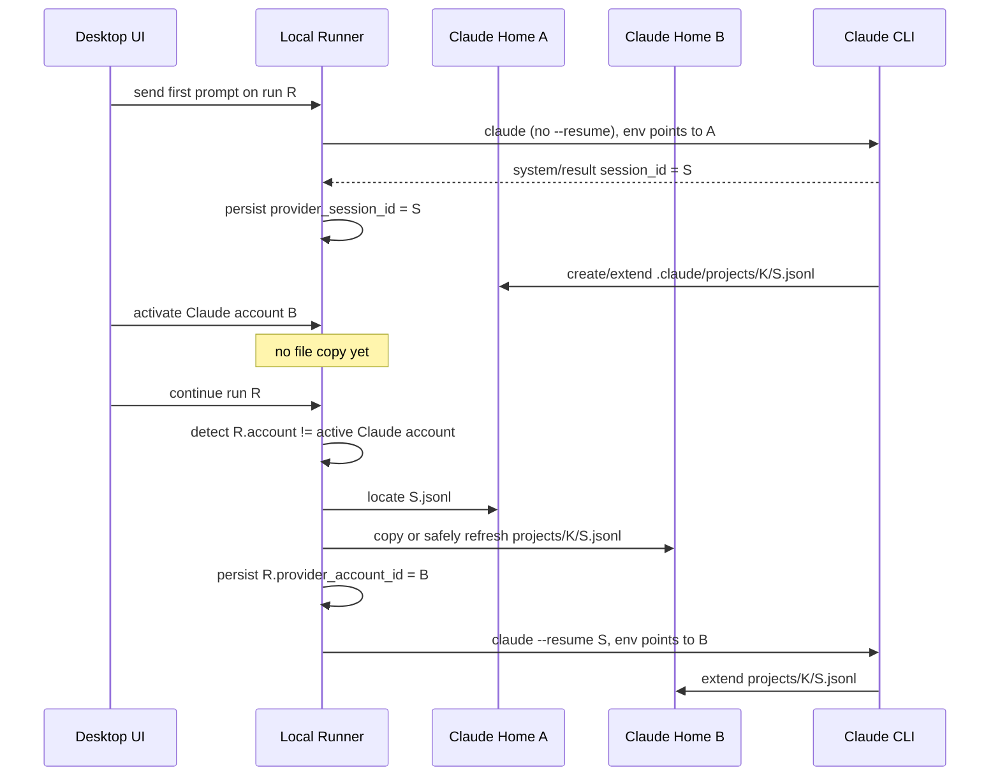
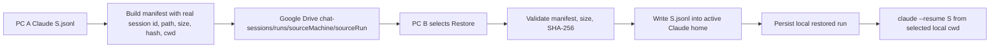

# SD-15: Claude Cross-Account And Cross-PC Chat Resume And Home Sync

## Metadata

- Document ID: `SD-15`
- Title: `Claude Cross-Account And Cross-PC Chat Resume And Home Sync`
- Phase: `tech_design`
- Status: `draft`
- Owner: `DatNguyen`
- Reviewers: `TBD`
- Created: `2026-06-19`
- Last Updated: `2026-06-19`
- Parent Documents: [SS-11: Workflow With Session](../05-System-Specs/SS-11-Workflow-With_Session.md)
- Child Documents: `none`
- Related Documents: [SD-12: Refactor Workflow With Session](./SD-12-Refactor-Workflow-With_Session.md), [SD-14: Codex Cross-Account Chat Resume And Home Sync](./SD-14-Codex-Cross-Account-Chat-Resume-And-Home-Sync.md), [Task-067: Desktop Post-Restart Run Resume Via Provider Session ID](../08-Task/done/Task-067-Desktop-Post-Restart-Run-Resume-Via-Provider-Session-Id.md), [Task-069: Cross-PC Sync For Non-Supabase Users](../08-Task/inprogress/Task-069-Cross-PC-Sync-Non-Supabase-Sessions-Ndjson.md), [Task-071: Cross-Account Chat Resume Definition Of Done Checklist](../08-Task/inprogress/Task-071-Cross-Account-Chat-Resume-DOD-Checklist.md), [Task-072: Cross-Account Chat Resume Test Signatures](../08-Task/inprogress/Task-072-Cross-Account-Chat-Resume-Test-Signatures.md), [Task-073: Cross-PC Non-Supabase Chat Sync Definition Of Done Checklist](../08-Task/inprogress/Task-073-Cross-PC-Non-Supabase-Chat-Sync-DOD-Checklist.md), [Task-074: Cross-PC Non-Supabase Chat Sync Test Signatures](../08-Task/inprogress/Task-074-Cross-PC-Non-Supabase-Chat-Sync-Test-Signatures.md), [Task-075: Cross-Account And Cross-PC Chat E2E Test Guide](../08-Task/inprogress/Task-075-Cross-Account-And-Cross-PC-Chat-E2E-Test-Guide.md), [Task-076: Replay User Prompts On Chat Transcript Resume](../08-Task/done/Task-076-Replay-User-Prompts-On-Chat-Transcript-Resume.md), [CA-098: Provider Session File Portability Spike](../../change-audit/CA-098-spike-provider-session-portability.md)
- Replaces: `none`
- Tags: `claude, provider-account, desktop-chat, resume, session, local-runner, google-drive, cross-pc`

## AI Quick View

### Summary

- Claude continuity uses one real Claude `session_id` plus one provider-owned JSONL transcript under `<accountHome>/.claude/projects/<project-key>/<sessionId>.jsonl`.
- FlowPilot launches a fresh Claude process for each turn and continues the conversation with `claude --resume <realSessionId>` under the active account's isolated `HOME`, `XDG_CONFIG_HOME`, and `CLAUDE_CONFIG_DIR`.
- Same-PC account switching is lazy: the JSONL file is copied into the new active Claude home only when the user reopens the run or sends the next turn.
- Cross-PC continuation uses explicit Google Drive sync and restore of the manifest plus the Claude JSONL file; local account auth is never copied.
- Current code can perform the initial copy, but reliable A -> B -> A continuation additionally requires safe append-only refresh of an older Claude destination file. Live Claude portability across accounts and PCs is still provider-untested.

### Current Ask

- Describe Claude cross-account and cross-PC chat continuation with the same implementation depth, path examples, state transitions, conflict rules, and user Q&A used by `SD-14`.
- Separate current implemented behavior from the additional design required to make repeated Claude account switching reliable.

### Key Decisions

- `D-1` Persist and resume the real Claude `session_id`; never pass FlowPilot's synthetic run/session id to `claude --resume`.
- `D-2` Treat one Claude JSONL file as the provider session source of truth for one Claude chat session.
- `D-3` Isolate each Claude account through account-scoped environment variables and copy only the session JSONL, never credentials or account configuration.
- `D-4` Relocate lazily on reopen or next turn, then rebind the same FlowPilot `run_id` to the active Claude account.
- `D-5` Add Claude-specific append-only refresh semantics for A -> B -> A. Identical or prefix-compatible same-session files are safe; divergent files are conflicts.
- `D-6` Cross-PC restore remains explicit and integrity-checked. Unsupported provider portability must leave the history item visible but disabled with a clear reason.
- `D-7` Do not claim Claude portability is verified until the real-account E2E cases in Task-075 pass.

### Constraints

- Claude session continuity is valid only inside the Claude provider.
- The active target account must have valid local Claude authentication.
- Provider auth files, tokens, `.claude.json`, and account settings must not be copied as chat-session data.
- A source and destination JSONL must never be text-merged after divergent continuations.
- Cross-PC project-path remapping is provider-sensitive because Claude stores sessions below a project-key directory.
- No transcript-history injection fallback is used when native Claude resume is unavailable.

### Open Questions

- `Q-1` Does Claude accept the same copied JSONL under a different authenticated account in a real two-account test?
- `Q-2` Does Claude accept the copied JSONL on another PC when the workspace path changes?
- `Q-3` Does Claude require the original project-key directory, or can `--resume <sessionId>` discover the file across project directories?
- `Q-4` Which identity fields are stable across all supported Claude CLI JSONL versions and can be used to validate same-session append-only refresh?

### Source Refs

- `SS-11 section 6 Follow-Up Prompt Behavior`
- `SS-11 section 7.2 Claude`
- `SD-12 section 3.3 Cross-Provider Session Rule`
- `apps/local-runner/internal/runner/claude_adapter.go`
- `apps/local-runner/internal/runner/claude_process.go`
- `apps/local-runner/internal/runner/claude_permission_mcp.go`
- `apps/local-runner/internal/runner/provider_registry.go`
- `apps/local-runner/internal/runner/interactive_resume.go`
- `apps/local-runner/internal/runner/session_file_locator.go`
- `apps/local-runner/internal/runner/transcript_loader.go`
- `apps/local-runner/internal/runner/chat_session_sync.go`
- `apps/local-runner/internal/runner/turn_log.go`
- [CA-098](../../change-audit/CA-098-spike-provider-session-portability.md)
- [Task-075](../08-Task/inprogress/Task-075-Cross-Account-And-Cross-PC-Chat-E2E-Test-Guide.md)

## 1. Goal

Define how FlowPilot keeps one desktop Claude chat usable when:

- the active Claude account changes on the same machine,
- the app or local runner restarts,
- the chat is explicitly synced from PC A and restored on PC B,
- the project path on PC B differs from the original project path,
- an older copy of the same Claude session already exists in the target account home.

The design must explain:

- what Claude stores on disk,
- which Claude id FlowPilot persists,
- how each turn is launched,
- when files are copied,
- how the same FlowPilot `run_id` is rebound,
- how collisions and divergent files are handled,
- which behavior is implemented,
- which behavior still requires implementation or real-provider validation.

This document does not replace `SD-14`. Claude and Codex share the high-level FlowPilot resume model, but their provider files and update behavior differ.

## 2. Input Documents

- [SS-11: Workflow With Session](../05-System-Specs/SS-11-Workflow-With_Session.md)
- `SS-11 section 6 Follow-Up Prompt Behavior`
- `SS-11 section 7.2 Claude`
- [SD-12: Refactor Workflow With Session](./SD-12-Refactor-Workflow-With_Session.md)
- [SD-14: Codex Cross-Account Chat Resume And Home Sync](./SD-14-Codex-Cross-Account-Chat-Resume-And-Home-Sync.md)
- [Task-067: Desktop Post-Restart Run Resume Via Provider Session ID](../08-Task/done/Task-067-Desktop-Post-Restart-Run-Resume-Via-Provider-Session-Id.md)
- [Task-069: Cross-PC Sync For Non-Supabase Users](../08-Task/inprogress/Task-069-Cross-PC-Sync-Non-Supabase-Sessions-Ndjson.md)
- [Task-071: Cross-Account Chat Resume Definition Of Done Checklist](../08-Task/inprogress/Task-071-Cross-Account-Chat-Resume-DOD-Checklist.md)
- [Task-072: Cross-Account Chat Resume Test Signatures](../08-Task/inprogress/Task-072-Cross-Account-Chat-Resume-Test-Signatures.md)
- [Task-075: Cross-Account And Cross-PC Chat E2E Test Guide](../08-Task/inprogress/Task-075-Cross-Account-And-Cross-PC-Chat-E2E-Test-Guide.md)
- [Task-076: Replay User Prompts On Chat Transcript Resume](../08-Task/done/Task-076-Replay-User-Prompts-On-Chat-Transcript-Resume.md)
- [CA-098: Provider Session File Portability Spike](../../change-audit/CA-098-spike-provider-session-portability.md)

Provider-validation status inherited from those inputs:

- Claude same-account post-restart resume: implemented mechanically, real-provider E2E still open.
- Claude same-PC cross-account resume: file relocation and active-home environment are implemented, real-provider portability still open.
- Claude cross-PC resume: sync/restore mechanics are implemented generically, real-provider portability and path-remap behavior still open.

## 3. Architecture Decision

- `D-1` The real Claude `session_id` is the durable provider resume handle.
  - First-turn behavior:
    - FlowPilot starts Claude without `--resume`.
    - Claude emits `session_id` on `system/init` or `result`.
    - FlowPilot captures and persists that real id.
  - Later-turn behavior:
    - FlowPilot launches `claude --resume <realSessionId>`.
  - Rejected alternative:
    - resume with FlowPilot's synthetic `thread-*` or run-local id.
  - Reason:
    - only the real provider id identifies Claude's stored conversation.

- `D-2` One Claude session is represented by one provider-owned JSONL file.
  - Expected path:

```text
<accountHome>/.claude/projects/<project-key>/<realSessionId>.jsonl
```

  - Unlike Codex:
    - Claude does not require a turn-log list of later provider session ids.
    - later turns are expected to extend the same session JSONL.

- `D-3` Claude remains spawn-per-turn.
  - FlowPilot does not require a long-lived Claude process for continuity.
  - Every turn starts a new headless stream-JSON process.
  - Continuity comes from `--resume <realSessionId>` and the provider session file.
  - A warm process is an optional future optimization, not a correctness dependency.

- `D-4` Account isolation is environment-based.
  - For an account home such as `/Users/tiendat/.claudeHome1`, FlowPilot sets:

```text
HOME=/Users/tiendat/.claudeHome1
XDG_CONFIG_HOME=/Users/tiendat/.claudeHome1/.config
CLAUDE_CONFIG_DIR=/Users/tiendat/.claudeHome1/.claude
```

  - Windows additionally receives account-scoped `USERPROFILE`, `APPDATA`, `LOCALAPPDATA`, `HOMEDRIVE`, and `HOMEPATH`.
  - The session JSONL is copied between account homes; credentials and settings are not.

- `D-5` Same-PC cross-account relocation is lazy.
  - Selecting another Claude account changes active-account state only.
  - FlowPilot copies the session file when:
    - the history run is reopened, or
    - the next turn starts.
  - After successful preparation, the same FlowPilot `run_id` is persisted with the new `provider_account_id`.

- `D-6` Claude A -> B -> A requires append-only refresh semantics.
  - Current generic relocation behavior:
    - target missing: copy,
    - target identical: accept,
    - target different: reject.
  - Required completed behavior:
    - target is an older byte-prefix of the same valid JSONL session: update target with the newer source,
    - target already extends source: keep target and do not downgrade,
    - files diverge after a shared prefix: reject.
  - This is required because account A commonly retains an older copy after account B continues the session.

- `D-7` Safe Claude refresh must validate identity and record boundaries.
  - Minimum conditions:
    - expected filename is `<realSessionId>.jsonl`,
    - both files contain valid newline-delimited JSON records,
    - identity-bearing records do not contradict the expected `session_id`,
    - the shorter file ends on a complete JSONL record boundary,
    - one complete byte stream is a prefix of the other.
  - File size alone is never sufficient.
  - No field-level merge is allowed.

- `D-8` Cross-PC continuation uses an explicit portability bundle.
  - Bundle:
    - FlowPilot run metadata,
    - real Claude `session_id`,
    - provider-relative JSONL path,
    - JSONL bytes,
    - byte size,
    - SHA-256 hash,
    - original working directory,
    - source machine id and source run id.
  - Restore writes into the active Claude account home and persists a local run row.

- `D-9` Project-key handling remains conservative until live Claude validation settles it.
  - Current relocation preserves the source `<project-key>` directory.
  - Current Drive restore preserves the provider-relative path from the manifest.
  - FlowPilot launches Claude from the selected/remapped local `cwd`.
  - If Claude cannot find or accept the restored session:
    - do not guess or silently duplicate the file into arbitrary project directories,
    - return a typed unavailable result,
    - keep the history row visible but disabled.

- `D-10` Native provider resume is the only continuity mechanism in this design.
  - Transcript replay is used to render history.
  - Transcript replay is not injected into a fresh Claude session as fallback.
  - If native portability is rejected, FlowPilot reports the run as unavailable.

## 4. Component Impact

- Impacted modules:
  - `provider_registry.go`
    - resolves the active Claude account and builds its isolated environment.
  - `claude_adapter.go`
    - captures the real session id and adds `--resume` on later turns.
  - `claude_process.go`
    - owns spawn-per-turn process lifecycle and synthetic-to-real id mapping.
  - `interactive_service.go`
    - gates turns on active-account consistency and seeds resumed Claude ids.
  - `interactive_resume.go`
    - locates, relocates, rebinds, and reconstructs persisted chats.
  - `session_file_locator.go`
    - locates Claude JSONL files and computes account-home relocation/restore paths.
  - `transcript_loader.go`
    - converts Claude JSONL frames into desktop-visible provider events.
  - `chat_session_sync.go`
    - builds, uploads, lists, restores, and validates Drive-backed chat bundles.
  - `local_file_session_store.go`
    - persists local run/session metadata and raw prompt sidecar entries.

- New or extended modules required by this design:
  - Claude JSONL metadata validator.
  - Claude append-only compatibility comparison.
  - Claude-specific relocation tests for older/newer/divergent copies.
  - real-provider E2E evidence for same-account, cross-account, and cross-PC resume.

- Unchanged modules:
  - workflow orchestration semantics,
  - Codex rollout-chain behavior,
  - cross-provider handoff rules,
  - provider credential storage,
  - artifact sync outside the chat-session bundle.

## 5. Data Model

### 5.1 Entities

- `ProviderSessionState`
  - `run_id`
  - `project_id`
  - `workflow_id`
  - `provider_key = claude`
  - `provider_session_id = real Claude session_id`
  - `provider_account_id`
  - `working_directory`
  - `run_kind = chat`
  - `last_prompt`
  - `last_message`
  - `source_machine_id`
  - `source_run_id`
  - `sync_status`
  - `sync_updated_at`

- in-memory `interactiveRun`
  - synthetic `providerSessionID`
  - real `realProviderSessionID`
  - persisted state chooses the real id when known

- Claude process-pool mapping
  - FlowPilot synthetic session id -> real Claude session id
  - restored runs seed this mapping before the next turn

- turn-log sidecar entry
  - `kind:"prompt"` with the raw user input
  - no Claude per-turn session-id entries are needed

- `ChatSessionSyncManifest`
  - source machine/run identity
  - provider identity
  - real provider session id
  - original cwd
  - provider-relative file path
  - file size and SHA-256

### 5.2 File Contracts

- FlowPilot local session index:

```text
<workspace>/.flowpilot/chats/sessions.ndjson
```

- FlowPilot per-run raw prompt log:

```text
<workspace>/.flowpilot/chats/<runId>-turns.ndjson
```

- Default Claude account example:

```text
/Users/tiendat/.claude/
  projects/
    <project-key>/
      <realSessionId>.jsonl
```

- Managed Claude account A example:

```text
/Users/tiendat/.claudeHome1/
  .claude.json
  .claude/
    settings.json
    projects/
      <project-key>/
        <realSessionId>.jsonl
```

- Managed Claude account B example:

```text
/Users/tiendat/.claudeHome2/
  .claude.json
  .claude/
    settings.json
    projects/
      <project-key>/
        <realSessionId>.jsonl
```

Important distinction:

- account home:
  - `/Users/tiendat/.claudeHome1`
- Claude config/session directory:
  - `/Users/tiendat/.claudeHome1/.claude`
- provider session file:
  - `/Users/tiendat/.claudeHome1/.claude/projects/<project-key>/<realSessionId>.jsonl`

### 5.3 Claude JSONL Content Model

The file is expected to contain newline-delimited provider frames such as:

```json
{"type":"system","subtype":"init","session_id":"claude-real-1","cwd":"/repo"}
{"type":"user","message":{"role":"user","content":[{"type":"text","text":"hello"}]}}
{"type":"assistant","message":{"role":"assistant","content":[{"type":"text","text":"Hi"}]}}
{"type":"result","subtype":"success","session_id":"claude-real-1","result":"Hi"}
```

The exact provider schema may vary by Claude CLI version. FlowPilot relies on:

- `type`,
- `subtype`,
- `session_id` when present,
- `cwd` when present,
- nested message content for transcript replay.

The compatibility baseline must continue checking these fields before portability is considered supported.

### 5.4 State Transitions

1. New run starts with a synthetic FlowPilot session id and the active Claude account id.
2. First Claude turn starts without `--resume`.
3. Claude emits a real `session_id`.
4. FlowPilot stores that real id and uses it as the durable provider resume handle.
5. Later same-account turns launch fresh Claude processes with `--resume <realSessionId>`.
6. On account mismatch, FlowPilot prepares the active account home before the next turn.
7. After successful relocation, FlowPilot persists the same run with the active account id.
8. On cross-PC restore, FlowPilot writes the provider file into the active local Claude home and creates or reuses a local run identity.

## 6. Interfaces and Contracts

### 6.1 Runtime Contracts

- `claudeAdapter.SendTurn(...)`
  - gets the real id from the shared Claude process pool,
  - calls `claudeArgs(...)`,
  - spawns a fresh Claude process,
  - writes the prepared user turn,
  - captures `session_id` from `system` or `result`,
  - persists the real id.

- `claudeArgs(...)`
  - always configures stream JSON input/output,
  - adds model, effort, MCP, and permission posture,
  - adds `--resume <realSessionId>` only when the real id is non-empty.

- `startTurn(runId, TurnInput, ...)`
  - compares the run-stamped Claude account with the currently active Claude account,
  - calls `ensureResumeReady(...)` for chat runs when they differ,
  - seeds the resumed Claude adapter with the persisted real id,
  - never changes provider identity.

- `resumeRun(runId)`
  - reconstructs the local run,
  - resolves the source account home,
  - validates the real session id and JSONL,
  - prepares the active account home if needed,
  - seeds transcript events from the JSONL plus raw prompt sidecar.

### 6.2 File Contracts

- `LocateSessionFile(claude, accountHome, sessionID, cwd)`
  - searches below `<accountHome>/.claude/projects`,
  - matches `<sessionID>.jsonl`,
  - currently does not require a derived project key.

- `RelocateSessionFile(claude, srcPath, targetHome, sessionID, cwd)`
  - preserves the source project-key directory,
  - writes to:

```text
<targetHome>/.claude/projects/<source-project-key>/<sessionID>.jsonl
```

  - same physical source/destination is a successful no-op,
  - missing destination is copied,
  - identical destination is accepted,
  - required extension: prefix-compatible same-session JSONL may refresh an older destination.

- Claude append-only refresh contract:

```text
compareClaudeSessionFiles(src, dst, expectedSessionID)
  -> identical
  -> source_extends_destination
  -> destination_extends_source
  -> divergent
  -> invalid
```

  - only `source_extends_destination` authorizes replacing destination bytes,
  - `destination_extends_source` keeps destination,
  - `divergent` and `invalid` fail closed.

- `TurnLogStore`
  - stores raw prompts so resumed transcript bubbles do not show FlowPilot-injected prompt reinforcement or skill preambles.

### 6.3 Account Environment Contract

Given account home `<H>`, the Claude adapter receives:

```text
HOME=<H>
XDG_CONFIG_HOME=<H>/.config
CLAUDE_CONFIG_DIR=<H>/.claude
```

On Windows:

```text
USERPROFILE=<H>
APPDATA=<H>/AppData/Roaming
LOCALAPPDATA=<H>/AppData/Local
HOMEDRIVE=<drive portion of H>
HOMEPATH=<path portion of H>
```

This contract ensures:

- authentication is read from the target account home,
- provider sessions are read from the target account home,
- FlowPilot's controlled permission settings remain account-scoped.

### 6.4 Optional Cloud Sync Contracts

- `BuildChatSessionSyncManifest(runId)`
  - loads the persisted Claude run,
  - resolves the real session id,
  - locates one JSONL file,
  - records relative path, size, and SHA-256.

- `syncChatRunToDrive(runId, ...)`
  - uploads the JSONL,
  - uploads `manifest.json`,
  - updates `chat-sessions/_index/sessions.ndjson`.

- `restoreChatRunFromDrive(...)`
  - downloads and validates the manifest,
  - downloads and validates the JSONL,
  - requires a local cwd or cwd remap,
  - resolves the active Claude account home,
  - refuses a different existing target file,
  - persists the restored local run.

Required correction:

- restore account resolution must be provider-scoped to the manifest provider. It must not accidentally use another provider's globally selected account.

## 7. Execution Flow

### 7.1 High-Level Same-PC Cross-Account Flow



### 7.2 User Scenario: Claude Account A -> B -> A

Assumptions:

- `runId = run-claude-abc`
- real Claude session id = `claude-sid-1`
- source project-key directory = `project-key-xyz`
- account A home = `/Users/tiendat/.claudeHome1`
- account B home = `/Users/tiendat/.claudeHome2`
- workspace = `/Users/tiendat/work/mealplanner`

#### Step 1. Open a new chat while Claude account A is active

FlowPilot creates the run:

```text
run_id=run-claude-abc
provider_key=claude
provider_account_id=acctA
provider_session_id=thread-<synthetic>
working_directory=/Users/tiendat/work/mealplanner
```

No real Claude session id exists until Claude emits one.

Path state:

```text
/Users/tiendat/.claudeHome1/.claude/projects/
  (no file for this run yet)

/Users/tiendat/.claudeHome2/.claude/projects/
  (unchanged)
```

#### Step 2. Send `"hello im accA"`

1. FlowPilot launches Claude with account A's environment.
2. The command does not include `--resume`.
3. FlowPilot writes the composed stream-JSON user turn.
4. Claude emits `session_id = claude-sid-1`.
5. FlowPilot persists the real id.
6. Claude creates:

```text
/Users/tiendat/.claudeHome1/.claude/projects/project-key-xyz/claude-sid-1.jsonl
```

7. FlowPilot stores the raw prompt separately:

```json
{"kind":"prompt","prompt":"hello im accA"}
```

FlowPilot state:

```text
sessions.ndjson
  run-claude-abc ->
    provider_key=claude
    provider_account_id=acctA
    provider_session_id=claude-sid-1
    last_prompt="hello im accA"
```

Path state:

```text
.claudeHome1/.claude/projects/project-key-xyz/
  claude-sid-1.jsonl  <- created and owned by Claude

.claudeHome2/.claude/projects/
  (unchanged)
```

#### Step 3. Switch active Claude account to B

Only provider-account state changes.

No JSONL is copied at switch time because no specific chat has been selected for continuation.

Path state remains:

```text
.claudeHome1/.claude/projects/project-key-xyz/
  claude-sid-1.jsonl

.claudeHome2/.claude/projects/
  (no copy yet)
```

The run still records `provider_account_id=acctA` until it is reopened or continued.

#### Step 4. Send `"hello im accB"` on the same FlowPilot run

Before Claude receives the prompt:

1. `startTurn(...)` detects:

```text
run.provider_account_id = acctA
active Claude account   = acctB
```

2. `ensureResumeReady(...)` resolves account A's home.
3. `LocateSessionFile(...)` finds:

```text
.claudeHome1/.claude/projects/project-key-xyz/claude-sid-1.jsonl
```

4. FlowPilot validates account B is signed in.
5. FlowPilot copies the JSONL to:

```text
.claudeHome2/.claude/projects/project-key-xyz/claude-sid-1.jsonl
```

6. FlowPilot persists:

```text
provider_account_id=acctB
```

Then the turn runs:

7. The Claude adapter is created from account B.
8. Environment points to `.claudeHome2`.
9. FlowPilot seeds the process pool with `claude-sid-1`.
10. Claude launches with:

```text
claude ... --resume claude-sid-1
```

11. Claude account B authenticates the new model call.
12. If portability is accepted, Claude extends B's JSONL with the new turn.

Path state after a successful turn:

```text
.claudeHome1/.claude/projects/project-key-xyz/
  claude-sid-1.jsonl  <- older copy, contains turn 1

.claudeHome2/.claude/projects/project-key-xyz/
  claude-sid-1.jsonl  <- newer copy, contains turns 1 and 2
```

Important:

- the real session id remains `claude-sid-1`,
- Claude does not create a new provider session id for each turn,
- FlowPilot does not append JSON lines itself,
- the Claude CLI extends the JSONL after successful native resume.

If Claude rejects the copied session:

- the run remains in history,
- continuation fails with a typed unavailable reason,
- the desktop must show the run as unavailable/disabled rather than resetting it.

#### Step 5. Switch active Claude account back to A

Again, no file changes immediately.

Before the next turn:

```text
.claudeHome1/.../claude-sid-1.jsonl = older A copy
.claudeHome2/.../claude-sid-1.jsonl = newer B copy
run.provider_account_id             = acctB
active Claude account               = acctA
```

#### Step 6. Send `"see you again, im A"`

Before Claude receives the prompt:

1. FlowPilot locates the current source file under account B.
2. FlowPilot computes account A's destination path.
3. Account A already has a file with the same session id.
4. FlowPilot compares the files using the Claude append-only compatibility contract.

Expected safe relationship:

```text
A file bytes are a complete-record prefix of B file bytes
```

Required result:

- refresh A's older file with B's newer file,
- persist `provider_account_id=acctA`,
- launch Claude under account A with `--resume claude-sid-1`,
- let Claude append turn 3 to account A's file.

Final path state:

```text
.claudeHome1/.claude/projects/project-key-xyz/
  claude-sid-1.jsonl  <- newest copy, contains turns 1, 2, and 3

.claudeHome2/.claude/projects/project-key-xyz/
  claude-sid-1.jsonl  <- older copy, contains turns 1 and 2
```

Current-code warning:

- today, different Claude destination bytes are rejected,
- therefore Step 6 requires the `D-6`/`D-7` extension-aware refresh before A -> B -> A can be called complete.

### 7.3 State Summary Table

| User step | Active Claude home | Persisted run account after step | File operation | Claude command |
|---|---|---|---|---|
| 1. Open run on A | `.claudeHome1` | `acctA` | none | none |
| 2. First prompt on A | `.claudeHome1` | `acctA` | Claude creates `S.jsonl` | no `--resume` |
| 3. Switch to B | `.claudeHome2` | still `acctA` | none | none |
| 4. Continue on B | `.claudeHome2` | `acctB` | copy A `S.jsonl` to B | `--resume S` |
| 5. Switch to A | `.claudeHome1` | still `acctB` | none | none |
| 6. Continue on A | `.claudeHome1` | `acctA` | safely refresh older A file from B | `--resume S` |

### 7.4 Same-Account Multiple-Turn Flow

If the user stays on account A:

1. no cross-home relocation occurs,
2. each turn spawns a fresh Claude process,
3. the process uses account A's environment,
4. every turn after the first includes `--resume <realSessionId>`,
5. Claude extends the same JSONL in account A's home,
6. FlowPilot appends only raw user prompts to its sidecar.

Example:

```text
Turn 1: claude ...                    -> creates S.jsonl
Turn 2: claude ... --resume S         -> extends S.jsonl
Turn 3: claude ... --resume S         -> extends S.jsonl
```

There is no need to copy the file or record multiple provider session ids.

### 7.5 Optional Cross-PC Google Drive Flow



Detailed flow:

1. PC A has a completed or resumable Claude chat.
2. FlowPilot resolves the run's real Claude session id.
3. FlowPilot locates one JSONL file.
4. FlowPilot uploads:
   - provider file bytes,
   - manifest,
   - remote history index record.
5. PC B lists the remote chat.
6. User selects a local project path when the original cwd is unavailable.
7. FlowPilot resolves the active Claude account on PC B.
8. FlowPilot validates that account has local auth.
9. FlowPilot validates downloaded byte count and SHA-256.
10. FlowPilot writes the JSONL under the manifest's provider-relative path.
11. FlowPilot persists a local run row with:
    - real session id,
    - local cwd,
    - active local Claude account id,
    - source machine/run provenance.
12. Opening or continuing the run seeds the real id and launches:

```text
claude ... --resume <realSessionId>
```

Important boundary:

- Google Drive carries session data, not authentication,
- the target Claude account must already be signed in,
- provider acceptance on another PC is still unverified.

### 7.6 Source-PC And Target-PC Update Model

After PC B restores and continues the chat, PC A and PC B can hold different versions of the same session file.

Safe case:

```text
PC A file = turns 1..2
PC B file = turns 1..3
```

PC B may sync its newer prefix-compatible extension to Drive.

Unsafe case:

```text
PC A independently adds turn 3A
PC B independently adds turn 3B
```

The files now diverge after a common prefix.

Design rule:

- FlowPilot must not merge these JSONL files,
- re-sync/restore must report a conflict,
- the user must choose which branch to keep or preserve them as separate local runs in a future conflict-resolution feature.

### 7.7 Concrete Validation Status

Implemented and covered by automated tests:

- real Claude session id is persisted when known,
- synthetic id is not used for native resume,
- restored Claude adapter is seeded with the real id,
- `--resume <realSessionId>` is generated,
- active account home controls Claude environment,
- Claude file locator searches `.claude/projects`,
- relocation preserves the source project-key directory,
- same-home relocation is a no-op,
- transcript replay reads user/assistant/tool frames,
- Drive manifest/hash/restore mechanics are provider-generic.

Not yet proven with real Claude accounts:

- account A JSONL accepted under account B,
- account B can extend the copied session,
- refreshed file accepted again under account A,
- copied file accepted on PC B,
- remapped cwd works with the preserved source project-key directory.

Acceptance status must use one of:

- `pass`,
- `greyout-safe`,
- `provider-untested`.

## 8. Failure and Edge Handling

- `F-1` Source account home cannot be resolved.
  - result: `session_unavailable` or `account_unavailable`

- `F-2` Target Claude account home does not exist.
  - result: `account_unavailable`

- `F-3` Target account is not signed in.
  - result: `account_not_signed_in`

- `F-4` Real Claude session id is missing.
  - result: do not call `--resume`; persisted history run is unavailable for native continuation

- `F-5` Source `<sessionId>.jsonl` cannot be found.
  - result: `session_unavailable`

- `F-6` Source and destination resolve to the same physical file.
  - result: successful no-op followed by account-id rebinding

- `F-7` Destination does not exist.
  - result: create parent directory and copy source JSONL

- `F-8` Destination is byte-identical.
  - result: accept without rewrite

- `F-9` Source safely extends destination.
  - result: atomically replace destination with source after validation

- `F-10` Destination safely extends source.
  - result: keep destination; never downgrade

- `F-11` Source and destination diverge.
  - result: typed `session_file_conflict`; never merge

- `F-12` JSONL is malformed or ends with an incomplete record.
  - result: fail validation and preserve both existing files

- `F-13` Claude rejects `--resume` after relocation.
  - result: preserve history metadata, mark continuation unavailable, show disabled/greyed-out state

- `F-14` Original cwd does not exist on the target PC.
  - result: `cwd_remap_required`

- `F-15` Remapped cwd is accepted by FlowPilot but Claude cannot discover the preserved project-key session.
  - result: provider-unavailable/greyout-safe; do not copy into guessed directories

- `F-16` Restored local `run_id` already belongs to unrelated local data.
  - result: remap to `sync-<machine>-<sourceRunId>`

- `F-17` Existing restored target file has a different hash.
  - result: `session_file_conflict`

- `F-18` Drive bytes do not match manifest size/hash.
  - result: `sync_integrity_failed`

- `F-19` User switches account while a Claude turn is in flight.
  - result: active in-flight process remains scoped to the account/environment used when it started; the next turn performs account preparation

- `F-20` Old run has no raw prompt sidecar.
  - result: native resume may still work; transcript replay may display provider-composed prompt text or reduced prompt fidelity

## 9. Security and Operational Concerns

- auth:
  - target account authentication is a local prerequisite,
  - session-file portability does not transfer authorization to call Claude.

- secrets:
  - do not upload or copy:
    - `.claude.json`,
    - OAuth tokens,
    - API keys,
    - account settings,
    - environment secrets.
  - the JSONL may still contain sensitive conversation and tool content and must be treated as user data.

- account isolation:
  - every Claude turn must use the active account's isolated environment,
  - controlled `CLAUDE_CONFIG_DIR` remains responsible for permission posture.

- path safety:
  - restore paths must remain below `<targetHome>/.claude`,
  - reject `..`, absolute-path escape, or non-Claude relative paths.

- integrity:
  - Drive restore validates size and SHA-256 before write,
  - local refresh validates same-session append-only compatibility.

- atomicity:
  - extension refresh should write a temporary sibling file, flush, then replace the older destination,
  - a failed refresh must leave the original destination readable.

- audit:
  - preserve:
    - source machine id,
    - source run id,
    - provider key,
    - account binding,
    - sync timestamps,
    - typed failure reason.

- deletion:
  - deleting one Claude history run must scan all registered Claude homes because safe relocation may leave copies in several homes.

- rollback:
  - account rebinding occurs only after file preparation succeeds,
  - failed copy/refresh/restore leaves the source run binding unchanged.

## 10. Risks and Trade-Offs

- `R-1` Claude portability is mechanically plausible but not yet provider-verified.
  - mitigation:
    - retain explicit `provider-untested` status and greyout fallback.

- `R-2` The project-key directory may encode the original cwd.
  - impact:
    - cross-PC restore with a different local path may fail even when id and JSONL are correct.
  - mitigation:
    - preserve source key first, require cwd selection, validate live behavior before adding alternate placement.

- `R-3` One file is simpler than Codex's multi-rollout chain but creates stale-copy conflicts.
  - impact:
    - A -> B succeeds, but B -> A needs extension-aware refresh.
  - mitigation:
    - implement `D-6` and `D-7`.

- `R-4` Byte-prefix compatibility assumes provider updates are append-only.
  - impact:
    - if a Claude CLI version rewrites prior records, safe refresh will reject it.
  - mitigation:
    - fail closed and update compatibility baselines before changing merge rules.

- `R-5` Concurrent continuation on two accounts or PCs creates branches.
  - impact:
    - no automatic merge is safe.
  - mitigation:
    - detect divergence and require explicit future conflict resolution.

- `R-6` The JSONL can contain tool inputs, outputs, file paths, and user content.
  - impact:
    - cloud sync has privacy and storage implications.
  - mitigation:
    - explicit user sync, project-scoped Drive folder, integrity metadata, no credential files.

- `R-7` Generic restore code can accidentally use a non-Claude global active account if account selection is not provider-scoped.
  - mitigation:
    - resolve the active account using `activeAccountForProvider(manifest.ProviderKey)`.

- `R-8` Copying the file does not guarantee the provider will authorize continuation under another account.
  - mitigation:
    - separate file portability, target-account authentication, and provider acceptance in diagnostics.

## 11. Validation Strategy

### 11.1 Unit Tests

- real session id persistence:
  - `sessionStateOf` uses the real Claude id when known.

- adapter resume:
  - first turn omits `--resume`,
  - later/restored turn uses `--resume <realSessionId>`,
  - synthetic id is never passed.

- account environment:
  - `HOME`,
  - `XDG_CONFIG_HOME`,
  - `CLAUDE_CONFIG_DIR`,
  - Windows home variables.

- locator/relocation:
  - find `<sessionId>.jsonl` below `.claude/projects`,
  - preserve project-key directory,
  - same-home no-op,
  - missing destination copy,
  - identical destination no-op.

- required new append-only tests:
  - source extends destination -> destination updated,
  - destination extends source -> destination retained,
  - divergent files -> conflict,
  - wrong session id -> conflict,
  - malformed JSONL -> conflict,
  - partial final record -> conflict,
  - atomic replacement failure -> old destination preserved.

- transcript replay:
  - user prompts,
  - assistant messages,
  - tool result frames,
  - raw prompt override,
  - missing file best-effort behavior.

- Drive restore:
  - valid Claude relative path,
  - path traversal rejection,
  - hash conflict,
  - provider-scoped active account resolution.

### 11.2 Integration Tests

- reconstruct persisted Claude run after runner restart,
- seed real session id into a fresh adapter,
- prepare account B from account A,
- rebind the same run id to account B,
- prepare account A from a newer account B file,
- preserve source binding on relocation failure,
- list and restore a Claude Drive bundle,
- remap local run id collision.

### 11.3 Manual Real-Provider Tests

- `E2E-031`: same-account post-restart Claude resume.
- `E2E-041`: same-PC Claude account A -> B.
- additional required case: Claude A -> B -> A after extension refresh.
- cross-PC:
  - PC A sync,
  - PC B restore with same cwd,
  - PC B restore with remapped cwd,
  - continue and verify remembered token.

Record:

- Claude CLI version,
- OS,
- source/target account type,
- source/target paths,
- real session id,
- whether file was accepted,
- whether context was preserved,
- whether a new turn completed,
- final status: `pass`, `greyout-safe`, or `provider-untested`.

### 11.4 Observability

Inspect:

```text
<workspace>/.flowpilot/chats/sessions.ndjson
<workspace>/.flowpilot/chats/<runId>-turns.ndjson
<accountA>/.claude/projects/<project-key>/<sessionId>.jsonl
<accountB>/.claude/projects/<project-key>/<sessionId>.jsonl
Google Drive/chat-sessions/runs/<machine>/<run>/
```

Diagnostics should distinguish:

- source file missing,
- target account not signed in,
- local file conflict,
- malformed JSONL,
- cwd remap required,
- provider rejected resume,
- sync integrity failure.

## 12. Traceability to Spec

- `SS-11 section 6: follow-up continues the provider session when supported`
  - mapped to `D-1`, `D-2`, `D-3`, Sections 6 and 7.

- `SS-11 section 7.2: Claude uses provider session id and native resume`
  - mapped to `D-1`, `D-3`, Section 6.1.

- `SS-11: provider session identity is runtime state, not durable FlowPilot identity`
  - mapped to the stable FlowPilot `run_id` plus mutable account binding in Sections 5 and 7.

- `SS-11: workflow/chat state remains auditable`
  - mapped to local session index, raw prompt sidecar, source machine/run provenance, and typed failures in Sections 5 and 9.

- `SS-11: cross-provider continuity must not share provider sessions`
  - mapped to the Claude-only constraint in `D-10`.

## 13. User Q And A: Claude Cross-Account And Cross-PC Resume

This section records the practical questions that must be answered when reviewing the Claude design.

### Q-1. How does Claude continuation work after FlowPilot or the runner restarts?

Short answer:

- FlowPilot reconstructs the run from local metadata,
- locates `<realSessionId>.jsonl`,
- seeds the Claude adapter with the real id,
- starts a fresh process with `claude --resume <realSessionId>`.

The old process is not required. Claude continuity depends on:

1. real session id,
2. matching JSONL file,
3. valid local Claude authentication,
4. a compatible local Claude CLI,
5. a usable working directory.

### Q-2. How does same-PC account A -> B continuation work?

Short answer:

- FlowPilot copies the session JSONL from A's Claude home into B's Claude home immediately before reopen/next turn, then runs Claude under B's account environment with the same real session id.

FlowPilot does not:

- copy A's auth,
- log B into Claude,
- create a new FlowPilot run,
- inject transcript text into a fresh conversation.

The target account B must already be authenticated.

### Q-3. If we save the Claude session id and copy the JSONL file, is that enough to resume on another account or PC?

Design answer:

- it is the required technical foundation,
- but it is not yet proven sufficient for Claude in this repository.

Additional prerequisites:

- target account auth,
- compatible Claude CLI,
- provider acceptance of a file created under another account/machine,
- project-key/cwd discovery behavior.

Therefore:

- Codex: portability has real same-PC evidence in `CA-098`,
- Claude: portability remains `provider-untested` until Task-075 E2E evidence exists.

### Q-4. Why does Claude need only one provider file while Codex may need several?

Claude:

```text
one real session id -> one <sessionId>.jsonl -> later turns extend that file
```

Codex in the current implementation:

```text
one stable resume id + later per-turn rollout ids -> multiple rollout files may be required for replay/relocation
```

Therefore Claude does not need `kind:"claude_session"` entries in the turn-log sidecar.

### Q-5. What happens when the user switches A -> B -> A?

After B continues:

- A has an older JSONL,
- B has a newer JSONL.

Before A can continue again, FlowPilot must:

1. prove both files represent the same session,
2. prove A's file is a complete-record prefix of B's file,
3. refresh A with B's newer bytes,
4. run `claude --resume <sameSessionId>` under A.

Current code does not yet perform this Claude-specific refresh. It rejects different destination bytes. That is the main implementation gap identified by this design.

### Q-6. Can FlowPilot overwrite the older file on account A?

Yes, only when all safe conditions match:

- same expected session id,
- valid JSONL,
- complete record boundary,
- source is a strict append-only extension of destination.

No, when:

- files diverge,
- identity is inconsistent,
- JSONL is malformed,
- source is merely larger without prefix compatibility.

### Q-7. What happens if account A and account B both continue independently?

Example:

```text
A: turns 1, 2A
B: turns 1, 2B
```

The files diverge.

FlowPilot must:

- reject automatic overwrite,
- never concatenate or merge records,
- preserve both files,
- report `session_file_conflict`.

Automatic conversation-branch merge is out of scope.

### Q-8. What happens if the same target file already exists during cross-PC restore?

- same hash:
  - accept; restore is idempotent.
- different hash:
  - reject with `session_file_conflict`.

The current Drive restore contract is stricter than local extension refresh. A future sync-update design may use the same prefix-compatible comparison, but it must not silently overwrite a divergent local continuation.

### Q-9. How is the Claude account selected behind the scenes?

FlowPilot resolves the active account specifically for `provider_key=claude`.

The adapter then receives account-specific environment variables:

```text
HOME=<Claude account home>
XDG_CONFIG_HOME=<Claude account home>/.config
CLAUDE_CONFIG_DIR=<Claude account home>/.claude
```

This is why copying the JSONL alone does not switch identity. Authentication comes from the target environment.

### Q-10. Does FlowPilot copy `.claude.json` or login tokens with the chat?

No.

Copied/synced:

- one session JSONL,
- FlowPilot metadata/manifest.

Not copied/synced:

- `.claude.json`,
- tokens,
- API keys,
- account settings,
- provider credentials.

### Q-11. What happens when the project path differs on PC B?

FlowPilot requires the user to select a local project path when the original cwd is unavailable.

Current design then:

- stores the local cwd in the restored run,
- preserves the source provider-relative project-key path,
- launches Claude from the local cwd.

Unverified provider question:

- whether Claude discovers the preserved session file when the cwd differs.

If it does not:

- return a clear unavailable state,
- do not guess the project-key algorithm,
- add a verified path-remapping rule only after observing the real CLI behavior.

### Q-12. Does transcript replay prove that native resume will work?

No.

Transcript replay proves FlowPilot can read and display the JSONL.

Native resume additionally requires Claude CLI to accept:

- the session id,
- the file location,
- the account,
- the machine,
- the cwd relationship.

Rendering history and continuing provider context are separate capabilities.

### Q-13. If the user stays on one Claude account, is any copying performed?

No.

FlowPilot:

- stays in one account home,
- launches a fresh Claude process per turn,
- reuses the same real session id,
- uses `--resume`,
- lets Claude extend the local JSONL.

### Q-14. Why is the account switch lazy instead of copying every Claude chat immediately?

Because selecting account B does not identify which historical run the user intends to continue.

Lazy preparation:

- copies only the selected run,
- avoids scanning all Claude sessions,
- keeps account activation fast,
- reduces unnecessary sensitive-file copies.

### Q-15. What is the user-visible fallback if Claude rejects portability?

The history row remains visible.

FlowPilot shows a clear unavailable/disabled reason such as:

- session data not found,
- target account not signed in,
- provider rejected resume,
- project path remap required,
- session file conflict.

FlowPilot does not silently start an empty Claude conversation and pretend it resumed the old chat.

### Q-16. Can the same synced Claude chat be restored twice?

Yes, if the second restore finds:

- the same source machine/run identity,
- the same provider file hash,
- the same or safely remapped local run identity.

It should be idempotent.

If local content has changed and the hash differs:

- restore stops with a conflict.

### Q-17. What must pass before SD-15 can move from draft to approved?

Minimum evidence:

1. same-account restart resume succeeds with real Claude,
2. account A -> B resume succeeds or produces the agreed greyout-safe result,
3. A -> B -> A refresh behavior is implemented and tested,
4. cross-PC same-cwd restore is tested,
5. cross-PC remapped-cwd behavior is recorded,
6. provider-scoped restore account resolution is verified,
7. no auth files are copied,
8. divergence is rejected without data loss.
