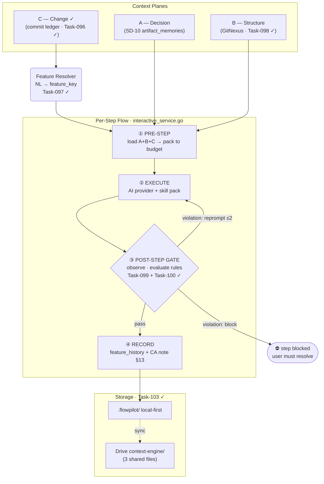

# SD-17: Context And Regression Engine

## Metadata

- Document ID: `SD-17`
- Title: `Context And Regression Engine`
- Phase: `tech_design`
- Status: `draft`
- Owner: `FlowPilot`
- Reviewers: `TBD`
- Created: `2026-06-23`
- Last Updated: `2026-06-24`
- Parent Documents: [SS-14: Code Context And Regression Safety](../05-System-Specs/SS-14-Code-Context-And-Regression-Safety.md), [SS-02: Project Context](../05-System-Specs/SS-02-Project-Context.md), [SS-09: Artifact Memory Context Retrieval](../05-System-Specs/SS-09-Artifact-Memory-Context-Retrieval.md), [SS-13: AI-Followable Document Contract](../05-System-Specs/SS-13-AI-Followable-Document-Contract.md)
- Child Documents: [CP-35: Context And Regression Engine Rollout](../07-Coding-Plan/inprogress/CP-35-Context-And-Regression-Engine-Rollout.md), [SD-20: Flow Gate Rule Semantics](./SD-20-Flow-Gate-Rule-Semantics.md)
- Related Documents: [SD-10: Context Resolver & RAG](./SD-10-Context-Resolver-RAG.md), [SD-16: Agent Spawn And Tool-Calling Design](./SD-16-Agent-Spawn-And-Tool-Calling-Design.md), [CP-10: Integrations, Memory & Context Intelligence](../07-Coding-Plan/inprogress/CP-10-Integrations-Hardening.md), [CP-34: Init Tool](../07-Coding-Plan/done/CP-34-Init-tool.md), [CP-31: Auto-Document Process](../07-Coding-Plan/done/CP-31-Auto-Document-Process.md), [CP-32: UnitTest Rule](../07-Coding-Plan/done/CP-32-UnitTest-Rule.md), [CP-23: Context Control & Wrong-Way Detection](../07-Coding-Plan/todo/CP-23-Auto-Learn-To-Skill.md)
- Replaces: `None (extends SD-10)`
- Tags: `context, regression, commit-ledger, feature-resolver, flow-gate, skill-pack, gitnexus, tooling, local-runner`

## AI Quick View

### Summary

- FlowPilot's accuracy problem has two roots a single RAG cannot fix: the AI lacks whole-project structural context, and it lacks change history, so it conflicts with, duplicates, or deletes load-bearing prior work (regression).
- The engine serves context from three planes — Decision (SD-10 artifact memory), Structure (**GitNexus as a pluggable provider**), and Change (**a commit-indexed, feature-tagged, ordered history**) — and enforces the flow with a runner-owned gate.
- Plane C is deliberately cheap: it is built from `git log` + FlowPilot's own commit-message convention (`Task-`/`BUG-`/`CP-` ids) + `change-audit/` notes. No symbol graph or AST hashing is required for v1.
- A natural-language ask is mapped to the right feature by a **Feature Resolver** over a small **Feature Catalog** (lexical match + an LLM pick-from-list — no vector index needed), then the ordered history is a direct key lookup — newest entry is current truth.
- Enforcement is two-layered: a **bundled flow skill pack** makes the AI cooperate (soft), and a **runner Post-Step Flow Gate** forces required outputs — CA note, Task/BugFix doc, green tests (hard).
- The strongest regression signal is the **existing test suite itself**: a previously-green test that breaks (and was not changed by the task) is a hard regression — cheaper and more reliable than any code graph.
- Required external tooling (GitNexus, RTK, node, skill pack) is installed and health-checked through the init/setup tool (`CP-34`); the engine degrades gracefully to the available capability tier.
- Symbol-level graphs, AST-normalized hashing, and Change-Contract scope-drift are **deferred to an optional advanced phase**, used only where a provider (GitNexus) supplies them cheaply.

### Current Ask

- Settle a runtime architecture that gives the AI enough project context and forces a safe, auditable flow, built from cheap, mostly-existing signals (git, commit convention, change-audit, GitNexus), not a bespoke code-intelligence engine.

### Key Decisions

- `D-1` Context is served by three planes: A Decision (semantic), B Structure (provider), C Change (ordered commit history).
- `D-2` The engine operates only on the bound target project; never FlowPilot's own source. Every plane is per-project, multi-tenant, local-first.
- `D-3` Plane C is a commit-indexed, feature-tagged, **ordered** history (newest = current truth), derived from `git log` + commit-id convention + `change-audit/` notes — no symbol graph or hashing.
- `D-4` A natural-language ask resolves to a `feature_key` via a Feature Resolver over a small Feature Catalog using lexical match + an LLM pick-from-list (the catalog is small enough to show the model inline); no vector index is required. History retrieval is then a direct key lookup. Catalog embeddings are an optional later enhancement; pgvector stays reserved for Plane A memory (SD-10).
- `D-5` Plane B is **GitNexus as a pluggable structure provider** run against the bound repo; if absent, structure degrades to file/commit level. No bespoke indexer is built.
- `D-6` Flow enforcement is runner-owned: a **Post-Step Flow Gate** observes the AI's response, tool calls, git diff, and test result, and forces required artifacts. Provider-native hooks are an optional accelerator, not a dependency.
- `D-7` A bundled, provider-agnostic **flow skill pack** is auto-installed into each bound project (`.claude/.codex/.gemini`) as the soft enforcement layer; it includes a commit-message-format skill so commits stay machine-parseable for the change ledger (`D-3`).
- `D-8` Required tooling (GitNexus, RTK, node, skill pack) is installed and health-checked via the init/setup tool (`CP-34`); the engine reads a tooling registry and runs at the available capability tier.
- `D-9` The universal substrate is code + git; SS-13 structured docs are an enrichment, never a precondition.
- `D-10` The oracle rule (a failing test forces a spec/business re-check or a user question, and code/tests are never changed blindly to pass) is enforced by the Flow Gate + skill pack — deterministic and cheap (delivers `CP-32`).
- `D-11` Symbol-level graph, AST-normalized hashing, and Change-Contract scope-drift are **deferred (advanced/optional)** and used only where GitNexus supplies them cheaply, because validation showed they are noisy and costly relative to their v1 value.
- `D-12` The pre-existing test suite is the primary regression signal: a test that was green before the change and is red after it (and was not itself modified by the task) is a hard regression and **always** blocks the step (not subject to `gate_mode`) — distinct from a task-authored test that is not yet green. This needs no code graph. On a test/spec mismatch, the gate raises it for explicit user confirmation rather than resolving silently.

### Constraints

- Must layer on the SD-10 / CP-10 Part B context-resolver pipeline additively, not break it.
- Must reuse the `<target>/.flowpilot/` local convention (`CA-097`) and Supabase RLS-by-`project_id`.
- Must work on arbitrary repos with no specs and no FlowPilot history (code + git only).
- All enforcement must be runner-owned so it works across every provider (`SD-16`); skills and provider hooks are additive.
- Indexing, catalog build, and history build must be non-fatal and retryable; never block the raw work.

### Open Questions

- `Q-1` Feature Resolver disambiguation UX: auto-pick top match above a threshold, always confirm, or confirm only when scores are close?
- `Q-2` Flow Gate remediation: how many auto re-prompt attempts before escalating to the user, and which rules block vs. warn by default?
- `Q-3` GitNexus run trigger and cost on the bound repo: on bind, on demand, or scheduled — and how stale may its index be before the structure signal is suppressed?
- `Q-4` Resolved for v1 — start with lexical match + an LLM pick-from-list (no embeddings); add catalog embeddings only if the catalog grows large or matching proves weak.

### Source Refs

- `SS-14` AC-1..AC-13; `SS-02`, `SS-09`, `SS-13 §7.3/§8.3/§13`.
- `SD-10`/`CP-10 §3` Plane A; `SD-16` runner-owned orchestration; `CP-34` init/setup + skill install; `CP-31` doc normalization; `CP-32` unit-test rule; `CP-23` behavioral drift (distinct).
- External: GitNexus CLI/MCP (`npx gitnexus analyze`); RTK token proxy.
- Code refs: `internal/contextresolver/` (CP-10), `interactive_service.go`, `local_file_session_store.go` (`.flowpilot/` pattern), provider adapters (`claude_*`, `codex_adapter.go`).

## 1. Goal

Make FlowPilot-driven AI work correct and regression-safe on any bound project, using cheap and mostly-existing signals:

- give the AI the **ordered change history** of the feature it is touching (so it builds on prior work instead of undoing it),
- give it **structural context** from GitNexus when available,
- **force a safe flow** after the response (update the change-audit, create the Task/BugFix doc, keep tests green) through a runner gate plus a bundled skill pack,
- and make the required tooling installable and verifiable on the user's machine.

Symbol-level diffing and scope-drift are explicitly out of v1; they are an optional later enhancement.

## 2. Input Documents

- `SS-14` Code Context And Regression Safety — acceptance criteria (`AC-1`..`AC-13`).
- `SS-02`, `SS-09`, `SS-13` (§7.3 upstream triggers, §8.3 authority, §13 change-ledger block).
- `SD-10` / `CP-10` Part B — Plane A (artifact memory) this builds on.
- `SD-16` — runner-owned side effects and gates.
- `CP-34` init/setup + skill & tooling install; `CP-31` existing-doc normalization; `CP-32` unit-test rule.

## 3. Architecture Decision

### 3.1 `D-1`/`D-2` Three planes, target-scoped

| Plane | Answers | Source | Retrieval |
|---|---|---|---|
| A. Decision | "what was decided / why" | `artifact_memories` + SS-13 docs (SD-10) | semantic + ID |
| B. Structure | "who depends on this now" | **GitNexus provider** on the bound repo | graph query (best-effort) |
| C. Change | "what changed for this feature, in order" | **git + commit convention + change-audit** | feature_key → ordered list |

All planes are built from and stored against the bound target project; FlowPilot never uses its own source as context.

### 3.2 `D-3` Plane C: the commit-history ledger

Every commit carries its feature linkage **directly in the commit message** through FlowPilot's commit contract `[Type][feature][layer?] <description>`:

```text
[Feature][slash-commands][ui] add /s and /a chat commands Task-087
[BugFix][agents-panel]      stabilize agents panel BUG-130
[Refactor][skill-pack]      extract install logic CP-35
```

The parser reads the brackets in order: bracket 1 → `change_type`, **bracket 2 → `feature_key` (`confidence: high`)**, bracket 3 → optional `layer`. So `git log` yields, for every commit, the exact feature it belonged to — no inference. The `change-audit/CA-###` note (with the `SS-13 §13` `flowpilot:change-ledger` block) still supplies the human summary and can also carry `feature_key`. The ledger is the join of these, keyed by feature and **sorted by commit order, newest last**. No AST, no symbol identity, no hashing.

Putting the feature **in** the commit is what makes history precise. Without a feature bracket the engine must guess from file paths, which collapses an entire top-level directory (e.g. `domain/`) into one bucket spanning many unrelated features — too coarse to answer "what changed for *this* feature." The mandatory feature bracket prevents that.

Because the ledger depends on this format, the bundled `git-commit-format` skill (§6.4) enforces it at commit time — the commit message is a contract between that skill (producer) and the ledger parser (consumer), the same pattern as the `SS-13 §13` block for change-audit notes. Feature keys are kept stable by a single registry file (`change-audit/FEATURE-KEYS.md`, `SS-13 §13`); the `git-commit-format` skill requires the `[feature]` value to exist there (the `audit-logging` skill appends new keys when none fits), and the Feature Catalog (§3.3) seeds from it.

**Fallback chain when the feature bracket is absent** (legacy commits / non-FlowPilot history), in priority order: (0) feature bracket in the commit → high; (1) `feature_key` in a matching CA `§13` block → high; (2) `FEATURE-KEYS.md` keyword match → low; (3) dominant top-level changed path → low; (4) the source-doc id itself → low. Levels 2–4 are coarse by nature and flagged `confidence: low`.

### 3.3 `D-4` Feature resolution from natural language

The user rarely supplies a `feature_key`. Resolution is a two-step:

1. **Catalog match** — the catalog is small (the project's own features), so match the NL ask lexically (keywords + file globs) against it (built from SS/CP titles + AI Quick View summaries + `change-audit` `feature_key`s + touched-file globs) → ranked candidate keys.
2. **Confirm if ambiguous** — above a confidence threshold, auto-select; otherwise pass the candidate list (key + one-line summary) to the model inline and let it pick, or present the candidates for the user to pick (`Q-1`).

No vector search is needed at this scale: the *entry* uses lexical match + LLM pick; the history itself is a direct, deterministic key lookup. Catalog embeddings are an optional flag for very large catalogs only.

### 3.4 `D-5` Plane B: GitNexus as a provider

GitNexus (`npx gitnexus analyze`) indexes any repo, so the runner uses it as a pluggable structure provider against the bound repo (impact, dependents, flows). A provider interface lets FlowPilot degrade cleanly: GitNexus present → real blast radius; absent → file-level neighbors + commit history only. No bespoke indexer is built.

### 3.5 `D-6`/`D-7`/`D-10` Two-layer enforcement

- **Soft (skills):** a bundled flow skill pack installed per project tells the AI to follow the flow (write the CA note, honor failing tests, cite sources). Voluntary but provider-agnostic.
- **Hard (runner gate):** the Post-Step Flow Gate observes the result after the turn and forces compliance regardless of whether the AI cooperated. The gate is the source of truth because the runner mediates every provider (`SD-16`); provider hooks are an optional accelerator.

### 3.6 `D-8` Tooling availability

The engine depends on external tools (GitNexus, RTK, node) and the skill pack. These are installed and health-checked by the init/setup tool (`CP-34`); the engine reads a tooling registry and selects a capability tier rather than failing when something is missing.

### 3.7 `D-11` Deferred: symbol-level scope-drift

Symbol graphs, AST-normalized hashing, and the Change-Contract scope-drift loop are recorded as an optional advanced phase. They are used only where GitNexus already provides the data cheaply, because validation showed bespoke versions are noisy (false drift on ripple/format/rename) and costly. v1 covers regression through history awareness + tests + GitNexus-when-present.

### 3.8 Architecture Diagram

#### Layers — three context planes

| Plane | Answers | Source | Slot | Status |
|---|---|---|---|---|
| **A — Decision** | "what was decided / why" | SD-10 `artifact_memories` + SS-13 docs | `decision.memory` (priority 0) | owned by SD-10/CP-10 |
| **B — Structure** | "who depends on this now" | GitNexus provider → `npx gitnexus impact` | `code.dependents` (priority 2) | Task-098 ✓ |
| **C — Change** | "what changed, in order — newest = truth" | `git log` + `[Type]:id` convention + CA `§13` | `feature.history` (priority 1) | Task-096 ✓ |

Feature key resolved from NL by **Feature Resolver** (lexical + LLM pick, Task-097 ✓) before history lookup. No vector DB.

#### Per-step flow



#### Flow Gate rules

| Rule | Trigger | Required output | Action | Always? |
|---|---|---|---|---|
| `r-ca` | `code_changed` | change-audit note | reprompt | gate_mode |
| `r-bug` | `bug_fixed` | BugFix doc | block | gate_mode |
| `r-tests` | `tests_failed` | tests green or explained | block | **yes** |
| `r-reg ★` | `regression_test_broke` | restore green (no weakening) | **block** | **always** |
| `r-dep` | `removed_referenced_code` | confirm / update callers | block | GitNexus only |

`r-reg` and `r-tests` are **always enforced** regardless of `gate_mode`. `gate_mode: warn` downgrades only `r-ca` and `r-bug`.

#### Storage split

```text
<target>/.flowpilot/
  ledger/feature_history.ndjson    ← synced to Drive
  catalog/features.ndjson          ← synced to Drive
  settings/flow-rules.json         ← synced to Drive
  guard/test_baseline.json         ← local only (machine-specific)
  tooling.json                     ← local only (machine-specific)
  structure/                       ← local only (rebuildable index)

change-audit/FEATURE-KEYS.md       ← git-synced (repo file, not Drive)
```

#### Tooling + skill pack (Task-101 ✓, Task-102 ✓)

- **Skill pack** (5 skills) auto-installed to `.claude/.codex/.gemini` on bind: `git-commit-format`, `oracle-rule`, `audit-logging`, `phase-doc`, `context-discipline`.
- **Tooling registry** checks `gitnexus`, `rtk`, `node`, `skill_pack` → writes `tooling.json` → drives `CapabilityProfile` → engine degrades gracefully when a tool is absent.

## 4. Component Impact

**New runner modules:**

```text
internal/changeledger/     # Plane C: git-log parse + change-audit join, ordered history
internal/featurecatalog/   # catalog build + Feature Resolver (NL -> feature_key)
internal/structure/        # GitNexus provider adapter (+ file-level fallback)
internal/flowgate/         # Post-Step Flow Gate: observe -> evaluate rules -> force
internal/tooling/          # tooling availability registry + capability tier
```

**Extended:** `internal/contextresolver/` (new `feature.*` and `code.*` slots), `interactive_service.go` (pre: resolve; post: flow gate). **Owned by `CP-34`:** skill-pack installer + setup page. **Not built (deferred):** symbol code-graph, AST hashing, change-contract drift.

## 5. Data Model

Local-first under `<target>/.flowpilot/`; optional Supabase mirror under RLS-by-`project_id`. All small.

```text
feature_catalog        # feature_key, title, summary, keywords[], file_globs[], doc_refs[], embedding?
feature_history        # commit_hash, feature_key, source_doc_id, change_type, summary, committed_at, order_index
flow_rules             # id, scope(step|workflow|project), trigger, required_output, action(reprompt|block|approve)
tooling_status         # tool, version, status(ok|missing|stale), checked_at
capability_profile     # has_specs, has_gitnexus, has_tests, structure_tier, decision_tier, languages[]
```

- `feature_history` is derived from git and rebuilt incrementally; it is a cache, not a source of truth (git is).
- Plane A `artifact_memories` (SD-10) is unchanged.
- Notable: no `code_symbols` / `code_edges` / `symbol_memory_links` in v1 (deferred).

### 5.1 On-disk layout and Drive sync

Engine data follows the existing `<workspace>/.flowpilot/` convention (alongside `artifacts/`, `chats/`, `settings/`):

```text
<target>/.flowpilot/
  ledger/feature_history.ndjson    # Plane C
  catalog/features.ndjson          # Feature Catalog
  settings/flow-rules.json         # flow-gate config
  guard/test_baseline.json         # per-task baseline (ephemeral)
  guard/<runId>-report.json        # flow-gate report
  tooling.json                     # tooling status + capability profile (machine-specific)
  structure/                       # GitNexus index cache (rebuildable)
```

Drive sync reuses the chat-sync mechanism (`chat_session_sync.go`): the same per-project Drive folder selected for chat (`CP-33`), under a sibling `context-engine/` prefix, with the same NDJSON `_index` + `manifest.json` + SHA256 integrity and the same `ensureGoogleDriveFolderPath` / `upsertGoogleDriveFile` helpers.

```text
context-engine/
  ledger/feature_history.ndjson
  catalog/features.ndjson
  flow-rules.json
  _index/manifest.json
```

What syncs vs stays local:

- **Synced (project-shared):** `feature_history` enriched summaries, `feature_catalog`, `flow_rules` — team-shared and machine-independent.
- **Local-only:** `test_baseline`, flow-gate reports, `tooling_status` / `capability_profile`, GitNexus index — machine-specific or ephemeral; syncing them across machines would be wrong (e.g., GitNexus may be installed on one machine only).
- **Git is already the sync for raw history:** the commit ledger is rebuildable from `git log` on any machine, so Drive only carries the non-git-derivable enrichment (AI summaries) + config; git remains the source of truth.
- **The feature-key registry rides git, not Drive:** `change-audit/FEATURE-KEYS.md` is a committed repo file, so it travels with the repo (clone/pull) like the `CA-*` notes — it is **not** part of the `context-engine/` Drive sync. The `.flowpilot/catalog/features.ndjson` cache seeds from it and is Drive-synced.

## 6. Interfaces and Contracts

### 6.1 Resolver slots (extend CP-10 §3.4)

| Resolver | Source | Priority | Behavior |
|---|---|---|---|
| `feature.resolve` | Feature Catalog | 1 | NL ask → ranked `feature_key`(s); may request user confirm |
| `feature.history` | `feature_history` | 1 | Ordered commit summaries for a `feature_key`, newest last |
| `code.dependents` | Structure provider | 2 | Best-effort blast radius (GitNexus) or file-level fallback |

### 6.2 Feature history lookup

```text
getFeatureHistory("chat-ui")  →  (oldest → newest)
  { order:1, task:"Task-040", commit:"abc123", date:"2026-03", summary:"chat feed + continue flow" }
  { order:2, bug:"BUG-060",  commit:"def456", date:"2026-05", summary:"history replay fix" }
  { order:3, task:"Task-087", commit:"ghi789", date:"2026-06", summary:"/s and /a slash commands" }  ← current truth
```

### 6.3 Flow rule + gate

```json
{ "trigger": "code_changed", "required_output": "change_audit_note", "action": "reprompt" }
{ "trigger": "bug_fixed",    "required_output": "bugfix_doc",        "action": "block" }
{ "trigger": "tests_failed", "required_output": "tests_green_or_explained", "action": "block" }
{ "trigger": "regression_test_broke", "required_output": "restore_green_without_weakening", "action": "block" }  // always enforced (not gate_mode-gated)
{ "trigger": "removed_referenced_code", "required_output": "confirm_or_update_callers", "action": "block" }  // only when structure provider available (AC-4)
```

`FlowGate.evaluate(turnResult) → { pass | violations[] }`, where `turnResult` carries the final message, executed tool calls, `git status` diff, and test outcome. Violations route to `reprompt` (inject the missing requirement and continue), `block` (step cannot reach DONE), or `approve` (surface to user).

### 6.4 Skill pack manifest and tooling health

- Skill pack: a versioned set of provider-agnostic skill files (`git-commit-format`, `oracle-rule`, `audit-logging`, `phase-doc`, `context-discipline`) with install targets `.claude/skills/` and `.agents/skills/` (Codex + Gemini share `.agents/`). `git-commit-format` enforces the commit-message contract `[Type][feature][layer?] <desc>` (Type ∈ `Feature`/`BugFix`/`Refactor`/`Docs`/`Hotfix`/`Test`; feature ∈ `FEATURE-KEYS.md`; layer optional; source-doc id `Task-`/`BUG-`/`CP-` in the description) that the change ledger (§3.2) parses for an exact `feature_key`. It also enforces English, a ≤72-char first line, and no AI-authorship attribution (this consolidates the former standalone `git-commit` skill).
- Tooling health: `checkTool(name) → { status, version }` for `gitnexus`, `rtk`, `node`, `skill_pack`; consumed by `tooling_status` and the setup page (`CP-34`).

## 7. Execution Flow

### 7.1 Per-step loop

1. **Resolve (pre):** if the task references a feature by NL, run `feature.resolve` → `feature_key`; load `feature.history` (ordered) + Plane A memory + `code.dependents` (if GitNexus present); pack within budget (SD-10 §7).
2. **Execute:** run the provider step (skill pack already installed, biasing behavior).
3. **Flow Gate (post):** observe response + tool calls + git diff + tests; evaluate `flow_rules`; `reprompt`/`block`/`approve` on violation.
4. **Record:** append to `feature_history` (from the new commit) and ensure the `change-audit` note exists with the `SS-13 §13` block; write the SD-10 prompt-context audit row.

### 7.2 Regression suite + oracle rule (delivers `CP-32`)

Tests are split into two sets, captured cheaply (no code graph): **pre-existing** tests (present and green at task start / on the base commit) and **task-authored** tests (added or changed by the current task).

- A **pre-existing test that was green and is now red, and was not modified by the task** = a **regression**: the new code broke previously-working behavior. The gate hard-**blocks**, and the fix must restore green by correcting the new code — never by editing or deleting that test.
- A **task-authored test that is red** = "not done yet" (normal TDD); the AI may iterate.
- If a pre-existing test was modified in the same turn as code, surface it for human review (possible oracle tampering); do not auto-accept.
- When a test legitimately must change: if specs exist, re-check the governing acceptance criteria (`SS-13 §8.3` authority); if not, ask the user. If a test and its governing spec disagree, **raise the mismatch and require explicit user confirmation before changing either** — never resolve it silently. Code/tests are never changed blindly to go green.

### 7.3 Bind / setup flow

On project bind (via `CP-34`): install the skill pack into provider dirs; health-check tooling (`gitnexus`, `rtk`, `node`); run `CP-31` to normalize any existing docs toward SS-SD-CP; build the Feature Catalog and `feature_history` from git + change-audit; compute the capability profile. All non-fatal.

## 8. Failure and Edge Handling

- `F-1` GitNexus absent/stale → structure degrades to file-level + commit history; structure signal flagged low-confidence.
- `F-2` Feature Resolver ambiguous or wrong key → present candidates for user confirm; never silently pick a low-confidence key for a destructive action.
- `F-3` AI ignores a forced requirement → bounded re-prompt attempts, then escalate to the user (`Q-2`).
- `F-4` Required tool not installed → setup page flags it; engine runs at the lower capability tier.
- `F-5` No specs in the repo → oracle rule degrades to "refuse to weaken tests + ask the user".
- `F-6` Commit lacks an id (no convention) → fall back to file-path clustering for `feature_key`; mark low-confidence.

## 9. Security and Operational Concerns

- **Tenant isolation:** all rows keyed by `project_id`; RLS mirrors CP-10 §3.1; no cross-project history.
- **Target-project only context:** the engine only indexes the currently bound target project. If FlowPilot itself is intentionally bound as that target, it is allowed and remains isolated from other projects.
- **Test execution sandboxing:** the Flow Gate runs the bound repo's tests = running third-party code; this must be sandboxed/isolated and is a stated security concern.
- **Tooling install trust:** auto-installing GitNexus/RTK runs external installers; the setup tool must pin sources/versions and show what it runs.
- **Local vs remote:** `.flowpilot/` is the working source of truth and git-ignored; remote mirror is opt-in under RLS; provider tokens stay on the runner (`CP-10 §2.3`). Drive sync of shared engine data reuses the chat-sync path (§5.1); machine-specific data (tooling status, GitNexus index) is never synced.
- **Audit:** flow-gate decisions, forced remediations, and oracle classifications are persisted.

## 10. Risks and Trade-Offs

- `R-1` Feature Resolver picks the wrong feature → mitigated by confirm-on-ambiguity and showing the matched history for review.
- `R-2` Over-forcing (re-prompt loops, false blocks) annoys users → bounded retries, warn-before-block defaults, per-step rule config.
- `R-3` GitNexus run cost/staleness on large repos → on-demand/scheduled runs, suppress stale structure (`Q-3`).
- `R-4` Skill drift across providers → versioned skill pack, re-sync on bind, gate as backstop.
- `R-5` Deferring symbol-level means some regressions (subtle dynamic-call breakage) are caught only by tests → accepted for v1; tests are the safety net.

## 11. Validation Strategy

- **unit:** git-log id parsing → `feature_history` order; change-audit `§13` block parse + join; Feature Resolver ranking + ambiguity threshold; flow-rule evaluation per trigger; GitNexus-absent fallback; capability tier selection.
- **integration:** bind a repo with no specs → catalog + history build from git alone; NL ask "update the chat UI" → resolves to the chat feature and returns ordered history; code change without a CA note → gate reprompts then blocks; failing test → "make it pass" blocked, oracle path taken; GitNexus present → `code.dependents` returns real callers.
- **manual:** bind a third-party repo and bind FlowPilot itself as a project; confirm skill pack installed, tooling health shown, and context always comes only from the currently bound target; verify newest history entry is treated as current truth.

## 12. Traceability to Spec

- `SS-14 AC-1` (target-only, isolated) → `D-2`, §9. `AC-2` (works without our docs) → `D-3`, `D-9`, §7.3. `AC-5` (structural context when available) → `D-5`, §6.1. `AC-6` (oracle integrity) → `D-10`, §7.2. `AC-7` (auditable) → §7.1(4), §9. `AC-9` (non-fatal) → §7.3, §8.
- `SS-14 AC-10` (resolve feature from NL) → `D-4`, §3.3, §6.1–6.2.
- `SS-14 AC-11` (force required outputs) → `D-6`, §3.5, §6.3, §7.1(3).
- `SS-14 AC-12` (flow-aware skills auto-installed) → `D-7`, §3.5, §6.4, §7.3.
- `SS-14 AC-13` (tooling installed + health-checked, degrade) → `D-8`, §3.6, §6.4, §8.
- Pain #1 (whole-project context) → Plane B provider (`D-5`) + Plane C history (`D-3`).
- Pain #2 (regression) → ordered history awareness (`D-3`/`D-4`) + Flow Gate (`D-6`) + oracle rule (`D-10`).

## 13. Implementation Notes (Q&A Addendum)

Clarifications based on implementation review (CP-35, 2026-06-24). Use these to resolve the most common misunderstandings.

---

### 13.1 What local files are created when a project is bound?

Binding triggers `POST /client/projects/{id}/engine/init?trigger=bind` in the desktop. The runner calls `runEngineInit()` in `engine_setup.go`, which runs these sequential steps (skill install runs **before** the tooling check so the `skill_pack` sentinel exists when it is probed):

```
1. skillpack.Install()       → .claude/skills/*/SKILL.md
                             → .agents/skills/*/SKILL.md
2. tooling.CheckAll()        → .flowpilot/tooling.json
3. changeledger.Build()      → .flowpilot/ledger/feature_history.ndjson
                             → .flowpilot/ledger/.cursor
4. featurecatalog.Build()    → .flowpilot/catalog/features.ndjson
5. contextsync.NewEngineStore + WriteManifest + SyncSharedFiles
                             → .flowpilot/ledger/ (subdir created)
                             → .flowpilot/catalog/ (subdir created)
                             → .flowpilot/settings/ (subdir created)
                             → .flowpilot/guard/ (subdir created)
                             → .flowpilot/structure/ (subdir created)
                             → .flowpilot/manifest.json
                             → Drive context-engine/ (if connected)
Then:
   engine-init.json          → .flowpilot/engine-init.json
```

All steps are non-fatal. If the repo has no git history or no `change-audit/` notes, steps 3–4 still succeed with partial results.

---

### 13.2 What are the correct skill install directories?

Skills are installed into **two** roots, not three:

| Root | Used by |
|---|---|
| `.claude/skills/<skill>/SKILL.md` | Claude Code |
| `.agents/skills/<skill>/SKILL.md` | Codex AND Gemini |

There is **no `.gemini/` directory**. Both Codex and Gemini share `.agents/skills/`. The `providerStatuses` struct in `skillpack/install.go` maps codex → `.agents/skills` and gemini → `.agents/skills` for status checking.

---

### 13.3 What happens if the user deletes `.flowpilot/` contents?

`shouldSkipBindInit()` checks three conditions before skipping a bind-triggered re-init:
1. `.flowpilot/` directory exists
2. skill pack is current (version matches)
3. `engine-init.json` exists

If **any** child file or subdirectory is missing (e.g. user deletes `feature_history.ndjson`), `shouldSkipBindInit` still returns `true` (it does NOT verify individual child files exist). The workaround is to trigger a **manual re-init** from `Settings → Engine → Initialize / Re-sync Project`, which bypasses the skip gate (`trigger=manual`). The engine treats `.flowpilot/` as a cache — it is always safe to delete and rebuild.

---

### 13.4 How is `feature_history.ndjson` built?

`changeledger.Build()` calls `git log --no-merges` with an incremental cursor. For each commit:

1. `parseTags()` reads the `[Type][feature][layer?]` bracket run → `ChangeType` (bracket 1), `FeatureKey` + `confidence: high` (bracket 2, when present), `Layer` (bracket 3, optional).
2. Subject + body regex `(Task-\d+|BUG-\d+|CP-\d+[\w-]*)` → `SourceDocID`.
3. `EnrichAll()` runs the priority resolution (see §13.5) — but **skips entries whose feature was already set high-confidence by the commit bracket** (priority 0).
4. One NDJSON line is appended per commit, sorted ascending by `CommittedAt`. `OrderIndex` is assigned after sort (newest = highest index).
5. The newest commit hash is written to `.flowpilot/ledger/.cursor` for the next incremental run.

**This is pure code — no AI involved.** The AI only appears later in the feature resolver (§3.3, D-4) when resolving NL → `feature_key`.

---

### 13.5 How is `feature_key` extracted from commits?

Feature-key resolution applies five priority levels in order. The first that matches wins:

| Priority | Source | Confidence |
|---|---|---|
| 0 | **`[Type][feature][layer?]` commit bracket** — the feature declared directly in the commit message (set by `parseTags` in `parse.go`) | `high` |
| 1 | `change-audit/CA-*.md` scissor block — `feature_key:` field inside `# ---8<--- flowpilot:change-ledger` block, matched by `SourceDocID` | `high` |
| 2 | `change-audit/FEATURE-KEYS.md` — keyword match against the commit subject/body | `low` |
| 3 | `git show --name-only` — dominant top-level changed path → coarse directory bucket | `low` |
| 4 | `SourceDocID` itself used as the key | `low` |

**This is pure code — no AI.** Priority 0 is the intended path: the `git-commit-format` skill makes the AI put the feature in the commit, so extraction is exact. Priorities 2–4 are coarse legacy fallbacks (priority 3 buckets a whole directory like `domain/` into one key) and are flagged `confidence: low` — meaningful feature history depends on commits adopting the bracket contract (priority 0) or carrying CA notes (priority 1).

---

### 13.6 How is `features.ndjson` (the Feature Catalog) built?

`featurecatalog.Build()` assembles the catalog from three sources:

1. **`change-audit/FEATURE-KEYS.md`** (authoritative key list) — each line `- key — description` becomes a `Feature` entry with `title` and `keywords`.
2. **SS-*.md + CP-*.md docs** — H1 headings and AI Quick View summaries contribute `title`, `summary`, and `DocRefs`.
3. **Distinct `feature_key` values** from the ledger — commits that have a key but no matching SS/CP doc get a stub entry.

`FileGlobs` per key are aggregated from `git show --name-only` across all commits for that key.

The file is truncated and rewritten on every call to `Build()`.

---

### 13.7 Who writes and maintains `FEATURE-KEYS.md`?

`change-audit/FEATURE-KEYS.md` is the authoritative feature key registry. Ownership:

| Actor | Role |
|---|---|
| **Human (owner)** | Seeds the initial list with domain-representative keys |
| **AI (audit-logging skill)** | Appends new keys when no existing key fits a change; NEVER deletes or renames existing keys |
| **Code** | Never writes to this file; only reads it (enrich.go, catalog.go) |

The `audit-logging` skill (v3, CP-35) instructs the AI to:
1. Open `FEATURE-KEYS.md` and find the best matching key before creating a CA note.
2. If no key fits, append a new `- my-new-key — description` line first.
3. Create the CA note using that key in the scissor block.

The skill is auto-installed to `.claude/skills/audit-logging/SKILL.md` and `.agents/skills/audit-logging/SKILL.md` on every project bind. The `PackVersion` mechanism ensures re-installs happen when the skill content changes.

---

### 13.8 How does the Post-Step Flow Gate execute in the runner?

The gate runs in `interactive_service.go:runTurn()` via `gate_hook.go:runFlowGate()`.

**Exact call site** (after `finishTurn()` completes and `rs.turnInFlight = false`):

```go
// Post-turn flow gate (CP-35 P-4/P-5)
if completed {
    if s.runFlowGate(ctx, rs, turnID, fin) {
        completed = false
    }
}
// Finalizer hook runs only on clean completions.
if completed {
    _ = s.finalizer.Finalize(fin)
}
```

**`runFlowGate` steps:**
1. `ObserveGitDiff(cwd)` — `git status --porcelain` against workspace.
2. `LoadBaseline(dotFP)` — load `.flowpilot/guard/test_baseline.json`; if absent, `CaptureBaseline()` creates it.
3. `RunOracle(cwd, baseline, diff)` — detect regressions (pre-existing green test now red, not in diff) and oracle tampering (pre-existing test file modified).
4. Build `TurnResult` with `FinalMessage`, `GitDiff`, `Tests.Failed`.
5. `LoadRules(settings/)` — load `flow-rules.json` or fall back to `DefaultRules()`.
6. `Evaluate(tr, rules)` — check all rule triggers.
7. Append oracle tampering as a `warn` violation if detected.
8. `Enforce(violations, "warn")` — resolve final `Action` per rule and `gate_mode`.
9. Emit `EventFlowGateViolation` SSE event with the violation message.
10. Route: `"block"` → return `true` (step suppressed); `"reprompt"` → launch a follow-up turn via `startTurn()`, return `true`; `"warn"` → log only, return `false` (step completes).

The gate is provider-agnostic because it runs in the runner after every `finishTurn()`, regardless of which provider (Claude, Codex, Gemini) produced the turn.

---

### 13.9 What is the `repromptAttempts` counter for?

`interactiveRun.repromptAttempts` prevents infinite reprompt loops. When `Enforce()` returns `action: reprompt`, the gate increments this counter and only launches a new turn if `attempts < maxFlowGateReprompts` (= 2). On the third attempt, the gate still returns `block=true` (suppressing the completion) but does NOT launch another turn, leaving the step in a state where only the user can resolve it.

The counter resets with each new `interactiveRun` (i.e., each new run / step start).

---

### 13.10 `tooling.json` vs `engine-init.json` vs `manifest.json` — are they redundant?

No. These three files in `.flowpilot/` answer three different questions and never replace one another.

| File | Written by | Answers | Contents | Drive-synced? |
|---|---|---|---|---|
| `tooling.json` | `tooling.CheckAll()` | "What tools are installed on *this machine*?" | Array of `{tool, version, status, checked_at}` for `gitnexus`, `rtk`, `node`, `skill_pack` | ❌ machine-local |
| `engine-init.json` | `saveEngineInitState()` | "What happened the *last time* init ran?" | `{trigger, status, skipped, skipReason, attemptedAt, completedAt, workingDirectory, install summary, steps[]}` — an audit record of each init step's outcome | ❌ run log (local) |
| `manifest.json` | `contextsync.WriteManifest()` | "What is the *integrity/state* of the shared data files?" | Array of `{path, sha256, size_bytes}` for the 3 shared files (`feature_history.ndjson`, `features.ndjson`, `flow-rules.json`) | used as the Drive `_index` reference |

**Distinct roles:**

- **`tooling.json` — capability snapshot.** The desktop Engine page reads it to show which tools are present/missing and to compute the `CapabilityProfile` tier. It is about the *environment*. The "Refresh Tooling" action rewrites it independently of a full init, which is why it is a separate file from `engine-init.json`.
- **`engine-init.json` — last-run log.** Records that init was triggered (`bind`/`manual`), whether it was skipped, and the per-step results (`skillpack_install`, `tooling_check`, `changeledger_build`, `featurecatalog_build`, `contextsync_manifest`). `shouldSkipBindInit()` uses its existence as one of the three skip-gate conditions (§13.3), and the UI shows it as "Last Init". It is about the *process*.
- **`manifest.json` — content fingerprint.** sha256 + size of the actual shared data files so a Drive/cross-machine sync can detect changes and verify integrity. It is about the *data*.

**The only overlap** is conceptual: `engine-init.json`'s `steps[]` records that the `contextsync_manifest` step ran, and `manifest.json` is the artifact that step produced. One says "the manifest step ran OK"; the other *is* the manifest with the hashes. Neither replaces the other. The single theoretical merge candidate is folding `tooling.json` into `engine-init.json` (both local) — but they are deliberately separate because tooling is refreshed on its own button without a full init.
