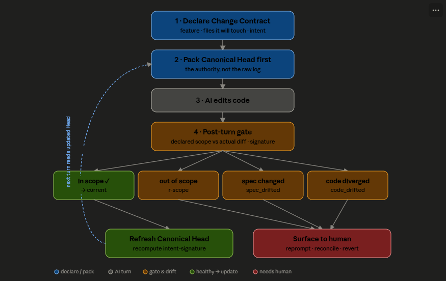

# SD-21: Change Contract And Canonical Intent Signature

## Metadata

- Document ID: `SD-21`
- Title: `Change Contract And Canonical Intent Signature`
- Phase: `tech_design`
- Status: `draft`
- Owner: `FlowPilot`
- Reviewers: `TBD`
- Created: `2026-07-03`
- Last Updated: `2026-07-03`
- Parent Documents: [SS-14: Code Context And Regression Safety](../05-System-Specs/SS-14-Code-Context-And-Regression-Safety.md) (US-3, AC-7, AC-8, BR-2)
- Child Documents: [CP-43: Change Contract And Canonical Intent Signature](../07-Coding-Plan/todo/CP-43-Change-Contract-And-Canonical-Intent-Signature.md)
- Related Documents: [SD-22: Pluggable Context Source Registry](./SD-22-Pluggable-Context-Source-Registry.md) (**substrate** — Canonical Head is packed as a context source on SD-22's registry; SD-22 lands first), [SD-17: Context And Regression Engine](./SD-17-Context-And-Regression-Engine.md) (activates deferred `D-11`), [SD-20: Flow Gate Rule Semantics](./SD-20-Flow-Gate-Rule-Semantics.md), [SD-10: Context Resolver & RAG](./SD-10-Context-Resolver-RAG.md), [CP-35: Context And Regression Engine Rollout](../07-Coding-Plan/done/CP-35-Context-And-Regression-Engine-Rollout.md), [CP-23: Context Control & Wrong-Way Detection](../07-Coding-Plan/todo/CP-23-Auto-Learn-To-Skill.md)
- Replaces: `None (activates SD-17 D-11; extends SD-20 Flow Gate rules)`
- Tags: `change-contract, canonical-head, intent-signature, scope-drift, flow-gate, provenance, regression, gitnexus, local-runner`

## AI Quick View

### Summary

- Settles the design for `SS-14 US-3` — the AI declares what it intends to change and is flagged when it changes anything else — the one user story `SD-17`/`CP-35` deferred (`SD-17 D-11`).
- The core insight: `SD-17 D-11` deferred scope-drift because doing it via **AST-normalized hashing of code** proved noisy (rename/format/ripple false-drift) and costly. This design keeps the value while dropping the cost by hashing **intent, not code**, and detecting drift by a **declared-scope vs actual-touched set difference** over the diff the Flow Gate already observes.
- Adds a per-`feature_key` **Canonical Head**: the single authoritative statement of a feature's current behavior, carrying an `intent_signature = sha256(feature_key + governing spec ids + their content hashes + behavior statement)`. This is the "digital signature" that answers "does the code still match its canonical intent?".
- Adds **superseding Decision Records**: when a feature churns `A → B → C → X → A`, only the current state plus the *rejected alternatives and their reasons* are promoted; positive churn stays in the ledger but is not surfaced. History becomes readable as "current truth + closed dead-ends", not raw commit noise.
- Purely additive to `CP-35`: one new runner module (`internal/changecontract/`), four new Flow Gate rules, and a Canonical-Head-first prompt-packing extension. No Supabase tables; local-first with the existing Drive sync.

### Current Ask

- Settle whether intent-signature + change-contract scope-drift is the reviewed design of record for `SS-14 US-3` (superseding the "deferred, AST-based" framing of `SD-17 D-11`), and fix the exact contract for the signature, the scope-diff, the drift states, and the four gate rules.

### Key Decisions

- `D-1` **Hash intent, not code.** The integrity signature covers the governing spec (ids + content hashes) and the canonical behavior statement — never code bytes or an AST. This directly avoids the `SD-17 D-11` noise/cost that caused deferral.
- `D-2` **Drift is a set difference, not a graph diff.** `out_of_scope = actual_touched \ declared_scope`, computed from the Flow Gate's existing `TurnResult.GitDiff`. File-level always; symbol-level only when `structure.Available()` (GitNexus).
- `D-3` **Canonical Head is the authority; history is secondary.** The prompt packer leads with the per-feature Head (behavior + signature status + rejected alternatives); `CP-35`'s ordered `feature_history` is packed only as lower-priority detail. This is the fix for "the log is chaotic for the AI to read".
- `D-4` **Collapse positive churn, promote negative knowledge.** `A → B → C → A` reduces to current-`A` plus `Decision` records for the rejected `B`/`C`. `A`-then-`A` is byte-identical but not semantically identical: the value is the rejection reasons, which the Head keeps and the raw ledger buries.
- `D-5` **Warn before block.** All four rules default to `warn`. Only `r-scope` may escalate to `block`, and only when `structure.Available()` gives reliable symbol-level truth. Spec/code-drift are always surfaced for human reconciliation, never auto-rewritten (`BR-2`).
- `D-6` **Runner-owned and provider-agnostic**, reusing the single post-`finishTurn` gate hook (`SD-16`, `SD-20`). No new hook point.

### Constraints

- Additive to `SD-17`/`CP-35` (`internal/{changeledger,flowgate,structure,contextsync}/`) and `SD-20`'s single-action gate resolution (`approve < warn < reprompt < block`).
- Non-fatal and retryable (`SS-14 AC-9`): any internal error in contract/head/drift computation degrades to "pass"; the raw artifact save is never blocked.
- Per-`project_id`, local-first under `<target>/.flowpilot/`; no Supabase migration. Shared derived data (`canonical/*.json`) syncs via the `CP-35 P-8` `context-engine/` mechanism; per-run `contracts.ndjson` stays local.
- Deterministic-first: only the behavior statement and rejection summaries are AI-generated (cheap-tier, heuristic fallback), matching `SD-17 §3.2`'s `chat_summary` rule.

### Open Questions

- `Q-1` Contract capture: explicit AI declaration turn vs inferred-from-first-diff-then-confirm. (Trade-off in `§3` D-7.)
- `Q-2` Should `r-scope` ever block at **file** level (structure absent), or always warn until symbol truth exists? (Ties to `SD-17 R-1`.)
- `Q-3` Governing-doc discovery for the signature — trust `featurecatalog.DocRefs`, or require an explicit `governs:` field in SS/SD front-matter?
- `Q-4` Canonical Head granularity: per `feature_key` (v1) or also per code-unit where GitNexus gives stable symbol identity?

### Source Refs

- `SS-14` US-3, AC-7 (records symbols/files changed), AC-8 (stale-context flagged), BR-2 (`SS-13 §7.3` no silent redefinition of upstream intent).
- `SD-17` D-3 (ordered history, newest = truth), D-11 (deferred scope-drift — activated here), §3.2 (`chat_summary` rejected approaches), §6.1 (prompt-assembly seam).
- `SD-20` gate action resolution + rule-contract pattern. `CP-35` §4.1/§4.3/§4.4/§4.2.1/§4.8 modules.
- Code: `internal/flowgate/{rules,evaluate,enforce,observe}.go`, `internal/{changeledger,structure,contextsync}/`, `runner/gate_hook.go`, `interactive_service.go`.

## 1. Goal

Give every code-mutating step a declared **Change Contract**, flag any edit outside it, maintain one authoritative **Canonical Head** per feature (carrying an `intent_signature` and its rejected-alternative history), and detect drift between the current code and its governing spec — all cheaply, deterministically, and auditable per `AC-7`/`AC-8`. Deliver the deferred `SD-17 D-11` scope-drift without the AST-hashing cost that caused its deferral.

## 2. Input Documents

- `SS-14` — US-3 (declare + flag), AC-7 (record changed symbols/files), AC-8 (flag stale context), BR-2 (upstream authority).
- `SD-17` — D-11 (the deferred decision activated here), D-3, §3.2, §6.1.
- `SD-20` — Flow Gate rule-contract semantics and single-action resolution this design extends.
- `CP-35` — the shipped `changeledger`/`flowgate`/`structure`/`contextsync` modules this design builds on.

## 3. Architecture Decision

- `D-1` **Intent signature over spec, not code.** `intent_signature = sha256(canonicalJoin(feature_key, sort(governing_doc_ids), sort(governing_doc_content_hashes), normalize(behavior_statement)))`.
  - *Alternatives considered:* (a) AST-normalized hash of the feature's code (the `SD-17 D-11` approach); (b) content hash of changed files (git already does this).
  - *Why this option:* (a) is noisy — rename/format/ripple flip the hash with no semantic change, and `A`-then-`A` hashes equal yet is not semantically equal after intervening rejected work; it is also costly (needs a symbol graph). (b) answers "did bytes change", which is not the question. Hashing *intent* answers the real question — "does the implementation still match the spec it is supposed to satisfy" — and is cheap (hash a few markdown files + one statement).
- `D-2` **Scope-drift as a set difference.** Reuse the Flow Gate's `TurnResult.GitDiff`; `out_of_scope = actual_paths \ glob(declared_paths)`, excluding docs and the `SS-14 E-4` ignore set. Symbol-level only under `structure.Available()`.
  - *Alternatives considered:* build a bespoke code-graph diff (rejected — this is exactly `D-11`'s cost); rely on the AI to self-report (rejected — not verifiable, violates US-3's "flagged when it changes anything else").
  - *Why:* declared-vs-actual is deterministic, needs no new indexing, and is verifiable from data the gate already has.
- `D-3` **Canonical Head is packed first.** The `feature.history` slot prepends the Head block; raw ordered history is a lower-priority budget item.
  - *Why:* the originating problem is that the ordered log is chaotic to read; an authority record the AI reads first removes the need to reconstruct truth from churn.
- `D-4` **Superseding Decision Records.** Fold `SD-17 §3.2` `chat_summary` rejected-approaches and revert-type `changeledger` bugfix entries into the Head's `Decisions[]`; do not pack positive churn by default.
- `D-5` **Drift is surfaced, never silently reconciled.** `spec_drifted`/`code_drifted` raise `warn` violations for human reconciliation (`BR-2`); the behavior statement is never auto-rewritten from a divergent code change.
- `D-6` **No new hook.** All rules evaluate in the existing post-`finishTurn` gate (`SD-20 §1`), resolving to a single highest-severity action.
- `D-7` **Contract capture (`Q-1`).** Default: the `context-discipline` skill prompts a short declaration block before editing (`declared`); if absent, synthesize an `inferred` contract from the first diff and confirm only under `gate_mode=enforce`.

## 4. Component Impact

- **New module:** `apps/local-runner/internal/changecontract/` — `contract.go` (P-1 capture), `head.go` (P-3 Canonical Head + signature), `decisions.go` (P-4 superseding records), `query.go`.
- **Impacted (extended, not broken):**
  - `internal/flowgate/rules.go` + `evaluate.go` — four new rules (`r-contract`, `r-scope`, `r-spec-drift`, `r-code-drift`); `enforce.go` reused unchanged (action ladder from `SD-20`).
  - `internal/featurecatalog` history slot + `internal/contextresolver` — new `contract.declare` slot; Head prepend in the `feature.history` slot (`CP-35 §4.2.1`).
  - `internal/contextsync` — add `canonical/*.json` to the shared/Drive-synced set; keep `contracts.ndjson` local-only.
- **Unchanged (reused):** `interactive_service.go` gate hook, `observe.go` `GitDiff`, `structure.Dependents`, `changeledger` history, `chat_summary`, `chat_session_sync.go` Drive helpers.
- **Owned elsewhere:** the "declare scope before editing" clause is a `CP-34`/`CP-35 P-6` skill-pack edit (`context-discipline`); the Canonical-Head Admin panel is Admin-Web work.

## 5. Data Model

**`Contract`** (`.flowpilot/contracts/contracts.ndjson`, local-only, one per `(run_id, step_id)`, last-wins):
- `run_id`, `step_id`, `feature_key`, `intent` (one line), `declared_paths []glob`, `declared_symbols []` (when structure available), `declared_at` (RFC3339), `confidence` ∈ `declared | inferred`.

**`CanonicalHead`** (`.flowpilot/canonical/<feature_key>.json`, one per feature, Drive-synced):
- `feature_key`, `behavior_statement`, `governing_doc_ids []`, `governing_doc_hashes {docID: sha256}`, `intent_signature`, `head_commit`, `decisions []Decision`, `updated_at`, `status`.
- `spec_confidence` ∈ `spec_backed | spec_less` — `spec_less` when `governing_doc_ids` is empty (a new feature coded before any SS/SD exists, `AC-2`); the signature is then over `feature_key + [] + behavior_statement` and is flagged low-confidence in packing.
- Lifecycle fields (end-of-life): `superseded_by []feature_key` (targets of a rename/merge), `retired_at`, used when `status ∈ {renamed, merged, deprecated}`.
- `status` ∈ `spec_less | current | spec_drifted | code_drifted | renamed | merged | deprecated`.

**`Decision`** (embedded in `CanonicalHead.decisions`):
- `tried`, `outcome` ∈ `adopted | rejected | reverted`, `reason` (the negative knowledge), `superseded_by`, `source_doc_id` (`Task-`/`BUG-`/`CP-`), `at`.

**State transitions (`status`):**
- `∅ → spec_less`: **birth** — a brand-new `feature_key` (registered in `FEATURE-KEYS.md`) with no governing doc; Head minted from the first passing Contract's `intent`, not from history (there is none).
- `∅ → current`: birth of a feature that already has a governing SS/SD at first commit.
- `spec_less → current`: **attach-spec / re-baseline** (rule `r-attach-spec`, §6) — a governing SS/SD is written *after* the code; `governing_doc_ids`/`hashes` are populated and the signature re-baselined. This is **not** `spec_drifted` (it is spec being *added*, not changed) and requires human confirmation that the new spec matches current behavior.
- `current → spec_drifted`: governing doc hash changed while `behavior_statement` unchanged.
- `current → code_drifted`: feature code changed out-of-contract and not reflected in `behavior_statement`/governing docs.
- `spec_drifted | code_drifted → current`: a reconciling step updates the Head (recompute signature) with human confirmation.
- `* → renamed | merged | deprecated`: **end-of-life** (rule `r-retire`, §6) — a human-confirmed action retires the Head. `renamed`/`merged` set `superseded_by` (pointer to the new key[s]); the retired Head is kept for provenance (its `decisions` are copied into the target Head) and dropped from default packing.

## 6. Interfaces and Contracts

- **File contracts:** `contracts.ndjson` (NDJSON, mutex-guarded, mirrors `local_file_session_store.go`); `canonical/<feature_key>.json` (one Head/feature). `contracts.ndjson` never syncs; `canonical/*.json` joins the `CP-35 P-8` `context-engine/` manifest (SHA256-indexed).
- **Resolver slot contract:** `contract.declare` (priority 1, pre-turn, after `feature.resolve`) writes the active `Contract`; `feature.history` (priority 1) prepends the Head block.
- **Flow-gate rule contracts** (seed `settings/flow-rules.json`):

| id | trigger | required_output | action (default) |
|----|---------|-----------------|------------------|
| `r-contract` | `code_changed_no_contract` | `declared_change_contract` | `reprompt` (≤ `max_reprompt_attempts`) |
| `r-scope` | `edit_outside_declared_scope` | `confirm_or_revert_out_of_scope` | `warn` (→ `block` only when `structure.Available()` + configured) |
| `r-spec-drift` | `governing_spec_changed` | `reconcile_canonical_head` | `warn` |
| `r-code-drift` | `code_diverged_from_intent` | `reconcile_or_revert` | `warn` |
| `r-attach-spec` | `governing_spec_added_to_spec_less` | `confirm_spec_matches_behavior_then_rebaseline` | `approve` |
| `r-retire` | `feature_rename_merge_or_deprecate` | `confirm_target_and_fold_decisions` | `approve` |

- **`r-attach-spec`** fires when a `spec_less` feature gains its first governing SS/SD (`governing_doc_ids` empties → non-empty). It is **not** `r-spec-drift` (that is a *changed* spec, not an *added* one). Action `approve`: a human confirms the new spec describes current behavior before the Head is re-baselined (`spec_less → current`), preventing a wrong spec from becoming the baseline of truth.
- **`r-retire`** fires when a feature is renamed, merged, or deprecated. Action `approve`: a human confirms the target key(s) (`superseded_by`) and the retired Head's `decisions` are folded into the target so negative knowledge is not lost. Both `approve` rules reuse the `SD-16` approval-gate infrastructure (`SD-20` action ladder `approve < warn < reprompt < block`); they never auto-mutate the Head without human confirmation (`BR-2`).
- **Signature contract:** `intent_signature` is reproducible — identical `(feature_key, governing_doc_ids, governing_doc_hashes, normalized behavior_statement)` yields the identical hash; any governing-doc content change yields a new hash.

## 7. Execution Flow

1. **Pre-turn:** `feature.resolve` (CP-35) → `feature_key`; `contract.declare` records a `Contract` (declared or inferred, `D-7`).
2. **Pre-turn packing:** `feature.history` prepends the `CanonicalHead` block (behavior + `intent_signature` status + rejected `Decisions`), then optional ordered history.
3. **Turn runs** (provider-agnostic, `SD-16`).
4. **Post-`finishTurn` gate** (`SD-20 §1`): `observe.go` builds `TurnResult` (`GitDiff`, tests).
5. **Evaluate new rules:** compute `out_of_scope` (file-level; symbol-level when structure present); recompute governing-doc hashes vs Head; classify `spec_drifted`/`code_drifted`; emit `r-contract`/`r-scope`/`r-spec-drift`/`r-code-drift`.
6. **Resolve one action** (`approve < warn < reprompt < block`); emit SSE violation(s); reprompt/ block per `enforce.go`.
7. **On gate pass:** `UpdateHead(feature_key, contract, diff)` folds the realized intent, recomputes `intent_signature`, sets `status=current`, appends any new `Decision`.
8. **Sync:** `canonical/*.json` syncs via `contextsync` (debounced); `contracts.ndjson` stays local.

## 8. Failure and Edge Handling

- `F-1` **Governing doc deleted/missing** → hash recompute must not panic; Head → `spec_drifted`, flagged (not silently dropped).
- `F-2` **Rename-only / formatter diff** → must not trip `r-scope` when GitNexus resolves the change to an in-scope symbol; file-level uses the `SS-14 E-4` ignore set. (This is the `SD-17 D-11` false-drift trap; the design's reason for symbol-level gating.)
- `F-3` **No declaration** (legacy turn) → `inferred` contract; `r-contract` warns/reprompts once, never blocks.
- `F-4` **AI behavior-statement generation fails** → heuristic fallback (newest history summary); never blocks.
- `F-5` **Any internal error in changecontract/gate** → degrade to gate "pass" (`SS-14 AC-9`), log for retry.
- `F-6` **Feature resolves ambiguously** → no contract binding; defer to `CP-35` resolver confirm-on-ambiguity; skip scope-drift for that turn.

## 9. Security and Operational Concerns

- **Auth/secrets:** none new — all data is local project files or Drive files under the project's existing OAuth; `intent_signature` is a non-secret content hash.
- **Audit:** contract-vs-actual diffs, scope violations, and signature-status transitions are written to the existing gate audit log (`CP-35 §8` / `SD-20`), satisfying `AC-7` (retrievable record of context used + symbols/files changed).
- **Isolation:** per-`project_id` under `<target>/.flowpilot/`; no cross-project leakage (`AC-1`).
- **Rollback:** every rule is feature-flagged in `flow-rules.json`; disabling all reverts to exact `CP-35`/`SD-20` behavior with no data loss (`canonical/`, `contracts/` retained locally; git remains source of truth).

## 10. Risks and Trade-Offs

- `R-1` **False drift** on rename/format/ripple — the exact reason `D-11` was deferred. *Mitigation:* hash intent not code; declared-vs-actual set diff; symbol-level only via GitNexus; `E-4` ignore set; warn-before-block.
- `R-2` **Contract friction** slows simple turns. *Mitigation:* inferred fallback; `r-contract` warn/reprompt only; declaration folded into the existing skill pack.
- `R-3` **Wrong/stale behavior statement** poisons the Head. *Mitigation:* deterministic seed from newest history + governing docs; cheap-tier text with heuristic fallback; drift surfaced for human reconciliation, never auto-rewritten (`BR-2`).
- `R-4` **Overlap with `CP-35`/`CP-23`.** *Mitigation:* `CP-35` = structural history (what happened); `CP-23` = behavioral runtime drift (in-session); `SD-21` = intent integrity (declared vs actual vs canonical). Shared hooks/telemetry/storage; no duplicated observation.
- `R-5` **Governing-doc discovery wrong** → Head hashes the wrong specs. *Mitigation:* source from `featurecatalog.DocRefs`; `Q-3` may require an explicit `governs:` field.

## 11. Validation Strategy

- **Unit:** contract parse (declared vs inferred); glob scope diff incl. `E-4` ignore set; symbol-level diff under structure; `intent_signature` stability + doc-change sensitivity; status transitions (`current`/`spec_drifted`/`code_drifted`); decision folding + churn collapse; Head backfill from history.
- **Integration:** declare → in-scope edit → `current` + Head refreshed; out-of-scope edit → `r-scope` warn (block when GitNexus + dependents); edit governing SS → `spec_drifted`; `A → B → A` → Head shows A + rejected-B and packed prompt omits B churn; no-declaration → `r-contract` once.
- **Manual:** packed prompt leads with the Head across Claude/Codex; Admin scope-diff highlighting; `contracts.ndjson` never syncs while `canonical/*.json` does.
- **Observability:** gate audit log entries for contracts, violations, and signature transitions; Admin Canonical-Head panel.

## 12. Traceability to Spec

- `US-3` (declare + flag) → `D-1`/`D-2`, rules `r-contract`/`r-scope` (§6), flow §7.
- `AC-7` (record symbols/files changed, auditable) → §5 `Contract`/`Decision` + §9 audit log.
- `AC-8` (stale context flagged, de-prioritized) → `spec_drifted`/`code_drifted` states (§5) + Head-first packing that demotes churn (`D-3`).
- `BR-2` (no silent redefinition of upstream intent) → `D-5` drift surfaced for human reconciliation, never auto-rewritten.
- `SD-17 D-11` (deferred scope-drift) → activated cost-safely by `D-1`/`D-2` (intent hash + set diff, no AST).
- `AC-9` (non-fatal) → §8 `F-5`, §10 constraints.

## 13. Phụ lục A — Giải thích & ví dụ vòng đời (tiếng Việt)

> Mục này giải thích tường minh phần dễ nhầm nhất: **Change Contract** và **Canonical Head** là **hai file khác nhau**, và **ai tạo / ai đổi** từng file. Đọc kèm §5 (Data Model) và §7 (Execution Flow).

### 13.1 Hai file — đừng nhầm

| | **Change Contract** | **Canonical Head** (chứa `intent_signature`) |
|---|---|---|
| Phạm vi | **1 turn / 1 step** (tạm thời) | **1 feature** (lâu dài) |
| Đường dẫn | `.flowpilot/contracts/contracts.ndjson` (local, không sync) | `.flowpilot/canonical/<feature_key>.json` (sync qua Drive) |
| Ai **tạo** | **AI** khai báo đầu turn; nếu AI không khai → **runner** suy ra từ diff (`confidence=inferred`) | **Runner** tạo tự động (lần đầu: backfill khi bind) |
| Ai **đổi** | Không ai — ghi một lần cho turn đó rồi thôi | **Runner** cập nhật tự động sau turn pass gate; **người** chỉ can thiệp khi có drift |
| `intent_signature` do ai tính | — | **Runner** tính, deterministic. **Không ai gõ tay.** |

Điểm mấu chốt: **không có "contract per feature"**. Contract là **per-turn** (ý định của *một lần sửa*). Cái *per-feature* là **Canonical Head** (sự thật hiện tại của *cả feature*).

### 13.2 `intent_signature` là gì — hash **ý định**, không hash code

Đây là checksum của "feature này ĐÁNG LẼ phải làm gì", ghép từ 4 thành phần rồi băm SHA-256:

```
intent_signature = sha256(
    feature_key                         // "chat-ui"
  + sort(governing_doc_ids)             // ["SD-05", "SS-07"]  (các spec chi phối feature)
  + sort(hash mỗi file governing doc)   // sha256(SS-07.md), sha256(SD-05.md)
  + normalize(behavior_statement)       // "Chat feed hiển thị các turn; có nút retry mỗi turn"
)
```

- Băm lên **spec + câu behavior**, **không** băm code bytes hay AST → tránh nhiễu do rename/format và tránh bẫy `A`-rồi-`A` (byte giống nhau nhưng khác nghĩa).
- Runner tính con số này; nó là non-secret, chỉ dùng để so sánh toàn vẹn.

### 13.3 Ví dụ vòng đời cụ thể — feature `chat-ui`

**Mốc T0 — Bind project (Runner tạo Head lần đầu).**
Khi bind, runner backfill: lấy commit mới nhất của `chat-ui` từ ledger (CP-35) + các doc spec liên quan (`SS-07`, `SD-05`), sinh cheap-tier câu behavior. Ghi `.flowpilot/canonical/chat-ui.json`:
```json
{
  "feature_key": "chat-ui",
  "behavior_statement": "Chat feed hiển thị các turn theo thứ tự; mỗi turn có nút copy.",
  "governing_doc_ids": ["SS-07", "SD-05"],
  "governing_doc_hashes": { "SS-07": "a1b2…", "SD-05": "c3d4…" },
  "intent_signature": "SIG_1",
  "head_commit": "ee7dba6",
  "decisions": [],
  "status": "current"
}
```
→ *Người không tạo tay. Runner tạo.*

**Mốc T1 — AI sửa đúng scope (Runner tự cập nhật Head).**
User: "thêm nút retry cho mỗi turn trong chat".
1. Pre-turn: resolve ra `feature_key=chat-ui`; **AI khai Change Contract**:
   ```json
   { "run_id":"r-101","step_id":"s-1","feature_key":"chat-ui",
     "intent":"thêm nút retry mỗi turn",
     "declared_paths":["apps/admin-web/**/chat-feed.tsx"], "confidence":"declared" }
   ```
2. Pre-turn packing: nạp **Canonical Head lên đầu prompt** (behavior + `status:current`), không nạp log churn.
3. AI sửa đúng `chat-feed.tsx`.
4. Post-turn gate: `actual_touched = {chat-feed.tsx}`; `out_of_scope = {} ` → **không vi phạm**. Spec chưa đổi.
5. Gate pass → **runner chạy `UpdateHead()`**: đổi `behavior_statement` thành "…mỗi turn có nút copy **và nút retry**", `head_commit` mới, tính lại → `intent_signature = SIG_2`, `status:current`.
→ *Head bị đổi bởi **runner**, tự động, vì turn hợp lệ.*

**Mốc T2 — AI sửa lan ra ngoài scope (Gate flag, người xử lý).**
User: "sửa màu nút retry". Contract khai `declared_paths:["…/chat-feed.tsx"]`. Nhưng AI lỡ sửa thêm `auth-service.ts`.
- Gate: `out_of_scope = {auth-service.ts}` → phát `r-scope` (warn; **block** nếu có GitNexus và symbol đó có dependents).
- **Runner KHÔNG update Head.** Đưa ra cho **người**: xác nhận (đưa `auth-service.ts` vào scope) hoặc revert.
→ *Đây chính là US-3: "khai định sửa X, đụng thêm Y thì bị flag ngay".*

**Mốc T3 — Spec đổi (phát hiện `spec_drifted`).**
Ai đó sửa `SS-07.md` (đổi yêu cầu chat feed). Turn sau, runner băm lại `SS-07` → `hash` khác `governing_doc_hashes.SS-07` đang lưu → `intent_signature` không còn khớp trong khi `behavior_statement`/code chưa theo.
- Head chuyển `status:"spec_drifted"` → phát `r-spec-drift` (warn): "spec đã đổi, code/Head cần catch up".
- **Runner không tự viết lại behavior.** **Người** reconcile (`BR-2`: downstream không âm thầm định nghĩa lại intent của upstream).

**Mốc T4 — Churn `A → B → A` (Decision Record giữ tri thức âm).**
Lịch sử: layout chat từng là list phẳng (**A**) → thử virtualized list (**B**) → BUG-201 revert về **A**.
- Runner fold từ `chat_summary` + commit bugfix vào `decisions` của Head:
  ```json
  "decisions": [
    { "tried":"virtualized list", "outcome":"reverted",
      "reason":"scroll nhảy khi stream token", "source_doc_id":"BUG-201" }
  ]
  ```
- Head vẫn là **A hiện tại** + ghi chú "đã thử B, loại vì R". Prompt turn sau nạp Head → AI thấy "đừng thử lại virtualized list" mà **không phải đọc lại toàn bộ churn**.
→ Positive churn (A→B→A) *collapse*; negative knowledge (tại sao B sai) được *promote*. `A`-cuối ≠ `A`-đầu vì mang theo bài học này.

### 13.4 Tóm tắt "ai làm gì"

- **AI**: khai Change Contract mỗi turn; (cheap-tier) đề xuất câu `behavior_statement`.
- **Runner**: tạo Head lần đầu (backfill); tính `intent_signature`; cập nhật Head sau mỗi turn hợp lệ; chạy gate scope/drift; fold Decision Records. **Toàn bộ deterministic, non-fatal.**
- **Người**: chỉ vào cuộc khi gate flag — duyệt mở rộng scope, hoặc reconcile spec-drift/code-drift, hoặc revert. **Không bao giờ gõ tay `intent_signature`.**

### 13.5 Vòng đời ĐẦY ĐỦ của một feature MỚI

> §13.3 bắt đầu ở `T0 = bind một feature **đã tồn tại**` (đã có commit + đã có spec). Mục này bổ sung phần đầu và phần cuối vòng đời mà §13.3 chưa chạm: **khai sinh** (chưa có gì), **gắn spec sau**, và **kết thúc**. Bám theo enum `status` ở §5.

Ví dụ feature hoàn toàn mới: `chat-reactions` (thả cảm xúc vào tin nhắn).

**T-1 — Khai sinh, CHƯA có spec (`∅ → spec_less`).**
User: "cho phép thả emoji vào từng tin nhắn". Feature này chưa hề tồn tại: không Head, không history, không SS/SD.
1. Resolve không ra key cũ nào → coi là **feature mới**. AI khai Contract với `feature_key` mới và ghi bracket `[Feature][chat-reactions]` khi commit; skill `audit-logging` thêm `chat-reactions` vào `FEATURE-KEYS.md` (nguồn khoá hợp lệ, theo CP-35/`SS-13 §13`).
2. AI code. Gate pass (đúng scope, không regression).
3. **Runner mint Head lần đầu — từ `intent` của Contract, KHÔNG từ history** (vì chưa có):
   ```json
   {
     "feature_key": "chat-reactions",
     "behavior_statement": "Mỗi tin nhắn có thể được thả emoji; hiển thị đếm số lượt.",
     "governing_doc_ids": [],
     "governing_doc_hashes": {},
     "intent_signature": "sha256(chat-reactions + [] + behavior)",
     "spec_confidence": "spec_less",
     "head_commit": "9f2a1c",
     "decisions": [],
     "status": "spec_less"
   }
   ```
→ `spec_less`: signature chỉ dựa trên `feature_key + behavior_statement`, được **gắn cờ low-confidence** khi pack (thoả `AC-2`: chạy được trên repo chưa có tài liệu). *Runner tạo, không phải người.*

**T-1b — Viết spec SAU (`spec_less → current`, re-baseline — KHÔNG phải spec_drift).**
Sau vài sprint, team mới viết `SS-18-Chat-Reactions.md`.
- Runner phát hiện có doc governing cho key này (qua `featurecatalog.DocRefs`, hoặc field `governs:` — `Q-3`). Đây là spec **được thêm vào**, không phải sửa spec cũ → **không** phát `r-spec-drift`.
- Chạy nhánh **attach-spec / re-baseline**: nạp `governing_doc_ids=["SS-18"]`, `governing_doc_hashes`, tính lại `intent_signature`, `spec_confidence="spec_backed"`, `status="current"`.
- **Cần người xác nhận** "SS-18 mô tả đúng behavior hiện tại" trước khi chốt baseline (tránh spec sai làm chuẩn). Từ đây feature vào đúng vòng T1→T4 của §13.3.

**T5 — Kết thúc vòng đời (`* → renamed | merged | deprecated`).**
Ba tình huống, đều **do người xác nhận**, runner không tự quyết:
- **Rename**: `chat-reactions` → `message-reactions`. Head cũ `status="renamed"`, `superseded_by=["message-reactions"]`; `decisions` copy sang Head mới; Head cũ giữ lại cho provenance, **bỏ khỏi packing mặc định**.
- **Merge**: gộp `chat-reactions` vào `chat-ui`. Head cũ `status="merged"`, `superseded_by=["chat-ui"]`; các Decision (đã thử gì, loại vì sao) được **fold vào Head đích** để không mất tri thức âm.
- **Deprecate**: feature bị gỡ. Head `status="deprecated"`, `retired_at` set; không pack nữa nhưng vẫn tra cứu được (giải thích "tại sao feature này từng tồn tại và bị bỏ").

### 13.6 Bảng vòng đời đầy đủ

| Giai đoạn | `status` | Ai hành động | Head |
|---|---|---|---|
| Khai sinh, chưa spec | `spec_less` | AI khai key + code → **Runner** mint | tạo từ `intent` |
| Khai sinh, đã có spec | `current` | như trên nhưng có governing doc | tạo, spec_backed |
| Gắn spec sau | `spec_less → current` | Team viết SS/SD → **Runner** re-baseline + **người** xác nhận | re-hash |
| Phát triển đúng scope | `current` | AI khai Contract, sửa đúng | **Runner** update + `SIG` mới |
| Sửa lan ngoài scope | `current` (chặn) | Gate `r-scope` → **người** xử lý | **không** update |
| Spec bị sửa | `spec_drifted` | **Người** reconcile | chờ catch up |
| Code lệch intent | `code_drifted` | **Người** reconcile / revert | chờ catch up |
| Churn A→B→A | `current` | **Runner** fold Decision | A + bài học B |
| Kết thúc | `renamed`/`merged`/`deprecated` | **Người** xác nhận | retire, giữ provenance |
