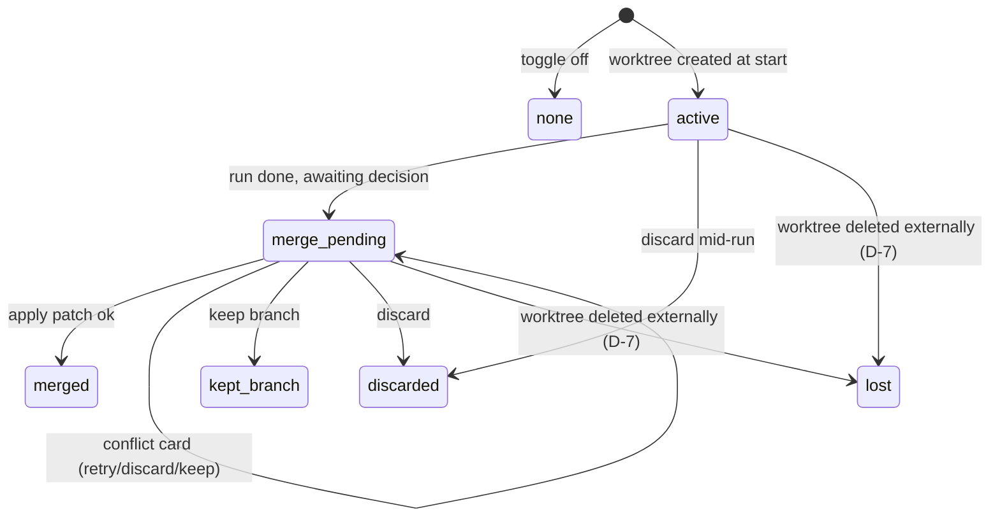

# SD-27: Run Worktree Isolation

## Metadata

- Document ID: `SD-27`
- Title: `Run Worktree Isolation — Shared Manager, Run Binding, Merge-Back Protocol`
- Phase: `tech_design`
- Status: `draft`
- Owner: `FlowPilot`
- Reviewers: `TBD`
- Created: `2026-09-22`
- Last Updated: `2026-09-22`
- Parent Documents: [SS-23: Run Isolation Worktree](../05-System-Specs/SS-23-Run-Isolation-Worktree.md)
- Child Documents: `CP-71 (planned)`
- Related Documents: [SD-24: Durable Turn Dispatch](./SD-24-Durable-Turn-Dispatch.md), [SD-25: Recovery Ownership Linearization Closure](./SD-25-Recovery-Ownership-Linearization-Closure.md), [SD-26: Chat Continuity SSOT](./SD-26-Chat-Continuity-Ssot.md), [Task-369](../08-Task/done/Task-369-Worktree-Rollout-Manager.md)
- Replaces: `None`
- Tags: `worktree, isolation, git, runner, desktop, tui`

## AI Quick View

### Summary

- Generalize the proven `tournament.WorktreeManager` lifecycle (create from HEAD → run isolated → patch-based merge → idempotent cleanup) into a shared `internal/worktree` package usable by any run — tournament keeps working unchanged on top of it.
- A run opted-in via `StartRunInput.worktree` gets a worktree under `.flowpilot/worktrees/<ownerId>` (owner = `chatId` for chat runs, flow runId for flow runs — `D-8`) on a slugified branch; the provider adapter's cwd is pointed at the worktree — isolation is purely a working-directory concern, zero engine/gate/prompt changes.
- Binding lives on the local run/session record (`worktreePath`, `worktreeBranch`, `worktreeBaseCommit`, `worktreeState`) — no Supabase DDL; recovery rehydrates the binding exactly like CP-51 turn state.
- Merge-back is a dedicated `worktree_merge_requested` card: `apply_patch` / `keep_branch` / `discard`; conflicts return `MergeConflictError` (patch + paths as evidence) — the Devin `ResolveWorktreeChanges(mode, failOnConflicts)` equivalent.

### Current Ask

- Settle the technical contract — package layout, run record fields, HTTP input, merge-back protocol, GC rules — so CP-71 slices are mechanical.

### Key Decisions

- `D-1` New package `internal/worktree` hosts the generalized manager and `internal/tournament` **delegates** to it — one implementation, no parallel copies. `tournament.WorktreePath` export and CP-65 observable behavior (paths, cleanup timing, no-orphan policy) stay byte-compatible; the tournament test suite is the regression oracle.
- `D-8` **Owner key** `worktreeOwnerID` scopes one worktree to one owner: `chatId` for chat-mode runs (every leg shares — `resolveChatIdentity` + `ListProviderSessionsByChat` let a new leg read the prior leg's binding even after restart), the parent flow `runId` for harness/vibe flow runs (spawned children already inherit `parent.workspaceCwd`, `interactive_service.go:3398`). Path `.flowpilot/worktrees/<ownerId>`, branch `fp/<slug>-<ownerIdShort>`. Leg inheritance: a new leg whose chat has a binding in `active|merge_pending` reuses it after `D-7` validation (toggle implied on; toggling off with a live binding is rejected).
- `D-9` `worktreeEnabled bool` persists on the **run record** (there is no runner-side chat record — CP-59 groups runs by `chatId`); "per chat" restore = newest run of the chat pre-sets the toggle on reopen. New chats default `false`.
- `D-2` Worktree branch is real (`git worktree add -b <slug>`) so `keep_branch` costs nothing; merge-back to main workspace is still **patch-based** (`git diff` + `git apply`), never `git merge` — refs of the main repo stay clean.
- `D-3` Worktree state is local-only on the session/run record (same precedent as `working_mode`, CP-60 P-1): fields persisted in `sessions.ndjson` via the existing session store; Admin Web never sees them.
- `D-4` Merge-back serializes per repo with a mutex + pre-apply drift check (main `HEAD` + dirty fingerprint vs `.base` sidecar) — reuses Task-369 `T-2`/`T-3` discipline verbatim.
- `D-4b` Base commit is captured at `createRun` for **every** run kind when `worktree:true` (chat + flow) — not the flow-only `flowStartGitHead` (`flow_executor.go:94`, captured in `startResolvedFlow`). The anchor point is run creation, so chat-mode worktrees are anchored identically.
- `D-4c` Merge-back entry differs by `runKind`: flow runs (`runKind != "chat"`) emit `worktree_merge_requested` at terminal status; chat runs expose a user-initiated merge action (control in chat UI → same resolve endpoint) and surface the pending decision on chat delete (`E-3`). Same card, same resolve contract, two triggers.
- `D-5` The toggle is transported on `POST /client/workflow-runs` as `worktree: true` (accepted for `X-Client: desktop|tui`); TUI passes it via its existing start-run path. No new top-level endpoint.
- `D-6` The toggle preference is **chat-scoped by derivation** (see `D-9`): persisted per run record, restored from the chat's newest run; new chats default `false`.
- `D-7` Binding validation on resume/attach: `git worktree list --porcelain` must contain `worktreePath`, the dir must exist, and the `.base` sidecar must be present — else `worktreeState=lost` + notice card offering `archive chat` or `recreate empty worktree from base` (explicit user choice; never silent recreate/duplicate).

### Constraints

- No changes to `flowgate`, flow definitions, provider prompts, or `ProviderRuntimeAdapter` semantics — the only provider-facing delta is process cwd.
- Git operations only via `os/exec` `git` (existing convention in `tournament/worktree_manager.go`); no new git library dependency.
- `.flowpilot/worktrees/` gitignore append stays best-effort additive (Task-369 T-1).
- Additive-tests-only + all-provider parity per `safe-fix-contract`.

### Open Questions

- `Q-1` Resolved — dedicated `worktree_merge_requested` event/card + dedicated `worktree/resolve` endpoint.
- `Q-2` Resolved — `discard` confirm lists untracked/uncommitted artifacts found in the worktree (e.g. generated images) so the user sees what will be lost.

### Source Refs

- `SS-23 AC-1..AC-8`, `BR-1..BR-7`, `E-1..E-7`; `internal/tournament/worktree_manager.go` (`worktreeRootRel`, `baseSidecar`, `MergeConflictError`, cleanup policy); `flow_executor.go` (`flowStartGitHead`); `interactive_handlers.go` (`handleStartRun`, `runHistoryItem`); `local_file_session_store.go` (sessions.ndjson); Devin bundle proto (`CreateWorktree`, `ListWorktrees`, `ResolveWorktreeChanges`, `gitWorktreePath`, `worktreeMerges`).

## 1. Goal

Give every run an optional, durable, isolated filesystem rooted at a dedicated git worktree, with a deterministic create → run → merge-back/discard lifecycle and crash-safe recovery — without touching engine, gate, or provider semantics.

## 2. Input Documents

- `SS-23` — `AC-1..AC-8` (toggle, isolation, merge-back, conflict, recovery, parity, off-by-default parity), `BR-1..BR-7`, `E-1..E-7`.
- `Task-369` `T-1..T-5` + `CA-877` — proven lifecycle semantics being generalized.
- `SD-24`/`SD-25`/`SD-26` — durable dispatch, recovery ownership, chat SSOT that the binding must ride on.

## 3. Architecture Decision

- `D-1` **Shared package**: `apps/local-runner/internal/worktree` exporting `Manager` with `Create(repoDir, ownerID, slug) → Info`, `List(repoDir)`, `Resolve(repoDir, ownerID, mode, failOnConflicts)`, `Cleanup(repoDir, ownerID, keepBranch)`, parameterized by a caller-supplied name prefix (tournament passes `candidate-`, runs pass none). `internal/tournament` **delegates** its candidate operations to this manager — extraction must not change CP-65 observable behavior (paths, `WorktreePath` export, cleanup timing); the tournament test suite is the regression oracle.
  - Alternatives considered: (a) duplicate logic per consumer — rejected (divergence, double bugs); (b) extend `tournament` package for runs — rejected (wrong domain name, leaks candidate concepts into run lifecycle).
- `D-8` **Owner key `worktreeOwnerID`**: `chatId` for chat-mode runs (all legs share via the `D-7`-validated inheritance lookup: resident `s.runs` then `ListProviderSessionsByChat`); parent flow `runId` for flow runs (children inherit `parent.workspaceCwd`). Path `.flowpilot/worktrees/<ownerId>`, branch `fp/<slug>-<ownerIdShort>`.
- `D-9` **Toggle persistence**: `worktreeEnabled` on the run record (no runner-side chat record exists — CP-59 groups runs by `chatId`); per-chat restore = newest run's value.
- `D-2` **Real branch + patch merge-back**: `git worktree add -b run/<slug>-<runIdShort>`; merge-back = `git -C worktree diff <base>..HEAD`/working diff → `git apply` in main workspace, guarded by base sidecar drift check.
- `D-3` **Local-only persistence**: `worktreePath`, `worktreeBranch`, `worktreeBaseCommit`, `worktreeState`, `worktreeSlug` on the local run record; excluded from Supabase sync payloads.
- `D-4` **Serialized merge-back**: per-repo mutex in the manager + `HEAD`/dirty-fingerprint pre-check; conflict → typed `MergeConflictError` → card evidence.
- `D-5` **Plumbing**: `StartRunInput.Worktree bool`; `createRun` provisions the worktree before provider spawn and stores binding; provider process cwd = worktree path. `X-Client` gate identical to `working_mode` (desktop|tui only).

## 4. Component Impact

- Impacted modules:
  - `internal/runner` — `createRun` provisions binding; `runSnapshotView`/`runHistoryItem` gain `worktree*` display fields; resume path rehydrates binding; delete path schedules GC.
  - `internal/tournament` — refactored to delegate (or untouched if manager is extracted additively).
  - `apps/desktop-flowpilot` — `ChatPosturePanel` toggle, Navigator worktree badge, merge-back card render.
  - `apps/local-runner/internal/tui` — start option + status badge + merge-back prompt.
- New modules: `internal/worktree` (manager, slug, sidecar, GC).
- Unchanged modules: `internal/flowgate`, flow pack definitions, provider adapters' prompt/session logic (cwd only), Admin Web, Supabase schema.

## 5. Data Model

- Entities:
  - `WorktreeInfo { OwnerID, Path, Branch, BaseCommit, Slug, CreatedAt }`
  - Run record additions: `worktreeOwnerID string`, `worktreePath string`, `worktreeBranch string`, `worktreeBaseCommit string`, `worktreeSlug string`, `worktreeState enum`, `worktreeEnabled bool`, all `omitempty`.
- Fields / state transitions:
  - `worktreeState`: `none → active → merge_pending → merged | kept_branch | discarded`; `active|merge_pending → lost` when resume validation (`D-7`) fails; terminal-deleted runs transition to `gc_eligible` (implicit, by absence of binding).
  - `.base` sidecar file next to worktree dir records `BaseCommit` + dirty fingerprint (Task-369 pattern).

## 6. Interfaces and Contracts

- API contracts:
  - `POST /client/workflow-runs` body += `worktree?: boolean` — `worktree:true` from a client other than `desktop|tui` → `403 worktree_client_forbidden` (same gate style as `working_mode`).
  - `GET /client/workflow-runs/{runId}` snapshot += `worktree` view block `{path, branch, state, baseCommit}`.
  - `GET /client/projects/{projectId}/workflow-runs` items += `worktreeState`, `worktreeSlug` for badges.
  - New event: `worktree_merge_requested` carrying `{runId, patchArtifactRef, conflictPaths?}` rendered as a dedicated merge-back card; resolved via `POST /client/workflow-runs/{runId}/worktree/resolve {mode: apply_patch|keep_branch|discard}`. Retry after a conflict is re-sending `mode: apply_patch` (the state stays `merge_pending`; no separate retry mode).
- DB contracts: none (local `sessions.ndjson` only).
- File contracts: `.flowpilot/worktrees/<ownerId>/` dirs, `<ownerId>.base` sidecars, patch artifacts under run artifact store (`E-6`); tournament keeps `candidate-<id>` via the manager's prefix parameter.
- Provider contracts: none beyond cwd.

## 7. Execution Flow

1. Start: client sends `worktree:true` → `createRun` resolves `worktreeOwnerID` (`chatId` or flow run id per `D-8`; a new leg first tries inheriting the chat's existing binding via resident runs → `ListProviderSessionsByChat`) → validates repo is git + captures `HEAD` as base (all run kinds, `D-4b`) → `Manager.Create` from base (or reuses the inherited binding after `D-7` validation) → binding persisted on run record → provider process spawned with `cwd=worktreePath`.
2. During run: all flow/provider file I/O lands in the worktree; timeline badge shows `worktree: run/<slug>`; checkpoint/artifacts (file_artifact bindings) stay worktree-relative where they are project files.
3. Finish: flow runs — on terminal status with `worktreeState=active` → emit `worktree_merge_requested` card. Chat runs — `state=active` persists while the chat lives; user triggers merge via the controls action, or the decision surfaces on chat delete. Both land at the same `worktree/resolve` endpoint → `apply_patch` | `keep_branch` | `discard`.
4. Apply: pre-check main `HEAD`+dirty fingerprint vs `.base`; ok → `git apply` → cleanup worktree+branch → `merged`. Conflict → `MergeConflictError` → card with paths + patch artifact; user may retry, keep branch, or discard.
5. GC: boot-time scan — worktrees whose run record is gone/deleted → `git worktree remove --force` + `prune` + delete branch (never for resumable/merge_pending runs).

## 8. Failure and Edge Handling

- `F-1` `git worktree add` fails (no git / not a repo) → start rejected with `worktree_unavailable` error; never falls back silently (`E-5`).
- `F-2` Runner crash mid-run → worktree dir persists; `resumeRun` rehydrates binding and runs the `D-7` validation (`git worktree list --porcelain` + dir + `.base` sidecar); any failure → `worktreeState=lost` + notice card (`archive chat` | `recreate empty worktree from base`) — never auto-recreate, never duplicate.
- `F-3` Conflict on apply → card carries `ConflictPaths` + patch file ref; worktree preserved until user decision (no orphan, no silent discard).
- `F-4` Main workspace dirtied between run start and merge → drift check blocks apply before any partial write; `git apply --check` first, then real apply — apply is all-or-nothing.
- `F-5` User deletes a chat whose binding is `active`/`merge_pending` → deletion first surfaces the merge-back decision (`E-3`/`AC-4`); only a confirmed delete marks the worktree GC-eligible and notes the removal.
- `F-6` Serialized applies: second concurrent apply waits on repo mutex, then re-runs drift check — may legitimately conflict (`E-4`).

## 9. Security and Operational Concerns

- auth: none new (local HTTP surface already client-scoped).
- secrets: worktree copies the full repo — same trust boundary as the main checkout; `.env` handling identical to today's provider cwd behavior.
- audit: merge decision + outcome recorded on run timeline; `MergeConflictError` evidence in card/audit (Task-369 policy).
- rollback: `apply` uses `git apply --check` then apply; on mid-apply failure the error surfaces and the worktree remains for manual recovery.

## 10. Risks and Trade-Offs

- `R-1` Extracting the shared manager could perturb CP-65 tournament paths → mitigate by careful delegation (prefix-parameterized paths) + the full tournament test suite as oracle; GitNexus `impact` on `WorktreeManager` symbols before the edit.
- `R-2` Users forgetting merge-back leave stale worktrees → mitigate with Navigator badge + GC + deletion notice; accepted as user data retention.
- `R-3` Patch-based merge loses commit granularity → accepted (BR-2); `keep_branch` preserves full history for users who want it.
- `R-4` Very large repos → `git worktree add` cost is metadata-only (shared object store); acceptable.

## 11. Validation Strategy

- Unit: manager create/resolve/cleanup/conflict/GC against real temp git repos (`git init` in `t.TempDir()`, Task-369 convention) — no git mocking.
- Runner: start-run with `worktree:true` produces binding + correct provider cwd; resume rehydrates; delete marks GC-eligible.
- Parity: provider-agnostic evidence — worktree path is cwd-only; grep-verified zero `providerKey` branches in manager (same method as Task-369).
- E2E: two concurrent vibe runs on one project each modify overlapping file sets; both merge sequentially, second sees conflict card; Dev-mode/harness runs unchanged with toggle off.
