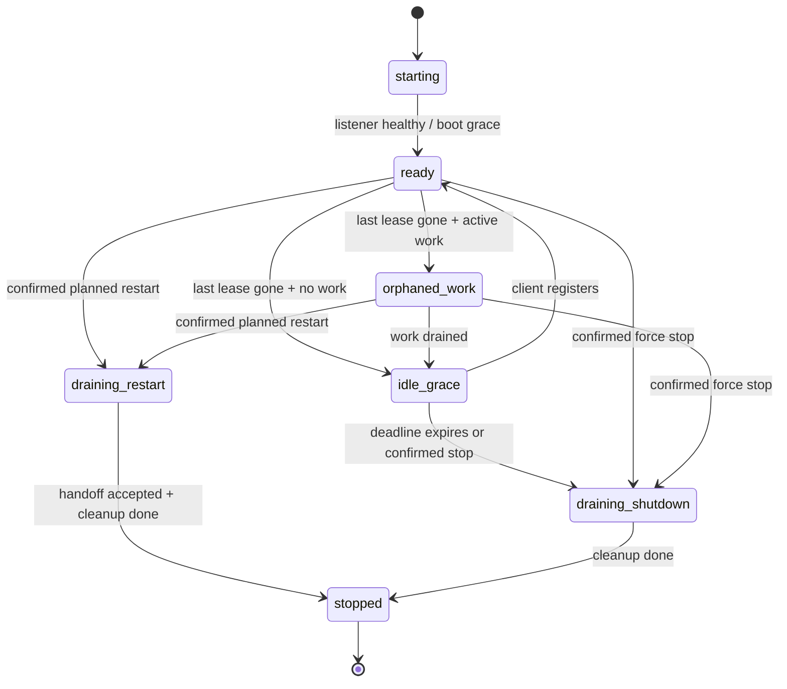

# SD-28: Shared Runner Lifecycle

## Metadata

- Document ID: `SD-28`
- Title: `Shared Runner Lifecycle — Lease Registry, Idle Shutdown, Fenced Stop/Restart`
- Phase: `tech_design`
- Status: `draft`
- Owner: `FlowPilot`
- Reviewers: `TBD`
- Created: `2026-09-22`
- Last Updated: `2026-09-22`
- Parent Documents: [SS-24: Shared Runner Lifecycle](../05-System-Specs/SS-24-Shared-Runner-Lifecycle.md)
- Child Documents: `CP-81 (planned)`
- Related Documents: [SD-24: Durable Turn Dispatch](./SD-24-Durable-Turn-Dispatch.md), [SD-25: Recovery Ownership Linearization Closure](./SD-25-Recovery-Ownership-Linearization-Closure.md), [SD-26: Chat Continuity SSOT](./SD-26-Chat-Continuity-Ssot.md), [CP-56](../07-Coding-Plan/done/CP-56-Terminal-TUI-Chat-And-Flow-Client.md), [CP-68](../07-Coding-Plan/done/CP-68-Skill-Anchored-Scaffold-And-AI-Guided-Init.md)
- Replaces: `CA-474 client-exit contract assumption`
- Tags: `runner, lifecycle, lease, heartbeat, process, supervisor, windows, desktop, tui`

## AI Quick View

### Summary

- Introduce a runner-owned, in-memory lifecycle manager that tracks generation-scoped client leases and protected workload inventory.
- Normal client close releases a lease; abnormal close is recovered by heartbeat TTL expiry. When zero leases and zero work remain, `client-managed`/`supervised` runners idle for 30 seconds and exit.
- `/system/shutdown` and `/system/restart` become fenced, confirmation-token actions. Busy/shared runners return a typed `409` snapshot first; confirmed force performs durable stop-all and bounded process cleanup.
- TUI/Desktop own client leases and display a three-choice close surface. Electron main owns the Desktop lease so renderer reload/crash does not churn ownership.
- Process lifetime is decoupled from client lifetime: Windows Job Object `KILL_ON_JOB_CLOSE` is removed; lease expiry owns orphan cleanup. Supervisor becomes a fenced controller, not a permanent lease.

### Current Ask

- Freeze the lifecycle state machine, HTTP contracts, workload inventory, process ownership rules, compatibility behavior, and restart handoff so CP-81 tasks are mechanical.

### Key Decisions

- `D-1` One lifecycle manager owns all transitions and exposes snapshots; no client/supervisor owns runner lifetime directly.
- `D-2` Leases are in-memory, generation-scoped, token-fenced, heartbeat-refreshed, and expire after TTL. They intentionally do not survive restart.
- `D-3` Idle shutdown is driven by `zero live leases + zero protected work` after an initial boot grace; active work prevents silent shutdown.
- `D-4` Destructive actions require `expectedInstanceId` + a short-lived `confirmToken` minted from a current lifecycle snapshot.
- `D-5` Planned restart and unplanned death are different transports: heartbeat must expose `draining_restart` before the socket disappears.
- `D-6` TUI-spawned runners must not be Job Object children of the TUI; the shared daemon survives client process death.
- `D-7` `LiveWorkSnapshot` counts real cancellable work only — turns, flow/agent loops, scaffold dispatches, running provider executions — not warm provider sessions.
- `D-8` Runner build identity (`buildId`, `protocolVersion`, `runnerInstanceId`) is additive to health/lifecycle so stale replacement can be fenced safely.
- `D-9` Legacy clients get a bounded compatibility presence from `X-Client` traffic/open streams, but new lease clients are the authoritative model.

### Constraints

- Local loopback only; no external coordination service.
- Must preserve CA-911/CA-913 requester telemetry and BUG-240 Windows process-tree cleanup.
- Must remain provider-agnostic and additive to existing client/runner APIs.
- No Supabase schema migration; lifecycle registry is in-memory.
- Cleanup deadlines remain bounded; lifecycle logic must not hang shutdown forever.
- GitNexus impact analysis is required before symbol edits; `detect_changes` before commits.

### Open Questions

- `Q-1` Resolved — reconnect grace is bounded by the restart response; proposed default is 60 seconds.
- `Q-2` Resolved — supervisor is a controller, not a client lease.
- `Q-3` Resolved — `client-managed` restart uses a detached successor that waits for the old instance to release the port; `supervised` restart delegates to `scripts/supervisor.js` through a fenced command record.

### Source Refs

- `SS-24 AC-1..AC-16`, `BR-1..BR-9`, `E-1..E-20`.
- `apps/local-runner/internal/cli/root.go` — current `/health`, `/system/shutdown`, `/system/restart`, signal handling, bounded cleanup.
- `apps/local-runner/internal/tui/runnerboot/runnerboot.go` and `sysprocattr_windows.go` — current spawn/reuse and Windows Job Object behavior.
- `apps/local-runner/internal/tui/client/client.go` — current `ShutdownStack` and `X-Client` convention.
- `apps/desktop-flowpilot/electron/main.ts`, `src/client/HttpWsRunnerClient.ts`, `src/state/store.ts`, `src/types/contract.ts` — Desktop lifecycle touchpoints.
- `scripts/supervisor.js` — current stack owner and Windows tree kill behavior.
- `internal/runner/interactive_service.go` and `scaffold_handler.go` — active work and scaffold claim sources.

## 1. Goal

Implement one coherent lifecycle authority in the runner so TUI/Desktop/supervisor can share a daemon without accidental shutdowns or leaked processes, while preserving deliberate global stop, planned restart, stale-build replacement, and diagnosable exits.

## 2. Input Documents

- `SS-24` — full product contract (`AC-1..AC-16`, `BR-1..BR-9`, `E-1..E-20`).
- `SD-24`/`SD-25`/`SD-26` — durable turn/run recovery semantics that shutdown must use rather than bypass.
- `CP-56` — TUI client/runner boot assumptions.
- `CP-68` — scaffold dispatch and long-running init work.
- `BUG-240`, `BUG-328`, `CA-445`, `CA-474`, `CA-901`, `CA-911`, `CA-913`.

## 3. Architecture Decision

- `D-1` **Lifecycle manager is the single authority.** New `internal/lifecycle` package owns client leases, workload snapshot input, phases, confirmation tokens, restart handoff state, and exit callbacks. HTTP handlers and process code call the manager; no other component decides global lifetime.
  - Alternatives considered: raw client counter — rejected because crash/Task Manager cannot decrement; process parentage — rejected because TUI/Desktop can share and die independently; supervisor-only owner — rejected because TUI-spawned and packaged runners need the same semantics.
- `D-2` **Lease model.** Registration creates `{leaseId, leaseToken, clientInstanceId, kind, pid, label, protocolVersion, buildId, createdAt, lastHeartbeatAt, expiresAt}`. Heartbeat=5s, TTL=15s. All mutation requests carry token + generation. Duplicate `clientInstanceId` registration is idempotent within a generation.
- `D-3` **Lifecycle modes.** `persistent` (manual `runner serve`, no auto idle exit), `client-managed` (TUI/Desktop spawned, 60s boot grace then 30s zero-client grace), `supervised` (supervisor spawned, 90s boot grace then 30s zero-client grace). Supervisor does not hold a lease.
- `D-4` **Two-phase destructive commands.** A shutdown/restart request on a busy/shared runner returns `409 lifecycle_confirmation_required` with inventory and `confirmToken`. The confirmed request must include the token and `expectedInstanceId`; the manager revalidates the inventory revision before acting.
- `D-5` **Restart marker.** `draining_restart` carries `{restartId, deadline}`. Clients that saw it reconnect; clients that did not see it classify transport loss as unplanned and close. New runner generation exposes a different `runnerInstanceId`.
- `D-6` **Process decoupling.** Remove `JOB_OBJECT_LIMIT_KILL_ON_JOB_CLOSE` for shared runner mode and spawn the runner in an independent process group/session where needed. Lease expiry handles orphan cleanup.
- `D-7` **Workload protection.** `InteractiveService.LiveWorkSnapshot()` reports active turns, flow/agent loops, scaffold claims, and running provider executions. Warm provider sessions are cleanup candidates, not blockers.
- `D-8` **Build fencing.** Health/lifecycle expose `runnerInstanceId`, `generation`, `protocolVersion`, `buildId`, `lifecycleMode`, `phase`. `runnerboot` compares expected build identity and replaces only idle stale runners.
- `D-9` **Compatibility presence.** A runner in lifecycle mode treats legacy `X-Client` traffic/open streams as bounded `legacy_presence` evidence so an older client is not instantly orphaned; lease clients are the long-term contract.

## 4. Component Impact

- Impacted modules:
  - `internal/cli` — route wiring, serve flags/env, signal behavior, fenced shutdown/restart.
  - `internal/runner` — health identity, workload snapshot, durable stop-all, scaffold cancellation.
  - `internal/tui/client` — lifecycle API client.
  - `internal/tui/runnerboot` — spawn mode, job decoupling, build classification/replacement.
  - `internal/tui/app` — heartbeat, close dialog, reconnect/loss UX.
  - `apps/desktop-flowpilot/electron` — app lease owner, native dialog, quit/watchdog/reconnect IPC.
  - `apps/desktop-flowpilot/src` — lifecycle controls/status/store/client types.
  - `scripts/supervisor.js` — supervised mode, fenced restart/shutdown, stale command cleanup.
- New modules:
  - `apps/local-runner/internal/lifecycle` — registry/state machine.
  - `apps/local-runner/internal/runner/lifecycle_handlers.go` — HTTP adapter layer.
- Unchanged modules:
  - Flow engine/gates/provider prompts.
  - Supabase schema and Admin Web.
  - Provider adapters except shared cancellation/execution cleanup hooks.

## 5. Data Model

### Lifecycle entities

```go
type ClientKind string // "tui" | "desktop"
type LifecycleMode string // "persistent" | "client-managed" | "supervised"
type RunnerPhase string // "starting"|"ready"|"idle_grace"|"orphaned_work"|"draining_restart"|"draining_shutdown"|"stopped"

type ClientLease struct {
    LeaseID          string
    TokenHash        string
    ClientInstanceID string
    Kind             ClientKind
    PID              int
    Label            string
    ProjectPath      string
    ProtocolVersion  int
    BuildID          string
    CreatedAt        time.Time
    LastHeartbeatAt  time.Time
    ExpiresAt        time.Time
}

type WorkloadItem struct {
    Kind        string // "turn"|"flow"|"agent"|"scaffold"|"provider_exec"
    RunID       string
    ProjectID   string
    ProviderKey string
    StartedAt   time.Time
    Cancellable bool
    Detail      string
}

type LifecycleSnapshot struct {
    RunnerInstanceID string
    Generation       int
    ProtocolVersion  int
    BuildID          string
    Mode             LifecycleMode
    Phase            RunnerPhase
    StartedAt        time.Time
    Clients          []ClientLeaseView
    OtherClientCount int
    Workload         WorkloadSnapshot
    IdleDeadline     *time.Time
    Restart          *RestartInfo
    UpdatePending    bool
    InventoryRevision int64
}
```

### State transitions



### Storage

- Leases: in-memory only; never persisted across runner restart.
- Restart marker: short-lived local control record under `.flowpilot/` only when a handoff needs a supervisor/self-reexec coordinator; it must carry `runnerInstanceId`, `restartId`, and expiry.
- Durable run state: existing session/run stores only; lifecycle code does not create a parallel run model.

## 6. Interfaces and Contracts

### 6.1 Lifecycle API

```text
GET  /system/lifecycle
POST /system/clients/register
POST /system/clients/{leaseId}/heartbeat
POST /system/clients/{leaseId}/release
POST /system/shutdown
POST /system/restart
```

`POST /system/clients/register`

```json
{
  "kind": "tui",
  "clientInstanceId": "uuid",
  "pid": 17264,
  "label": "TUI 17264",
  "protocolVersion": 1,
  "buildId": "sha256...",
  "projectPath": "C:/working/DnStudio"
}
```

Response `200` for idempotent re-register or `201` for new lease:

```json
{
  "leaseId": "lease_...",
  "leaseToken": "secret-token",
  "runnerInstanceId": "instance_...",
  "generation": 1,
  "heartbeatIntervalMs": 5000,
  "ttlMs": 15000,
  "snapshot": {"phase":"ready"}
}
```

`POST /system/clients/{leaseId}/heartbeat`

```json
{"leaseToken":"...","runnerInstanceId":"...","generation":1}
```

Response `200` returns a full `LifecycleSnapshot`. Errors: `404 lease_unknown`, `409 stale_generation`, `403 invalid_lease_token`.

`POST /system/clients/{leaseId}/release`

```json
{"leaseToken":"...","runnerInstanceId":"...","generation":1}
```

Response `200` is idempotent; repeated release returns `200` or typed `lease_already_released` without side effects.

`POST /system/shutdown` / `POST /system/restart`

```json
{
  "requesterLeaseId": "lease_...",
  "leaseToken": "...",
  "expectedInstanceId": "instance_...",
  "reason": "user_exit|system_control|stale_build|supervisor",
  "confirm": false,
  "confirmToken": ""
}
```

Safe idle response: `202 {"status":"accepted","snapshot":...}`.

Busy/shared response: `409`

```json
{
  "error": {
    "code": "lifecycle_confirmation_required",
    "message": "Runner is shared or has active work",
    "confirmToken": "...",
    "snapshot": {"clients":[], "workload":{"activeCount":2}}
  }
}
```

Confirmed request repeats with `confirm:true` + token. Stale token/instance returns `409 stale_lifecycle_snapshot`.

### 6.2 Health additions

`GET /health` keeps existing fields and adds:

```json
{
  "status": "online",
  "runnerVersion": "dev",
  "runnerInstanceId": "instance_...",
  "generation": 1,
  "protocolVersion": 1,
  "buildId": "...",
  "lifecycleMode": "client-managed",
  "phase": "ready",
  "startedAt": "..."
}
```

`GET /system/lifecycle` returns the full snapshot including client and workload inventory.

### 6.3 Client behavior

- TUI registers after `EnsureRunner`; heartbeats from the Bubble Tea loop; normal close calls `release`.
- Desktop registers in Electron main after app ready; preload exposes lifecycle actions; renderer reload does not create a second lease.
- Heartbeat failure handling:
  - Last observed phase `draining_restart` → reconnect mode until deadline.
  - No restart marker → unplanned loss notification and client close.
- Client close intent:
  - Snapshot says only self + no work → release and close.
  - Otherwise → three-choice dialog.

### 6.4 Process ownership

- `client-managed` spawn must remove Windows `KILL_ON_JOB_CLOSE` and Unix process-group coupling that makes TUI death equal runner death.
- Runner startup lock prevents concurrent spawns.
- `killRunnerByURL`/direct PID kill is allowed only as bounded fallback after accepted fenced shutdown and only when the live health `runnerInstanceId` still matches.
- Unknown listener on the target port is never killed.

### 6.5 Supervisor contract

- Runner launched with `--lifecycle-mode supervised` or `FLOWPILOT_RUNNER_LIFECYCLE_MODE=supervised`.
- Supervisor requests/actions identify `X-Client: supervisor` and include controller metadata, but supervisor is not counted as a user lease.
- Planned restart record must include `{action:"restart-runner", runnerInstanceId, restartId, expiresAt}`; supervisor validates the currently tracked runner before killing.
- Stale command files are removed or ignored when instance IDs do not match.
- Unexpected runner child exit must not silently respawn behind clients; supervisor logs and applies the frozen unexpected-exit policy.

## 7. Execution Flow

### Register/heartbeat/release

1. Client boots or attaches to runner.
2. Client calls `register` with stable process/session identity.
3. Runner validates protocol, creates lease/token, returns generation + snapshot.
4. Client heartbeats every 5s; runner refreshes `expiresAt`.
5. Graceful close calls `release`; lease removed immediately.
6. Crash/kill stops heartbeats; sweeper removes lease after 15s.

### Idle shutdown

1. Last lease is removed/expired.
2. Manager queries `LiveWorkSnapshot`.
3. If work exists → `orphaned_work`; if none → `idle_grace` with deadline `now+30s`.
4. New registration during grace cancels it atomically.
5. Deadline expires → `draining_shutdown` → `StopAllForSystemAction` → bounded provider cleanup → process exit.

### Force shutdown

1. Client requests shutdown.
2. Manager detects other clients/work → returns `409` + `confirmToken`.
3. UI displays inventory; user confirms `Turn off FlowPilot`.
4. Client repeats with `confirm:true`, token, expected instance.
5. Runner enters `draining_shutdown`, rejects new work/registrations, terminalizes/cancels active work, cleans provider processes, exits.
6. Remaining clients see `draining_shutdown` then transport loss and close with notice.

### Planned restart

1. Client requests restart.
2. Busy/shared request goes through same confirmation flow.
3. Runner enters `draining_restart`, returns `restartId` + reconnect deadline in heartbeats.
4. Runner settles work per restart policy and performs handoff:
   - supervised → fenced supervisor command;
   - client-managed → detached successor waits for old instance to release port.
5. Clients poll `/health`, require different `runnerInstanceId`, register a fresh lease, restore durable state.

### Stale build replacement

1. `runnerboot` computes expected build identity.
2. Existing listener reports incompatible `buildId`.
3. If lifecycle reports zero clients/work → send fenced shutdown with reason `stale_build`, wait for instance disappearance, spawn expected runner.
4. If busy → attach if protocol compatible and surface `Update pending`; if protocol incompatible → actionable error.
5. If lifecycle fields are absent (`legacy_unknown`) → do not infer idleness; ask for explicit replacement confirmation.

## 8. Failure and Edge Handling

- `F-1` Heartbeat arrives after release/expiry → `404 lease_unknown`; client re-registers if runner still same generation.
- `F-2` Heartbeat/release from old generation → `409 stale_generation`; ignored by new runner.
- `F-3` Registration during `draining_shutdown`/`draining_restart` → `409 runner_draining` with phase/restart payload.
- `F-4` Shutdown races new registration → manager serializes; once drain starts registration is rejected; before drain starts request returns fresh confirmation snapshot.
- `F-5` Restart acknowledgement deadline expires → runner may continue shutdown if handoff was confirmed; clients eventually classify reconnect timeout and close.
- `F-6` Runner receives SIGINT while busy → first signal logs/prints inventory and opens a 5-second confirm window; second signal force-drains; no second signal returns to `ready`.
- `F-7` Terminal close cannot be caught → process loss is unplanned; clients close by heartbeat failure.
- `F-8` Windows `go run` wrapper dies but compiled child remains → supervisor/lifecycle cleanup must target the process tree, not just wrapper PID.
- `F-9` Stale command file references old `runnerInstanceId` → ignore and delete; never kill the new generation.
- `F-10` Legacy runner lacks lifecycle fields → client cannot prove idle; replacement requires explicit confirmation.
- `F-11` Lease registry lock poisoning/panic → manager methods must be bounded; sweeper recovers and exits process rather than leaving half-state.
- `F-12` Client clock sleep/suspend causes missed heartbeat → lease may expire; client treats `lease_unknown` as re-register when same generation, otherwise reconnect/close semantics apply.

## 9. Security and Operational Concerns

- auth: local loopback surface remains unchanged; lease token prevents stale/accidental cross-client actions but is not an internet auth boundary.
- secrets: lease tokens are hashed in memory and never logged; lifecycle logs must not include token values.
- audit: system actions log requester PID/process name, `X-Client`, remote endpoint, lifecycle reason, runner instance, phase, and outcome.
- rollback: contract is additive; old health fields remain. `persistent` mode preserves manual runner behavior.
- diagnostics: `cli-runner.log` must show lease transitions, idle deadline, drain reason, stopped workload IDs, restart handoff, and final exit reason.

## 10. Risks and Trade-Offs

- `R-1` Cross-cutting blast radius: runner, TUI, Electron, supervisor, and durable work all change. Mitigate by implementing the state machine and HTTP contract before client UX.
- `R-2` Legacy clients cannot heartbeat → bounded compatibility presence prevents immediate kill, but older clients may still see runner idle exit. Document and test migration.
- `R-3` Removing Job Object coupling can reintroduce leaks if lease logic fails → dedicated Windows integration test must prove TTL+idle cleanup.
- `R-4` Self-reexec restart can accidentally reuse stale `go run` temp binary → successor inherits the same build only for planned restart; source-level update still uses idle stale replacement.
- `R-5` Workload snapshot misses a category → runner could idle-exit while work runs. Mitigate with provider-agnostic inventory tests and explicit `kind` enumeration.
- `R-6` Confirmation token UX can feel noisy → only shown when another client/workload exists or action is global.

## 11. Validation Strategy

- unit:
  - lifecycle registry state/event matrix, TTL sweeper, idempotency, generation fencing, token validation, concurrent races;
  - `LiveWorkSnapshot` and `StopAllForSystemAction` including scaffold cancellation;
  - `runnerboot` classification and build ID computation.
- integration:
  - HTTP lifecycle contract via `httptest`/real local listener;
  - Windows process tests for detached spawn and process-tree cleanup;
  - supervisor fenced command tests;
  - Electron main quit/reconnect behavior tests.
- e2e/manual:
  - TUI+Desktop coexistence, close one, crash one, last-client idle exit;
  - active work blocks idle, force shutdown cancels all work;
  - planned restart reconnects; unexpected runner death closes clients;
  - stale idle replacement and busy `Update pending`.
- observability:
  - logs prove requester PID/process name, lifecycle reason, lease counts, active work IDs, restart ID, and final exit reason.

## 12. Traceability to Spec

- `AC-1` -> `D-2`, §5 `ClientLease`, §6 register/heartbeat/release.
- `AC-2` -> §6 client behavior, release contract.
- `AC-3` -> `D-3`, §7 idle shutdown.
- `AC-4` -> `D-7`, `orphaned_work`.
- `AC-5` -> §6 client close intent.
- `AC-6` -> `D-4`, §7 force shutdown.
- `AC-7` -> `D-6`, lease expiry.
- `AC-8` -> `F-6` signal semantics.
- `AC-9` -> heartbeat failure + unplanned loss rules.
- `AC-10` -> `D-5`, §7 planned restart.
- `AC-11` -> `D-8`, §7 stale replacement.
- `AC-12` -> §6 process ownership + health identity.
- `AC-13` -> token/generation fencing and supervisor command fencing.
- `AC-14` -> §9 audit/telemetry.
- `AC-15` -> `D-7` + `StopAllForSystemAction`.
- `AC-16` -> provider-agnostic workload boundary.
