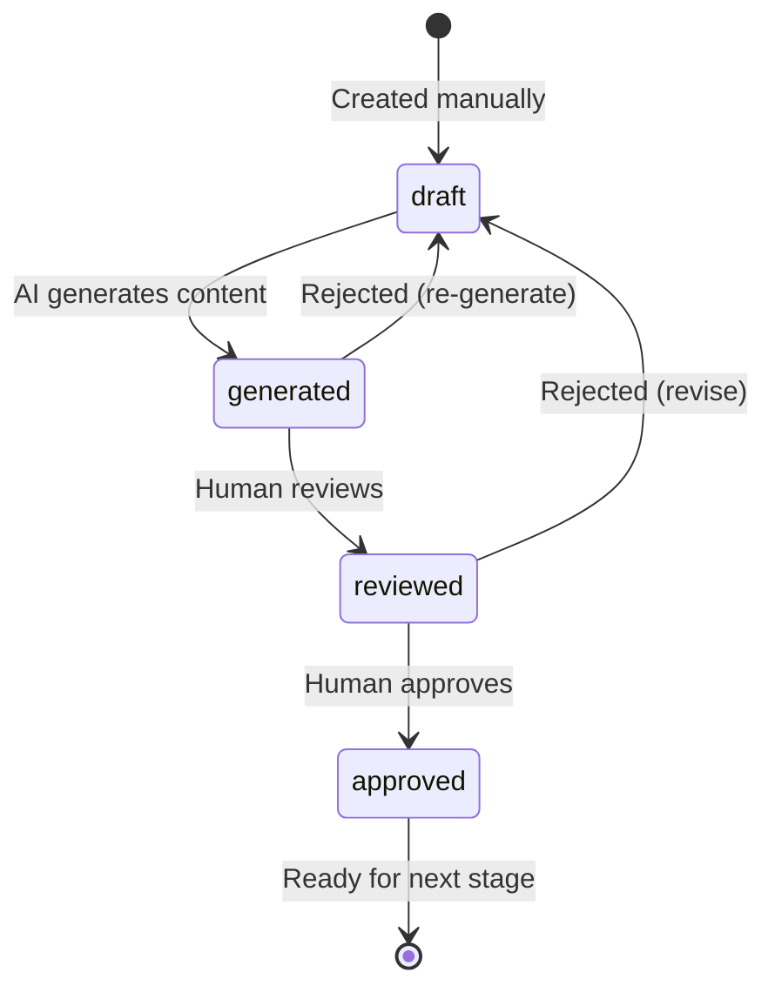

# CP-03: Document Workflow — Business Logic → Tech Spec → Coding Plan

**Maps from:** SD-05 (Workflow Engine), Google Doc §4.3–4.5, §11
**Phase:** 3
**Depends on:** CP-02

---

## 1. Core Concept

This phase implements the **document pipeline** — the sequential chain of deliverables that flow through human review and AI generation before any code is written:

```
Business Logic Document → Technical Spec → Coding Plan
      (draft → generated → reviewed → approved)
```

Each document has a strict lifecycle status: `draft` → `generated` → `reviewed` → `approved`.
A document cannot advance to the next stage without approval (unless YOLO mode is enabled).

---

## 2. Database Tables (New Migration)

```sql
-- Business Logic Documents
CREATE TABLE business_logic_docs (
  id UUID PRIMARY KEY DEFAULT gen_random_uuid(),
  project_id TEXT NOT NULL REFERENCES projects(id) ON DELETE CASCADE,
  title TEXT NOT NULL,
  content TEXT NOT NULL DEFAULT '',
  status TEXT NOT NULL DEFAULT 'draft',   -- draft, generated, reviewed, approved
  created_by TEXT NOT NULL,
  approved_by TEXT,
  created_at TIMESTAMPTZ DEFAULT now(),
  updated_at TIMESTAMPTZ DEFAULT now()
);

-- Technical Specs (linked to business logic)
CREATE TABLE technical_specs (
  id UUID PRIMARY KEY DEFAULT gen_random_uuid(),
  project_id TEXT NOT NULL REFERENCES projects(id) ON DELETE CASCADE,
  business_logic_doc_id UUID REFERENCES business_logic_docs(id) ON DELETE SET NULL,
  title TEXT NOT NULL,
  content TEXT NOT NULL DEFAULT '',
  status TEXT NOT NULL DEFAULT 'draft',
  created_by TEXT NOT NULL,
  approved_by TEXT,
  created_at TIMESTAMPTZ DEFAULT now(),
  updated_at TIMESTAMPTZ DEFAULT now()
);

-- Coding Plans (linked to tech spec)
CREATE TABLE coding_plans (
  id UUID PRIMARY KEY DEFAULT gen_random_uuid(),
  project_id TEXT NOT NULL REFERENCES projects(id) ON DELETE CASCADE,
  technical_spec_id UUID REFERENCES technical_specs(id) ON DELETE SET NULL,
  title TEXT NOT NULL,
  content TEXT NOT NULL DEFAULT '',
  status TEXT NOT NULL DEFAULT 'draft',
  created_by TEXT NOT NULL,
  approved_by TEXT,
  created_at TIMESTAMPTZ DEFAULT now(),
  updated_at TIMESTAMPTZ DEFAULT now()
);

-- Enable RLS
ALTER TABLE business_logic_docs ENABLE ROW LEVEL SECURITY;
ALTER TABLE technical_specs ENABLE ROW LEVEL SECURITY;
ALTER TABLE coding_plans ENABLE ROW LEVEL SECURITY;
```

---

## 3. Domain Models

```typescript
// src/domain/model/entity/document.ts
export type DocumentStatus = 'draft' | 'generated' | 'reviewed' | 'approved';

export interface BusinessLogicDoc {
  id: string;
  projectId: string;
  title: string;
  content: string;
  status: DocumentStatus;
  createdBy: string;
  approvedBy: string | null;
  createdAt: string;
  updatedAt: string;
}

export interface TechnicalSpec {
  id: string;
  projectId: string;
  businessLogicDocId: string | null;
  title: string;
  content: string;
  status: DocumentStatus;
  createdBy: string;
  approvedBy: string | null;
  createdAt: string;
  updatedAt: string;
}

export interface CodingPlan {
  id: string;
  projectId: string;
  technicalSpecId: string | null;
  title: string;
  content: string;
  status: DocumentStatus;
  createdBy: string;
  approvedBy: string | null;
  createdAt: string;
  updatedAt: string;
}
```

---

## 4. TanStack Query Hooks

```typescript
// src/features/business-logic/queries.ts
export const businessLogicKeys = {
  byProject: (projectId: string) => ['businessLogicDocs', projectId] as const,
  detail: (id: string) => ['businessLogicDoc', id] as const,
}

// src/features/tech-specs/queries.ts
export const techSpecKeys = {
  byProject: (projectId: string) => ['technicalSpecs', projectId] as const,
  detail: (id: string) => ['technicalSpec', id] as const,
}

// src/features/coding-plans/queries.ts
export const codingPlanKeys = {
  byProject: (projectId: string) => ['codingPlans', projectId] as const,
  detail: (id: string) => ['codingPlan', id] as const,
}
```

---

## 5. UI Components

### 5.1 Business Logic Editor (`/projects/:projectId/business-logic`)
- **List view:** DataTable of all business logic docs for this project (title, status badge, created date)
- **Editor view:** Full Markdown editor (use a lightweight editor like `@uiw/react-md-editor` or custom `<textarea>` + preview)
- **Sections within editor:**
  - Requirements
  - Acceptance Criteria
  - Constraints
  - Edge Cases
- **Actions:**
  - "Save Draft" button
  - "Ask AI to Review" button → triggers AI review for ambiguity/missing requirements (Phase 6)
  - "Approve for Tech Spec Generation" → sets status = `approved`

### 5.2 Technical Spec Viewer/Editor (`/projects/:projectId/tech-specs`)
- **List view:** DataTable of all specs linked to this project
- **Spec detail view:** Read-only markdown render + inline editing
- **Suggested sections** (per Google Doc):
  - Overview
  - Scope
  - User Flows
  - Data Model
  - API/Edge Function Design
  - Frontend Component Plan
  - Permissions and RLS
  - Error Handling
  - Logging and Monitoring
  - Testing Strategy
- **Actions:**
  - "Generate from Business Logic" → calls AI (Phase 6)
  - "Approve for Coding Plan"

### 5.3 Coding Plan Viewer/Editor (`/projects/:projectId/coding-plan`)
- **List view:** All coding plans for this project
- **Plan detail:** Markdown render with sections:
  - Feature Breakdown
  - Repository Structure Changes
  - Frontend Tasks
  - Backend/Edge Function Tasks
  - Database Migration Tasks
  - Test Tasks
  - Review Tasks
  - Deployment Tasks
- **Actions:**
  - "Generate from Tech Spec" → calls AI (Phase 6)
  - "Mark Ready for Scheduling"

---

## 6. Status Transition Flow



Status transitions are enforced client-side in the UI and server-side via RLS policies or Edge Functions.

---

## 7. Definition of Done — Phase 3

- [ ] Database migration: `business_logic_docs`, `technical_specs`, `coding_plans`
- [ ] Business Logic: CRUD with Markdown editor, status transitions
- [ ] Tech Spec: list/detail view with section-based rendering
- [ ] Coding Plan: list/detail view with task-oriented sections
- [ ] Status badges: draft (gray), generated (blue), reviewed (yellow), approved (green)
- [ ] Document linking: Tech Spec knows its parent Business Logic Doc, Coding Plan knows its parent Tech Spec
- [ ] "Generate from..." buttons are visible but disabled (AI integration in Phase 6)
