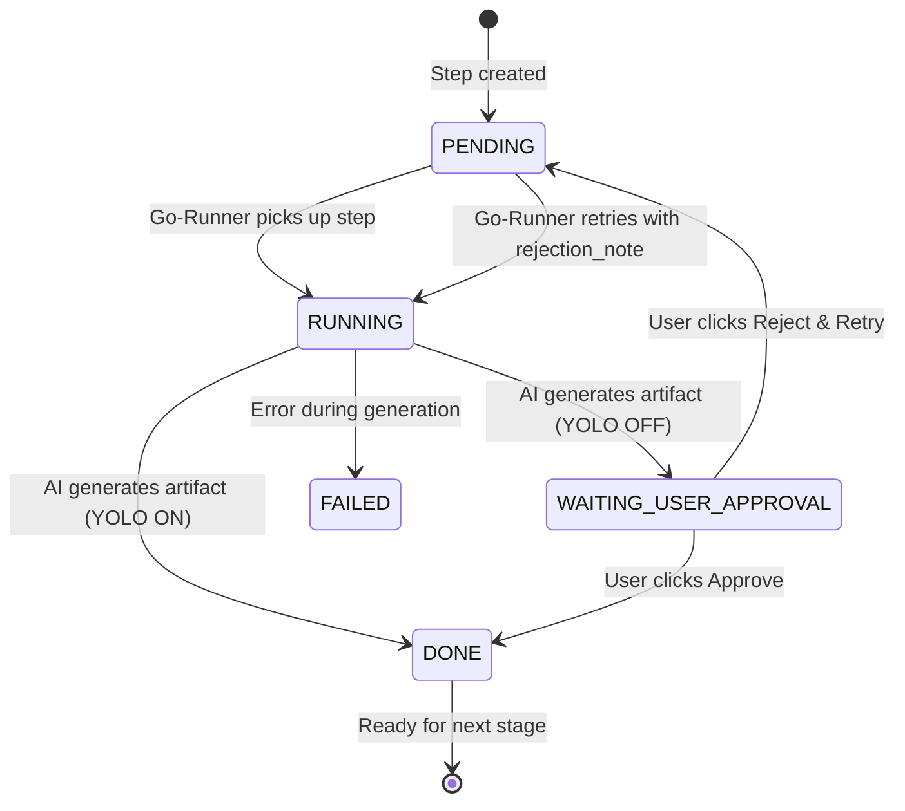

# CP-06: Document Workflow — Business Logic → Tech Spec → Coding Plan

**Maps from:** SS-04 (Workflow Steps), SS-07 (Artifacts), SS-08 (Approval Gates), SD-05 (Workflow Engine), SD-08 (Artifact Management), SD-09 (Approval Gates)
**Phase:** 3
**Depends on:** CP-07

---

## 1. Core Concept

This phase implements the **document pipeline** — the sequential chain of deliverables that flow through human review and AI generation before any code is written:

```
Business Logic → Tech Spec → Coding Plan
    (workflow steps producing approved artifacts at each stage)
```

Each document in this pipeline is an **artifact** — the output of a specific workflow step (SS-04 §3.5). A document cannot advance to the next stage without approval (unless YOLO mode is enabled, per SS-08).

**Key design constraint:** Do not create separate document tables. All documents produced in this pipeline are stored in the canonical `artifacts` table (SD-08), distinguished by `artifact_type`. This gives version history, Context Resolver integration (SD-10), and Approval Gate wiring for free.

---

## 2. Database Migration

### 2.1 Artifacts Table Extension

CP-06 creates the canonical `artifacts` table defined in SD-08 and used by all later artifact, approval, AI, and memory flows:

```sql
CREATE TABLE artifacts (
  id UUID PRIMARY KEY DEFAULT gen_random_uuid(),
  project_id UUID NOT NULL REFERENCES projects(id) ON DELETE CASCADE,
  workflow_run_id UUID REFERENCES workflow_runs(id) ON DELETE SET NULL,
  workflow_run_step_id UUID REFERENCES workflow_run_steps(id) ON DELETE SET NULL,
  artifact_type TEXT NOT NULL DEFAULT 'generic',
  parent_artifact_id UUID REFERENCES artifacts(id) ON DELETE SET NULL,
  version INT NOT NULL DEFAULT 1,
  title TEXT NOT NULL,
  content_url TEXT NOT NULL,
  status TEXT NOT NULL DEFAULT 'PENDING' CHECK (status IN ('PENDING', 'RUNNING', 'WAITING_USER_APPROVAL', 'DONE', 'FAILED', 'SKIPPED')),
  created_by UUID REFERENCES auth.users(id),
  approved_by UUID REFERENCES auth.users(id),
  rejection_note TEXT,
  retry_count INT NOT NULL DEFAULT 0,
  created_at TIMESTAMPTZ DEFAULT now(),
  updated_at TIMESTAMPTZ DEFAULT now()
);

ALTER TABLE workflow_run_steps
  ADD CONSTRAINT workflow_run_steps_artifact_fk
  FOREIGN KEY (artifact_id) REFERENCES artifacts(id);

-- Index for fast project + type queries
CREATE INDEX IF NOT EXISTS artifacts_project_type_idx ON artifacts(project_id, artifact_type);

-- Valid artifact_type values for this phase:
-- 'business_logic', 'tech_spec', 'coding_plan'
-- (plus future types: 'architecture', 'tdd_plan', 'task_breakdown', etc.)
```

### 2.2 Artifact Type Reference

| `artifact_type` | Produced by step (SS-04) | Feeds into |
|---|---|---|
| `business_logic` | Business Idea / Business Summary / Feature Intake Step | Tech Spec Step |
| `tech_spec` | Tech Spec Step | Make Plan Coding Step |
| `coding_plan` | Make Plan Coding Step | Code/Review Loop Step |

### 2.3 How Documents Are Linked

The `parent_artifact_id` column expresses the pipeline chain:
- A `tech_spec` artifact sets `parent_artifact_id` to the `business_logic` artifact it was generated from.
- A `coding_plan` artifact sets `parent_artifact_id` to the `tech_spec` artifact.

This replaces the need for `business_logic_doc_id` / `technical_spec_id` foreign keys on separate tables.

### 2.4 RLS Policies

```sql
-- Read: project owners/admin-web only
CREATE POLICY "artifacts_select_project_members"
  ON artifacts FOR SELECT
  USING (
    project_id IN (
      SELECT p.id FROM projects p
      WHERE p.created_by = auth.uid() OR p.owner_id = auth.uid()
    )
  );

-- Insert: authenticated project owners/admin-web only
CREATE POLICY "artifacts_insert_project_members"
  ON artifacts FOR INSERT
  WITH CHECK (
    project_id IN (
      SELECT p.id FROM projects p
      WHERE p.created_by = auth.uid() OR p.owner_id = auth.uid()
    )
  );

-- Update: limited to status transitions by project owners/admin-web
CREATE POLICY "artifacts_update_project_members"
  ON artifacts FOR UPDATE
  USING (
    project_id IN (
      SELECT p.id FROM projects p
      WHERE p.created_by = auth.uid() OR p.owner_id = auth.uid()
    )
  );
```

---

## 3. Domain Models

```typescript
// src/domain/model/entity/artifact.ts

export type ArtifactType = 'business_logic' | 'tech_spec' | 'coding_plan' | 'generic';

// Artifact status is the workflow step status from SD-09 / SD-05:
// PENDING → RUNNING → WAITING_USER_APPROVAL → DONE | FAILED | SKIPPED
export type ArtifactStatus = 'PENDING' | 'RUNNING' | 'WAITING_USER_APPROVAL' | 'DONE' | 'FAILED' | 'SKIPPED';

export interface Artifact {
  id: string;
  projectId: string;
  workflowRunId: string;
  workflowRunStepId: string;        // maps to workflow_run_step_id in artifacts table
  artifactType: ArtifactType;
  parentArtifactId: string | null;  // pipeline chain: tech_spec → business_logic parent
  version: number;
  contentUrl: string;               // Supabase Storage URL (SD-08 §2)
  status: ArtifactStatus;           // mirrors workflow_run_steps.status (SD-09)
  createdBy: string;                // UUID FK → auth.users
  approvedBy: string | null;        // UUID FK → auth.users, set on DONE
  rejectionNote: string | null;     // set on Reject & Retry (SD-09 §4)
  retryCount: number;
  createdAt: string;
  updatedAt: string;
}
```

---

## 4. TanStack Query Hooks

```typescript
// src/features/documents/queries.ts

export const documentKeys = {
  byProjectAndType: (projectId: string, type: ArtifactType) =>
    ['artifacts', projectId, type] as const,
  detail: (id: string) =>
    ['artifact', id] as const,
  versionHistory: (projectId: string, workflowRunStepId: string) =>
    ['artifactVersions', projectId, workflowRunStepId] as const,
}

// Example hook — same pattern for tech_spec and coding_plan
export function useBusinessLogicDocs(projectId: string) {
  return useQuery({
    queryKey: documentKeys.byProjectAndType(projectId, 'business_logic'),
    queryFn: () =>
      supabase
        .from('artifacts')
        .select('*')
        .eq('project_id', projectId)
        .eq('artifact_type', 'business_logic')
        .order('created_at', { ascending: false }),
  });
}
```

---

## 5. UI Components

### 5.1 Business Logic Editor (`/projects/:projectId/business-logic`)

- **List view:** DataTable of all `artifact_type = 'business_logic'` artifacts for this project (title, status badge, version, created date, approved by)
- **Editor view:** Full Markdown editor (lightweight, e.g. `@uiw/react-md-editor` or custom `<textarea>` + preview). Content is fetched from `contentUrl` (Supabase Storage).
- **Suggested sections within editor:**
  - Requirements
  - Acceptance Criteria
  - Constraints
  - Edge Cases
- **Actions:**
  - "Save Draft" → uploads content to Supabase Storage, updates `content_url`
  - "Ask AI to Review" → triggers AI review step (Phase 6 — disabled in this phase)
  - "Approve" → calls the approval Edge Function (sets `workflow_run_steps.status = DONE`, marks next step `PENDING`)
  - "Reject & Retry" → prompts for rejection reason, calls rejection Edge Function (SD-09 §4)
- **Version history:** Sidebar dropdown listing previous `version` records for the same `workflow_run_step_id`

### 5.2 Technical Spec Viewer/Editor (`/projects/:projectId/tech-specs`)

- **List view:** DataTable of all `artifact_type = 'tech_spec'` artifacts for this project
- **Spec detail view:** Read-only Markdown render + inline edit mode. Shows parent Business Logic doc link (`parent_artifact_id`).
- **Suggested sections** (per SS-04 §3.5.5):
  - Overview
  - Scope
  - User Flows
  - Data Model
  - API/Edge Function Design
  - Frontend Component Plan
  - Permissions and RLS
  - Error Handling
  - Logging and Monitoring
  - Testing Strategy
- **Actions:**
  - "Generate from Business Logic" → calls AI via workflow step (Phase 6 — button visible but disabled)
  - "Approve" / "Reject & Retry" → same approval gate pattern as §5.1

### 5.3 Coding Plan Viewer/Editor (`/projects/:projectId/coding-plan`)

- **List view:** All `artifact_type = 'coding_plan'` artifacts for this project
- **Plan detail:** Markdown render with suggested sections:
  - Feature Breakdown
  - Repository Structure Changes
  - Frontend Tasks
  - Backend/Edge Function Tasks
  - Database Migration Tasks
  - Test Tasks
  - Review Tasks
  - Deployment Tasks
- **Actions:**
  - "Generate from Tech Spec" → calls AI (Phase 6 — disabled)
  - "Mark Ready for Scheduling" → approval action that advances status to `DONE`, enabling the Task Breakdown step to proceed
- **Parent link:** Shows the Tech Spec this coding plan was generated from (`parent_artifact_id`)

---

## 6. Status Transition Flow

Document artifacts follow the **canonical workflow step state machine** (SD-09 / SD-05), not a separate document lifecycle. The Go-Runner and approval Edge Functions control all transitions — the frontend is read-only via Supabase Realtime.



### 6.1 YOLO Mode

When YOLO mode is enabled (project or workflow level, per SS-08 §3–4):
- The Go-Runner transitions `RUNNING → DONE` directly, skipping `WAITING_USER_APPROVAL`.
- The "Approve" / "Reject & Retry" buttons are hidden in the UI.
- The next step is marked `PENDING` immediately.

### 6.2 Approval Gate (Safe Mode)

When YOLO mode is OFF (default):
1. Go-Runner sets step to `WAITING_USER_APPROVAL` after generating the artifact.
2. Frontend shows "Approve" and "Reject & Retry" buttons (sourced from Supabase Realtime).
3. On Approve: an Edge Function sets `workflow_run_steps.status = DONE`, marks next step `PENDING`.
4. On Reject & Retry: Edge Function stores `rejection_note`, resets step to `PENDING`. Go-Runner retries with the note appended to the prompt (SD-09 §4).

**Important:** Status transitions are **never enforced purely client-side**. The frontend calls a Supabase Edge Function or the Go-Runner API. The Edge Function validates the transition and applies it.

---

## 7. Definition of Done — Phase 3

- [ ] `artifacts` table created with UUID project/workflow/run-step FKs
- [ ] `artifacts.artifact_type` column exists with index
- [ ] `artifacts.parent_artifact_id` column exists (FK, nullable)
- [ ] RLS policies enforce project-scoped read/write on `artifacts`

### Domain & Data Layer
- [ ] `ArtifactType` and `ArtifactStatus` TypeScript types defined
- [ ] TanStack Query hooks for listing and fetching artifacts by type
- [ ] Version history query by `project_id` + `workflow_run_step_id`

### UI
- [ ] Business Logic list and editor view with Markdown editor
- [ ] Tech Spec list and detail view with section-based rendering
- [ ] Coding Plan list and detail view with task-oriented sections
- [ ] Status badges: `PENDING` (gray), `RUNNING` (blue spinner), `WAITING_USER_APPROVAL` (yellow), `DONE` (green), `FAILED` (red)
- [ ] Parent document link shown on Tech Spec and Coding Plan detail views
- [ ] Version history sidebar on all document detail views
- [ ] "Generate from..." buttons visible but disabled (AI integration in Phase 6)

### Approval Gate
- [ ] "Approve" and "Reject & Retry" buttons wired to Edge Function (not client-side state mutation)
- [ ] Rejection note prompt and submission flow implemented
- [ ] YOLO mode hides approval buttons and auto-advances status
- [ ] Supabase Realtime subscription updates UI when `workflow_run_steps.status` changes

### Tests
- [ ] Tests cover document listing filtered by `artifact_type`
- [ ] Tests cover parent-child chain resolution (`parent_artifact_id`)
- [ ] Tests cover approval transition (DONE) and rejection (PENDING + rejection_note)
- [ ] Tests cover YOLO mode auto-advance
