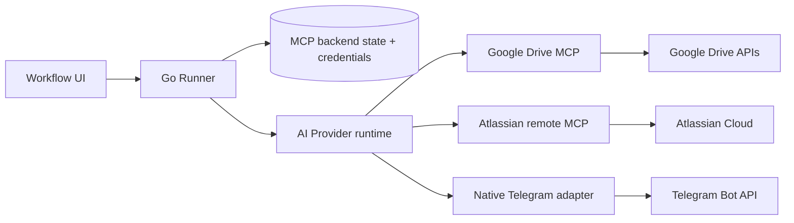
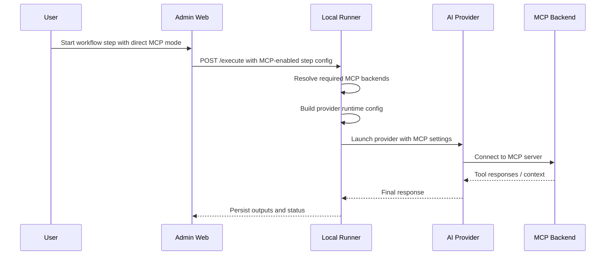

# CP-13: Direct MCP Runtime for AI Providers

**Maps from:** SD-11, CP-05, CP-07
**Phase:** Later improvement
**Depends on:** CP-11, CP-12

---

## 1. Goal

Enable the AI provider itself to connect to MCP backends directly, instead of FlowPilot always fetching MCP data and attaching it to the prompt first.

This is the “Codex works with Google Drive MCP directly” mode.

It is separate from the current prompt-hydration path.

Current path:

- FlowPilot fetches MCP data
- FlowPilot injects that data into the prompt
- AI provider only sees the assembled prompt

Future direct-runtime path:

- FlowPilot launches the AI provider with MCP access configured
- the AI provider reads MCP tools directly during execution
- the provider can request fresh context without FlowPilot preloading everything into the prompt

---

## 2. Why This Exists

This plan is for cases where direct tool access is better than prompt stuffing.

Benefits:

- less prompt bloat
- better freshness for large or dynamic data
- fewer manual prefetch steps in FlowPilot
- closer alignment with MCP-native AI clients

This is a later optimization, not a replacement for CP-07.

---

## 3. Scope

### In scope

- launch an MCP-capable AI provider with MCP backends attached
- support per-provider MCP configuration for allowed backends
- keep secrets in the runner boundary
- expose runtime status in UI
- support local third-party MCP servers and official remote MCP endpoints

### Out of scope for this plan

- redesigning workflow prompt caching
- removing the CP-07 fetch-and-inject path
- turning Telegram into an MCP backend

---

## 4. Runtime Architecture

The important change is that the provider runtime gets MCP connectivity directly, not only preformatted text.

---

## 5. Direct MCP Launch Flow

---

## 6. Provider Strategy

### 6.1 Codex

Codex is the first candidate for this mode because it is the provider mentioned in the use case.

FlowPilot should be able to:

- detect which MCP backends are enabled for the current step
- generate the provider launch config
- start Codex with those MCP backends attached
- capture the output and return it to the workflow engine

If direct MCP launch is unsupported for a provider, FlowPilot should fall back to the CP-07 fetch-and-inject path.

### 6.2 Google Drive

Google Drive can be exposed either as:

- fetched context in CP-07
- direct MCP tool access in CP-13

The direct mode should still reuse the runner-owned backend state and credential handling.

### 6.3 Jira

Jira direct mode should connect through Atlassian’s official remote MCP server using the supported local client bridge.

This is the direct-runtime version of the same Atlassian integration already modeled in CP-05.

### 6.4 Telegram

Telegram stays native Go.

It does not need direct MCP runtime because it is a notification-oriented integration, not an MCP browsing source.

---

## 7. Required Runner Work

The runner must add a direct-runtime orchestration layer:

1. resolve allowed MCP backends for the workflow step
2. prepare launcher or remote endpoint configuration
3. inject runtime secrets through secure local state
4. launch the AI provider process with MCP access enabled
5. monitor the provider session
6. persist step results and errors

The runner must still enforce an allowlist.

It should not let arbitrary MCP servers be attached just because a workflow step requested them.

---

## 8. UI Changes

The UI should show:

- whether a step uses `fetch-and-inject` mode or `direct MCP` mode
- which MCP backends are attached to the step
- whether the selected provider supports direct MCP runtime
- a fallback warning when the provider only supports prompt injection

Possible label:

- `MCP Mode: Prompt Hydration`
- `MCP Mode: Direct Runtime`

---

## 9. Data Model Additions

Potential step-level fields:

- `mcp_mode`
- `attached_mcp_backends`
- `provider_capabilities`
- `direct_mcp_supported`

Potential run-level fields:

- `mcp_runtime_status`
- `attached_backend_keys`
- `runtime_error`

---

## 10. Migration Path

This should be implemented after the current prompt-hydration path is stable.

Recommended order:

1. finish CP-07 fetch-and-inject
2. standardize provider capability metadata
3. add direct-runtime orchestration to the runner
4. enable Codex first
5. extend to other supported providers later

---

## 11. Success Criteria

This plan is done when:

- the AI provider can connect to approved MCP backends directly
- FlowPilot still owns secrets and status tracking
- prompt-injection mode still works as fallback
- the UI can show which execution mode was used

