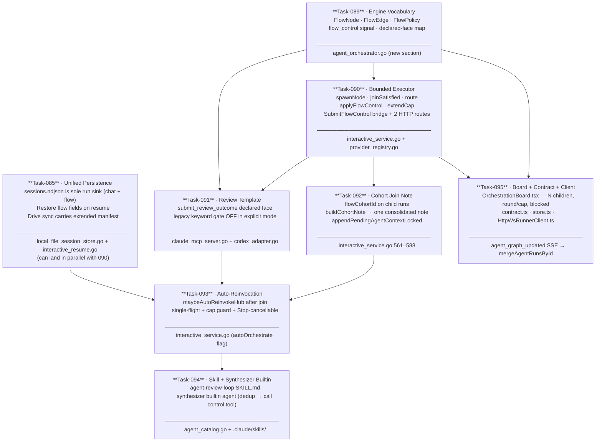
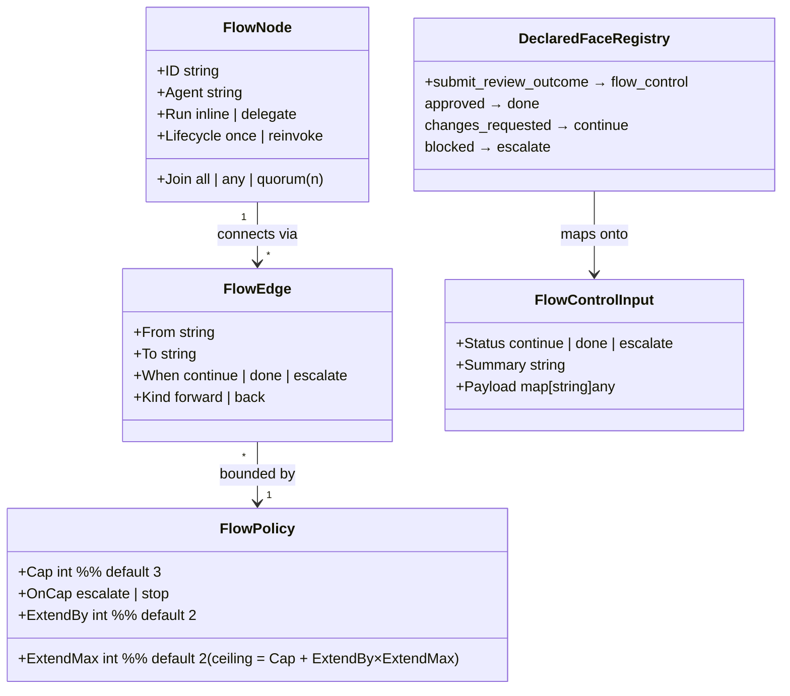
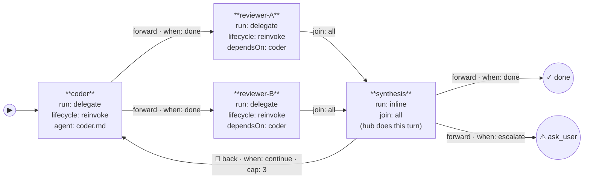
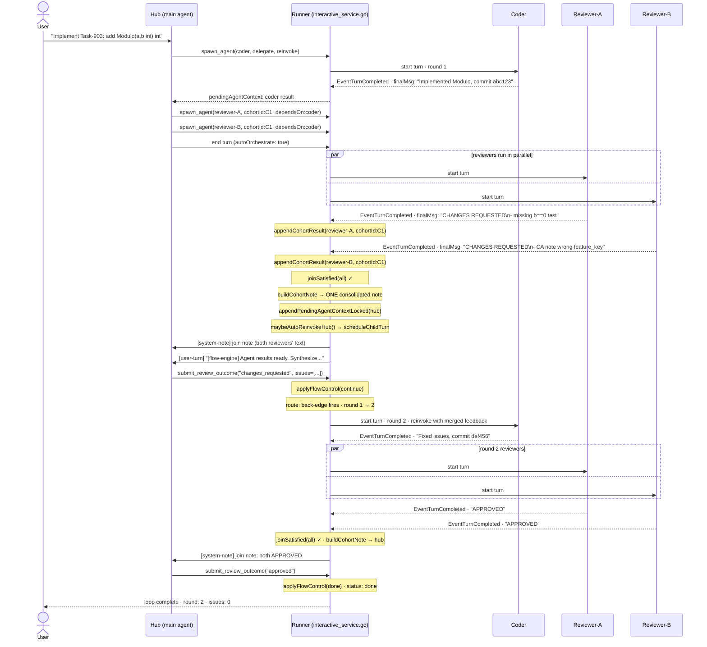
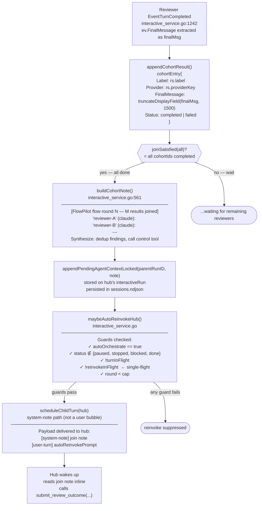
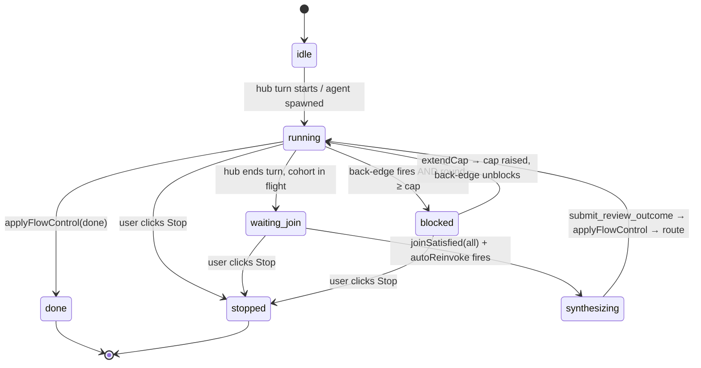
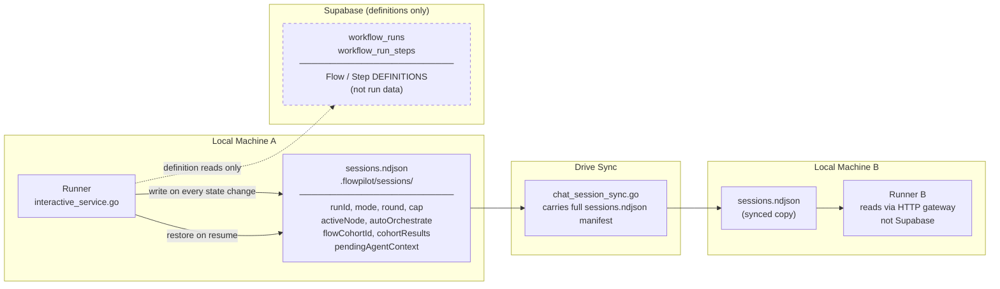

# CP-36 Diagrams — Generic Agent-Flow Engine

> Companion to [CP-36](./CP-36-Agent-Review-Loop-And-Main-Hub-Orchestration.md).
> Read these diagrams top-to-bottom — each one zooms in on a different layer of the same system.

---

## Diagram 1 — Task Build Order (Layer Stack)

Each task is independently testable and stacks on the one below it.
Tasks 089 / 090 / 085 can land in parallel; everything else has a strict dependency.

---

## Diagram 2 — Engine Core Types (Task-089)

The vocabulary introduced by Task-089. Everything in the executor (`route`, `applyFlowControl`, `joinSatisfied`) operates on these types — no role-specific strings anywhere in Go.

> **Code anchor:** `agent_orchestrator.go` — `FlowNode`, `FlowEdge`, `FlowPolicy`, `FlowControlInput`, face registry map.

---

## Diagram 3 — Review Loop as a FlowDefinition (Task-091)

The review-until-clean loop is not hardcoded in Go. It is **data** — a `FlowDefinition` of nodes + edges + policy. Any topology that fits the same schema runs on the same executor.

> **Key point:** Replace coder/reviewer labels with alpha/beta — the engine behaves identically. The words "coder" and "reviewer" are agent definition filenames, not Go branches.

---

## Diagram 4 — Runtime Execution Trace (Full Review Round)

What actually runs inside the runner for Task-903 (add Modulo to calc.go).

---

## Diagram 5 — Cohort Join Note Chain (Task-092 + Task-093)

Zoom in on what happens after the last reviewer's `EventTurnCompleted` fires, through to the hub waking up.

---

## Diagram 6 — Flow State Machine (AgentLoopState.Status)

The states stored in `sessions.ndjson` and surfaced on the Orchestration Board.

> **Board mapping:** `blocked` = renders Extend +2 / Stop buttons. `waiting_join` = spinner on all child nodes. `done` = all nodes green, no further reinvoke.

---

## Diagram 7 — Persistence Model (Task-085)

Where run data lives and how it travels across machines.

> **Rule:** Production never writes `workflow_run_logs` / `workflow_run_sessions` / `workflow_run_steps` for run data. `cli/root.go:120-123` wires `localFileSessionStore` as the sole run sink.
