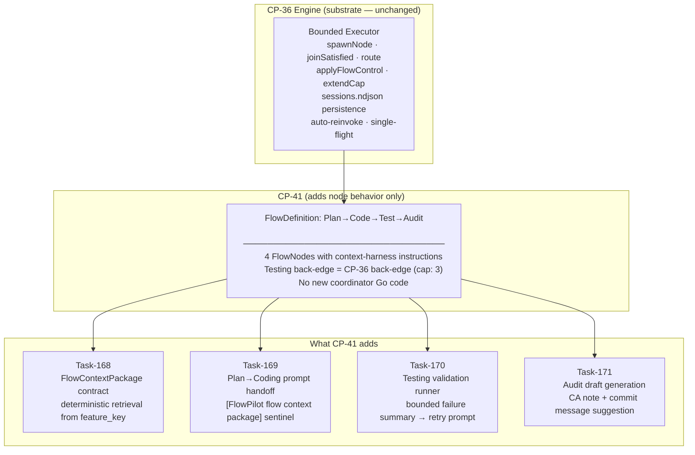
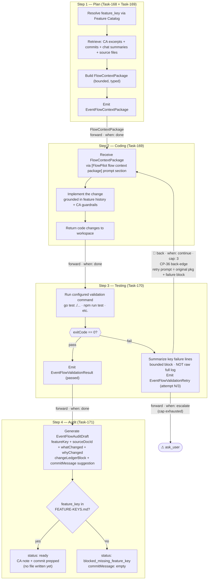
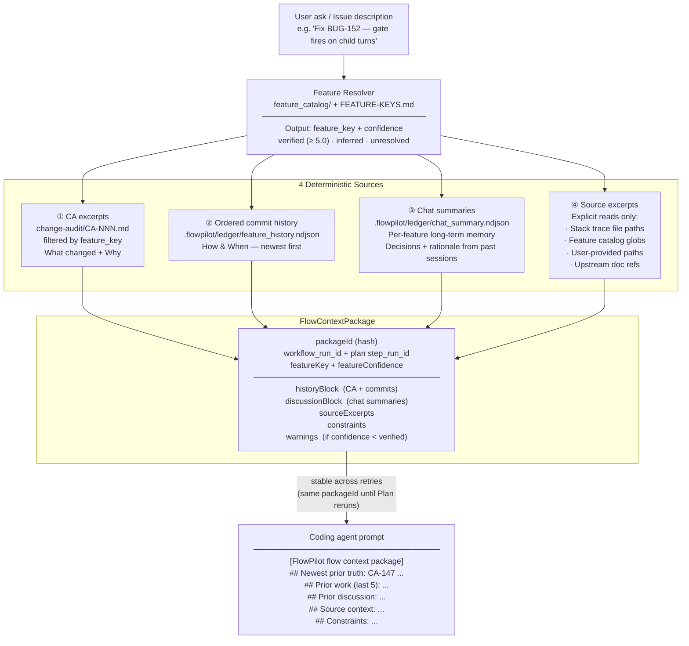
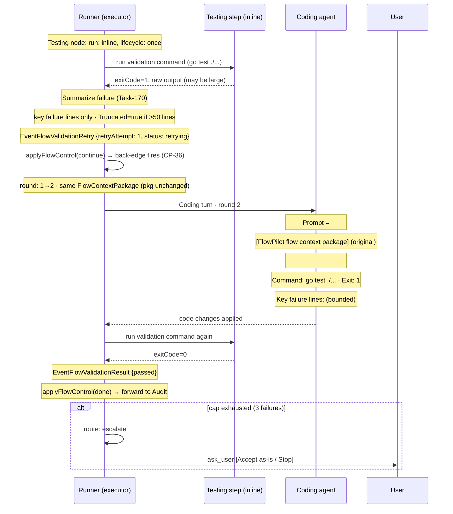
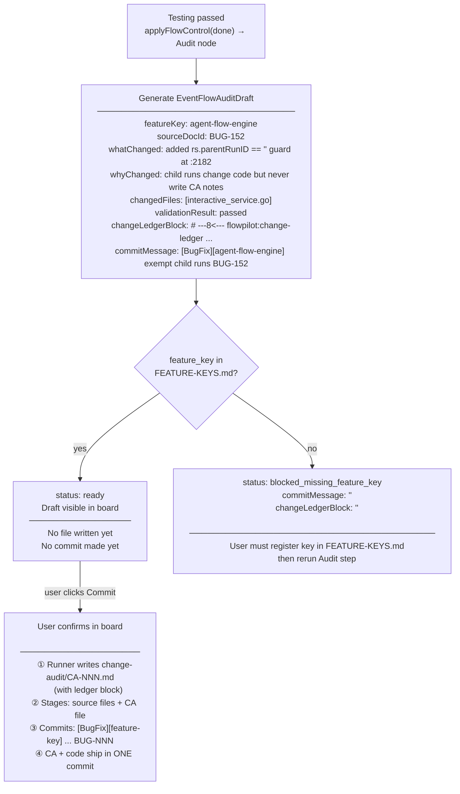
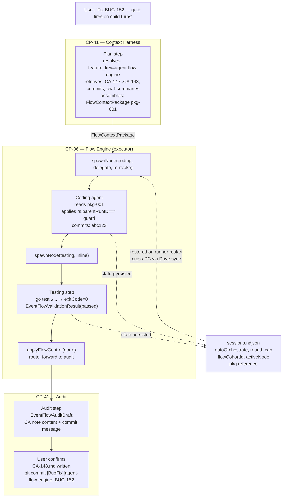

# CP-41 Diagrams — RAG Harness Flow Mode

> Companion to [CP-41](./CP-41-RAG-Harness-Flow-Mode.md).
> CP-41 **adds no new agent-interaction code** — it only adds context-harness node behavior on top of CP-36's engine. Read [CP-36-DIAGRAM.md](./CP-36-DIAGRAM.md) first.

---

## Diagram 1 — How CP-41 Sits on CP-36

CP-41 is a `FlowDefinition` over the CP-36 executor. The Plan→Code→Test→Audit pipeline is just four nodes with edges — the same engine that runs the review loop runs this.

---

## Diagram 2 — Pipeline Overview (Plan → Code → Test → Audit)

What data flows between steps and what each step owns.

---

## Diagram 3 — Context Package Assembly (Task-168)

How the Plan step builds the `FlowContextPackage`. Retrieval is **deterministic only** — no vector DB, no embedding index, no similarity search.

---

## Diagram 4 — Testing Retry = CP-36 Back-Edge (Task-170)

The Testing→Coding retry is **not** a new state machine. It reuses the CP-36 bounded back-edge directly. The only new code is the validation runner and the failure summary builder.

> **Environment errors:** If the command binary is not found (`exec: not found in $PATH`), the runner emits `status: skipped_env_error` and does **not** trigger a Coding retry. Environment failures are reported, not retried.

---

## Diagram 5 — Audit Draft Gate (Task-171)

The Audit step prepares output but writes **nothing** automatically. Every write is behind an explicit user confirmation.

---

## Diagram 6 — Full Data Lineage (CP-36 + CP-41 Together)

How a single FlowPilot run flows data from user ask to committed audit note.

