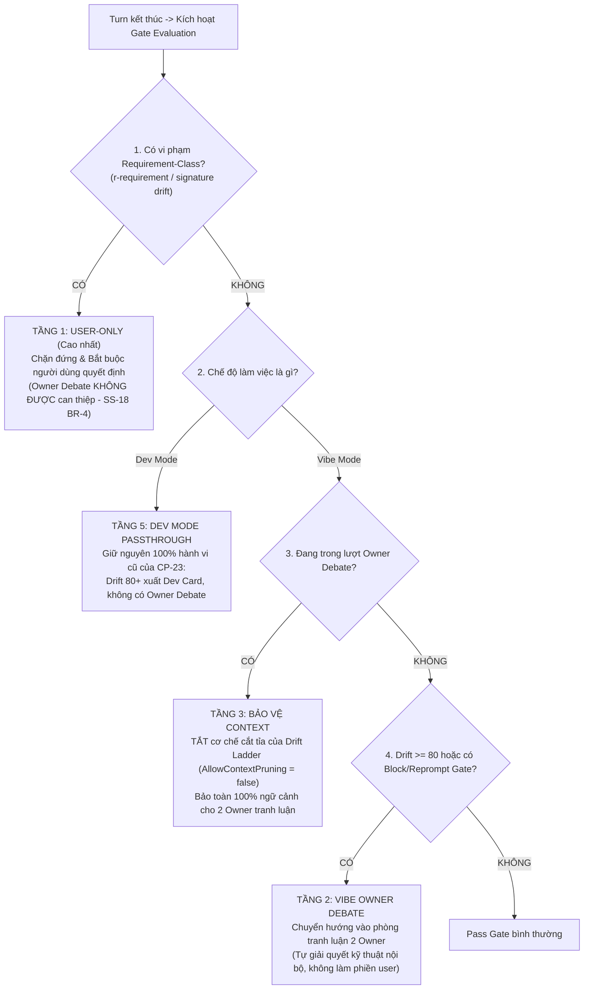
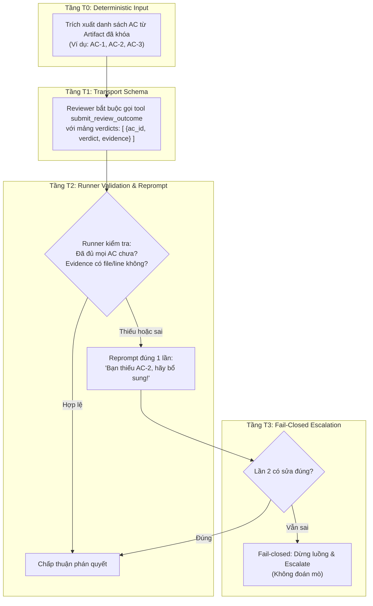
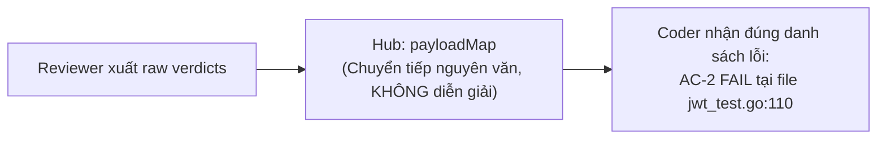
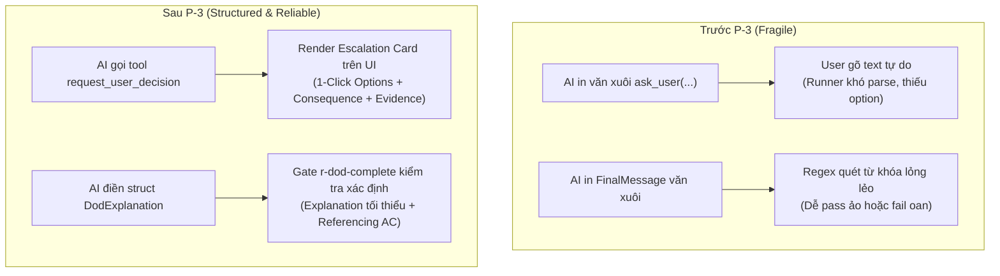
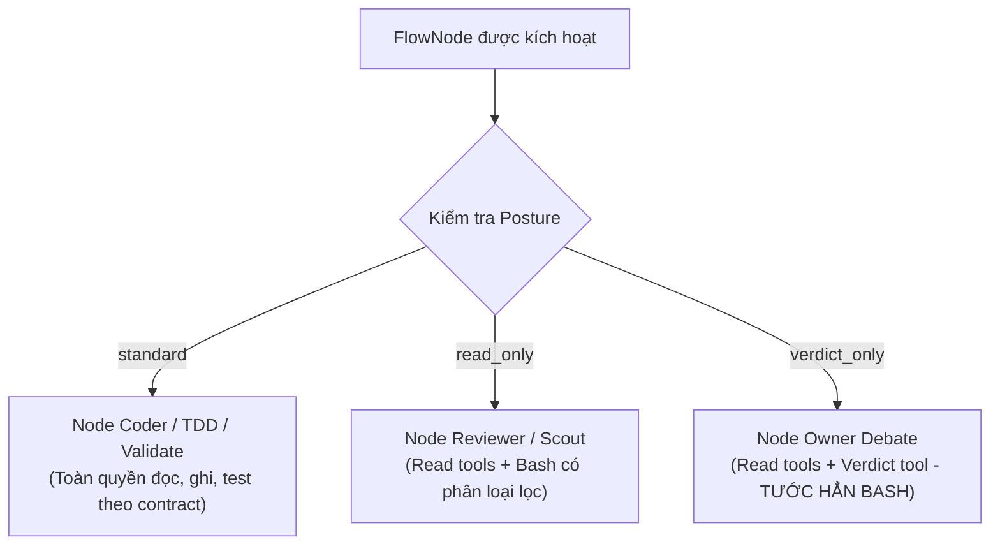
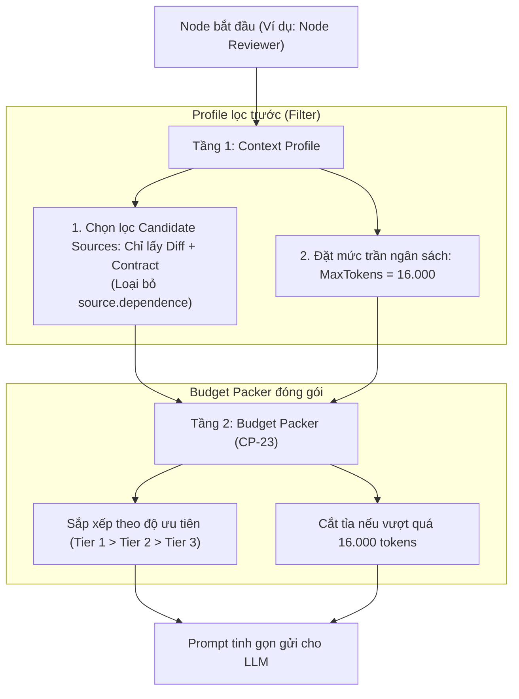
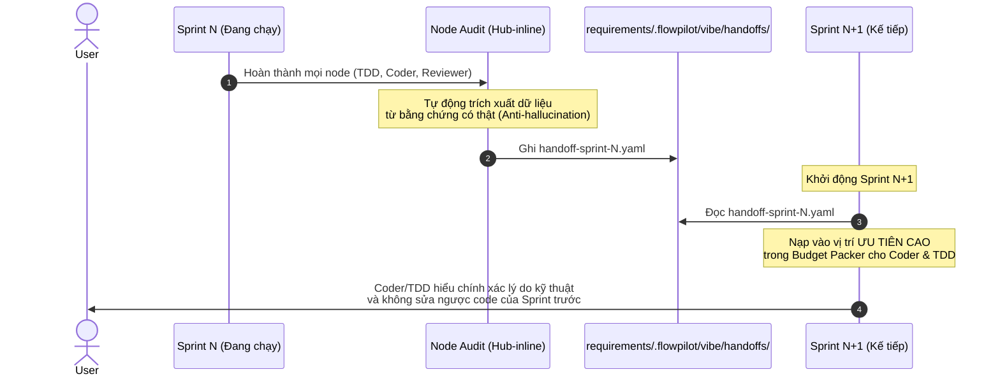
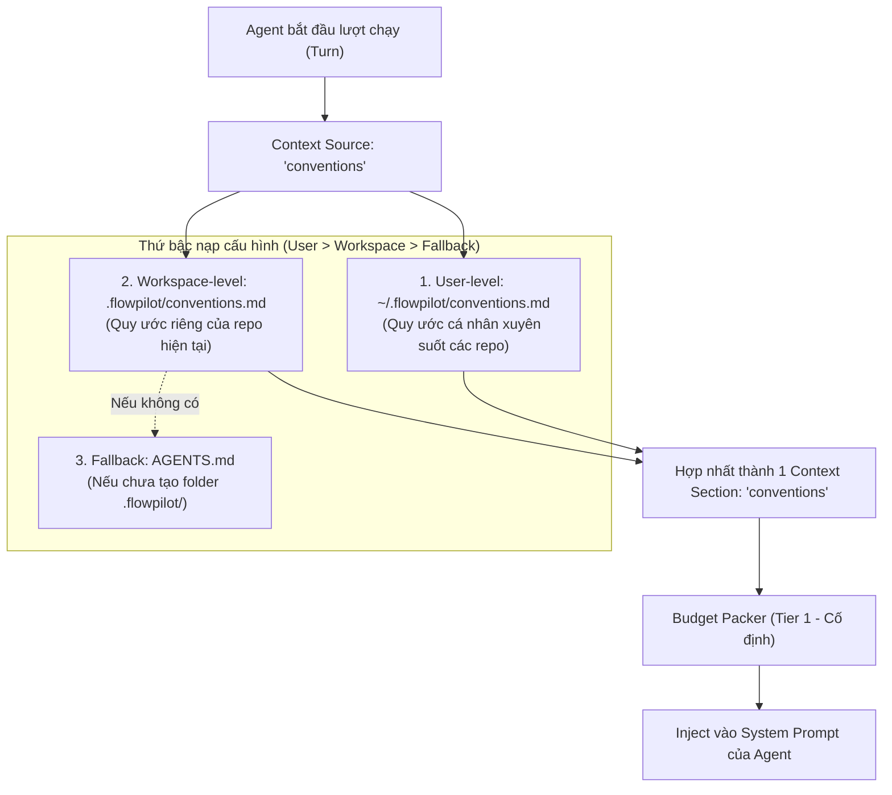

# CP-62 Note: Giải thích & Q&A Kiến trúc Toàn diện (P-1 đến P-7)

Tài liệu tổng hợp và chuẩn hóa toàn bộ nội dung giải thích, cơ chế kỹ thuật và các câu hỏi đáp kiến trúc chuyên sâu về đầy đủ 7 slice: **Slice P-1** ([Task-337](file:///Users/tiendat/Desktop/flowpilot/flowpilot/requirements/08-Task/done/Task-337-Gate-Precedence-Contract-And-Wiring.md)), **Slice P-2** ([Task-338](file:///Users/tiendat/Desktop/flowpilot/flowpilot/requirements/08-Task/done/Task-338-Reviewer-Verdict-Schema-And-Per-AC-Evidence.md)), **Slice P-3** ([Task-339](file:///Users/tiendat/Desktop/flowpilot/flowpilot/requirements/08-Task/done/Task-339-Structured-Escalation-Card-And-Or-Explained-Schema.md)), **Slice P-4** ([Task-340](file:///Users/tiendat/Desktop/flowpilot/flowpilot/requirements/08-Task/done/Task-340-Per-Node-Read-Only-Enforcement-And-Isolation.md)), **Slice P-5** ([Task-341](file:///Users/tiendat/Desktop/flowpilot/flowpilot/requirements/08-Task/done/Task-341-Per-Node-Context-Profile-And-Catalog-Tier.md)), **Slice P-6** ([Task-342](file:///Users/tiendat/Desktop/flowpilot/flowpilot/requirements/08-Task/done/Task-342-Sprint-Handoff-Artifact-Schema-And-Chain.md)) và **Slice P-7** ([Task-343](file:///Users/tiendat/Desktop/flowpilot/flowpilot/requirements/08-Task/done/Task-343-Conventions-Context-Source-Repo-As-Config.md)) của [CP-62: Zcode-Harness-Parity](../done/CP-62-Zcode-Harness-Parity.md).

---

# Phần 1. P-1: Gate Precedence Contract & Wiring

> **Task tham chiếu**: [Task-337: Hợp đồng Precedence giữa các hệ thống Gate và Kết nối Runner](../../08-Task/done/Task-337-Gate-Precedence-Contract-And-Wiring.md)  
> **System Tech Design**: [SD-20 §7: Gate Precedence Table](../../06-System-Tech-Design/SD-20-Flow-Gate-Rule-Semantics.md)

---

### 1. Vấn đề thực tế trước P-1: "Đâm nhau chan chát giữa các hệ thống kiểm soát"

Khi hệ thống FlowPilot phát triển qua nhiều giai đoạn, nhiều lớp phòng thủ độc lập được xây dựng song song:
1. **CP-23 (Drift Detector & Drift Ladder)**: Giám sát xem agent có bị lạc đề không. Nếu điểm drift $\ge 80$ $\rightarrow$ Bắn Dev Card bắt người dùng xác nhận, đồng thời kích hoạt nấc thang **thu hẹp context** (Context Pruning) để ép AI quay về trọng tâm.
2. **CP-47 / CP-61 (FlowGate Rules)**: Các quy tắc nghiệm thu như `r-dod-complete` (kiểm tra checklist DoD), `r-requirement` (bảo vệ System Specs), `r-scope`, `r-tests`.
3. **CP-60 (Vibe Working Mode & Owner Debate)**: Chế độ làm việc tự động (autonomous). Khi có bất đồng hoặc lỗi kỹ thuật, hệ thống khởi động vòng tranh luận giữa 2 Owner (`owner-debate`) để tự thương lượng và sửa lỗi nội bộ, tránh làm phiền con người.

#### Xung đột nghiêm trọng xảy ra khi các hệ thống này cùng chạy:
- 💥 **Xung đột 1: Vibe Mode bị Drift phá bĩnh (Phá vỡ tính Autonomous)**:  
  Người dùng chọn Vibe Mode vì muốn hệ thống tự động giải quyết các vấn đề kỹ thuật. Đột nhiên Drift chạm 80 điểm, bộ lọc CP-23 nhảy xổ ra bắn một cái "Dev Card" thô kệch bắt người dùng nhập liệu bằng tay, phá vỡ trải nghiệm tự trị của Vibe Mode.
- 💥 **Xung đột 2: Owner Debate bị "ngạt thở" vì bị Drift cắt mất ngữ cảnh (Context Starvation)**:  
  Khi 2 Owner vào phòng tranh luận để mổ xẻ xem Coder vi phạm hợp đồng nào, thì nấc thang của Drift Ladder lại tự động cắt gọt bớt context để giảm token. Hậu quả: 2 Owner bị mất sạch tài liệu và code vi phạm, dẫn đến việc tranh luận mù, không có bằng chứng để đối chiếu.
- 💥 **Xung đột 3: Tranh quyền đoạt vị (Ai có quyền giải quyết cái gì?)**:  
  Nếu Coder vi phạm vào System Spec gốc (`r-requirement`), liệu 2 Owner trong Vibe Mode có được quyền "tự thương lượng" để bỏ qua yêu cầu của người dùng không? Nếu cho phép, AI sẽ tự ý sửa đổi mong muốn ban đầu của con người (vi phạm nguyên tắc tối cao `SS-18 BR-4`).

> **Chính xác hoá (2026-09-13)**: Xung đột 1 là mâu thuẫn ở mức **thiết kế** của CP-23 — chân pause 80+ của ladder tới nay vẫn **deferred wiring** (quyết định Task-335: bắn event confirm khi chưa có backend `ssLockGate` sẽ kẹt modal client), nên runtime chưa từng bắn Dev Card cho drift; hành vi cũ chỉ là ghi nhận action + log. P-1 chốt thứ bậc điều phối **trước khi** chân pause được wire. Ngoài ra toàn bộ Drift Detector đang flag-gated (`FLOWPILOT_ENABLE_DRIFT_DETECTOR`, default OFF).

---

### 2. Ý tưởng cốt lõi của P-1: "Bảng Thứ Bậc Quyền Hạn Tối Cao (Precedence Matrix)"

> **Triết lý**:  
> Cần một "Hiến pháp điều phối" xác định (Deterministic Precedence Contract) bằng code Go thuần (0 token LLM), phân định rõ ràng quyền hạn và thứ tự giải quyết khi nhiều gate cùng kích hoạt.



---

### 3. Năm Tầng Thứ Bậc Quyền Hạn (The 5 Tiers)

Được chuẩn hóa tại `apps/local-runner/internal/flowgate/precedence.go` và `SD-20 §7`:

| Tầng | Tên Quy Tắc | Quyền Hạn / Tuyến Điều Phối | Ý Nghĩa Kỹ Thuật |
|---|---|---|---|
| **Tầng 1** | **Requirement-Class (Tối thượng)** | `PrecedenceRouteUser` (Action: `block`) | Vi phạm `r-requirement` hoặc Spec Intent luôn bắt buộc con người quyết định. Hai Owner **không có quyền tự thỏa hiệp** để đổi yêu cầu của user (`SS-18 BR-4`). |
| **Tầng 2** | **Vibe Drift $\ge 80$ (Non-requirement)** | `PrecedenceRouteOwnerDebate` | Trong Vibe Mode, khi bị lạc đề $\ge 80$ điểm nhưng không vi phạm Spec gốc, hệ thống **không hỏi user** mà nạp lý do drift vào Owner Debate để 2 Owner tự uốn nắn Coder. |
| **Tầng 3** | **Context Pruning Bypass** | `AllowContextPruning = false` | Khi một node đang chạy Owner Debate, Drift Ladder **bị cấm tiệt việc cắt gọt prompt**. Hai Owner được cấp đầy đủ mã nguồn và vi phạm để phân tích. |
| **Tầng 4** | **Thứ tự Chốt chặn (Settlement Order)** | `r-dod-complete` $\rightarrow$ `r-requirement` | Nếu trên cùng 1 turn cả DoD và Requirement đều dính lỗi, `r-dod-complete` được ghi nhận trước để chốt trạng thái checklist, sau đó `r-requirement` khóa chốt cuối cùng. |
| **Tầng 5** | **Bảo toàn Dev Mode (Invariance)** | Passthrough (`Route = ""`) | Ở chế độ Dev Mode truyền thống, hành vi của CP-23 giữ nguyên 100%: drift 80+ vẫn ghi nhận `pause_for_human` như hiện tại (chân bắn card hỏi-user đang **deferred wiring** — Task-335), hoàn toàn không sinh Owner Debate. |

---

### 4. Đảm bảo Parity 3 Provider (Claude, Codex, Grok)

- Toàn bộ logic Precedence nằm ở tầng thuần túy điều phối trong package `flowgate` và `runner` (pure Go logic).
- Không có bất kỳ dòng code nào phụ thuộc vào API riêng của Claude, Codex hay Grok.
- Dù runner đang chạy model nào, quy tắc phân giải độ ưu tiên và chuyển hướng Owner Debate hoạt động **giống hệt nhau 100% (Provider-agnostic by Construction)**.

---

### 5. Tổng kết giá trị của P-1

| Tiêu chí | Trước P-1 | Sau P-1 |
|---|---|---|
| **Xung đột Drift vs Vibe** | Drift 80+ bắn Dev Card làm phiền người dùng Vibe Mode | Định tuyến mượt mà vào Owner Debate để 2 Owner tự xử lý |
| **Ngữ cảnh Owner Debate** | Bị Drift Ladder cắt tỉa làm mất tài liệu vi phạm | Cấm cắt tỉa context (`AllowContextPruning = false`), đủ tài liệu tranh luận |
| **Bảo vệ System Spec** | Nguy cơ Owner tự ý thỏa hiệp thay đổi yêu cầu của user | `r-requirement` luôn giữ quyền tối thượng (`user-only`, `SS-18 BR-4`) |
| **Thứ tự chốt lỗi** | Các gate tranh chấp thứ tự xử lý trên cùng một turn | `r-dod-complete` chốt checklist trước, `r-requirement` chốt chặn sau |
| **Tương thích Dev Mode** | Nguy cơ làm hỏng luồng Dev Mode cũ | Bảo toàn 100% byte-for-byte không hồi quy |

---

# Phần 2. P-2: Reviewer Verdict Schema & Per-AC Evidence

> **Task tham chiếu**: [Task-338: Reviewer Verdict có Schema và Bằng chứng per-AC](../../08-Task/done/Task-338-Reviewer-Verdict-Schema-And-Per-AC-Evidence.md)

---

### 1. Vấn đề thực tế trước P-2: "Reviewer lười biếng & Hiện tượng Rubber-stamping"

Trước P-2, trong các chu trình Flow Mode hay Vibe Mode, khi node `coder` viết xong mã nguồn, quyền kiểm soát được giao cho node `reviewer`. 

Lúc này, công cụ nộp kết quả duy nhất của Reviewer là tool `submit_review_outcome` với định dạng văn xuôi tự do:
```json
{
  "status": "approved", // hoặc "changes_requested"
  "summary": "Mã nguồn đã viết tốt, các hàm JWT đã được thêm vào và chạy đúng logic."
}
```

#### Hậu quả nghiêm trọng:
1. **Hiện tượng "Đóng dấu duyệt bừa" (Rubber-stamping)**:
   - LLM Reviewer rất hay "lười biếng": Nó chỉ quét lướt qua code diff, thấy code viết sáng sủa, không lỗi compile là buông lời khen ngợi văn hoa rồi ấn `status: approved`.
   - Nó **không hề đối chiếu thực chất** xem từng tiêu chí nghiệm thu (Acceptance Criteria - AC) trong bản đặc tả (Spec/Task) đã thực sự được hoàn thành hay chưa.
2. **"Tam sao thất bản" khi đi qua Hub (Hub Paraphrase Problem)**:
   - Nếu Reviewer từ chối (`changes_requested`), nó viết một đoạn văn dài mô tả lỗi.
   - Đoạn văn này khi đi qua Node Hub (`plan_synthesis`, `synthesis`) để đẩy ngược lại cho Coder sửa (back-edge) thường bị LLM ở Hub **tóm tắt lại (paraphrase)**. 
   - Quá trình tóm tắt làm rơi rụng mất vị trí file, số dòng bị lỗi (`file:line`), khiến Coder nhận được một lời nhắc mơ hồ, phải đoán mò xem Reviewer muốn mình sửa chỗ nào.

---

### 2. Ý tưởng cốt lõi của P-2: "Nói có sách, mách có bằng chứng (Per-AC Evidence)"

> **Triết lý**:  
> Reviewer không được kết luận chung chung. Muốn phán một Acceptance Criterion là `pass`, `fail` hay `blocked`, Reviewer **bắt buộc phải trích xuất bằng chứng vật lý** (`file`, `line`, `excerpt`) từ codebase.

P-2 thiết lập mô hình **Schema-First 4 tầng (T0 $\rightarrow$ T3)**:



---

### 3. Cấu trúc dữ liệu chuẩn của `verdicts` (Schema & Go Struct)

Tool `submit_review_outcome` được mở rộng với trường `verdicts` có schema chặt chẽ:

```yaml
status: "changes_requested"
verdicts:
  - ac_id: "AC-1"
    verdict: "pass"
    evidence:
      - path: "apps/local-runner/internal/auth/jwt.go"
        line: 45
        excerpt: "func VerifyToken(token string) (*Claims, error)"
    note: "Đã verify token đúng chuẩn RFC 7519"

  - ac_id: "AC-2"
    verdict: "fail"
    evidence:
      - path: "apps/local-runner/internal/auth/jwt_test.go"
        line: 110
        excerpt: "// TODO: test expired token"
    note: "Chưa có unit test cho trường hợp token hết hạn"

summary: "Chưa hoàn thành AC-2: Cần bổ sung test case expired token trước khi merge."
```

#### Các thành phần chính trong struct Go (`apps/local-runner/internal/runner/review_verdict.go`):
```go
type EvidenceItem struct {
    Path    string `json:"path"`    // Đường dẫn file cụ thể
    Line    int    `json:"line"`    // Dòng code bằng chứng
    Excerpt string `json:"excerpt"` // Đoạn code thực tế
}

type VerdictRow struct {
    ACID     string         `json:"ac_id"`              // Bắt buộc map 1:1 với AC trong Spec
    Verdict  string         `json:"verdict"`            // Enum: pass | fail | blocked
    Evidence []EvidenceItem `json:"evidence,omitempty"` // Bằng chứng vật lý
    Note     string         `json:"note,omitempty"`     // Ghi chú ngắn
}
```

---

### 4. Cơ chế kiểm soát tại Runner: In-turn Retry + Hub-done Backstop (T2 $\rightarrow$ T3)

> **Chính xác hoá cơ chế (2026-09-13)**: không có counter "đúng 1 lần" như thiết kế D-1 phác thảo. Cơ chế đã ship như sau:

1. **Kiểm tra độ phủ AC (AC Coverage Check)**:
   - `ValidateReviewOutcomeVerdicts` so tập `expectedACs` với danh sách `ac_id` Reviewer nộp; thiếu → trả error đặt tên từng AC thiếu.
   - **Error string trả về như tool result CHÍNH LÀ reprompt**: model thấy lỗi ngay trong cùng lượt chạy và tự gọi lại tool với đầy đủ AC (retry in-turn, không giới hạn cứng số lần trong turn).
2. **Fail-closed Backstop — nằm ở Hub-done Gate (CP-61), không phải runner chủ động "escalate lần 2"**:
   - Nếu Reviewer kết thúc turn mà vẫn không nộp verdict payload hợp lệ: `review_done_verdict.go` **từ chối `done`** khi hub chuẩn bị chốt mà thiếu machine verdict — luồng không bao giờ chốt `done` trên một approval im lặng (fail-closed).
   - Runner **tuyệt đối không tự suy diễn** xem Reviewer định cho pass hay fail.
3. **⚠️ Trạng thái wiring (2026-09-13)**: `ValidateReviewOutcomeVerdicts` + `ExtractACIDs` đã có sẵn (pure Go, test phủ), nhưng **chưa có call site production nào gọi chúng** — việc thread `expectedACs` vào 3 điểm gọi adapter là follow-up **đã được duyệt fix** (Task-344). Hiện parse layer chỉ validate shape (ac_id + verdict enum + evidence.path), chưa chặn thiếu AC.

---

### 5. Cơ chế chuyển tiếp nguyên vẹn qua Hub (Raw Rows Forwarding)



- Khi Reviewer trả về `changes_requested`, dữ liệu mảng `verdicts` được lưu thẳng vào payload của turn (`payload.verdicts`).
- Khi Hub kích hoạt chuyển tiếp về node Coder (`back-edge`), Hub **giữ nguyên vẹn 100% mảng `verdicts` gốc**.
- Coder khi bắt đầu lượt sửa lỗi sẽ thấy ngay một bảng chi tiết vị trí file và dòng code cần sửa mà không bị tam sao thất bản qua văn xuôi tóm tắt của Hub.

---

### 6. Đảm bảo Parity 3 Provider (Claude, Codex, Grok)

- Hàm kiểm tra và chuẩn hóa `parseReviewOutcomeInput` nằm tại `apps/local-runner/internal/runner/agent_orchestrator.go:836` (điểm hội của 3 adapter); `review_verdict.go` chỉ chứa `ExtractACIDs` + `ValidateReviewOutcomeVerdicts`.
- Đây là **điểm hội tụ chung duy nhất** trong Go runner mà cả 3 adapter (`claude_permission_mcp.go`, `codex_adapter.go`, `interactive_handlers.go` cho Grok) đều bắt buộc phải đi qua.
- Dù chạy bằng Claude Sonnet, Codex Terra hay Grok 4.6, quy tắc bắt buộc nộp evidence và cơ chế reprompt-once hoạt động **giống hệt nhau từng byte (Parity by Construction)**.

---

### 7. Tổng kết giá trị của P-2

| Tiêu chí | Trước P-2 | Sau P-2 |
|---|---|---|
| **Định dạng kết quả** | Văn xuôi tự do trong `summary` | Bảng `verdicts` có schema chi tiết từng AC |
| **Tính xác thực** | Không bắt buộc bằng chứng; dễ duyệt bừa | Bắt buộc đính kèm `evidence` (file, line, excerpt) |
| **Kiểm tra độ phủ** | Không biết Reviewer có bỏ sót AC nào không | Runner tự động kiểm tra set diff giữa AC spec và AC nộp |
| **Xử lý sai sót** | Bỏ qua hoặc crash nếu text không đúng form | Reprompt đúng 1 lần có hướng dẫn, vi phạm lần 2 dừng luồng |
| **Phản hồi cho Coder** | Bị Hub tóm tắt lại, mất dấu vết dòng code lỗi | Chuyển tiếp nguyên văn (Raw Rows Forwarding) |

---

### 8. Q&A Chuyên sâu về Kiến trúc P-2

#### Q1: Làm sao Runner check được AC spec? Cái này phải đảm bảo file đúng format phải không?

👉 **ĐÚNG, cơ chế này dựa trên Hợp đồng tài liệu chuẩn SS-13 của repo, nhưng cách Runner quét dữ liệu cực kỳ thông minh: tốn 0 token LLM và có cơ chế chịu lỗi (fallback an toàn) nếu file không đúng format:**

> **⚠️ Trạng thái wiring (2026-09-13)**: mọi hàm mô tả dưới đây (`ExtractACIDs`, set diff, fallback rỗng) **đã có trong code + test**, nhưng **chưa được nối vào 3 điểm gọi adapter** — đó chính là follow-up đã duyệt (Task-344). Đọc phần này như "thiết kế đã hiện thực hoá ở tầng hàm, wiring đang chờ landing".

1. **Runner trích xuất AC bằng hàm Go thuần (0 Token LLM - Pure Go)**:
   - Trong `apps/local-runner/internal/runner/review_verdict.go:21`:
     ```go
     var acIDPattern = regexp.MustCompile(`\bAC-\d+\b`)

     func ExtractACIDs(md string) []string {
         seen := map[string]bool{}
         var out []string
         for _, m := range acIDPattern.FindAllString(md, -1) {
             if !seen[m] {
                 seen[m] = true
                 out = append(out, m)
             }
         }
         sort.Strings(out)
         return out
     }
     ```
   - Khi Reviewer khởi động, nó được nạp tài liệu Task/Spec qua **Artifact Binding**.
   - Runner đưa chuỗi Markdown qua hàm `ExtractACIDs`. Regex `\bAC-\d+\b` quét toàn bộ văn bản để tìm mọi token `AC-1`, `AC-2`... (dù nằm trong checklist `- [ ] AC-1`, tiêu đề `### AC-2`, hay trong đoạn văn).
   - Runner lọc trùng và sắp xếp cho ra tập `expectedACs = ["AC-1", "AC-2", "AC-3"]` với tốc độ dưới 1ms và 0 token LLM.

2. **Ràng buộc Hợp đồng định dạng SS-13**:
   - Mọi Task chuẩn trong `requirements/08-Task/` đều bắt buộc tuân theo `FORMAT-REFERENCE-TASK.md`, trong đó mục `## 6. Acceptance Check` liệt kê danh sách `- [ ] AC-1`, `- [ ] AC-2`...

3. **Cơ chế chịu lỗi (Fault Tolerance) khi file KHÔNG ĐÚNG format**:
   - **Tình huống 1: File tự do không có `AC-n` nào (Freeform run / Legacy flow)**:
     - Hàm `ExtractACIDs` trả về rỗng: `len(expectedACs) == 0`.
     - Trong `ValidateReviewOutcomeVerdicts`:
       ```go
       if len(expectedACs) == 0 {
           return nil // Bỏ qua kiểm tra độ phủ AC!
       }
       ```
       $\rightarrow$ Runner tự động chuyển sang fallback: Reviewer nộp status chung như cũ, **tuyệt đối không bị chặn hay crash**.
   - **Tình huống 2: Người viết ghi sai format (vd: `TC-1`, `Rule 1`)**:
     - Runner sẽ không nhận diện được `expectedACs`. 
     - Lỗ hổng này được ngăn chặn từ sớm nhờ các subagent auditor (`phase-document-compliance`) kiểm duyệt gắt gao format của file Task trước khi chuyển sang `todo`.

4. **Phép trừ tập hợp (Set Diff) khi Reviewer nộp kết quả**:
   - Runner thực hiện: $\text{Missing} = \text{expectedACs} \setminus \text{gotACs}$.
   - Nếu $\text{Missing} \neq \emptyset$, Runner lập tức báo lỗi in-turn kèm danh sách AC bị thiếu để model bổ sung trong cùng turn.

---

# Phần 3. P-3: Structured Escalation Card & Or-Explained Schema

> **Task tham chiếu**: [Task-339: Thẻ Leo thang Quyết định có Cấu trúc và Schema Or-Explained](../../08-Task/done/Task-339-Structured-Escalation-Card-And-Or-Explained-Schema.md)

---

### 1. Vấn đề thực tế trước P-3 (Tại sao cần P-3?)

Trong quá trình vận hành FlowPilot, có hai tình huống nhức nhối xảy ra liên quan đến sự tương tác giữa AI và con người/quy trình kiểm duyệt:

#### Vấn đề 1: Hỏi ý kiến người dùng bằng văn xuôi tự do (Unstructured Prose Escalation)
- Khi AI gặp ngã ba đường (ví dụ: spec bị xung đột, thiếu API key/credentials, hoặc phân vân giữa 2 giải pháp kiến trúc A vs B), trước đây agent chỉ gọi tool dạng văn xuôi sơ sài:
  ```text
  ask_user(prompt: "Tôi thấy có 2 cách: dùng JWT hay Session? Bạn muốn chọn cách nào?")
  ```
- **Hậu quả**:
  1. Phía UI người dùng chỉ nhìn thấy một đoạn chat text bình thường. Người dùng phải tự gõ câu trả lời tự do bằng tay.
  2. Người dùng không thấy được hệ quả kỹ thuật (`consequence`) của từng lựa chọn, cũng không biết AI đề xuất phương án nào tối ưu hơn (`recommended`).
  3. Sau khi người dùng trả lời bằng một câu văn tự do (vd: *"ừ chọn cái đầu đi nhưng nhớ thêm refresh token"*), Runner rất khó phân tích (parse) xác định xem người dùng đã chốt phương án nào. Luồng workflow dễ bị hiểu nhầm hoặc tắc nghẽn.

#### Vấn đề 2: "Or-Explained" trong gate `r-dod-complete` (CP-47) dùng Regex lỏng lẻo
- Trong quy tắc nghiệm thu Definition of Done (DoD): Một task được coi là hoàn thành nếu đáp ứng đủ mọi Acceptance Criteria (AC), **HOẶC** nếu có AC chưa làm được thì phải có "giải thích hợp lệ kèm lý do ngoại lệ" (`or-explained`).
- **Thực trạng trước P-3**: Runner kiểm tra điều kiện này bằng cách dùng **Regex quét tìm từ khóa** trong chuỗi `FinalMessage` tự do của model (tìm xem có chữ *"explained"*, *"waiver"*, *"exception"*, *"AC-..."* hay không).
- **Hậu quả**:
  1. **Pass ảo (False-Positive)**: Model chỉ cần nói bâng quơ một câu có từ khóa ngoại lệ là gate tự động cho qua, dù thực tế tính năng chưa được làm xong và chẳng có lý do chính đáng nào!
  2. **Fail oan (False-Negative)**: Model giải thích rất cặn kẽ và logic nhưng dùng từ ngữ khác với biểu thức Regex, khiến gate đánh rớt và chặn workflow vô lý.

---

### 2. Ý tưởng cốt lõi của P-3: "Cấu trúc hóa & Ràng buộc bằng Schema"

> **Triết lý**:  
> Mọi tương tác quan trọng (Hỏi ý kiến con người & Miễn trừ tiêu chí DoD) **không được dùng văn xuôi trôi nổi**. Chúng phải được mô hình hóa thành **dữ liệu có cấu trúc máy đọc được (Machine-readable Schema)**.



---

### 3. Chi tiết Cơ chế 1: Thẻ Leo thang Quyết định (`request_user_decision`)

Thay vì in văn xuôi, P-3 trang bị cho agent một tool call chuyên dụng với schema chặt chẽ:

#### Payload mẫu của tool `request_user_decision`:
```yaml
question: "Xác thực API: Nên sử dụng Stateless JWT hay Redis-backed Session?"
detail: "Hệ thống đang định hướng microservices phân tán trên nhiều cụm runner."
options:
  - id: "opt_jwt"
    label: "Stateless JWT Token"
    consequence: "Không phụ thuộc Redis tập trung, nhưng khó thu hồi token tức thì khi bị lộ."
  - id: "opt_session"
    label: "Redis Distributed Session"
    consequence: "Thu hồi token tức thì được, nhưng thêm điểm nghẽn phụ thuộc vào Redis cluster."
recommended: "opt_jwt"
evidence:
  - path: "requirements/06-System-Tech-Design/architecture.md"
    line: 45
  - path: "apps/local-runner/internal/auth/jwt.go"
```

> **Lưu ý schema**: mỗi entry `evidence` là **object `{path, line, excerpt}`** (`path` bắt buộc), không phải chuỗi `"path#L45"` — payload dạng chuỗi sẽ fail `parseUserDecisionCard` và rơi về fallback prose.

#### Trải nghiệm vượt trội phía UI & Runner:

> **⚠️ Trạng thái (2026-09-13)**: runner đã ship **phát payload JSON chuẩn qua event** `user_decision_card_requested` (`Task-339` chủ tường minh không đụng renderer). Việc **render thẻ + nút bấm phía client chưa build** — đó là việc tiếp theo (Task-345). Hai mục dưới đây mô tả trải nghiệm **đích**, chưa phải hiện trạng.

1. **Giao diện Client trực quan (Escalation Card)**:
   - Hiển thị thành một thẻ tương tác với các nút bấm 1 chạm rõ ràng: `[Stateless JWT Token]` và `[Redis Distributed Session]`.
   - Nút đề xuất (`recommended`) được highlight nổi bật để người dùng dễ đưa ra quyết định nhanh.
   - Bên dưới mỗi lựa chọn hiển thị rõ hậu quả (`consequence`) và bằng chứng liên quan (`evidence`).
2. **Xử lý xác định phía Runner**:
   - Khi người dùng bấm nút, Runner nhận được `option_id: "opt_jwt"` tường minh, không cần phải đoán ngữ nghĩa văn bản.
   - Quyết định này được ghi nhận vào `TurnEvents` để phục vụ biên bản bàn giao P-6 và audit log.

---

### 4. Chi tiết Cơ chế 2: Schema `DodExplanation` cho Gate `r-dod-complete`

Thay vì quét chuỗi regex trong `FinalMessage`, P-3 bổ sung một trường kiểu dữ liệu tường minh vào `TurnResult` trong lõi Go engine:

```go
// DodExplanation định nghĩa cấu trúc giải trình miễn trừ tiêu chí DoD
// (khớp nguyên si thiết kế Task-339 — code đã ship giống hệt):
type DodExplanation struct {
    Explanation   string `json:"explanation"`
    ReferencingAC string `json:"referencing_ac,omitempty"`
}
```

#### Quy trình thẩm định xác định tại Gate `r-dod-complete`:
1. **Trường hợp lý tưởng**: Mọi Acceptance Criteria đều có bằng chứng pass $\rightarrow$ **GATE PASS**.
2. **Trường hợp có tiêu chí ngoại lệ**:
   - Nếu có AC chưa hoàn thành, gate kiểm tra xem `TurnResult.DodExplanation` có tồn tại hay không.
   - **Điều kiện chấp thuận (đúng thiết kế Task-339, đã ship)**:
     - `TurnResult.DodExplanation != nil` và `Explanation` non-empty (sau TrimSpace) $\rightarrow$ gate hạ `block` xuống `warn` ("dod items open but explained").
     - **Không** có điều kiện độ dài tối thiểu, **không** có bước đối chiếu `ReferencingAC` với AC bị khuyết. `ReferencingAC` là **một chuỗi** tên criterion mở chính (vd `"AC-3"`) — phục vụ người đọc, không phải điều kiện gate.
     - Các heuristic cũ (regex cụm từ, section `## Deferred`/`## Open Items` trong doc) vẫn giữ bên dưới; structured field **wins** nếu có (tương thích ngược).

---

### 5. Quyết định Kiến trúc Q-1: Chiến lược Bọc-quanh & Dự phòng (Wrap-around Fallback)

> **Câu hỏi hóc búa đặt ra trong thiết kế**:  
> *Nếu model AI đời cũ hoặc provider bên ngoài không chịu gọi tool `request_user_decision` mà vẫn buột miệng in văn xuôi `ask_user(...)`, hệ thống có bị treo (stall) hoặc crash không?*

👉 **Quyết định Q-1 (Wrap-around Fallback Strategy)**:
- **Ưu tiên 1 (Primary)**: Runner cung cấp tool `request_user_decision` và prompt ép dùng thẻ cấu trúc. Nếu model gọi đúng tool $\rightarrow$ hiển thị thẻ chuẩn với đầy đủ options.
- **Cơ chế bọc-quanh dự phòng (Fallback)**:
  - Nếu model chỉ in text hoặc tool payload bị lỗi schema, Runner không được crash hay làm nghẽn workflow.
  - Runner **giữ nguyên kênh prose cũ làm fallback** (Q-1: "card prose hôm nay là fallback" — không tự tổng hợp card giả từ văn xuôi): payload sai schema bị log kiểm toán `decision_card_invalid` ("prose card stays") rồi drop; user vẫn nhận prose card như trước, không bao giờ mất thông báo. "Bọc-quanh" nghĩa là card cấu trúc **nối thêm quanh** đường prose hiện có (emit event additive), không thay thế.
  - Nhờ đó, hệ thống vừa đạt chuẩn hiện đại vừa đảm bảo độ ổn định tuyệt đối (fault-tolerant).

---

### 6. Đảm bảo Parity 3 Provider (Claude, Codex, Grok)

- Schema của tool `request_user_decision` được định nghĩa theo chuẩn tool definition trung lập (`flow-pack/tools/request-user-decision.yaml`).
- Parse + validate nằm **một điểm duy nhất** trong shared orchestrator — `applyFlowControl` (`interactive_service.go:1400`, parse `payload["decision_card"]` khi status = `escalate`); mọi adapter đổ về đây, không có nhánh riêng per-provider (parity by construction còn mạnh hơn "3 adapter cùng ánh xạ").
- Dù đang chạy bằng Claude Sonnet, Codex Terra hay Grok 4.6, trải nghiệm escalation card và giải trình DoD hoàn toàn đồng nhất.

---

### 7. Tổng kết giá trị của P-3

| Tiêu chí | Trước P-3 | Sau P-3 |
|---|---|---|
| **Hỏi ý kiến người dùng** | Văn xuôi tự do, người dùng phải tự gõ text | Thẻ tương tác 1 chạm (Options, Consequence, Evidence) |
| **Ghi nhận quyết định** | Phân tích text mù mờ, dễ nhầm lẫn | Card máy đọc được; phần **client gửi ngược `option_id` khi user bấm chưa build** (nối Task-345) |
| **Thẩm định DoD ngoại lệ** | Dùng Regex quét từ khóa trong `FinalMessage` (dễ lừa) | Schema `DodExplanation` tường minh gắn trong `TurnResult` |
| **Độ tin cậy của Gate** | Tiềm ẩn pass ảo hoặc fail oan | Hoàn toàn xác định (Deterministic verification) |
| **Khả năng chịu lỗi** | Dễ crash nếu model đổi format text | Cơ chế bọc-quanh dự phòng Q-1 (Wrap-around fallback) |

---

# Phần 4. P-4: Per-Node Read-Only Enforcement & Node Isolation

> **Task tham chiếu**: [Task-340: Thực thi Cô lập Node Đọc-Chỉ (Silent-Deny và Posture Mapping)](../../08-Task/done/Task-340-Per-Node-Read-Only-Enforcement-And-Isolation.md)

---

### 1. Vấn đề thực tế trước P-4: "Lời hứa suông của AI"

Trước P-4, trong hệ thống FlowPilot:
- Các persona như Reviewer (`reviewer.md`), Scout (`preflight_contract_plan`) hay Owner (`vibe-owner-debate`) được thiết kế là **chỉ đọc, không được sửa code**.
- Tuy nhiên, sự ngăn cấm này **chỉ nằm ở lời dặn trong prompt** (*"You are a reviewer, never write or edit files"*).
- Về mặt kỹ thuật thực tế: Khi runner khởi tạo agent trong Flow Mode, nó lại cấp **toàn quyền (write tools + Bash thoải mái)** vì engine kiểm soát posture cũ (`chat_posture_policy.go`) loại trừ hoàn toàn các workflow runs.

**Hậu quả nguy hiểm:**
1. **AI "ngứa tay" tự sửa code**: Khi Reviewer phát hiện lỗi cú pháp hoặc logic của Coder, thay vì trả về kết quả `changes_requested` để Coder sửa, thì Reviewer lại tự động gọi tool `write_file` hoặc lệnh Bash (`sed`, `echo >`) để sửa luôn! Điều này phá vỡ hoàn toàn vai trò độc lập giữa Coder và Reviewer.
2. **Làm suy yếu bài test (Vi phạm Oracle Rule SS-14 `AC-6`)**: Khi bài test bị fail, Reviewer hoặc Owner có thể tự ý sửa bài test, comment bớt assertion để test pass giả tạo, che giấu lỗi hồi quy (regression).

---

### 2. Ý tưởng cốt lõi của P-4: Cưỡng chế vật lý tại Runner (Enforcement)

> **Triết lý**:  
> **Không tin vào lời hứa trong prompt của AI.** Runner phải chặn thực thi vật lý ngay tại tầng điều khiển (`turnBridge.RequestApproval`) trước khi bất kỳ lệnh ghi nào chạm tới ổ đĩa hay hệ điều hành.

---

### 3. Ba tư thế thực thi (Posture Mapping)

P-4 bổ sung trường `posture` vào cấu hình của từng `FlowNode` trong file YAML:



| Tư thế (`posture`) | Áp dụng cho Node | Quyền hạn công cụ | Cơ chế bảo vệ |
|---|---|---|---|
| **`standard`** | `coder`, `implement`, `tdd`, `validate` | Toàn quyền dùng tool đọc, viết file và chạy command. | Tuân thủ hợp đồng đóng băng phạm vi (Freeze Contract). |
| **`read_only`** | `reviewer`, `plan_reviewer`, `scout` | Cấp tool đọc: `Read, Grep, Glob` + **`Bash` có kiểm duyệt từng lệnh (Per-command)**. | Chặn đứng mọi tool ghi file (`write_file`, `replace_file_content`). Lệnh Bash được phân loại riêng. |
| **`verdict_only`** | `owner_1`, `owner_2` trong `vibe-owner-debate` | Chỉ được đọc và gọi **duy nhất tool phán quyết** (`submit_review_outcome`). | **Tước bỏ hoàn toàn tool `Bash` (Q-3)**. Owner không có lý do gì để chạy terminal, triệt tiêu 100% nguy cơ sửa trộm file test. |

---

### 4. Chi tiết kiểm soát lệnh Bash cho Reviewer (Quyết định Q-3 & BUG-344)

Nhiều người sẽ hỏi: *Nếu Reviewer là `read_only`, tại sao không tước luôn tool `Bash` như Owner mà lại giữ?*

👉 **Lý do (Q-3)**: Reviewer cần chạy các lệnh đọc như `git diff`, `git log`, `ls`, `rg` để tự mình kiểm chứng bằng chứng (evidence) trước khi ký duyệt hoặc từ chối.

Vì vậy, P-4 áp dụng cơ chế **Phân loại per-command** (tái sử dụng trực tiếp hàm an toàn `isReadOnlyCommand` từ `BUG-344`):

- ✅ **Các lệnh ĐỌC được tự động phê duyệt**:
  ```bash
  git diff
  git log -n 5
  ls -la internal/
  rg "func Test"
  ```
- ❌ **Các lệnh GHI hoặc NGUY HIỂM bị chặn tức thì (Silent-Deny)**:
  ```bash
  rm -rf ...
  echo "abc" > file.go      # Chặn ghi đè redirect
  tee file.go               # Chặn ghi
  git commit / git push     # Chặn thay đổi git
  go build / go vet         # Bị chặn vì có ghi vào build cache (theo chuẩn BUG-344)
  ```

---

### 5. Cơ chế Silent-Deny & Audit Event

Khi một agent ở tư thế `read_only` hoặc `verdict_only` cố tình gọi lệnh ghi:
1. **Không làm sập luồng (Graceful fail)**: Runner chặn tool call ngay tại `turnBridge.RequestApproval` và trả quyết định `deny` kèm reason `flow_node_posture_read_only` / `flow_node_posture_verdict_only` về cho LLM (model nhận được quyết định + lý do, tự điều chỉnh trong vòng retry của loop).
2. **Ghi vết kiểm toán (Audit Event)**:
   Runner phát event `node_isolation_write_denied`. Điều này giúp lập trình viên và hệ thống kiểm soát biết chính xác lúc nào model đang cố vượt rào để đánh giá chất lượng prompt.

---

### 6. Đảm bảo Parity 3 Provider (Claude, Codex, Grok)

- Cơ chế chặn của P-4 được đặt tại `turnBridge.RequestApproval` — điểm cầu nối trung lập duy nhất trong Go runner mà **mọi provider adapter đều phải đi qua** trước khi thực thi tool.
- Nhờ thiết kế này (Parity by Construction), dù bạn chạy luồng với Claude, Codex hay Grok, rào chắn cô lập node hoạt động **giống nhau 100%**, không có ngoại lệ.

---

### 7. Tổng kết giá trị của P-4

| Tiêu chí | Trước P-4 | Sau P-4 |
|---|---|---|
| **Cơ chế cô lập** | Nhắc nhở trong prompt (AI có thể phớt lờ) | Cưỡng chế vật lý tại Runner (Silent-Deny) |
| **Quyền của Reviewer** | Có thể ghi đè file, sửa nhầm code của Coder | Chỉ đọc diff/log; mọi nỗ lực ghi đều bị chặn |
| **Quyền của Owner** | Có tool Bash, có nguy cơ sửa/làm yếu test | `verdict_only`: Tước bỏ hoàn toàn Bash (bảo vệ Oracle SS-14) |
| **Tính an toàn** | Tiềm ẩn rủi ro test pass ảo do reviewer sửa test | Đảm bảo tính trung thực 100% của quy trình kiểm thử |

---

### 8. Q&A Chuyên sâu về Kiến trúc P-4

#### Q1: Phần gate Bash này đã làm cho Chat Mode nhưng quên cho Flow Mode và Vibe Mode phải không?

👉 **Không hẳn là "quên", mà trong quá khứ hệ thống CỐ TÌNH loại trừ Flow Mode / Workflow Runs do thiết kế thô sơ ban đầu:**

1. **Lý do loại trừ trong quá khứ**:
   - File [`chat_posture_store_test.go:127`](file:///Users/tiendat/Desktop/flowpilot/flowpilot/apps/local-runner/internal/runner/chat_posture_store_test.go#L127) từng khẳng định:
     ```go
     // Flow/workflow runs never run a read-only posture.
     flow := &interactiveRun{chatPosture: ChatPostureScan, runKind: "chat", flowEngineDriven: true}
     if got := resolveTurnChatPosture(flow, TurnInput{}); got != "" {
         t.Fatalf("flow run posture = %q, want empty (never read-only)", got)
     }
     ```
   - Trong Chat Mode, posture áp dụng cho **toàn bộ phiên làm việc (Session-wide)**.
   - Nhưng trong Flow Mode, một quy trình bắt buộc phải có bước Coder viết code và Validate chạy lệnh kiểm thử. Nếu áp dụng posture `read_only` cho cả workflow, Coder sẽ bị block cứng ngắc không viết code được. Do đó, tác giả lúc ấy đã loại trừ toàn bộ Flow Mode khỏi posture policy.

2. **Hậu quả & Cách P-4 giải quyết**:
   - Việc loại trừ cả workflow khiến các node như `reviewer`, `scout`, và `owner` hoàn toàn không có rào chắn nào, phải dựa vào lời dặn suông trong prompt.
   - **P-4 không bật posture cho cả workflow**, mà **chia nhỏ xuống từng Node (Per-Node Posture)**:
     - `coder` $\rightarrow$ giữ `standard` (được code bình thường).
     - `reviewer`, `scout` $\rightarrow$ đặt `read_only` (áp dụng silent-deny).
     - `owner` trong debate $\rightarrow$ đặt `verdict_only` (tước bỏ hoàn toàn Bash).

---

#### Q2: Trong quá khứ gặp nhiều bug ở Scan Mode (lệnh read vẫn bị reject, vd BUG-344). Nó có ảnh hưởng tới plan code của CP-62 không?

👉 **Có ảnh hưởng, và ảnh hưởng theo hướng rất tích cực: P-4 kế thừa bộ lọc đã qua thử lửa của BUG-344 thay vì phải làm lại từ đầu.**

1. **Căn nguyên của BUG-344**:
   - Trước [BUG-344](../../09-BugFix/done/BUG-344-Scan-ReadOnly-Policy-Rejects-Compound-ReadOnly-Bash.md), hàm `isReadOnlyCommand` chỉ kiểm tra ký tự metacharacter ngây thơ: cứ thấy `;`, `|`, `&`, `>` là chặn toàn bộ.
   - Dẫn đến việc Grok và các agent khi chạy các lệnh ghép đọc an toàn (ví dụ: `rg "B4" ... | head -80; ls ... 2>/dev/null`) đều bị chặn đứng 100%, làm tê liệt Scan Mode.
   - BUG-344 đã khắc phục triệt để bằng bộ phân tích phân đoạn (segment-aware parsing), cho phép `2>/dev/null`, `2>&1`, và các pipe giữa các lệnh đọc an toàn.

2. **Ảnh hưởng trực tiếp đến P-4 của CP-62**:
   - **Quy tắc `T-3`**: P-4 **tái sử dụng 100% hàm `isReadOnlyCommand` của BUG-344**, tuyệt đối không tự viết regex riêng. Nhờ đó, Reviewer trong Flow Mode chạy các lệnh ghép như `git diff | head -n 50` hay `rg ... 2>/dev/null` sẽ được tự động cho qua mượt mà, không bị reject oan.
   - **Phát hiện về `go vet` / `go build`**: Theo phân loại của BUG-344, `go vet`/`go build` thực chất bị tính là lệnh GHI (do ghi vào `.cache/go-build`). Do đó, trong CP-62, Reviewer không dùng `go vet` mà chỉ dùng `git diff`, `git log`, `rg`, `ls`. Việc build/test được giao trọn vẹn cho node `command.validate` (`standard` posture).
   - **Owner được tước thẳng Bash (Q-3)**: Node Owner chuyển hẳn sang `verdict_only` (không có Bash), triệt tiêu 100% nguy cơ chạy lệnh sai hoặc làm suy yếu test.

---

# Phần 5. P-5: Per-Node Context Profile & Catalog Tier

> **Task tham chiếu**: [Task-341: Context Profile theo Node và Phân tầng Catalog trên Budget Packer](../../08-Task/done/Task-341-Per-Node-Context-Profile-And-Catalog-Tier.md)

---

### 1. Vấn đề thực tế trước P-5 (Tại sao cần P-5?)

Trước P-5, FlowPilot sử dụng cơ chế **"Một kích cỡ cho tất cả" (One-size-fits-all)**:
- Mọi node trong luồng chạy (từ `scout`, `plan_writer`, `coder`, `reviewer`, cho đến `validate`, `audit`) đều được nạp chung **MỘT gói ngữ cảnh duy nhất** gọi là `main_context`.
- Trong `main_context` này có đủ mọi thứ: `canonical.head`, `feature.history`, `change.contract`, toàn bộ cây phụ thuộc `source.dependence`, toàn bộ các đoạn code `source.excerpt`, và cả lịch sử `chat.summary`.

**Hậu quả lớn:**
1. **Lãng phí token khủng khiếp (Token Bloat)**: 
   - Node `reviewer` mục đích chính là soi xem code diff có đúng với AC và spec không. Nhưng nó lại bị nhồi nhét toàn bộ cây phụ thuộc `source.dependence` và các đoạn code trích dẫn dài hàng chục ngàn token mà nó chẳng bao giờ đụng đến.
   - Node `scout` chỉ cần nhìn lướt qua repo để xác định phạm vi bị ảnh hưởng, nhưng cũng bị nạp cả đống code chi tiết.
2. **Làm loãng sự tập trung của AI ("Lost in the Middle")**: 
   - Khi prompt bị phình to bởi những thứ không liên quan, LLM dễ bị phân tâm, bỏ sót các lỗi logic quan trọng trong code diff hoặc vi phạm spec.
3. **Budget Packer (CP-23) bị động**: 
   - Budget Packer chỉ có một danh sách ưu tiên toàn cục (global), không biết node hiện tại đang làm vai trò gì để ưu tiên dữ liệu cho đúng.

---

### 2. Ý tưởng cốt lõi của P-5: "Đúng người - Đúng việc - Đúng liều lượng"

> **Triết lý (Principle of Least Privilege for Context)**:  
> Mỗi node chỉ được cấp đúng những nguồn dữ liệu và hạn mức token mà nó **thực sự cần** để làm tròn nhiệm vụ của nó.

---

### 3. Phân chia Profile cụ thể cho từng Node

Thay vì nhồi nhét chung, P-5 định nghĩa các **Context Profile** rõ ràng cho từng vai trò:

| Node / Vai trò | Dữ liệu được cấp (`CandidateSources`) | Hạn mức Token (`MaxTokens`) | Tại sao lại cấu hình như vậy? |
|---|---|---|---|
| **`scout`** (Khảo sát) | `conventions`, `canonical.head`, `feature.history` | **6.000 tokens** | Chỉ cần conventions + intent feature + lịch sử vĩ mô để khoanh vùng scope, không cần đọc code chi tiết. |
| **`plan_writer`** (Lập kế hoạch) | `conventions`, `canonical.head`, `feature.history`, `change.contract`, `source.excerpt` | **16.000 tokens** | Cần thêm đoạn code mẫu + contract để viết plan chính xác. |
| **`reviewer`** (Đánh giá) | `conventions`, `change.contract`, `source.excerpt` | **12.000 tokens** | **Tuyệt đối không cấp `source.dependence`**. Reviewer tập trung vào contract + excerpt; diff tự đọc bằng tool read-only (P-4). |
| **`coder`** (Lập trình) | `conventions`, `canonical.head`, `change.contract`, `source.dependence`, `source.excerpt` | **24.000 tokens** | Cần nhiều ngữ cảnh nhất: hiểu hàm gọi từ đâu, file phụ thuộc ra sao để code không lỗi compile. |
| **Vibe `tdd` / `coder`** | Profile riêng 24k / 12k; **sprint handoff không đi qua profile** mà nối thẳng vào entry prompt sprint mới (`vibe_cp.go:206`) | **Tối ưu theo Sprint** | Đọc biên bản bàn giao sprint trước để biết lý do kỹ thuật mà không sửa ngược code. |

*(Giá trị trên khớp YAML đã ship: `task-harness.yaml:50-62`, `vibe-sprint.yaml:21-30` — `conventions` (P-7) đứng đầu mọi profile.)*

*(Nếu một node không khai báo profile $\rightarrow$ hệ thống tự động **fallback** về `main_context` nguyên thủy, đảm bảo an toàn 100%).*

---

### 4. Tầng Danh Mục (Catalog Tier) là gì?

Đây là tầng tiết kiệm token tiếp theo của P-5, gắn ngay sau lệnh cắt tỉa của Budget Packer:

- **Đã ship (Task-341)**: khi packer phải cắt một section, thay vì im lặng, nó chèn **catalog 1 dòng/mục bị cắt** vào cuối pack:
  ```text
  ### Context Catalog (pruned sections — request by title if needed)
  - exceeded_section_budget: big excerpt
  - exceeded_section_budget: memory
  ```
  $\rightarrow$ Model luôn biết **cái gì tồn tại nhưng bị prune** và có thể chủ động yêu cầu lại theo tiêu đề (progressive disclosure: metadata luôn có, body nạp theo nhu cầu).
- **Còn là hướng thiết kế (chưa ship)**: phần mở rộng "mọi skill/rule 1 dòng trong danh mục, body nạp khi trigger khớp" (kế thừa rule-card trigger CP-23) được mô tả trong CP-62 P-5 nhưng Task-341 chỉ landing bước 1 (catalog các mục đã cắt). Skill-catalog đầy đủ là follow-up riêng nếu bạn muốn làm tiếp.

---

### 5. Mối quan hệ giữa Context Profile và Budget Packer (CP-23)

Context Profile và Budget Packer không triệt tiêu nhau mà phối hợp 2 tầng:



- **Context Profile** đóng vai trò là **Bộ lọc đầu vào (Filter)**: Quyết định *node này được phép thấy những loại dữ liệu nào và trần ngân sách là bao nhiêu*.
- **Budget Packer** đóng vai trò là **Động cơ thực thi (Execution Engine)**: Nhận tập dữ liệu đã lọc đó, xếp theo độ ưu tiên và cắt tỉa chính xác nếu vượt ngân sách.

---

### 6. Tổng kết giá trị của P-5

| Tiêu chí | Trước P-5 | Sau P-5 |
|---|---|---|
| **Cấu hình Context** | 1 gói `main_context` dùng chung toàn bộ | Cấu hình riêng cho từng Node (`scout`, `coder`, `reviewer`...) |
| **Token tiêu thụ của Reviewer** | Thường xuyên chạm ngưỡng 30k - 50k tokens do gánh cả codebase | Giảm **30% - 50%**, chỉ còn ~12k - 16k tokens tập trung vào Diff |
| **Độ tập trung của AI** | Dễ bị "ngợp", bỏ sót lỗi trong code diff | Tối đa hóa sự chú ý vào đúng thông tin trọng tâm |
| **Khả năng quan sát** | Không biết từng node ngốn bao nhiêu token | Ghi vết minh bạch từng profile qua `prompt_context_audit` |

Tóm lại: **P-5 biến việc nạp ngữ cảnh từ chỗ "ném toàn bộ kho dữ liệu vào prompt" thành "phát đúng tài liệu cho đúng người", giúp prompt vừa rẻ hơn vừa thông minh hơn.**

---

# Phần 6. P-6: Sprint-Handoff Artifact Schema & Chain

> **Task tham chiếu**: [Task-342: Artifact Sprint-Handoff có Schema và Chuỗi Tiếp nhận giữa các Sprint](../../08-Task/done/Task-342-Sprint-Handoff-Artifact-Schema-And-Chain.md)

---

### 1. Vấn đề thực tế hiện tại (Tại sao cần P-6?)

Trong **Vibe Mode**, quy trình làm việc được chia thành chuỗi các Sprint liên tiếp (Sprint 1 $\rightarrow$ Sprint 2 $\rightarrow$ Sprint 3...). Mỗi sprint hoàn thành một Task/Slice.

**Thực trạng hiện nay khi chuyển giao giữa các Sprint:**
- Khi Sprint 1 kết thúc và Sprint 2 bắt đầu, Sprint 2 tìm hiểu xem Sprint 1 đã làm gì bằng cách: đọc `chat.summary` (văn xuôi tóm tắt chat) và cố gắng quét lại toàn bộ file trên ổ cứng.
- **Hậu quả lớn nhất: Bị mất ngữ cảnh "TẠI SAO" (The "WHY")**:
  - *Ví dụ ở Sprint 1*: Kỹ sư/Agent đã quyết định *"Dùng giải pháp A thay vì B vì B bị xung đột lock"* hoặc *"Chủ động sửa lại test case X vì Spec đã đổi"*.
  - *Đến Sprint 2*: Agent mới hoàn toàn không biết lý do tại sao Sprint 1 lại làm thế. Nó chỉ thấy code lạ hoặc test bị sửa, nên nó **tự ý sửa ngược lại code của Sprint 1**, gây ra xung đột logic hoặc vòng lặp phá vỡ code nhau.

---

### 2. Giải pháp của P-6: Biên bản bàn giao ca trực (`sprint_handoff.v1`)

> **Ý tưởng**: Giống như bác sĩ hay kỹ sư trực ca bàn giao công việc cho ca sau bằng một **biên bản có biểu mẫu chuẩn**.
> Cuối mỗi Sprint, runner tự động xuất một file YAML có cấu trúc máy đọc được lưu tại:  
> `requirements/.flowpilot/vibe/handoffs/handoff-sprint-{n}.yaml`

#### Cấu trúc chuẩn của biên bản bàn giao:
```yaml
sprint: 3
task: requirements/08-Task/todo/Task-340-Per-Node-Read-Only-Enforcement.md
done:
  - "Tích hợp isReadOnlyCommand vào chat_posture_policy"
  - "Reviewer tự động silent-deny các lệnh rm, redirect"
decisions:
  - what: "Cho phép Reviewer giữ lệnh Bash thay vì tước bỏ hoàn toàn"
    why: "Q-3 chốt: Reviewer cần chạy git diff và go vet để kiểm tra bằng chứng"
    alternatives: ["Cấm hẳn Bash", "Chỉ cho dùng Read/Grep tool"]
open:
  - "Cần bổ sung thêm regex cho các lệnh tee nguy hiểm ở sprint sau"
risks:
  - "Hiệu năng phân loại lệnh Bash khi chuỗi pipe quá dài"
weakened_tests: [] # Rỗng nếu không có test nào bị sửa/suy yếu
```

> **Semantics đã ship (khác sample minh hoạ phía trên)**: `done` = danh sách **node ID** hoàn thành sprint (vd `tdd`, `coder`, `audit`); `decisions` = lắp từ **verdict rows** của reviewer (`what: "AC-1: pass"`, `why` = note); `risks` = các verdict `fail`/`blocked`; các field `open`, `weakened_tests`, `alternatives` **có trong schema nhưng chưa có nguồn điền** (follow-up — plan Task-346). File ghi ra là **JSON** (hợp lệ như YAML 1.2 subset — tránh thêm go.mod dependency), hàm ghi là `emitSprintHandoff` (unexported, runner-side).

---

### 3. Cơ chế hoạt động của P-6 (Chuỗi tiếp nhận - Chaining)



---

### 4. Bốn nguyên tắc kỹ thuật cốt lõi của P-6

1. **Chỉ Node `audit` (Code của Runner) được ghi - Coder AI không được ghi**:
   - Node `coder` (AI viết code) **không được quyền tự viết file handoff**.
   - Runner sẽ tự động tổng hợp khi sprint kết thúc. Điều này ngăn AI "tự biên tự diễn" hoặc giấu diếm sai sót.
2. **Quy tắc chống bịa đặt (Hard Ceiling Rule từ CP-49)**:
   - Các trường `why` và `decisions` chỉ được trích xuất từ các sự kiện và bằng chứng đã được kiểm chứng (như verdict rows từ P-2, tranh luận owner, quyết định phê duyệt của user). AI không được bịa thêm lý do ngoài luồng.
3. **Ưu tiên nạp cao (High Priority Context)**:
   - Khi Sprint $N+1$ khởi động, Budget Packer sẽ dành riêng một slot ưu tiên cao cho file handoff này, đưa thẳng vào prompt của các node `tdd` và `coder` trước khi nạp các file source code khác.
4. **Fallback an toàn khi thiếu file**:
   - Nếu ai đó chạy một flow đơn lẻ hoặc xóa mất file handoff cũ, Sprint kế tiếp tự động chuyển về cơ chế đọc truyền thống (fallback), ghi log cảnh báo nhẹ, **tuyệt đối không crash hoặc chặn luồng**.

---

### 5. So sánh Trước và Sau khi có P-6

| Đặc điểm | Trước P-6 | Sau P-6 |
|---|---|---|
| **Dữ liệu chuyển giao** | Văn xuôi tự do trong `chat.summary` (dễ tam sao thất bản) | File YAML chuẩn `sprint_handoff.v1` có schema rõ ràng |
| **Lý do quyết định ("Why")** | Bị biến mất sau khi đóng phiên chat | Được lưu vết vĩnh viễn trong thư mục `handoffs/` |
| **Xung đột giữa các Sprint** | Sprint sau hay sửa ngược code hoặc test của Sprint trước | Sprint sau hiểu nguyên nhân và tiếp nối chính xác hướng đi |
| **Tính máy đọc (Machine-readable)** | Khó cho các công cụ tự động phân tích | Các sub-agent hoặc CI/CD có thể parse trực tiếp file YAML |

---

### 6. Q&A Chuyên sâu về Kiến trúc P-6

#### Q1: Làm sao có thể ghi file này nếu không nhờ AI giúp?
*(Nếu AI không viết, thì ai nghĩ ra nội dung `why`, `decisions`, `alternatives`, `done` để điền vào file YAML?)*

👉 **Bản chất là phân định giữa "Ai sinh ra quyết định" và "Ai là người lắp ráp ghi file":**

1. **AI và User ĐÃ sinh ra các quyết định trong suốt Sprint (thông qua Tool Calls có schema):**
   Trong suốt quá trình Sprint 1 chạy:
   - **Node Reviewer (P-2)**: Đã gọi tool `submit_review_outcome` với từng row cụ thể: `{ac_id: "AC-1", verdict: "pass", evidence: [...]}`.
   - **Vòng tranh luận Owner Debate (P-1)** hoặc **User Card (P-3)**: Khi phát sinh xung đột kiến trúc, tool `request_user_decision` đã ghi lại lựa chọn có cấu trúc:
     ```json
     {
       "question": "Chọn SQLite hay PostgreSQL?",
       "chosen_option": "SQLite",
       "why": "Cần embedded binary nhẹ theo yêu cầu kiến trúc",
       "alternatives": ["PostgreSQL", "DuckDB"]
     }
     ```
   - **Oracle / Regression Guard**: Bắt được chính xác test nào bị thay đổi (`weakened_tests`).

2. **Runner (Code Go của Node `audit`) chỉ làm nhiệm vụ Lắp Ráp Xác Định (Deterministic Aggregator):**
   - Khi nói *"không nhờ AI giúp ở node audit"*, ý nói là: **Runner không gọi một prompt LLM tự do** kiểu *"Này AI, hãy viết một bài văn tóm tắt lại sprint vừa rồi đi"*. Bởi vì nếu làm vậy, LLM sẽ bị ảo giác (hallucination), thêm thắt những lý do không có thật.
   - Thay vào đó, hàm Go `emitSprintHandoff` trong `runner` đọc **verified state in-memory của run**: completed step nodes (từ `workflowStore.LoadRunSteps`) + `rs.lastFlowVerdicts` (verdict rows reviewer đã nộp) rồi serialize thẳng ra file. Lưu ý: `chosen_option` từ card P-3 **chưa** được consume (cần client gửi structured answer — nối Task-345); đó là lý do `decisions` hiện chỉ phản ánh verdict rows.

> **Tóm lại**: Nội dung quyết định đã do AI và User trả lời qua các tool call trong sprint. Node `audit` của runner chỉ gom lại thành file YAML chuẩn, đảm bảo **100% dữ liệu có thật (Anti-hallucination - Hard Ceiling Rule)**.

---

#### Q2: Thực tế codebase hiện tại, `context.produce` step cũng có cung cấp thông tin WHY? rồi tại sao reject, chọn cái gì... rồi mà?

Đúng là hiện tại `context.produce` (trong `behavior_registry_builtin.go:93` và `flow_context_handoff.go`) đã nạp ngữ cảnh vào prompt qua các source: `feature.history`, `chat.summary`, `change.contract`. 

Tuy nhiên, giữa các **Sprint trong Vibe Mode**, cơ chế này gặp **3 lỗ hổng chí mạng** mà P-6 giải quyết:

1. **`chat.summary` là văn xuôi và dễ bị Budget Packer CẮT TỈA khi hết token**:
   - `chat.summary` là một đoạn text dài tóm tắt hội thoại. 
   - Trong Budget Packer (CP-23), `chat.summary` có độ ưu tiên thấp (`Tier 2/3`). Khi code hoặc log kiểm thử dài ra, Budget Packer sẽ **cắt cụt (truncate)** đoạn chat summary này. 
   - Hậu quả: Sang Sprint 2, model không còn thấy đoạn tóm tắt giải thích tại sao Sprint 1 lại reject giải pháp kia.
   - **P-6**: `sprint_handoff.v1` là artifact chuyên dụng, được cấp một **slot ưu tiên cao (High Priority)**, không bị cắt tỉa.

2. **`feature.history` chỉ lưu ở tầm VĨ MÔ (Macro), không lưu lý do VI MÔ (Micro Trade-offs)**:
   - `feature.history` đọc từ `feature_history.ndjson` (dựa trên commit message hoặc Change Audit note).
   - Nó chỉ nói những câu vĩ mô như: *"Task-320: Implement JWT Auth"*. 
   - Nó **hoàn toàn không ghi lại**:
     - *"Đã thử dùng thư viện golang-jwt v5 nhưng bị dính deadlock với sync.RWMutex nên phải chuyển sang token tĩnh."*
     - Những quyết định trong các vòng tranh luận ngầm giữa các Agent (Owner Debate) không bao giờ lọt vào `feature.history`.
     - Kết quả: Sang Sprint 2, Coder thấy code không dùng golang-jwt v5, nó tưởng Sprint 1 quên, thế là nó... viết lại thư viện đó vào và dính đúng cái deadlock cũ!

3. **Không có cơ chế ràng buộc máy đọc được (Machine-readable Contract) cho `weakened_tests`**:
   - Nếu Sprint 1 chủ động sửa đổi một bài test cũ vì spec thay đổi: Trong `context.produce` hiện tại, nó chỉ là một dòng diff trôi nổi.
   - Với P-6, trường `weakened_tests: [{path, line, justification}]` là một hợp đồng tường minh. Khi Sprint 2 đọc vào, nó biết ngay bài test đó đã được phép sửa, không kích hoạt cảnh báo sai (false alarm) về regression.

---

#### Q3: Flow Mode (như `task-harness`, `bug-harness`) thì sao? Nếu tháng trước tôi code Feature A đã reject gì đó thì nó có đọc lại được không?

👉 **Flow Mode ĐÃ ĐỌC ĐƯỢC và KHÔNG bị mất ngữ cảnh này**, nhờ chính hai cơ chế cốt lõi đã hoàn thành trước đây:

1. **CP-43 (`Canonical Head` & Tri thức phủ định - Negative Knowledge)**:
   - Lưu tri thức phủ định (Decisions / Rejected alternatives) vào `pending_canonical.ndjson` và sau đó finalize vào `.flowpilot/canonical/<feature_key>.json`.
   - Nạp vào qua context source `canonical.head`.
2. **CP-54 (Locus-Anchored Context Relevance)**:
   - Lưu lịch sử commit / change audit vào `.flowpilot/ledger/feature_history.ndjson`.
   - Dùng `buildRetrievalLocus` để chấm điểm và nạp đúng lịch sử liên quan nhất vào `feature.history`.

**Chu kỳ làm việc (Lifecycle) giải thích sự khác biệt giữa Flow Mode và Vibe Mode:**

```text
[FLOW MODE: task-harness / bug-harness]
(Một Task hoàn chỉnh từ đầu đến cuối)
Plan ──► Code ──► Validate ──► Review ──► Audit ──► [TERMINAL DONE] 
                                                         │
                                               Ghi đĩa vĩnh viễn:
                                               - canonical/<feature>.json (CP-43)
                                               - feature_history.ndjson (CP-54)
                                               ==> Dùng cho VÀI THÁNG SAU

───────────────────────────────────────────────────────────────────────────

[VIBE MODE: vibe-sprint]
(Chia 1 bài toán lớn thành chuỗi các Sprint nối tiếp nhau: Sprint 1 ──► Sprint 2 ──► Sprint 3)
[Sprint 1: TDD + Scaffolding] ────► [Sprint 2: Core Logic] ────► [Sprint 3: Edge Cases]
            │                                    │
    Chưa DONE terminal!                  Chưa DONE terminal!
    (Canonical Head CHƯA finalize)       (Canonical Head CHƯA finalize)
            │                                    ▲
            └────────── P-6 Handoff ─────────────┘
                  (Biên bản giao ca giữa chừng)
```

Giữa các Sprint liên tiếp của Vibe Mode, cơ chế CP-43 / CP-54 **chưa thể phát huy tác dụng** vì 2 lý do:
1. **Canonical Head chỉ được finalize khi kết thúc toàn bộ luồng (`terminal done`)**: Khi Sprint 1 xong, task lớn vẫn chưa xong (mới chỉ qua giai đoạn 1). `CanonicalHead` vẫn chỉ nằm ở dạng `pending_canonical.ndjson`, chưa được commit thành file chuẩn. Do đó, Sprint 2 khi khởi động chưa có Canonical Head mới của Sprint 1 để đọc.
2. **Thông tin bàn giao ca trực (Short-term Operational State) khác hoàn toàn thông tin kiến trúc vĩ mô**: `CanonicalHead` chỉ lưu kiến trúc vĩ mô (*"Dự án dùng SQLite, reject PostgreSQL"*). Nhưng cái mà Sprint 2 cần ngay lúc đó là bàn giao ca trực: việc đã xong (`done`), việc còn dở (`open`), rủi ro tức thời (`risks`), và bài test bị sửa tạm thời (`weakened_tests`).

---

### 7. Tổng kết: Kiến trúc 2 tầng bộ nhớ của FlowPilot

| Tầng bộ nhớ | Phục vụ cho | Slice / CP | Nơi lưu trữ | Nội dung chính |
|---|---|---|---|---|
| **Bộ nhớ Dài hạn** *(Long-term Knowledge)* | **Flow Mode** & các task cách nhau nhiều tuần/tháng | **CP-43** & **CP-54** | `.flowpilot/canonical/*.json` & `feature_history.ndjson` | Kiến trúc feature, các phương án phủ định đã reject vĩnh viễn, lịch sử commit vĩ mô |
| **Bộ nhớ Ngắn hạn** *(Inter-sprint Handoff)* | **Vibe Mode** giữa các Sprint $N \rightarrow N+1$ nối tiếp nhau | **CP-62 P-6** | `.flowpilot/vibe/handoffs/handoff-sprint-{n}.yaml` | Bàn giao ca trực: việc đã xong, việc còn dở dang, cảnh báo rủi ro, và các test bị sửa trong sprint vừa rồi |

---

# Phần 7. P-7: Conventions Context Source (Repo-as-Config)

> **Task tham chiếu**: [Task-343: Context Source Conventions (Repo-as-Config) qua SD-22 Registry](../../08-Task/done/Task-343-Conventions-Context-Source-Repo-As-Config.md)

---

### 1. Vấn đề thực tế hiện tại (Tại sao phải làm P-7?)

Hiện tại, mỗi dự án/repository có những quy ước riêng:
- **Lệnh test / build**: Go dùng `go test ./...`, Next.js dùng `pnpm test`, Android dùng `./gradlew test`.
- **Quy chuẩn code & naming**: CamelCase hay snake_case, đặt interface ở đâu, mock bằng tool gì.
- **Quy tắc an toàn**: Không được sửa test cũ, commit format theo chuẩn nào.

**Thực trạng hiện nay:**
1. Những quy ước này đang bị **hardcode rải rác** trong prompt template của từng agent, hoặc phải **copy thủ công** vào file System Spec (SS).
2. Khi bạn muốn mang FlowPilot chạy trên một dự án khác (ví dụ: chuyển từ repo Go sang repo TypeScript), bạn buộc phải **fork file Flow YAML** hoặc sửa lại prompt thì agent mới hiểu được quy ước của repo mới.

---

### 2. Ý tưởng cốt lõi: "Repo-as-Config" là gì?

> **Triết lý**: Thay vì FlowPilot "đoán" hoặc bắt người dùng sửa cấu hình FlowPilot cho từng repo, **chính bản thân Repository sẽ tự cấu hình các quy ước cho agent đọc**.

Tương tự như cách git đọc `.gitignore` hay linter đọc `.eslintrc`:
- FlowPilot sẽ tự động tìm và đọc file quy ước nằm ngay trong repo mục tiêu (`.flowpilot/conventions.md` hoặc `AGENTS.md`).
- File Flow YAML (`task-harness.yaml`, `vibe-sprint.yaml`) sẽ giữ **nguyên vẹn 100% giữa mọi dự án**, không bao giờ phải fork hay sửa đổi.

---

### 3. Cơ chế hoạt động của P-7 (How it works)

P-7 bổ sung một **Context Source** mới tên là `conventions` vào hệ thống `local-runner`:



#### 3 điểm kỹ thuật quan trọng của P-7:
1. **Hợp nhất 2 tầng + fallback (đúng theo code `conventionsBodyFor`)**:
   - **Tầng User**: `~/.flowpilot/conventions.md` (sở thích cá nhân xuyên repo) — **luôn được ghép vào**, không "ăn tụt" tầng workspace.
   - **Tầng Workspace**: `<repo>/.flowpilot/conventions.md` (quy tắc của team) — được ghép tiếp sau tầng user (join bằng `---`).
   - **Fallback**: `AGENTS.md` chỉ được đọc **khi workspace chưa có** `.flowpilot/conventions.md` (thay thế tầng workspace, không ghép thêm).
   - Tức là: `user + (workspace-conventions HOẶC AGENTS.md)` — merge 2 tầng, không phải pick-one precedence.
2. **Không bao giờ bị cắt tỉa (Tier-1 Non-droppable)**:
   - Trong CP-23, chúng ta đã có **Budget Packer** (nén và cắt bớt context khi prompt vượt quá token cho phép).
   - `conventions` được đánh dấu là **Tier 1 (Mandatory)**: Dù prompt có dài đến đâu, Budget Packer sẽ cắt bớt code cũ, log chat, nhưng **tuyệt đối giữ lại 100% conventions**, vì nếu agent mất conventions thì sẽ viết sai cú pháp, chạy sai lệnh test ngay.
3. **An toàn khi thiếu file (Graceful missing)**:
   - Nếu repo hoàn toàn không có cả 2 file trên, context source trả về rỗng một cách êm đẹp, không báo lỗi, không làm dừng workflow.

---

### 4. So sánh Lợi ích trước & sau P-7

| Tiêu chí | Trước P-7 | Sau P-7 |
|---|---|---|
| **Chạy đa dự án** | Phải sửa Flow YAML hoặc prompt riêng cho từng repo | Cùng 1 bộ Flow YAML chạy cho Go, Java, TypeScript, Python |
| **Bảo trì quy ước** | Sửa rải rác ở nhiều chỗ trong docs/prompts | Chỉ cần sửa 1 file `.flowpilot/conventions.md` hoặc `AGENTS.md` |
| **Token Budget** | Quy ước có nguy cơ bị cắt khi prompt quá dài | Luôn được bảo vệ cố định ở Tier 1 |
| **Độ minh bạch** | Không đo được quy ước tốn bao nhiêu token | Được ghi nhận rõ ràng qua `prompt_context_audit` |

Tóm lại: **P-7 biến quy ước của repo thành một nguồn ngữ cảnh tự động, có phân cấp và không thể bị cắt tỉa, giúp FlowPilot trở nên thực sự portable giữa mọi dự án.**
