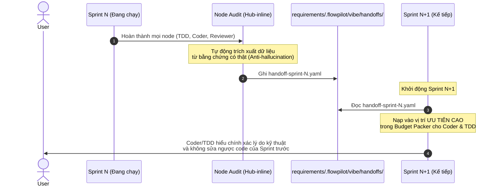
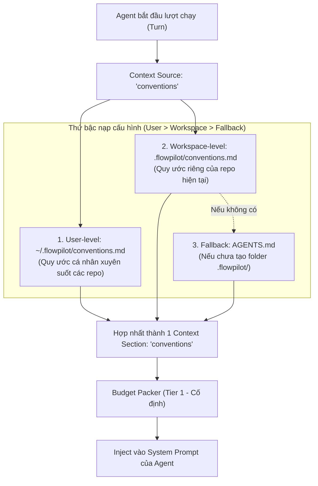

# CP-62 Note: Giải thích & Q&A Kiến trúc P-6 và P-7

Tài liệu tổng hợp và chuẩn hóa toàn bộ nội dung giải thích, cơ chế kỹ thuật và các câu hỏi đáp kiến trúc chuyên sâu về **Slice P-6** ([Task-342](file:///Users/tiendat/Desktop/flowpilot/flowpilot/requirements/08-Task/todo/Task-342-Sprint-Handoff-Artifact-Schema-And-Chain.md)) và **Slice P-7** ([Task-343](file:///Users/tiendat/Desktop/flowpilot/flowpilot/requirements/08-Task/todo/Task-343-Conventions-Context-Source-Repo-As-Config.md)) của [CP-62: Zcode-Harness-Parity](../todo/CP-62-Zcode-Harness-Parity.md).

---

# Phần 1. P-6: Sprint-Handoff Artifact Schema & Chain

> **Task tham chiếu**: [Task-342: Artifact Sprint-Handoff có Schema và Chuỗi Tiếp nhận giữa các Sprint](../../08-Task/todo/Task-342-Sprint-Handoff-Artifact-Schema-And-Chain.md)

---

### 1. Vấn đề thực tế hiện tại (Tại sao cần P-6?)

Trong **Vibe Mode**, quy trình làm việc được chia thành chuỗi các Sprint liên tiếp (Sprint 1 $\rightarrow$ Sprint 2 $\rightarrow$ Sprint 3...). Mỗi sprint hoàn thành một Task/Slice.

**Thực trạng hiện nay khi chuyển giao giữa các Sprint:**
- Khi Sprint 1 kết thúc và Sprint 2 bắt đầu, Sprint 2 tìm hiểu xem Sprint 1 đã làm gì bằng cách: đọc `chat.summary` (văn xuôi tóm tắt chat) và cố gắng quét lại toàn bộ file trên ổ cứng.
- **Hậu quả lớn nhất: Bị mất ngữ cảnh "TẠI SAO" (The "WHY")**:
  - *Ví dụ ở Sprint 1*: Kỹ sư/Agent đã quyết định *"Dùng giải pháp A thay vì B vì B bị xung đột lock"* hoặc *"Chủ động sửa lại test case X vì Spec đã đổi"*.
  - *Đến Sprint 2*: Agent mới hoàn toàn không biết lý do tại sao Sprint 1 lại làm thế. Nó chỉ thấy code lạ hoặc test bị sửa, nên nó **tự ý sửa ngược lại code của Sprint 1**, gây ra xung đột logic hoặc vòng lặp phá vỡ code nhau.

---

### 2. Giải pháp của P-6: Biên bản bàn giao ca trực (`sprint_handoff.v1`)

> **Ý tưởng**: Giống như bác sĩ hay kỹ sư trực ca bàn giao công việc cho ca sau bằng một **biên bản có biểu mẫu chuẩn**.
> Cuối mỗi Sprint, runner tự động xuất một file YAML có cấu trúc máy đọc được lưu tại:  
> `requirements/.flowpilot/vibe/handoffs/handoff-sprint-{n}.yaml`

#### Cấu trúc chuẩn của biên bản bàn giao:
```yaml
sprint: 3
task: requirements/08-Task/todo/Task-340-Per-Node-Read-Only-Enforcement.md
done:
  - "Tích hợp isReadOnlyCommand vào chat_posture_policy"
  - "Reviewer tự động silent-deny các lệnh rm, redirect"
decisions:
  - what: "Cho phép Reviewer giữ lệnh Bash thay vì tước bỏ hoàn toàn"
    why: "Q-3 chốt: Reviewer cần chạy git diff và go vet để kiểm tra bằng chứng"
    alternatives: ["Cấm hẳn Bash", "Chỉ cho dùng Read/Grep tool"]
open:
  - "Cần bổ sung thêm regex cho các lệnh tee nguy hiểm ở sprint sau"
risks:
  - "Hiệu năng phân loại lệnh Bash khi chuỗi pipe quá dài"
weakened_tests: [] # Rỗng nếu không có test nào bị sửa/suy yếu
```

---

### 3. Cơ chế hoạt động của P-6 (Chuỗi tiếp nhận - Chaining)



---

### 4. Bốn nguyên tắc kỹ thuật cốt lõi của P-6

1. **Chỉ Node `audit` (Code của Runner) được ghi - Coder AI không được ghi**:
   - Node `coder` (AI viết code) **không được quyền tự viết file handoff**.
   - Runner sẽ tự động tổng hợp khi sprint kết thúc. Điều này ngăn AI "tự biên tự diễn" hoặc giấu diếm sai sót.
2. **Quy tắc chống bịa đặt (Hard Ceiling Rule từ CP-49)**:
   - Các trường `why` và `decisions` chỉ được trích xuất từ các sự kiện và bằng chứng đã được kiểm chứng (như verdict rows từ P-2, tranh luận owner, quyết định phê duyệt của user). AI không được bịa thêm lý do ngoài luồng.
3. **Ưu tiên nạp cao (High Priority Context)**:
   - Khi Sprint $N+1$ khởi động, Budget Packer sẽ dành riêng một slot ưu tiên cao cho file handoff này, đưa thẳng vào prompt của các node `tdd` và `coder` trước khi nạp các file source code khác.
4. **Fallback an toàn khi thiếu file**:
   - Nếu ai đó chạy một flow đơn lẻ hoặc xóa mất file handoff cũ, Sprint kế tiếp tự động chuyển về cơ chế đọc truyền thống (fallback), ghi log cảnh báo nhẹ, **tuyệt đối không crash hoặc chặn luồng**.

---

### 5. So sánh Trước và Sau khi có P-6

| Đặc điểm | Trước P-6 | Sau P-6 |
|---|---|---|
| **Dữ liệu chuyển giao** | Văn xuôi tự do trong `chat.summary` (dễ tam sao thất bản) | File YAML chuẩn `sprint_handoff.v1` có schema rõ ràng |
| **Lý do quyết định ("Why")** | Bị biến mất sau khi đóng phiên chat | Được lưu vết vĩnh viễn trong thư mục `handoffs/` |
| **Xung đột giữa các Sprint** | Sprint sau hay sửa ngược code hoặc test của Sprint trước | Sprint sau hiểu nguyên nhân và tiếp nối chính xác hướng đi |
| **Tính máy đọc (Machine-readable)** | Khó cho các công cụ tự động phân tích | Các sub-agent hoặc CI/CD có thể parse trực tiếp file YAML |

---

### 6. Q&A Chuyên sâu về Kiến trúc P-6

#### Q1: Làm sao có thể ghi file này nếu không nhờ AI giúp?
*(Nếu AI không viết, thì ai nghĩ ra nội dung `why`, `decisions`, `alternatives`, `done` để điền vào file YAML?)*

👉 **Bản chất là phân định giữa "Ai sinh ra quyết định" và "Ai là người lắp ráp ghi file":**

1. **AI và User ĐÃ sinh ra các quyết định trong suốt Sprint (thông qua Tool Calls có schema):**
   Trong suốt quá trình Sprint 1 chạy:
   - **Node Reviewer (P-2)**: Đã gọi tool `submit_review_outcome` với từng row cụ thể: `{ac_id: "AC-1", verdict: "pass", evidence: [...]}`.
   - **Vòng tranh luận Owner Debate (P-1)** hoặc **User Card (P-3)**: Khi phát sinh xung đột kiến trúc, tool `request_user_decision` đã ghi lại lựa chọn có cấu trúc:
     ```json
     {
       "question": "Chọn SQLite hay PostgreSQL?",
       "chosen_option": "SQLite",
       "why": "Cần embedded binary nhẹ theo yêu cầu kiến trúc",
       "alternatives": ["PostgreSQL", "DuckDB"]
     }
     ```
   - **Oracle / Regression Guard**: Bắt được chính xác test nào bị thay đổi (`weakened_tests`).

2. **Runner (Code Go của Node `audit`) chỉ làm nhiệm vụ Lắp Ráp Xác Định (Deterministic Aggregator):**
   - Khi nói *"không nhờ AI giúp ở node audit"*, ý nói là: **Runner không gọi một prompt LLM tự do** kiểu *"Này AI, hãy viết một bài văn tóm tắt lại sprint vừa rồi đi"*. Bởi vì nếu làm vậy, LLM sẽ bị ảo giác (hallucination), thêm thắt những lý do không có thật.
   - Thay vào đó, hàm Go `EmitSprintHandoff(...)` trong `runner` chỉ việc đọc danh sách sự kiện (`TurnEvents` / `sessions.ndjson`) của Sprint vừa chạy, **nhặt các field `chosen_option`, `why`, `verdict_rows` đã được chốt và serialize thẳng thành file YAML**.

> **Tóm lại**: Nội dung quyết định đã do AI và User trả lời qua các tool call trong sprint. Node `audit` của runner chỉ gom lại thành file YAML chuẩn, đảm bảo **100% dữ liệu có thật (Anti-hallucination - Hard Ceiling Rule)**.

---

#### Q2: Thực tế codebase hiện tại, `context.produce` step cũng có cung cấp thông tin WHY? rồi tại sao reject, chọn cái gì... rồi mà?

Đúng là hiện tại `context.produce` (trong `behavior_registry_builtin.go:93` và `flow_context_handoff.go`) đã nạp ngữ cảnh vào prompt qua các source: `feature.history`, `chat.summary`, `change.contract`. 

Tuy nhiên, giữa các **Sprint trong Vibe Mode**, cơ chế này gặp **3 lỗ hổng chí mạng** mà P-6 giải quyết:

1. **`chat.summary` là văn xuôi và dễ bị Budget Packer CẮT TỈA khi hết token**:
   - `chat.summary` là một đoạn text dài tóm tắt hội thoại. 
   - Trong Budget Packer (CP-23), `chat.summary` có độ ưu tiên thấp (`Tier 2/3`). Khi code hoặc log kiểm thử dài ra, Budget Packer sẽ **cắt cụt (truncate)** đoạn chat summary này. 
   - Hậu quả: Sang Sprint 2, model không còn thấy đoạn tóm tắt giải thích tại sao Sprint 1 lại reject giải pháp kia.
   - **P-6**: `sprint_handoff.v1` là artifact chuyên dụng, được cấp một **slot ưu tiên cao (High Priority)**, không bị cắt tỉa.

2. **`feature.history` chỉ lưu ở tầm VĨ MÔ (Macro), không lưu lý do VI MÔ (Micro Trade-offs)**:
   - `feature.history` đọc từ `feature_history.ndjson` (dựa trên commit message hoặc Change Audit note).
   - Nó chỉ nói những câu vĩ mô như: *"Task-320: Implement JWT Auth"*. 
   - Nó **hoàn toàn không ghi lại**:
     - *"Đã thử dùng thư viện golang-jwt v5 nhưng bị dính deadlock với sync.RWMutex nên phải chuyển sang token tĩnh."*
     - Những quyết định trong các vòng tranh luận ngầm giữa các Agent (Owner Debate) không bao giờ lọt vào `feature.history`.
     - Kết quả: Sang Sprint 2, Coder thấy code không dùng golang-jwt v5, nó tưởng Sprint 1 quên, thế là nó... viết lại thư viện đó vào và dính đúng cái deadlock cũ!

3. **Không có cơ chế ràng buộc máy đọc được (Machine-readable Contract) cho `weakened_tests`**:
   - Nếu Sprint 1 chủ động sửa đổi một bài test cũ vì spec thay đổi: Trong `context.produce` hiện tại, nó chỉ là một dòng diff trôi nổi.
   - Với P-6, trường `weakened_tests: [{path, line, justification}]` là một hợp đồng tường minh. Khi Sprint 2 đọc vào, nó biết ngay bài test đó đã được phép sửa, không kích hoạt cảnh báo sai (false alarm) về regression.

---

#### Q3: Flow Mode (như `task-harness`, `bug-harness`) thì sao? Nếu tháng trước tôi code Feature A đã reject gì đó thì nó có đọc lại được không?

👉 **Flow Mode ĐÃ ĐỌC ĐƯỢC và KHÔNG bị mất ngữ cảnh này**, nhờ chính hai cơ chế cốt lõi đã hoàn thành trước đây:

1. **CP-43 (`Canonical Head` & Tri thức phủ định - Negative Knowledge)**:
   - Lưu tri thức phủ định (Decisions / Rejected alternatives) vào `pending_canonical.ndjson` và sau đó finalize vào `.flowpilot/canonical/<feature_key>.json`.
   - Nạp vào qua context source `canonical.head`.
2. **CP-54 (Locus-Anchored Context Relevance)**:
   - Lưu lịch sử commit / change audit vào `.flowpilot/ledger/feature_history.ndjson`.
   - Dùng `buildRetrievalLocus` để chấm điểm và nạp đúng lịch sử liên quan nhất vào `feature.history`.

**Chu kỳ làm việc (Lifecycle) giải thích sự khác biệt giữa Flow Mode và Vibe Mode:**

```text
[FLOW MODE: task-harness / bug-harness]
(Một Task hoàn chỉnh từ đầu đến cuối)
Plan ──► Code ──► Validate ──► Review ──► Audit ──► [TERMINAL DONE] 
                                                         │
                                               Ghi đĩa vĩnh viễn:
                                               - canonical/<feature>.json (CP-43)
                                               - feature_history.ndjson (CP-54)
                                               ==> Dùng cho VÀI THÁNG SAU

───────────────────────────────────────────────────────────────────────────

[VIBE MODE: vibe-sprint]
(Chia 1 bài toán lớn thành chuỗi các Sprint nối tiếp nhau: Sprint 1 ──► Sprint 2 ──► Sprint 3)
[Sprint 1: TDD + Scaffolding] ────► [Sprint 2: Core Logic] ────► [Sprint 3: Edge Cases]
            │                                    │
    Chưa DONE terminal!                  Chưa DONE terminal!
    (Canonical Head CHƯA finalize)       (Canonical Head CHƯA finalize)
            │                                    ▲
            └────────── P-6 Handoff ─────────────┘
                  (Biên bản giao ca giữa chừng)
```

Giữa các Sprint liên tiếp của Vibe Mode, cơ chế CP-43 / CP-54 **chưa thể phát huy tác dụng** vì 2 lý do:
1. **Canonical Head chỉ được finalize khi kết thúc toàn bộ luồng (`terminal done`)**: Khi Sprint 1 xong, task lớn vẫn chưa xong (mới chỉ qua giai đoạn 1). `CanonicalHead` vẫn chỉ nằm ở dạng `pending_canonical.ndjson`, chưa được commit thành file chuẩn. Do đó, Sprint 2 khi khởi động chưa có Canonical Head mới của Sprint 1 để đọc.
2. **Thông tin bàn giao ca trực (Short-term Operational State) khác hoàn toàn thông tin kiến trúc vĩ mô**: `CanonicalHead` chỉ lưu kiến trúc vĩ mô (*"Dự án dùng SQLite, reject PostgreSQL"*). Nhưng cái mà Sprint 2 cần ngay lúc đó là bàn giao ca trực: việc đã xong (`done`), việc còn dở (`open`), rủi ro tức thời (`risks`), và bài test bị sửa tạm thời (`weakened_tests`).

---

### 7. Tổng kết: Kiến trúc 2 tầng bộ nhớ của FlowPilot

| Tầng bộ nhớ | Phục vụ cho | Slice / CP | Nơi lưu trữ | Nội dung chính |
|---|---|---|---|---|
| **Bộ nhớ Dài hạn** *(Long-term Knowledge)* | **Flow Mode** & các task cách nhau nhiều tuần/tháng | **CP-43** & **CP-54** | `.flowpilot/canonical/*.json` & `feature_history.ndjson` | Kiến trúc feature, các phương án phủ định đã reject vĩnh viễn, lịch sử commit vĩ mô |
| **Bộ nhớ Ngắn hạn** *(Inter-sprint Handoff)* | **Vibe Mode** giữa các Sprint $N \rightarrow N+1$ nối tiếp nhau | **CP-62 P-6** | `.flowpilot/vibe/handoffs/handoff-sprint-{n}.yaml` | Bàn giao ca trực: việc đã xong, việc còn dở dang, cảnh báo rủi ro, và các test bị sửa trong sprint vừa rồi |

---

# Phần 2. P-7: Conventions Context Source (Repo-as-Config)

> **Task tham chiếu**: [Task-343: Context Source Conventions (Repo-as-Config) qua SD-22 Registry](../../08-Task/todo/Task-343-Conventions-Context-Source-Repo-As-Config.md)

---

### 1. Vấn đề thực tế hiện tại (Tại sao phải làm P-7?)

Hiện tại, mỗi dự án/repository có những quy ước riêng:
- **Lệnh test / build**: Go dùng `go test ./...`, Next.js dùng `pnpm test`, Android dùng `./gradlew test`.
- **Quy chuẩn code & naming**: CamelCase hay snake_case, đặt interface ở đâu, mock bằng tool gì.
- **Quy tắc an toàn**: Không được sửa test cũ, commit format theo chuẩn nào.

**Thực trạng hiện nay:**
1. Những quy ước này đang bị **hardcode rải rác** trong prompt template của từng agent, hoặc phải **copy thủ công** vào file System Spec (SS).
2. Khi bạn muốn mang FlowPilot chạy trên một dự án khác (ví dụ: chuyển từ repo Go sang repo TypeScript), bạn buộc phải **fork file Flow YAML** hoặc sửa lại prompt thì agent mới hiểu được quy ước của repo mới.

---

### 2. Ý tưởng cốt lõi: "Repo-as-Config" là gì?

> **Triết lý**: Thay vì FlowPilot "đoán" hoặc bắt người dùng sửa cấu hình FlowPilot cho từng repo, **chính bản thân Repository sẽ tự cấu hình các quy ước cho agent đọc**.

Tương tự như cách git đọc `.gitignore` hay linter đọc `.eslintrc`:
- FlowPilot sẽ tự động tìm và đọc file quy ước nằm ngay trong repo mục tiêu (`.flowpilot/conventions.md` hoặc `AGENTS.md`).
- File Flow YAML (`task-harness.yaml`, `vibe-sprint.yaml`) sẽ giữ **nguyên vẹn 100% giữa mọi dự án**, không bao giờ phải fork hay sửa đổi.

---

### 3. Cơ chế hoạt động của P-7 (How it works)

P-7 bổ sung một **Context Source** mới tên là `conventions` vào hệ thống `local-runner`:



#### 3 điểm kỹ thuật quan trọng của P-7:
1. **Phân tầng ưu tiên (Hierarchy)**:
   - **Cấp 1 (User)**: `~/.flowpilot/conventions.md` (ví dụ: sở thích cá nhân của dev, quy tắc global).
   - **Cấp 2 (Workspace)**: `<repo>/.flowpilot/conventions.md` (quy tắc của team trong dự án).
   - **Fallback**: Nếu chưa có `.flowpilot/conventions.md`, tự động đọc `AGENTS.md` (chính là file quy tắc GitNexus / FlowPilot mà repo hiện tại đang dùng).
2. **Không bao giờ bị cắt tỉa (Tier-1 Non-droppable)**:
   - Trong CP-23, chúng ta đã có **Budget Packer** (nén và cắt bớt context khi prompt vượt quá token cho phép).
   - `conventions` được đánh dấu là **Tier 1 (Mandatory)**: Dù prompt có dài đến đâu, Budget Packer sẽ cắt bớt code cũ, log chat, nhưng **tuyệt đối giữ lại 100% conventions**, vì nếu agent mất conventions thì sẽ viết sai cú pháp, chạy sai lệnh test ngay.
3. **An toàn khi thiếu file (Graceful missing)**:
   - Nếu repo hoàn toàn không có cả 2 file trên, context source trả về rỗng một cách êm đẹp, không báo lỗi, không làm dừng workflow.

---

### 4. So sánh Lợi ích trước & sau P-7

| Tiêu chí | Trước P-7 | Sau P-7 |
|---|---|---|
| **Chạy đa dự án** | Phải sửa Flow YAML hoặc prompt riêng cho từng repo | Cùng 1 bộ Flow YAML chạy cho Go, Java, TypeScript, Python |
| **Bảo trì quy ước** | Sửa rải rác ở nhiều chỗ trong docs/prompts | Chỉ cần sửa 1 file `.flowpilot/conventions.md` hoặc `AGENTS.md` |
| **Token Budget** | Quy ước có nguy cơ bị cắt khi prompt quá dài | Luôn được bảo vệ cố định ở Tier 1 |
| **Độ minh bạch** | Không đo được quy ước tốn bao nhiêu token | Được ghi nhận rõ ràng qua `prompt_context_audit` |

Tóm lại: **P-7 biến quy ước của repo thành một nguồn ngữ cảnh tự động, có phân cấp và không thể bị cắt tỉa, giúp FlowPilot trở nên thực sự portable giữa mọi dự án.**
