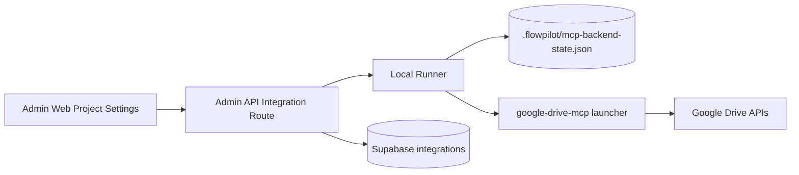

# CP-05-03: Google Drive MCP Implementation Plan

## Status

Priority planning.

## Depends On

- [CP-27: Google Cloud Setting](../todo/CP-27-Google-Cloud-Setting.md)
- [SD-11: MCP Connection Flows](../../06-System-Tech-Design/SD-11-MCP-Connection-Flows.md)

CP-27 owns the shared Google Cloud, OAuth, API key, and user consent model. This plan only covers how to implement and validate the Google Drive MCP feature using that setup.

---

## 1. Goal

Implement Google Drive MCP as a runner-owned integration that lets FlowPilot use a user's connected Google Drive account as an MCP-backed context/tool source.

The user-facing model:

- user opens project settings
- user adds Google Drive MCP
- local runner verifies the MCP backend
- user completes the MCP package's Google OAuth flow
- FlowPilot marks the integration connected only after verification succeeds

---

## 2. Current State

Current runner already has an allowlisted Google Drive MCP backend spec:

```text
npx -y @piotr-agier/google-drive-mcp --version
npx -y @piotr-agier/google-drive-mcp --help
```

Current design docs say Google Drive MCP is separate from artifact sync.

What is still missing or unclear:

- exact MCP OAuth setup instructions surfaced in FlowPilot UI
- connection verification beyond package launcher availability
- persistent runner state shape for MCP-ready vs OAuth-ready
- UI messaging that references CP-27 setup
- test coverage for success, missing Node, missing MCP credentials, OAuth incomplete, and verification failure

---

## 3. Scope

### In scope

- detect whether Node.js and the Google Drive MCP package can run
- document and validate the MCP package's required Google OAuth credential file
- run the allowlisted MCP install/verify commands from the local runner
- store MCP backend status in local runner state
- mirror visible integration status to Supabase
- expose actionable errors in admin-web
- keep secrets and local credentials inside the runner boundary

### Out of scope

- artifact upload to Google Drive
- Google Picker
- artifact destination folder selection
- direct AI-provider MCP runtime from CP-13
- BYO Google Cloud project UI

---

## 4. Architecture



The runner owns local backend readiness because MCP credentials and launcher state are machine-local.

Supabase owns project-visible integration status, not the Google OAuth token.

---

## 5. Google Cloud Dependency

Before implementing or testing this plan, complete CP-27.

MCP needs:

- one Google Cloud project
- OAuth consent screen
- Drive, Docs, Sheets, Slides, and Calendar APIs enabled
- Desktop app OAuth client
- `gcp-oauth.keys.json` available to the local runner or MCP process

MCP usually does not need:

- `GOOGLE_PICKER_API_KEY`
- Google Picker setup

Important distinction:

- CP-27 Google Cloud project is the app registration.
- The user still signs in with their own Google account.
- MCP access is scoped to the user's Drive authorization.

---

## 6. Implementation Plan

### Step 1: Confirm MCP package contract

Use this `@piotr-agier/google-drive-mcp` setup contract:

- required OAuth client type: Desktop app
- required credential file name: `gcp-oauth.keys.json`
- recommended credential path: `~/.config/google-drive-mcp/gcp-oauth.keys.json`
- explicit credential env var: `GOOGLE_DRIVE_OAUTH_CREDENTIALS`
- first-run OAuth command: `npx @piotr-agier/google-drive-mcp auth`
- default token path: `~/.config/google-drive-mcp/tokens.json`
- explicit token env var: `GOOGLE_DRIVE_MCP_TOKEN_PATH`
- required APIs: Drive, Docs, Sheets, Slides, Calendar
- runtime command: `npx @piotr-agier/google-drive-mcp`

Acceptance:

- CP-05-03 documents the exact local file path and command users must run.
- Runner validation has enough information to tell users what is missing.

### Step 2: Harden runner backend detection

Extend the existing Google Drive MCP backend detection to distinguish:

- Node.js missing
- package launcher unavailable
- package installed or runnable
- `gcp-oauth.keys.json` missing
- MCP token file missing
- MCP backend connected and queryable

Acceptance:

- runner status is not just "npx help command succeeded"
- UI can show the difference between install missing and OAuth missing

### Step 3: Define runner state shape

Use local runner state for machine-specific MCP readiness.

Recommended state fields:

```json
{
  "google_drive": {
    "backendStatus": "missing|installed|awaiting_oauth|connected|failed",
    "transport": "launcher",
    "launcher": "npx",
    "credentialPath": "~/.config/google-drive-mcp/gcp-oauth.keys.json",
    "tokenPath": "~/.config/google-drive-mcp/tokens.json",
    "accountEmail": "...",
    "lastVerifiedAt": "...",
    "lastError": "..."
  }
}
```

Acceptance:

- no OAuth token is stored in Supabase
- local status survives runner restart
- stale failures can be retried

### Step 4: Implement connection API behavior

When admin-web calls `POST /integrations/:id/connection`, the runner should:

1. identify provider as `google_drive`
2. validate Google Drive MCP backend spec
3. run install or verify command if needed
4. validate credential prerequisites
5. run the MCP package's OAuth or verification flow
6. return precise connection status

Acceptance:

- success returns `connected`
- missing credential setup returns `awaiting_oauth` or `failed` with actionable detail
- transient command failure returns `failed` with command context

### Step 5: Update admin-web integration UI

Project settings should present Google Drive MCP as a local runner integration.

Required UI states:

- not configured
- checking runner
- Node.js missing
- MCP package missing
- Google OAuth setup needed
- connected
- failed with retry

The UI should reference CP-27 setup concepts in user-facing copy only where necessary:

- "Google Cloud app setup required"
- "Connect your Google Drive account"
- "This uses your Drive account, not the app owner's Drive"

Acceptance:

- users can understand whether the issue is Google Cloud setup, local runner setup, or Google login
- retry does not create duplicate integrations

### Step 6: Verify MCP tool access

Connection should not be marked fully connected until the runner can verify that the MCP backend can access Drive.

Preferred verification:

- run a read-only MCP command or tool listing
- confirm the backend starts
- confirm Google auth is usable

Acceptance:

- a package that is installed but not authorized is not shown as connected
- a revoked Google token moves the integration back to failed or awaiting OAuth

### Step 7: Tests

Add or update tests for:

- Google Drive MCP backend spec includes expected launcher commands
- Node missing or command failure maps to clear status
- missing OAuth credential file maps to setup-needed status
- successful verification maps to connected
- retry updates existing integration status
- Supabase integration row does not store Google OAuth token

---

## 7. Data and Secret Ownership

Supabase may store:

- integration row
- provider type
- visible status
- last error
- last connected timestamp

Runner may store:

- MCP backend local state
- credential file path reference
- account email metadata
- local package readiness

Runner or MCP package may store:

- OAuth tokens

Supabase must not store:

- Google refresh token
- Google access token
- Google client secret unless a future encrypted BYO credential design explicitly adds it

---

## 8. Validation Flow

Manual MVP validation:

1. Complete CP-27 Google Cloud setup for MCP.
2. Start local runner.
3. Start admin-web.
4. Open project settings.
5. Add Google Drive MCP.
6. Confirm runner verifies Node/package readiness.
7. Complete Google OAuth for the MCP package.
8. Retry or refresh connection.
9. Confirm integration is connected.
10. Run one workflow or context retrieval path that uses Google Drive MCP.

Failure validation:

- remove credential file and confirm setup-needed error
- revoke Google access and confirm verification fails
- stop runner and confirm UI shows runner unavailable
- remove Node.js from PATH or mock command failure and confirm clear status

---

## 9. Acceptance Criteria

Google Drive MCP is done when:

- CP-27 setup is enough for a new local install to configure Google Cloud once
- runner can detect Google Drive MCP readiness
- runner can distinguish install failure from OAuth/setup failure
- admin-web shows connection state and retry path
- Supabase integration state mirrors runner result
- Google OAuth tokens stay out of Supabase
- a connected state means the MCP backend can actually access Drive
- automated tests cover success and main failure paths

---

## 10. Open Decisions

- Whether to support one shared FlowPilot OAuth client only, or also BYO Google OAuth client later.
- Whether to wrap `google-drive-mcp` with a FlowPilot-owned config directory for more predictable setup.
- Whether MCP connection can later provide reusable account metadata to artifact sync without sharing tokens.
- Whether direct provider MCP runtime from CP-13 should consume this same runner state.
