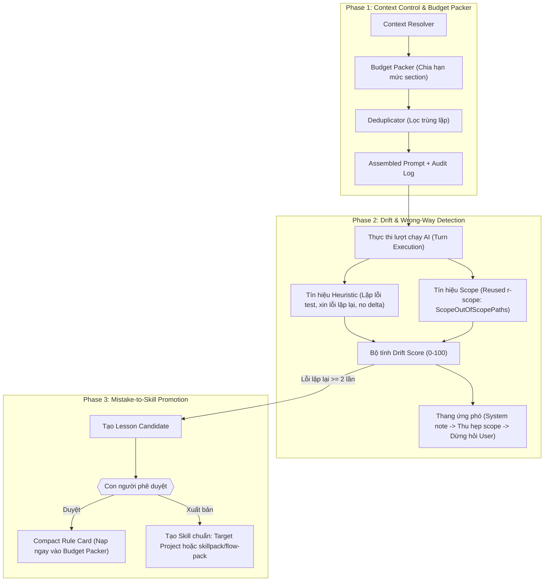

# CP-23: Bộ trí tuệ vận hành tích hợp (Kiểm soát Context, Bắt lệch hướng và Tự học Skill)

## Metadata

- Document ID: `CP-23`
- Title: `Bộ trí tuệ vận hành tích hợp (Kiểm soát Context, Bắt lệch hướng và Tự học Skill)`
- Feature Keys: `runtime-intelligence, context-budget, drift-detector, auto-skill`
- Phase: `coding_plan`
- Status: `approved`
- Owner: `FlowPilot`
- Reviewers: `Operator`
- Created: `2026-07-10`
- Last Updated: `2026-09-11`
- Parent Documents: [SS-09: Context Management](../../05-System-Specs/SS-09-Context-Management.md), [SD-10: Memory and Prompt Architecture](../../06-System-Tech-Design/SD-10-Memory-And-Prompt-Architecture.md)
- Child Documents: [Task-334: Context Resolver và Bộ đóng gói Budget Packer](../../08-Task/todo/Task-334-Context-Resolver-And-Budget-Packer.md), [Task-335: Bộ phát hiện lệch hướng Drift Detector và Thang ứng phó](../../08-Task/todo/Task-335-Drift-Wrong-Way-Detector-And-Correction-Ladder.md), [Task-336: Thăng cấp bài học thành Skill và Đồng bộ Skillpack](../../08-Task/todo/Task-336-Mistake-To-Skill-Promotion-And-Skillpack-Sync.md)
- Related Documents: [SD-20: Flow Gate Rule Semantics](../../06-System-Tech-Design/SD-20-Flow-Gate-Rule-Semantics.md), [CP-60: Vibe Working Mode](../done/CP-60-Vibe-Working-Mode.md)
- Supersedes: `CP-24` (Wrong-Way Detect), `CP-25` (Auto Size-Down Context), `CP-26` (Auto Model Reasoning), `CP-39` (Token Usage)
- Tags: `runtime-intelligence, context-budget, drift-detector, auto-skill, skillpack`

## AI Quick View

### Summary

- Hợp nhất 3 bài toán sống còn trong runtime của AI thành một **kế hoạch trí tuệ vận hành (Runtime Intelligence)** thống nhất thay vì các tính năng phân mảnh rời rạc:
  - **Phase 1: Auto Size-Down Context (Budget Packer)**: Đặt hạn mức token cố định theo từng section, ưu tiên tóm tắt (`artifact_memories`) thay vì chèn mã nguồn thô, lọc trùng lặp và lưu vết audit prompt.
  - **Phase 2: Drift & Wrong-Way Detection**: Phát hiện agent sa vào vòng lặp xin lỗi vô nghĩa, lặp lại lỗi test fail $\ge 2$ lần, không sinh delta code, hoặc sửa file ngoài scope. **Tái sử dụng 100% tín hiệu từ `r-scope` và contract gate hiện có** làm đầu vào tính điểm `drift_score`, sau đó kích hoạt nấc thang ứng phó (Correction Ladder).
  - **Phase 3: Mistake-to-Skill Promotion**: Tự động chuyển các lỗi lặp đi lặp lại thành thẻ bài học (Lesson Candidate), và khi có người duyệt sẽ đúc kết thành **Skill mới**. Phân biệt rõ giữa lưu cục bộ vào `.agents/skills/` của target project và đóng góp ngược lại vào `internal/skillpack/flow-pack/<group>/` của FlowPilot.

### Current Ask

- Thực thi trọn vẹn 3 Phase thông qua 3 task chuyên biệt: `Task-334` (Phase 1), `Task-335` (Phase 2), và `Task-336` (Phase 3).

### Key Decisions

- `D-1` **Nguyên tắc phân tầng phụ thuộc**: Bắt buộc làm Phase 1 (Size-down context) trước Phase 2 (Drift detect) và Phase 3 (Auto-skill). Nếu prompt quá dài và nhiễu loạn, việc phát hiện sai hướng sẽ thiếu chính xác; và nếu không phân biệt được lỗi hệ thống với lỗi ngẫu nhiên thì việc tự sinh skill sẽ tạo ra rác tri thức.
- `D-2` **Tái sử dụng các Gate hiện có cho Phase 2**: Không viết lại logic kiểm tra diff hay scope. Phase 2 chỉ đóng vai trò là một **Telemetry Aggregator**: Thu nạp trực tiếp tín hiệu vi phạm từ `r-scope` (`ScopeOutOfScopePaths`) để cộng điểm vào `drift_score`.
- `D-3` **Cơ chế phát hiện 2 tầng (2-Tier Detector)**: Tầng 1 hoàn toàn bằng quy tắc xác định (0 token cost). Chỉ khi tầng 1 cảnh báo mới gọi classifier siêu nhẹ ở Tầng 2 để đánh giá.
- `D-4` **Thang thăng cấp bài học (Promotion Ladder)**: Không bao giờ tự động tạo file `.md` vĩnh viễn từ một lỗi đơn lẻ. Lỗi $\rightarrow$ Event $\rightarrow$ Candidate $\rightarrow$ Compact Rule Card $\rightarrow$ Project/Core Skill (sau khi con người duyệt).
- `D-5` **Tương thích hoàn toàn với kiến trúc `skillpack`**: Tích hợp trực tiếp vào hệ thống phân nhóm nền tảng hiện có (`common/`, `android/`, `golang/`, `kmm/`, `reactjs/`,...) và cơ chế cài đặt `install.go` khi khởi tạo dự án.

### Constraints

- Luôn ưu tiên tóm tắt hơn là nhồi toàn bộ lịch sử thô vào prompt.
- Tuyệt đối không auto-rollback thô bạo khi phát hiện drift; chỉ dùng thang ứng phó (nhắc nhở $\rightarrow$ thu hẹp ngữ cảnh $\rightarrow$ dừng hỏi người dùng).
- Mọi quyết định cắt giảm context và ứng phó drift đều phải được ghi log phục vụ kiểm toán (`prompt_context_audit`).

### Open Questions

- Đã giải quyết: Phase 2 tái sử dụng 100% tín hiệu từ `r-scope`, không viết lại logic kiểm tra.
- Đã giải quyết: Skill mới phải tương thích với kiến trúc phân nhóm skillpack hiện có.
- Đã giải quyết: Quá trình copy skill vào target project khi init được xử lý bởi `install.go`.

---

## 1. Kiến trúc tổng thể 3 Phase

---

## 2. Chi tiết từng giai đoạn

### Phase 1: Auto Size-Down Context & Budget Packer (Task-334)
- **Mục tiêu**: Làm cho prompt gửi tới AI nhỏ gọn nhất có thể mà vẫn bảo đảm đầy đủ ngữ cảnh cần thiết, tiết kiệm token tối đa.
- **Thứ tự ưu tiên phân bổ ngân sách (Token Budget Allocation)**:
  1. Hợp đồng hệ sinh thái và chỉ dẫn thực thi cốt lõi (Cố định).
  2. Yêu cầu của task hiện tại / prompt của người dùng (Ưu tiên cao nhất).
  3. Ngữ cảnh luồng bắt buộc (Canonical Head, Change Contract).
  4. Bộ nhớ làm việc dạng tóm tắt (`artifact_memories` - thay vì chèn raw file).
  5. Đoạn trích dẫn mã nguồn thô (Raw excerpts - chỉ chèn khi tóm tắt không đủ).
  6. Compact Skill Cards (thay vì chèn cả file markdown dài).
- **Lưu vết kiểm toán**: Tạo bản ghi `prompt_context_audit` ghi rõ: context nào được chọn, context nào bị drop, lý do drop và số token tiêu thụ.

### Phase 2: Drift & Wrong-Way Detection (Task-335)
- **Mục tiêu**: Phát hiện sớm khi AI có dấu hiệu đi chệch hướng, sa lầy vào vòng lặp hoặc tiêu tốn token vô ích.
- **Tập tín hiệu Drift Heuristics (Tầng 1 - 0 token)**:
  - Cụm từ xin lỗi lặp lại ("Tôi rất xin lỗi...", "Bạn hoàn toàn đúng...").
  - Chạy đi chạy lại cùng một test fail mà không đổi chiến thuật $\ge 2$ lần.
  - Tiêu tốn nhiều token nhưng không tạo ra bất kỳ delta thay đổi nào trên file code/artifact.
  - Sửa file ngoài phạm vi declared scope (Tái sử dụng trực tiếp tín hiệu `ScopeOutOfScopePaths` của cổng `r-scope`).
- **Thang điểm `drift_score`**:
  - `0 - 29`: Bình thường / Khỏe mạnh.
  - `30 - 59`: Cảnh báo nhẹ $\rightarrow$ Bơm system note nhắc nhở đổi chiến lược.
  - `60 - 79`: Lệch hướng $\rightarrow$ Tự động thu hẹp context pack cho lượt tiếp theo.
  - `80+`: Nghiêm trọng $\rightarrow$ Tạm dừng và yêu cầu con người can thiệp (Pause for human approval).

### Phase 3: Mistake-to-Skill Promotion & Skillpack Sync (Task-336)
- **Mục tiêu**: Đúc kết các sai lầm lặp lại thành tri thức kỹ thuật có thể tái sử dụng cho các phiên làm việc sau.
- **Thang thăng cấp (Promotion Ladder)**:
  - Sự cố đơn lẻ $\rightarrow$ Lưu `workflow_drift_events`.
  - Sự cố lặp lại $\ge 2$ lần $\rightarrow$ Tạo `workflow_lesson_candidates` (chứa trigger pattern, anti-pattern, và hành vi chuẩn).
  - Khi được người dùng duyệt $\rightarrow$ Sinh ra **Compact Rule Card** để Budget Packer tự động kích hoạt khi gặp ngữ cảnh tương tự.
- **Đồng bộ vào Skillpack**:
  - **Cấp độ Dự án (Project-level)**: Ghi trực tiếp vào thư mục `.agents/skills/<group>/<skill-name>/SKILL.md` của target project.
  - **Cấp độ Nền tảng (Platform Core)**: Tùy chọn xuất vào `apps/local-runner/internal/skillpack/flow-pack/<group>/` để mọi project mới sau này khi chạy `skillpack.Install` đều được trang bị.

---

## 3. Phân chia công việc (Work Breakdown & Task Mapping)

- `Task-334` (Triển khai Phase 1):
  - Xây dựng `ContextResolver` và `BudgetPacker` trong `internal/prompt/`.
  - Hỗ trợ Compact Skill Card và cơ chế deduplicate context.
  - Ghi log `prompt_context_audit`.
- `Task-335` (Triển khai Phase 2):
  - Xây dựng bộ tổng hợp telemetry `DriftDetector` trong `internal/runner/`.
  - Đọc tín hiệu `r-scope` và test failure history để tính `drift_score`.
  - Kích hoạt nấc thang ứng phó (Correction Ladder).
- `Task-336` (Triển khai Phase 3):
  - Quản lý `workflow_lesson_candidates`.
  - Giao diện xem xét và phê duyệt bài học thành Skill trên TUI/Desktop.
  - Kết nối lưu trữ vào `.agents/skills/` và bộ nguồn `internal/skillpack/flow-pack/`.

---

## 4. Các vùng bị ảnh hưởng (Touched Areas)

- `apps/local-runner/internal/promptpacker/` (Mới: Package đóng gói prompt thông minh — Phase 1).
- `apps/local-runner/internal/driftdetect/` (Mới: Package phát hiện lệch hướng — Phase 2).
- `apps/local-runner/internal/skilllearn/` (Mới: Package tự học skill — Phase 3).
- `apps/local-runner/internal/runner/interactive_service.go` (Tích hợp Budget Packer trước khi gọi model).
- `apps/local-runner/internal/runner/gate_hook.go` (Ghi nhận drift event sau mỗi turn).
- `apps/local-runner/internal/skillpack/install.go` (Hỗ trợ xuất bản skill mới).

---

## 5. Dữ liệu và Di chuyển

- Không có schema migration.
- Drift events và Lesson candidates lưu trữ dạng JSON trong workspace (`workflow_drift_events.json`, `workflow_lesson_candidates.json`).

---

## 6. Kế hoạch kiểm thử và nghiệm thu

- **Unit tests**: Mỗi Phase có bộ test riêng trong package tương ứng.
- **Tích hợp**: Chạy chuỗi task dài trong Vibe Mode, xác nhận Budget Packer giữ prompt dưới ngưỡng, Drift Detector cảnh báo đúng khi lặp lỗi, Skill Promotion tạo candidate khi lỗi lặp.
- **Regression**: Đảm bảo prompt mới vẫn sinh kết quả tương đương với prompt cũ trên các flow hiện có.

---

## 7. Triển khai và Dự phòng

- **Thứ tự triển khai bắt buộc**: Phase 1 → Phase 2 → Phase 3 (theo nguyên tắc phân tầng phụ thuộc D-1).
- **Dự phòng**: Mỗi Phase có thể tắt độc lập qua config flag (`enable_budget_packer`, `enable_drift_detector`, `enable_skill_learner`).

---

## 8. Rủi ro

- `R-1` **Budget Packer cắt quá mạnh**: Prompt quá ngắn dẫn đến AI thiếu context và sinh code sai. Giảm thiểu: Luôn giữ nguyên System Contract và Current Task (ưu tiên 1-2), chỉ cắt Raw Excerpts và Compact Skills.
- `R-2` **Drift Detector false positive**: Một số turn AI tốn token để suy nghĩ (reasoning) mà không tạo delta file cũng bị gắn cờ drift. Giảm thiểu: Chỉ cộng điểm `zero_delta` khi token > ngưỡng tối thiểu (ví dụ > 2000 tokens).
- `R-3` **Skill rác từ lỗi ngẫu nhiên**: Lỗi xảy ra 2 lần do trùng hợp ngẫu nhiên có thể sinh candidate vô nghĩa. Giảm thiểu: Con người luôn là người duyệt cuối cùng (D-4).

---

## 9. Tiêu chí hoàn thành tổng thể

- [ ] Phase 1: Prompt đầu ra luôn nằm trong ngân sách token quy định.
- [ ] Phase 2: Drift score phát hiện chính xác ≥ 3 loại tín hiệu lệch hướng.
- [ ] Phase 3: Lesson Candidate sinh ra sau 2+ lỗi cùng pattern.
- [ ] Phase 3: Skill xuất bản thành công vào cả target project và core skillpack.
- [ ] Tất cả unit tests của 3 package mới pass.
- [ ] Không làm gãy các flow và gate hiện có.
