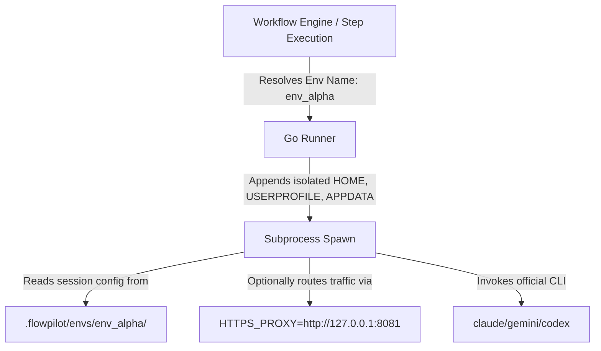

# Coding Plan 26: Environment-Based Account Rotation System ("Virtual PC Proxy")

## Context

FlowPilot executes AI provider CLI tools (such as Claude Code, Codex CLI, and Gemini CLI) as subprocesses. By default, these CLI tools store their authentication state (session tokens, cookies, active log-ins) in the host user's shared home directory (e.g., `~/.config/claude-code/` or `%APPDATA%\claude-code\`).

If a developer wants to use multiple distinct accounts (e.g., two different Claude Pro or ChatGPT accounts) on the same machine to increase throughput or rotate between account rate limits, they cannot easily switch. Simply rotating raw API requests via conventional proxy routers (like `9router`) can violate terms of service and trigger automated abuse-detection bans because it strips client telemetry and mixes session metadata.

### The Virtual PC Proxy Pattern

To solve this, we create isolated runtime "environments" on the same physical PC. Each environment behaves like a completely independent virtual PC:
1. It has its own dedicated directories on the local disk mimicking a fresh user home directory.
2. It isolates and persists the login credentials for that specific account.
3. It can be bound to its own local network interface/proxy (e.g., a specific VPN interface or proxy server) to ensure IP-address separation.
4. The workflow orchestrator can dynamically route step executions to different environments to rotate accounts natively and safely.

### Comparison: API Proxy (e.g., 9Router) vs. FlowPilot Environment Isolation

| Aspect | API Proxy (e.g., 9Router) | FlowPilot Environment Isolation ("Virtual PC") |
|---|---|---|
| **Mechanism** | Operates at the **API protocol layer** as a local HTTP proxy server (`localhost:20128/v1`). Swaps API Keys on outgoing HTTP header payloads. | Operates at the **OS process/file layer** by overriding environment variables (`HOME`, `USERPROFILE`, `APPDATA`) for native CLI child processes. |
| **Authentication Type** | Designed for raw **API Keys** (`sk-...`). Swaps keys dynamically for editors calling OpenAI-compatible backends. | Designed for official **CLI Agents** (e.g., Claude Code, Google Gemini CLI, Codex) that rely on interactive OAuth, session cookies, and local filesystem configurations. |
| **WAF / Ban Risk** | **High** for web session cookies. Multiplexing multiple accounts' cookies from the same machine IP, TCP socket, and JA3 TLS fingerprint is easily detected by Cloudflare and flagged as scraping/bot activity. | **Low / Compliant**. The actual native client software is run unmodified. The session token storage is isolated on disk. Traffic can be individually proxy-routed (`HTTPS_PROXY`) per environment to separate IPs. |
| **Integrity** | Operates as a local Man-in-the-Middle (MITM) proxy to intercept and route requests. | Preserves native end-to-end security configurations since the execution engine spawns the official binaries directly. |

---

## Technical Design



### 1. File Path redirection
To simulate separate PCs, we override the following environment variables when spawning the provider CLI command:
- **POSIX (macOS/Linux/WSL)**:
  - `HOME` → `<workspace>/.flowpilot/envs/<env_name>`
  - `XDG_CONFIG_HOME` → `<workspace>/.flowpilot/envs/<env_name>/.config`
- **Windows**:
  - `USERPROFILE` → `<workspace>\.flowpilot\envs\<env_name>`
  - `APPDATA` → `<workspace>\.flowpilot\envs\<env_name>\AppData\Roaming`
  - `LOCALAPPDATA` → `<workspace>\.flowpilot\envs\<env_name>\AppData\Local`
  - `HOME` → `<workspace>\.flowpilot\envs\<env_name>`
  - `HOMEDRIVE` → Drive letter (e.g., `C:`)
  - `HOMEPATH` → Folder path without drive (e.g., `\.flowpilot\envs\<env_name>`)

### 2. Database Schema changes
To allow users to define and manage these environments, we introduce a new table in Supabase:

```sql
CREATE TABLE IF NOT EXISTS local_environments (
    id UUID PRIMARY KEY DEFAULT gen_random_uuid(),
    project_id UUID REFERENCES projects(id) ON DELETE CASCADE,
    name VARCHAR(255) NOT NULL,
    description TEXT,
    proxy_url VARCHAR(500), -- e.g. http://127.0.0.1:8080 or socks5://...
    extra_env JSONB DEFAULT '{}'::jsonb, -- e.g. {"ANTHROPIC_API_KEY": "sk-...", "HTTP_PROXY": "..."}
    created_at TIMESTAMP WITH TIME ZONE DEFAULT timezone('utc'::text, now()) NOT NULL,
    updated_at TIMESTAMP WITH TIME ZONE DEFAULT timezone('utc'::text, now()) NOT NULL,
    UNIQUE(project_id, name)
);

-- Open RLS policies for admin role
ALTER TABLE local_environments ENABLE ROW LEVEL SECURITY;
CREATE POLICY "Allow admin all on local_environments" ON local_environments 
    FOR ALL TO authenticated USING (true) WITH CHECK (true);
```

We also modify the `workflow_runs` and `workflow_run_steps` (or step executions) to store which environment was selected:
```sql
ALTER TABLE workflow_runs ADD COLUMN IF NOT EXISTS environment_name VARCHAR(255);
ALTER TABLE workflow_steps ADD COLUMN IF NOT EXISTS environment_override VARCHAR(255);
```

---

## Implementation Plan

### Phase 1: Go Runner Environment Redirection Engine

#### Modified file: `apps/local-runner/internal/runner/runner.go`
Create a helper function to resolve environment variables based on the requested environment name:

```go
func (r *Runner) getEnvForExecution(envName string, customEnv map[string]string, proxyURL string) []string {
	baseEnv := os.Environ()
	if envName == "" {
		return baseEnv
	}

	// Define virtual home directory path
	envDir := filepath.Join(r.workspace, ".flowpilot", "envs", envName)
	_ = os.MkdirAll(filepath.Join(envDir, "AppData", "Roaming"), 0755)
	_ = os.MkdirAll(filepath.Join(envDir, "AppData", "Local"), 0755)
	_ = os.MkdirAll(filepath.Join(envDir, ".config"), 0755)

	var newEnv []string
	
	// Filter out standard home directory variables from parent environment
	for _, envVar := range baseEnv {
		parts := strings.SplitN(envVar, "=", 2)
		if len(parts) == 0 {
			continue
		}
		key := parts[0]
		if key == "HOME" || key == "USERPROFILE" || key == "APPDATA" || key == "LOCALAPPDATA" || key == "HOMEPATH" || key == "HOMEDRIVE" || key == "HTTP_PROXY" || key == "HTTPS_PROXY" {
			continue
		}
		// Also filter out any custom keys overridden in customEnv
		if _, exists := customEnv[key]; exists {
			continue
		}
		newEnv = append(newEnv, envVar)
	}

	// Apply redirection paths
	newEnv = append(newEnv, fmt.Sprintf("HOME=%s", envDir))
	newEnv = append(newEnv, fmt.Sprintf("XDG_CONFIG_HOME=%s/.config", envDir))

	if runtime.GOOS == "windows" {
		newEnv = append(newEnv, fmt.Sprintf("USERPROFILE=%s", envDir))
		newEnv = append(newEnv, fmt.Sprintf("APPDATA=%s\\AppData\\Roaming", envDir))
		newEnv = append(newEnv, fmt.Sprintf("LOCALAPPDATA=%s\\AppData\\Local", envDir))
		
		// HOMEDRIVE and HOMEPATH
		drive := "C:"
		path := strings.TrimPrefix(envDir, "C:")
		if strings.Contains(envDir, ":") {
			parts := strings.SplitN(envDir, ":", 2)
			drive = parts[0] + ":"
			path = parts[1]
		}
		newEnv = append(newEnv, fmt.Sprintf("HOMEDRIVE=%s", drive))
		newEnv = append(newEnv, fmt.Sprintf("HOMEPATH=%s", path))
	}

	// Apply proxy settings if defined
	if strings.TrimSpace(proxyURL) != "" {
		newEnv = append(newEnv, fmt.Sprintf("HTTP_PROXY=%s", proxyURL))
		newEnv = append(newEnv, fmt.Sprintf("HTTPS_PROXY=%s", proxyURL))
	}

	// Inject extra custom environment variables (e.g. API keys)
	for k, v := range customEnv {
		newEnv = append(newEnv, fmt.Sprintf("%s=%s", k, v))
	}

	return newEnv
}
```

#### Modified file: `apps/local-runner/internal/runner/types.go`
Update `PromptExecutionRequest` and `AiSessionStartRequest` to receive the environment parameters:
```go
type PromptExecutionRequest struct {
    // ... existing fields
    EnvironmentName string            `json:"environmentName,omitempty"`
    ProxyURL        string            `json:"proxyUrl,omitempty"`
    CustomEnv       map[string]string `json:"customEnv,omitempty"`
}

type AiSessionStartRequest struct {
    // ... existing fields
    EnvironmentName string            `json:"environmentName,omitempty"`
    ProxyURL        string            `json:"proxyUrl,omitempty"`
    CustomEnv       map[string]string `json:"customEnv,omitempty"`
}
```

#### Modified file: `apps/local-runner/internal/runner/runner.go` L789
Apply environment settings during prompt execution:
```go
	cmd := exec.CommandContext(execCtx, binary, args...)
	cmd.Env = r.getEnvForExecution(request.EnvironmentName, request.CustomEnv, request.ProxyURL)
```

#### Modified file: `apps/local-runner/internal/runner/sessions.go` L305
Apply environment settings during long-lived session starting:
```go
	cmd := commandContextFn(ctx, binaryPath, args...)
	cmd.Env = r.getEnvForExecution(req.EnvironmentName, req.CustomEnv, req.ProxyURL)
```

---

### Phase 2: CLI Authentication Support

Because each environment is isolated, developers need a way to run authentication triggers (like `claude login`, `gemini login`, `codex auth`) inside the specific environment context.

#### Modified file: `apps/local-runner/internal/runner/runner.go`
Add a command invocation helper that launches the interactive login prompt in a separate terminal:

```go
func (r *Runner) StartInteractiveAuth(ctx context.Context, envName string, providerKey string) error {
	spec, ok := lookupProviderSpec(providerKey)
	if !ok {
		return fmt.Errorf("unsupported provider %q", providerKey)
	}

	binaryPath, err := lookPathFn(spec.BinaryName)
	if err != nil {
		return fmt.Errorf("provider binary %q not found: %w", spec.BinaryName, err)
	}

	var authCommand string
	switch strings.ToLower(providerKey) {
	case "claude":
		authCommand = fmt.Sprintf("%s login", binaryPath)
	case "codex":
		authCommand = fmt.Sprintf("%s auth", binaryPath)
	case "gemini":
		authCommand = binaryPath // gemini prompts auth on first use
	default:
		return fmt.Errorf("provider %s does not support interactive CLI login", providerKey)
	}

	var cmd *exec.Cmd
	if runtime.GOOS == "windows" {
		cmd = exec.CommandContext(ctx, "cmd.exe", "/c", "start", "cmd.exe", "/k", authCommand)
	} else if runtime.GOOS == "darwin" {
		script := fmt.Sprintf("tell application \"Terminal\" to do script \"%s\"", authCommand)
		cmd = exec.CommandContext(ctx, "osascript", "-e", script)
	} else {
		// Linux/WSL terminal spawner
		cmd = exec.CommandContext(ctx, "x-terminal-emulator", "-e", authCommand)
	}

	// Inject the target environment variable mapping
	cmd.Env = r.getEnvForExecution(envName, nil, "")
	return cmd.Run()
}
```

Expose the REST API endpoint inside `apps/local-runner/internal/cli/root.go`:
* `POST /environments/auth` with JSON body: `{"environmentName": "env_alpha", "providerKey": "claude"}`.

---

### Phase 3: Workflow Routing & Rotation Policies

#### Modified file: `apps/admin-web/src/features/workflow-engine/workflow-start-runtime.ts`

When a workflow run starts:
1. Read the selected environment config (`local_environments` table).
2. Pass the environment's `name`, `proxy_url`, and custom environment variables into the runner when calling `startSession()` or `executePrompt()`.
3. If an account experiences a rate limit error (e.g. HTTP 429), FlowPilot can fall back to the secondary environment dynamically:

```typescript
async function executeStepWithRotation(step: WorkflowStep, run: WorkflowRun) {
  let activeEnv = run.environment_name;

  try {
    return await executeStep(step, activeEnv);
  } catch (error: any) {
    if (error.message.includes("429") || error.message.includes("RateLimit")) {
      const backupEnv = await getBackupEnvironment(run.project_id, activeEnv);
      if (backupEnv) {
         console.warn(`Rate limit hit on ${activeEnv}. Rotating to ${backupEnv.name}...`);
         return await executeStep(step, backupEnv.name);
      }
    }
    throw error;
  }
}
```

---

### Phase 4: UI Configuration Panel (React / Admin Web)

Create a user interface inside the Settings area of the Admin web app:
1. **Environments List**: View all configured local environments (Virtual PCs).
2. **Add Environment Form**:
   - Environment Name (e.g., `Account_Alpha`)
   - HTTP/HTTPS Proxy URL (optional, to isolate network IP)
   - Extra Environment Variables (JSON grid, e.g., API keys)
3. **Trigger Auth Button**:
   - A button next to each provider inside an environment (e.g., "Authenticate Claude"). Clicking this makes an API call to `/environments/auth` to spawn the login prompt.

---

## Acceptance Criteria

- [ ] Creating a new environment `env_alpha` creates a dedicated directory at `.flowpilot/envs/env_alpha/` with separate configuration stores.
- [ ] Running interactive authentication for `env_alpha` writes credential data solely into the dedicated subfolder, leaving the default global user home directory untouched.
- [ ] Changing target environment parameter in `PromptExecutionRequest` changes the active account used by the runner during executions.
- [ ] If custom proxy settings are specified for an environment, subprocess execution requests verify that traffic routes through the assigned proxy connection.
- [ ] Step executions can alternate between different configured environments within the same workflow run session.

---

## Related Files

| File | Role |
|------|------|
| `apps/local-runner/internal/runner/types.go` | Data structs for prompt execution and session requests |
| `apps/local-runner/internal/runner/runner.go` | Execution environment resolution and terminal auth spawn |
| `apps/local-runner/internal/runner/sessions.go` | Session runner subprocess creation environment hook |
| `apps/local-runner/internal/cli/root.go` | Auth trigger HTTP REST endpoint registration |
| `supabase/migrations/20260528120000_create_local_environments.sql` | Database schema migrations |
| `apps/admin-web/src/features/workflow-engine/workflow-start-runtime.ts` | Step environment routing and rotation executor |
