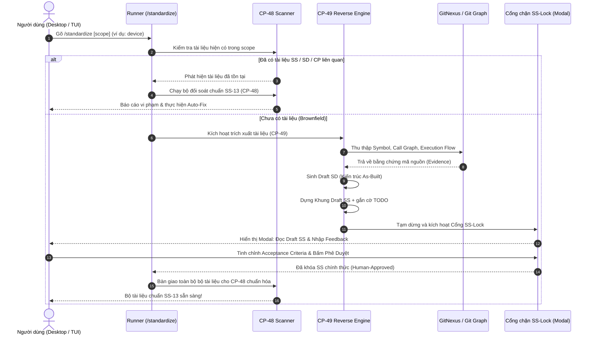

# CP-49: Trích xuất tài liệu từ mã nguồn và nạp tài liệu tự do (Reverse-Documentation)

## Metadata

- Document ID: `CP-49`
- Title: `Trích xuất tài liệu từ mã nguồn và nạp tài liệu tự do (Reverse-Documentation)`
- Feature Keys: `context-regression-engine, reverse-documentation`
- Phase: `coding_plan`
- Status: `approved`
- Owner: `FlowPilot`
- Reviewers: `Operator`
- Created: `2026-07-13`
- Last Updated: `2026-09-11`
- Parent Documents: [SS-13: Hợp đồng tài liệu cho AI](../../05-System-Specs/SS-13-AI-Followable-Document-Contract.md)
- Child Documents: [Task-333: Lệnh Standardize và Trích xuất tài liệu kèm cổng SS-Lock](../../08-Task/todo/Task-333-Standardize-Command-And-Reverse-Doc-With-SS-Lock.md)
- Related Documents: [CP-48: Bộ máy kiểm định và chuẩn hóa tài liệu](./CP-48-Standardize-Doc.md), [CP-60: Vibe Working Mode](../done/CP-60-Vibe-Working-Mode.md), `reqscaffold` package, GitNexus Code Intelligence
- Replaces: `None`
- Tags: `context-regression-engine, reverse-documentation, doc-ingestion, gitnexus, brownfield, ss-lock`

## AI Quick View

### Summary

- Dành cho các dự án legacy/brownfield chưa có tài liệu theo chuẩn hoặc chỉ có tài liệu tự do (README, ghi chú rời rạc): khởi tạo hệ thống phân loại tài liệu chuẩn `SS/SD/CP/Task` bằng cách **(a) nạp các tài liệu tự do có sẵn** và **(b) trích xuất tài liệu ngược từ mã nguồn thực tế (Reverse-Documentation)**.
- Tích hợp thông qua một lệnh giao diện duy nhất **`/standardize [scope]`** (hoặc nút bấm trên Desktop/TUI):
  - Khi người dùng muốn chuẩn hóa một feature hoặc module (ví dụ: `/standardize feature/device`), nếu hệ thống quét thấy chưa có bộ tài liệu nào liên quan, quy trình CP-49 sẽ được kích hoạt.
- **Nguyên tắc ranh giới bất di bất dịch (Hard Ceiling Rule)**:
  - Mã nguồn chỉ phản ánh *LÀM CÁI GÌ (What)*, không thể tự phản ánh *TẠI SAO (Why - Ý đồ nghiệp vụ)*.
  - Do đó, AI được phép tự sinh bản thảo thiết kế kiến trúc thực tế (**SD - System Tech Design**) và kế hoạch kỹ thuật (**CP/Task**) dựa trên bằng chứng có thật.
  - Đối với đặc tả hệ thống (**SS - System Specs / Business Intent**): **AI TUYỆT ĐỐI KHÔNG ĐƯỢC TỰ BỊA ĐẶT**. AI chỉ dựng khung sườn kèm đánh dấu `TODO: human intent needed`.
- **Cổng khóa người dùng (SS-Lock Gate - AI KHÔNG BAO GIỜ ĐƯỢC BYPASS)**:
  - Tương tự như cơ chế `ss_lock` đã thành công tại CP-60 (Vibe Mode), quy trình sẽ tạm dừng để hiển thị giao diện cho người dùng nhập feedback, điều chỉnh các tiêu chí nghiệm thu và xác nhận khóa SS. Chỉ khi con người phê duyệt, tài liệu mới được chính thức ban hành và bàn giao cho [CP-48](./CP-48-Standardize-Doc.md) chuẩn hóa định dạng.

### Current Ask

- Xây dựng tầng thu thập bằng chứng từ GitNexus & Git history (P-1), sinh bản thảo kiến trúc SD từ mã nguồn (P-2), tạo khung sườn SS kèm cổng chặn bắt buộc `SS-Lock` (P-3), tích hợp vào lệnh `/standardize` qua `Task-333`.

### Key Decisions

- `P-1` **Bằng chứng xác thực (Ground Truth) là nền tảng**: Trích xuất dữ liệu dựa trên GitNexus graph (symbols, call relationships, execution flows) và lịch sử git commit/changeledger. Không "nhồi" mã nguồn thô vô tội vạ vào prompt của LLM.
- `P-2` **Chống ảo giác (Anti-hallucination)**: Mọi nhận định trong bản thảo SD được sinh ra phải có dẫn chứng (symbol nào, hàm nào, commit nào). Không có bằng chứng $\rightarrow$ gắn cờ `TODO`.
- `P-3` **Cổng chặn SS-Lock bắt buộc (Non-bypassable Gate)**: SS là quyết định của người dùng. AI chỉ đóng vai trò trợ lý gợi ý; runner dừng lại bắt buộc người dùng xác nhận (`user.confirm`) trước khi sinh tiếp CP/Task.
- `P-4` **Bàn giao liền mạch cho CP-48**: Các bản thảo sau khi được con người duyệt sẽ được tự động chuyển cho bộ máy CP-48 để kiểm định và chuẩn hóa format theo đúng chuẩn `SS-13`.

### Constraints

- Không bịa đặt ý đồ nghiệp vụ: Không bao giờ tự suy diễn lý do kinh doanh nếu mã nguồn không thể hiện.
- Chế độ chỉ đọc đối với mã nguồn: Chỉ đọc code để phân tích, không sửa đổi source code trong quá trình reverse-doc; chỉ ghi các file nháp dưới `requirements/` chờ duyệt.
- Tận dụng tối đa GitNexus + `reqscaffold`, không viết lại bộ phân tích cú pháp AST mới.

### Source Refs

- `requirements/05-System-Specs/SS-13-AI-Followable-Document-Contract.md` (Hợp đồng tài liệu mục tiêu).
- `requirements/07-Coding-Plan/todo/CP-48-Standardize-Doc.md` (Bộ máy kiểm định và định dạng tiếp nhận đầu ra).
- `requirements/07-Coding-Plan/done/CP-60-Vibe-Working-Mode.md` (Mẫu cổng khóa `ss_lock` bắt buộc có người duyệt).
- GitNexus Code Intelligence (AST, symbol graph, execution traces).

### Open Questions

- Đã giải quyết: Cổng SS-Lock tái sử dụng hoàn toàn cơ chế `user.confirm` từ CP-60.
- Đã giải quyết: GitNexus được gọi qua `exec.Command` (CLI) hoặc MCP client tùy môi trường.

---

## 1. Mục tiêu

Cho phép một dự án brownfield/legacy nhanh chóng xây dựng được bộ tài liệu `SS/SD/CP` có căn cứ xác thực từ mã nguồn — trong đó kiến trúc kỹ thuật (SD) được trích xuất từ code thật, còn đặc tả nghiệp vụ (SS) được tạo khung và hoàn thiện dưới sự kiểm soát tối cao của con người thông qua cổng `SS-Lock`.

---

## 2. Luồng thực thi chi tiết của lệnh `/standardize [scope]`

---

## 3. Phân chia công việc (Work Breakdown & Task Mapping)

- `P-1` **Tầng thu thập bằng chứng mã nguồn (Evidence Collection)** $\rightarrow$ Nằm trong `Task-333`:
  - Kết nối GitNexus tool / API để trích xuất danh sách symbols, execution flow chính, các tệp phụ thuộc trong scope chỉ định.
  - Đọc log git commit gần nhất để xác định các thay đổi quan trọng và ngữ cảnh tính năng.
- `P-2` **Sinh bản thảo kiến trúc thực tế (Draft SD Generator)** $\rightarrow$ Nằm trong `Task-333`:
  - Từ bằng chứng thu thập được, AI tổng hợp cấu trúc module, luồng dữ liệu, các interface chính thành file `requirements/06-System-Tech-Design/todo/SD-*.md` với đầy đủ trích dẫn nguồn.
- `P-3` **Dựng khung đặc tả và Cổng chặn `SS-Lock`** $\rightarrow$ Nằm trong `Task-333`:
  - AI chỉ dựng khung sườn `requirements/05-System-Specs/todo/SS-*.md`: Các phần mục đích kinh doanh và tiêu chí nghiệm thu được đánh dấu `TODO: human intent needed`.
  - Runner kích hoạt trạng thái dừng tương tác (tương tự node `user.confirm` trong Vibe Mode).
  - TUI / Desktop app hiển thị cửa sổ xem trước SS và cho phép người dùng sửa đổi, bổ sung và bấm nút "Khóa & Phê duyệt SS".
- `P-4` **Kết nối luồng chuyển tiếp sang CP-48** $\rightarrow$ Nằm trong `Task-333`:
  - Sau khi người dùng phê duyệt SS, runner gọi trình quét và auto-fixer của CP-48 để chuẩn hóa cấu trúc cuối cùng.

---

## 4. Các vùng bị ảnh hưởng (Touched Areas)

- `apps/local-runner/internal/runner/standardize_cmd.go` (Xử lý lệnh `/standardize`, phân luồng kiểm tra tài liệu).
- `apps/local-runner/internal/runner/reverse_doc.go` (Tầng thu thập evidence và sinh draft doc).
- `apps/local-runner/internal/runner/ss_lock_modal.go` (Xử lý trạng thái dừng cổng `SS-Lock` cho TUI và Desktop).
- `apps/desktop-flowpilot/src/components/SSLockModal.tsx` (Giao diện xem trước và phê duyệt SS trên Desktop).

---

## 5. Kế hoạch kiểm thử & nghiệm thu

- **Kiểm thử logic**:
  - Chạy `/standardize` trên một thư mục code mẫu chưa có doc: Xác nhận AI không tự ý bịa đặt nội dung SS mà sinh ra khung có đánh dấu `TODO`.
  - Kiểm tra cổng `SS-Lock`: Đảm bảo quy trình bắt buộc phải dừng lại chờ tín hiệu phê duyệt của người dùng; không có cách nào AI tự vượt qua cổng này.
  - Sau khi phê duyệt: Xác nhận tài liệu được chuyển cho CP-48 và ghi vào thư mục `requirements/` với đầy đủ format hợp lệ.

---

## 6. Dữ liệu và Di chuyển

- Không có schema migration.
- Các file doc mới được ghi vào thư mục `requirements/` dưới dạng draft (`todo/`).

---

## 7. Triển khai và Dự phòng

- **Thứ tự triển khai**: Evidence collection (P-1) → SD generator (P-2) → SS-Lock gate (P-3) → CP-48 handoff (P-4).
- **Dự phòng**: Nếu GitNexus không khả dụng, hệ thống suy thoái mềm (graceful degradation) sử dụng static directory scan + basic Go AST.

---

## 8. Rủi ro

- `R-1` **AI bịa đặt nội dung SS**: AI có thể suy diễn business intent từ tên biến/hàm. Giảm thiểu: SS-Lock gate bắt buộc con người duyệt, AI chỉ ghi `TODO` cho các trường intent.
- `R-2` **GitNexus index lỗi thời**: Nếu index chưa được cập nhật, evidence sẽ thiếu symbol mới. Giảm thiểu: Tự động chạy `npx gitnexus analyze` nếu phát hiện index stale.

---

## 9. Tiêu chí hoàn thành tổng thể

- [ ] Evidence thu thập được có trích dẫn symbol/hàm cụ thể.
- [ ] SD draft sinh ra có dẫn chứng xác thực.
- [ ] SS draft chỉ chứa khung sườn với nhãn `TODO: human intent needed`.
- [ ] Cổng SS-Lock không thể bypass bởi AI.
- [ ] Sau khi người dùng phê duyệt, tài liệu chuyển sang CP-48 chuẩn hóa thành công.
