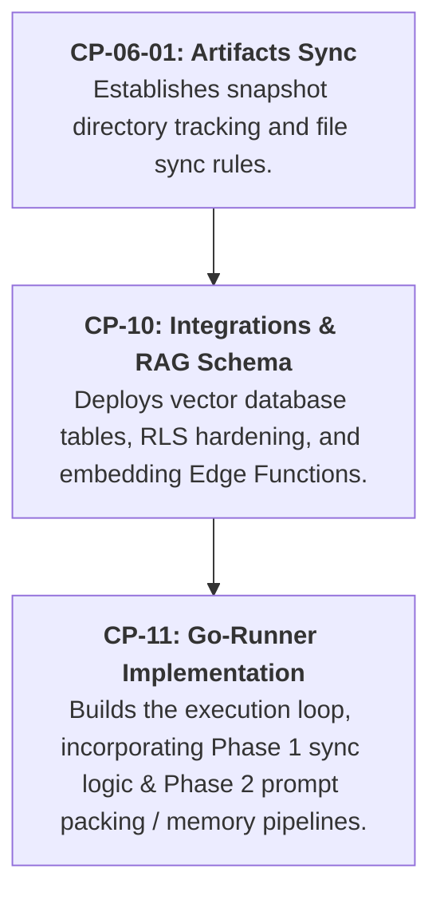

I will view `CP-12-Artifact-Memory-RAG.md` (which is in the `done` directory) to verify its dependencies and confirm if it already provides the necessary tables like `artifact_runs` that are needed for `CP-06-01`.

Viewed CP-12-Artifact-Memory-RAG.md:1-23

I will search the repository for `artifact_runs` to see if the table already exists in the database schema migrations or supabase setup, which is a prerequisite for both CP-06-01 and CP-11.

Searched for "artifact_runs"

Yes, you can absolutely implement them in that sequence: **`CP-06-01` $\rightarrow$ `CP-10` $\rightarrow$ `CP-11`**. 

This is a highly logical and optimal implementation path that avoids "chicken-and-egg" dependency cycles. Here is a breakdown of why this sequence is so clean and how each phase builds the foundation for the next:

---

### Phase 1: `CP-06-01` (Artifacts Sync)
*   **What it sets up:** The directory structural policy and rules for remote syncing—specifically how parent canonical files (e.g., `BusinessIdea.md`) and historical attempt snapshots (`.snapshots/<artifactId>/`) live and sync safely.
*   **Why it goes first:** The Go-Runner's core execution loop in `CP-11` is the system that actually writes these artifacts locally and saves them to the cloud. By implementing the snapshot sync specifications of `CP-06-01` first, you establish the exact file organization and sync behavior that the Go-Runner must follow when executing steps.

---

### Phase 2: `CP-10` (Integrations, Memory & Context Intelligence)
*   **What it sets up:** 
    *   Database tables for context tracking (`artifact_memories`, `step_context_slots`, `workflow_prompt_context_items`).
    *   pgvector semantic search functions (`match_artifact_memories` RPC).
    *   The `generate-embedding` Edge Function.
    *   Integration sync tables (Jira member/issue caches) and RLS security hardening.
*   **Why it goes second:** Before the Go-Runner can construct intelligent context-packed prompts, the database tables, vector search functions, and embedding Edge Functions must exist. Putting `CP-10` here prepares all the database schema and RAG microservices needed by the runner.

---

### Phase 3: `CP-11` (Go-Runner Implementation)
*   **What it sets up:** The Cobra CLI commands (`run`, `install-provider`, `init-project`, etc.) and the core step execution loop.
*   **Why it goes last:** 
    *   When the runner saves and uploads artifacts during execution, it incorporates the **sync specifications from `CP-06-01`** (Phase 1).
    *   When the runner compiles prompts before execution, it incorporates the **RAG Context Resolver and token packing logic from `CP-10`** (Phase 2).
    *   When the runner completes an artifact, it calls the **embeddings Edge Function and registers working memory from `CP-10`** (Phase 2).

---

### Summary of the Consolidated Rollout

This sequence keeps your implementation clean, incremental, and highly cohesive!