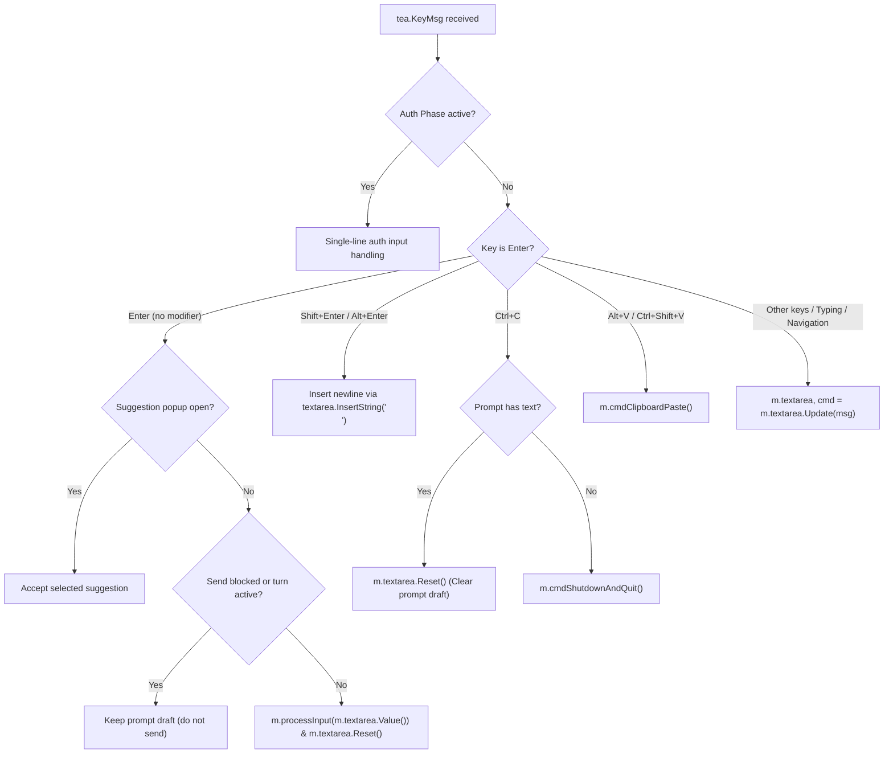

# Task-308: TUI Chat Input Refactoring to Bubbles Textarea

## Metadata

- Document ID: `Task-308`
- Title: `TUI Chat Input Refactoring to Bubbles Textarea`
- Phase: `task`
- Status: `draft`
- Owner: `FlowPilot Team`
- Reviewers: `TBD`
- Created: `2026-08-27`
- Last Updated: `2026-08-27`
- Feature Keys: `cli-tui`
- Parent Documents: [CP-56](../../07-Coding-Plan/inprogress/CP-56-Terminal-TUI-Chat-And-Flow-Client.md), [Task-279](./Task-279-Bubble-Tea-Chat-Stream-Shell.md)
- Child Documents: `None`
- Related Documents: [CA-611](../../../change-audit/CA-611-tui-vietnamese-ime-not-paste.md), [CA-612](../../../change-audit/CA-612-tui-ctrlv-no-stream.md), [CA-625](../../../change-audit/CA-625-clean-tui-input-ctrlc-paste-matrix.md), [CA-631](../../../change-audit/CA-631-restore-production-raw-paste-reject-guard.md), [CA-646](../../../change-audit/CA-646-tui-input-watchdog.md)
- Replaces: `Manual TUI Input & Burst Engine (custom caret/slice/paste-heuristics)`
- Tags: `cli-tui, bubbletea, bubbles, textarea, refactor, input-engine`

---

## AI Quick View

### Summary

- Replace the custom, fragile input engine in `AppModel` (`m.inputValue`, `m.inputCursor`, manual rune slicing, custom burst timer heuristics, manual caret blinking) with Charmbracelet's standard **`github.com/charmbracelet/bubbles/textarea`** component.
- Eliminate ~400+ lines of brittle custom time-based heuristics (`pasteBurst`, `burstSettle = 150ms`, `burstRuneGap = 25ms`, `isSingleRepeatedRuneChain`), manual SGR string slicing, and manual box framing.
- Retain all FlowPilot domain features: slash command auto-complete (`/`), file mentions (`@`), prompt draft preservation, send gating during running turns, paste token collapsing for long inputs, and Alt+V clipboard image/text insertion.

### Current Ask

Create a complete, production-ready technical design, step-by-step code implementation guide, test signatures, and Definition of Done (DOD) to refactor FlowPilot TUI input handling to `bubbles/textarea`.

### Key Decisions

- `D-1`: Embed `textarea.Model` from `github.com/charmbracelet/bubbles/textarea` into `AppModel`.
- `D-2`: Delegate key navigation (Up, Down, Left, Right, Home, End, Backspace, Delete, multi-line navigation) directly to `textarea.Update(msg)`.
- `D-3`: Maintain prompt expansion & token collapsing (`[Pasted N lines · C chars]`) via a thin wrapper over `textarea.SetValue()` / `textarea.Value()`.
- `D-4`: Handle slash suggestions (`/`) and `@` file mentions by intercepting `textarea.Value()` / `textarea.Cursor()` before suggestion popup rendering.
- `D-5`: Keep Send logic (`Enter`) executing `processInput(m.textarea.Value())` while `Shift+Enter` / `Alt+Enter` insert native multi-line breaks.

### Constraints

- Zero regression on existing features: Vietnamese Telex IME typing, Ctrl+C prompt clear / quit, Alt+V clipboard paste, slash command execution, send gating on active runs.
- 100% test pass on Linux, macOS, and Windows.

---

## 1. Goal

Eliminate intermittent hangs, dropped keys, caret misalignments, and burst heuristic timing bugs across Windows Terminal and Unix terminals by migrating FlowPilot TUI's input system to the battle-tested, standard `github.com/charmbracelet/bubbles/textarea` library.

---

## 2. Context & Root Cause Analysis of Legacy Engine

### 2.1 Why the Legacy Custom Engine Failed
The custom input engine evolved incrementally across CA-535 → CA-646, accumulating conflicting layers:
1. **Millisecond-based burst heuristics**: Trying to differentiate between human typing, Vietnamese IME Telex rewrites (`dd -> đ`), and terminal paste floods by measuring timestamp deltas (`pasteNow().Sub(lastRuneAt) < 25ms`). Windows timer jitter caused these thresholds to misfire, randomly swallowing keys or freezing input.
2. **Manual caret & box math**: Slicing rune arrays manually while ANSI color sequences (SGR) caused visual width discrepancies (`lipgloss.Width` vs rune counts), leading to corrupted rendering and cursor drift.
3. **Complex state interleaving**: `pasteBurst`, `rejectWindowsRawPaste`, `pasteCtrlVHintShown`, `settlePending`, and `inputWatchdog` had complex cross-dependencies that created silent deadlocks under rapid input.

---

## 3. Architecture & Replacement Design

### 3.1 Field Migration Map

| Legacy Field in `AppModel` | New State in `AppModel` | Responsibility |
| :--- | :--- | :--- |
| `m.inputValue string` | `m.textarea.Value()` / `m.textarea.SetValue(s)` | Storage & retrieval of current prompt text |
| `m.inputCursor int` | `m.textarea.Cursor()` / `m.textarea.SetCursor(n)` | Caret position management & multi-line navigation |
| `m.inputCursorVisible bool` | Built-in `textarea.Blink` | Cursor blinking & focused styling |
| `m.pasteBurst pasteBurst` | **REMOVED** (handled by textarea buffer) | Burst tracking & flood heuristics |
| `m.frameInput(...)` | `m.textarea.View()` | Rendering multi-line styled composer box |
| `m.moveInputCursor(d)` | Native `textarea.Update(msg)` | Left/Right/Home/End cursor navigation |
| `m.deleteInputBeforeCursor()` | Native `textarea.Update(msg)` | Backspace / Delete / Word deletion |

### 3.2 Key Lifecycle in `handleKey`



---

## 4. Code Implementation Guide

### Step 1: Add Dependency in `go.mod`
Run in `apps/local-runner`:
```bash
go get github.com/charmbracelet/bubbles@v0.21.0
```

### Step 2: Initialize `textarea` in `New()` (`model.go` & `app.go`)

```go
import "github.com/charmbracelet/bubbles/textarea"

func newChatTextArea(width int) textarea.Model {
	ta := textarea.New()
	ta.Placeholder = "Type a message, /command, or @file..."
	ta.Prompt = "┃ "
	ta.CharLimit = 0
	ta.ShowLineNumbers = false
	ta.SetWidth(width)
	ta.SetHeight(3) // Default 3 lines, auto-grows up to max
	ta.FocusedStyle.CursorLine = lipgloss.NewStyle()
	ta.FocusedStyle.Placeholder = styleSystem
	ta.FocusedStyle.Prompt = styleInputStroke
	ta.FocusedStyle.Text = styleUser
	ta.Focus()
	return ta
}
```

### Step 3: Integrate with `Update(msg)` in `app.go`

```go
func (m *AppModel) handleKey(msg tea.KeyMsg) (tea.Model, tea.Cmd) {
	// 1. Loading quit safety
	if m.sessionLoading && msg.Type == tea.KeyCtrlC {
		m.quitting = true
		return m, m.cmdShutdownAndQuit()
	}

	// 2. Ctrl+C Protection
	if msg.Type == tea.KeyCtrlC {
		if strings.TrimSpace(m.textarea.Value()) != "" {
			m.textarea.Reset()
			m.statusMsg = "prompt cleared"
			return m, nil
		}
		m.quitting = true
		return m, m.cmdShutdownAndQuit()
	}

	// 3. Alt+V & Clipboard Paste Chords
	switch msg.String() {
	case "alt+v", "ctrl+shift+v":
		return m, m.cmdClipboardPaste()
	case "ctrl+v", "\x16":
		if runtime.GOOS == "windows" {
			hint := "Use Alt+V for paste (text + image)"
			m.addMessage("system", hint, "gate")
			m.pasteCtrlVHintShown = true
			return m, m.showFlashToast(hint)
		}
	}

	// 4. Enter & Suggestion Dispatch
	if msg.Type == tea.KeyEnter && !msg.Alt {
		if items := m.collectSuggestions(); len(items) > 0 {
			return m.acceptSelectedSuggestion(items)
		}
		val := strings.TrimSpace(m.expandPasteTokens(m.textarea.Value()))
		if val == "" {
			return m, nil
		}
		if m.sendBlocked() && !strings.HasPrefix(val, "/") {
			m.statusMsg = "in progress — Enter disabled (keep typing)"
			return m, nil
		}
		m.textarea.Reset()
		return m.processInput(val)
	}

	// 5. Shift+Enter / Alt+Enter multi-line break
	if isPromptNewlineKey(msg) {
		m.textarea.InsertString("\n")
		return m, nil
	}

	// 6. Forward all standard navigation & typing to bubbles/textarea
	var cmd tea.Cmd
	m.textarea, cmd = m.textarea.Update(msg)
	return m, cmd
}
```

### Step 4: Refactor `renderInputLine()` in `app.go`

```go
func (m *AppModel) renderInputLine() string {
	w := safeTermWidth(m.chatWidth())
	m.textarea.SetWidth(w - 2)
	
	var inner []string
	if bar := m.renderAttentionBar(); bar != "" {
		inner = append(inner, strings.Split(bar, "\n")...)
	}
	inner = append(inner, strings.Split(m.textarea.View(), "\n")...)
	
	footer := strings.TrimSpace(m.model)
	return frameInput(inner, w, m.inputLabel(), footer, m.asciiMode)
}
```

### Step 5: Clean up Obsolete Custom Heuristics
Remove the following legacy files & helper methods:
- `apps/local-runner/internal/tui/app/chat_paste.go` (legacy `pasteBurst` tracker)
- `apps/local-runner/internal/tui/app/chat_newline.go` & `chat_newline_windows.go` (modifier polling)
- Custom caret methods: `inputCaretIndex()`, `moveInputCursor()`, `deleteInputBeforeCursor()`, `deleteInputAfterCursor()`, `windowRunesAround()`.

---

## 7. Phase 1 (Landed) — Value-Only Mirror

The end-state design above (sections 3–6) describes the target. Phase 1 — the
slice that landed — deliberately does NOT complete the DOD. It embeds
`textarea.Model` and keeps it as a **value-only mirror** of the live composer:

- `m.inputValue` / `m.inputCursor` remain the single source of truth; all
  typing, nav, paste, burst, and send logic is unchanged (intercept table in
  `handleKey` stays).
- `syncTextareaValue()` pushes `inputValue` into the mirror only when
  `authPhase == AuthNone` (passwords never reach the buffer), guarded by a
  normalized-form compare to avoid churn. `clearInputValue` calls
  `textarea.Reset()`.
- `newChatTextArea` disables `KeyMap.InsertNewline` and `KeyMap.Paste` so
  `handleKey` keeps ownership of Enter-send/Shift+Enter-newline and Alt+V.
- Fidelity: the mirror matches the bubbles sanitizer output (`\r`/`\n` -> `\n`,
  `\t` -> 4 spaces, control chars dropped). The live composer is never
  rewritten. Known Phase-2 constraint: `Value()` trims one trailing newline, so
  input ending in ≥2 newlines stays one shorter in the mirror.
- Tests: additive only (CP-56 D-8). Old matrix untouched. `task308_textarea_test.go`
  covers mirror fidelity, auth no-leak, reject-revert sync, collapse sync.

Phase 2 (landed as View-when-sticky-end, CA-652): `renderInputLine` uses
`textarea.View()` only when `useTextareaView()` is true (sticky-end with draft,
no burst/skills/attach/live/blocked); all other cases stay on the legacy
custom renderer so CA-633 idle-pin and CA-560 no-clamp are preserved.
`Prompt=""`, height is `LineCount()` with no 1..8 clamp. Full caret/selection
migration and `pasteBurst` deletion remain out of scope (CA-612/CA-631).

## 5. Test Signatures & Matrix

Phase 1 follows CP-56 D-8 additive-only: the legacy matrix
(`tui_input_comprehensive_matrix_test.go`) is NOT edited; new coverage lands in
`task308_textarea_test.go` (mirror fidelity, auth no-leak, reject-revert sync,
collapse sync, UTF-8/multi-rune, caret nav, Ctrl+C, cross-provider).
End-state signatures below are the Phase-2 target:

```go
// 1. Multi-byte UTF-8 & Vietnamese Telex IME
func TestTUIInput_Bubbles_Utf8DiacriticsAndMultiRune(t *testing.T)

// 2. Multi-line navigation & Caret positioning
func TestTUIInput_Bubbles_CaretNavigationAndInsert(t *testing.T)

// 3. Fast character stream & no heuristic drops
func TestTUIInput_Bubbles_FastTypingNoDrop(t *testing.T)

// 4. Token collapsing & expansion on submit
func TestTUIInput_Bubbles_PasteTokenCollapsingAndExpansion(t *testing.T)

// 5. Suggestion popup integration (/, @file)
func TestTUIInput_Bubbles_SuggestionNavigationAndAccept(t *testing.T)

// 6. Ctrl+C Clear vs Quit behavior
func TestTUIInput_Bubbles_CtrlC_ClearVsQuit(t *testing.T)

// 7. Cross-provider parity (Claude, Codex, Grok)
func TestTUIInput_Bubbles_CrossProviderParity(t *testing.T)
```

---

## 6. Definition of Done (DOD)

1. **Clean Dependencies**: `github.com/charmbracelet/bubbles/textarea` imported and wired in `AppModel`.
2. **Zero Heuristics Remaining**: All custom timing/burst structs (`pasteBurst`, `burstSettle`, `noteBurstRune`) completely deleted.
3. **Feature Complete**:
   - Vietnamese Telex IME typing works smoothly without any missing characters.
   - Arrow keys, Home, End, Backspace, Delete operate natively via textarea.
   - Slash commands (`/`) and `@` file mentions popups trigger and complete accurately.
   - Long pastes collapse into `[Pasted N lines · C chars]` and expand on send.
   - `Alt+V` paste works cleanly on Windows, macOS, and Linux.
4. **Test Suite**: 100% of tests in `apps/local-runner/internal/tui/...` pass across all providers (`claude`, `codex`, `grok`).
5. **No Hang Guarantee**: Rapid typing, pasting, and mouse clicking inside the terminal do not freeze or lock the TUI.
