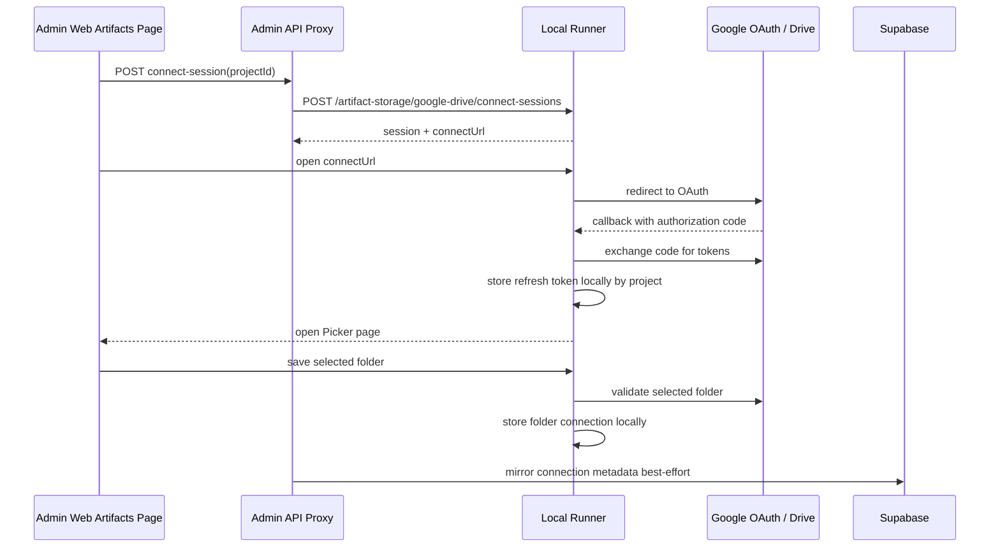
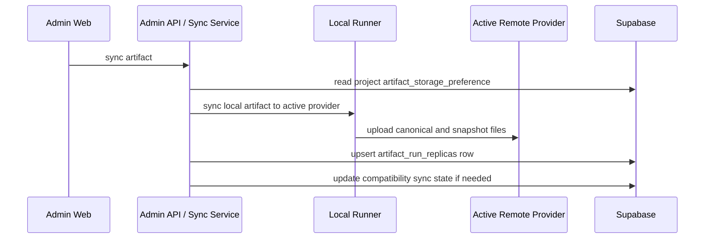

# Task-023: Sync Artifact With Google Drive

## Status

Planning and implementation task.

Task-023 is now the single source of truth for Google Drive artifact sync and artifact storage switching behavior.

Related prerequisite work is complete:

- [CP-27: Google Cloud Setting for Google Drive MCP and Artifact Sync](../../07-Coding-Plan/done/CP-27-Google-Cloud-Setting-Manually.md)
- [CP-28: Google Cloud Config With UI Auto](../../07-Coding-Plan/done/CP-28-Google-Cloud-Config-With-Ui-Auto.md)
- BUG-023 follow-up fixed the real Google Drive connect and folder selection flow

BUG-022 requirements have been merged into this task. Treat this document as the canonical requirements source for the remaining Google Drive artifact sync feature.

---

## 1. Goal

Make artifact sync work across Supabase Storage and Google Drive with safe provider switching.

The final product behavior must support:

- one Google Cloud project for FlowPilot app registration
- user authorizes their own Google Drive account
- local runner stores Google refresh tokens locally, not in Supabase or browser storage
- project can use either `supabase` or `google_drive` as active artifact storage provider
- artifact bytes can upload to Supabase Storage and Google Drive
- artifact metadata remains shared in Supabase
- switching a project storage provider migrates missing artifacts to the target provider before the switch is considered complete
- local-only artifacts remain visible and syncable
- remote artifact views are scoped to the active provider, while backend metadata can track replicas on both providers

The old requirement was "show only the active provider's remote artifacts." The updated requirement is stronger:

- both providers should eventually contain the same project artifact set after provider switches
- the active provider controls which remote replica set the UI shows
- provider switch triggers a migration/backfill job to copy missing artifacts to the target provider

---

## 2. Storage Semantics

### 2.1 Project Provider

`projects.artifact_storage_preference` remains the active provider selector.

Supported values:

- `supabase`
- `google_drive`

This field controls:

- which provider newly synced artifacts should use by default
- which provider's remote replicas appear in the main remote artifact view
- which provider must be ready before a provider switch can complete

### 2.2 Logical Artifact Identity

`artifact_runs` remains the canonical logical artifact record.

Use `artifact_runs.id` as the preferred artifact identity for provider replicas.

Fallback identity for local manifest reconciliation may use:

- `artifactId`
- `projectId`
- `workflowRunId`
- `workflowStepKey`

But durable shared sync state should converge on `artifact_runs.id`.

### 2.3 Provider Replica State

Current `artifact_runs` fields can represent only one remote copy:

- `storage_provider`
- `remote_path`
- `remote_object_id`
- `sync_status`

The updated provider-switch requirement needs per-provider replica metadata. Add a dedicated replica model instead of overwriting one provider with another.

Required logical model:

```text
artifact_run_replicas
```

Required fields:

- `id`
- `artifact_run_id`
- `project_id`
- `provider`
- `remote_path`
- `remote_object_id`
- `sync_status`
- `checksum`
- `last_synced_at`
- `last_error`
- `created_at`
- `updated_at`

Required unique constraint:

```text
unique(artifact_run_id, provider)
```

Allowed provider values:

- `supabase`
- `google_drive`

Allowed sync statuses:

- `queued`
- `syncing`
- `synced`
- `failed`

`artifact_runs` may keep compatibility fields for the active/latest provider, but provider-specific correctness must come from `artifact_run_replicas`.

### 2.4 Storage Scope Identity

Provider type alone is not enough to describe a usable remote source.

Real artifact sources are:

- `local`
- `supabase` with one concrete Supabase project/bucket/runtime target
- `google_drive` with one concrete folder plus account access

This means:

- `supabase` on Runner A may not be the same remote target as `supabase` on Runner B
- `google_drive` on Runner A may not be the same remote target as `google_drive` on Runner B
- same provider name does not guarantee same remote artifact set

Task-023 must treat shared artifact continuity as valid only when runners point to the same effective storage scope.

Required product rule:

- users must use the same Supabase runtime target and the same Google Drive folder if they expect full cross-runner artifact continuity for one project

Recommended future metadata addition:

- add a provider scope identity such as `storage_scope_key` or equivalent

Examples:

- `supabase:https://example.supabase.co:flowpilot-artifacts`
- `gdrive:folder_123456`

Without a scope identity, the system can only say "artifact has a Supabase replica" or "artifact has a Google Drive replica", but cannot prove it is the same Supabase bucket or the same Drive folder currently configured on another runner.

---

## 3. Google Drive Connection Semantics

Google Drive artifact sync needs its own connection state. It is separate from Google Drive MCP.

Artifact sync needs:

- CP-28 runtime config available to the runner
- artifact sync OAuth completed on the current runner
- project-scoped refresh token stored in the runner secret store
- one destination Google Drive folder selected for the project
- `.flowpilot/settings/artifact-storage-google-drive.json` stores local connection/folder state

Google Drive MCP connection does not imply artifact sync is connected.

Do not:

- store Google refresh tokens in browser storage
- store Google refresh tokens in Supabase
- share one runner's refresh token with another PC
- treat Picker API key as authorization
- reuse MCP token state as artifact sync token state

---

## 4. Expected End-to-End Flows

### 4.1 Connect Google Drive



### 4.2 Sync Artifact To Active Provider



### 4.3 Switch Provider With Migration

Example:

1. Project active provider is `supabase`.
2. Artifact A is synced to Supabase.
3. Artifact B exists locally but is not synced.
4. User switches project provider to `google_drive`.
5. UI shows a migration modal.
6. System scans project artifacts and replicas.
7. System syncs A and B to Google Drive.
8. Existing target replicas are skipped.
9. Project active provider becomes `google_drive` only after migration succeeds.

Reverse example:

1. Project active provider is `google_drive`.
2. Artifact C is generated and synced to Google Drive.
3. User switches project provider back to `supabase`.
4. UI shows migration modal.
5. System syncs C to Supabase.
6. Existing Supabase replicas are skipped.
7. Project active provider becomes `supabase` after migration succeeds.

---

## 5. Provider Switch Migration Requirements

### 5.1 Trigger

Whenever the user changes the remote storage provider for a project:

- do not immediately treat the new provider as fully active
- validate the target provider is configured and connected
- start a project-level migration/backfill job
- show a modal or blocking progress UI while the migration starts
- complete the provider switch only after required artifacts are synced to the target provider

### 5.2 Target Provider Readiness

Supabase target readiness:

- Supabase runtime config is available
- Supabase artifact bucket is available
- admin/shared sync credentials are available

Google Drive target readiness:

- CP-28 runtime config is saved or valid env fallback exists
- Google Drive project connection is `connected`
- selected folder ID exists
- project-scoped refresh token exists in runner secret store

If target provider is not ready, do not start migration. Show an actionable setup or reconnect message.

### 5.3 Candidate Artifact Set

Migration must consider all artifacts for the project:

- shared `artifact_runs` rows
- valid local manifests under `.flowpilot/artifacts`
- local-only artifacts that have enough identity to map back to a project and workflow run
- source-provider replicas that exist even if local files are missing on the current runner

Migration must build one combined candidate artifact set from all available sources in the current runner scope:

- local
- Supabase remote
- Google Drive remote

This is not a simple fallback chain that stops once one source works.

Required behavior:

- scan all available sources first
- merge them into one artifact candidate set by artifact identity
- decide which artifacts are missing on the target before downloading remote bytes
- only fetch/download the remote artifact content for artifacts that are actually missing on the target
- only backfill into the single active target provider selected by the switch request

Example:

- Supabase has `A`
- local has `B`
- Google Drive has `C`
- user switches target to `google_drive`

Then:

- `A` and `B` are candidates to sync into Google Drive if missing there
- `C` is not copied back into Supabase
- `B` is not copied back into Supabase
- `A` is not copied into local
- migration is one-directional into the selected target only

Artifact identity matching should prefer:

- `artifact_run_id`

Fallback matching may use:

- `artifactId + projectId + workflowRunId + workflowStepKey`

### 5.4 Duplicate Skip Rule

Before syncing an artifact to the target provider, check if a valid target replica already exists.

Skip sync when:

- `artifact_run_replicas.artifact_run_id` matches
- `artifact_run_replicas.provider` matches the target provider
- `sync_status = synced`
- checksum matches, when checksum is available
- remote object/path still resolves or is trusted by the current validation level

If checksum is missing, use artifact identity plus remote metadata as a weaker skip condition, but prefer adding checksum coverage.

Important performance rule:

- for remote Supabase and remote Google Drive artifacts, check whether the artifact is already present on the target by artifact identity first
- do not download raw remote bytes before this target-missing check
- remote download/fetch should happen only for artifacts that still need to be pushed to the target provider

This avoids unnecessary bandwidth and latency when the artifact already exists on the target.

Important scope rule:

- existence checks and duplicate-skip decisions are always evaluated against the selected target provider only
- migration must not try to "heal" every source at once
- Task-023 is target-directed backfill, not full mesh replication between local, Supabase, and Google Drive

### 5.5 Source Priority

When an artifact is confirmed missing on the target provider, choose source data in this order:

1. local artifact files on the current runner
2. source-provider remote copy from the current runner's configured Supabase runtime target
3. source-provider remote copy from the current runner's configured Google Drive folder scope
4. fail the artifact with an explicit "source unavailable" error

This priority applies only after the artifact has been included in the combined candidate set and confirmed missing on the target.

This is required because one runner may not have every local artifact, but the source provider may still have the remote copy.

Detailed rule:

- Runner B must only use sources reachable inside Runner B's own current storage scope
- Runner B must not assume artifacts in some other Supabase project, some other bucket, or some other Drive folder are reachable
- if the current runner is pointed at a different scope, migration must fail clearly instead of pretending the data is shared

Implementation expectation:

- Supabase remote source should download raw artifact bytes using the same remote path resolution model already used by the artifact open flow
- Google Drive remote source should support raw artifact download by `remoteObjectId` when available, and logical-path lookup under the configured root folder when object id is missing
- migration must be able to reconstruct canonical content plus snapshot files from either Supabase remote or Google Drive remote, not only from local files

### 5.6 Migration Progress UI

The provider switch flow must show migration progress.

Required progress states:

- `validating target provider`
- `scanning artifacts`
- `checking existing replicas`
- `syncing`
- `completed`
- `failed`
- `reconnect required`

Required progress details:

- total artifact count
- skipped count
- synced count
- failed count
- current artifact title or ID
- target provider

Short migrations may complete inside the modal. Longer migrations may allow the user to minimize the modal into a visible progress banner/panel, but the project must remain in a switching/migrating state until done.

### 5.7 Switch Completion

Recommended completion behavior:

- keep the old provider active while migration runs
- after migration succeeds, update `projects.artifact_storage_preference` to the target provider
- refresh the artifact browser
- show the target provider's remote replica set

If some artifacts fail:

- do not silently flip the provider
- show failures and allow retry
- allow a deliberate "switch with failed items" action only if product explicitly accepts partial migration later

For this task, default behavior is no provider flip when required migration fails.

---

## 6. Artifact Browser Requirements

### 6.1 Remote View

The remote artifact view should show replicas for the active provider only.

Examples:

- if active provider is `supabase`, show Supabase replicas
- if active provider is `google_drive`, show Google Drive replicas

Because provider switch now migrates missing artifacts, the active provider view should eventually contain the complete project artifact set.

Do not blend Supabase and Google Drive replicas into one main remote list.

### 6.2 Local View

Local-only artifacts remain independent from active-provider filtering.

Local view should show valid local artifacts that:

- are not synced to the active provider
- are missing target replica metadata
- failed previous sync
- need retry after migration failure

### 6.3 Grouping

Change artifact browser grouping from:

```text
Run ID > Step ID
```

To:

```text
Project ID > Storage Type > Run ID > Step ID
```

Storage type groups:

- `local_only`
- `supabase`
- `google_drive`

For remote view, storage type should normally show only the active provider group.

For diagnostic or future admin views, both provider groups may be shown, but that is not required for Task-023.

---

## 7. Token Lifecycle Requirements

Artifact sync uses short-lived access tokens and locally stored refresh tokens.

Access token expired:

- runner requests a new access token using the project-scoped refresh token
- original sync/open/folder operation continues automatically
- UI should not ask the user to reconnect

Refresh token expired, revoked, or invalid:

- runner marks Google Drive artifact connection as `reconnect_required`
- sync/open/folder operation returns an actionable reconnect-required error
- UI shows the same `Connect Google Drive` action used for initial connection
- reconnect flow replaces the invalid refresh token and keeps the selected project/folder flow usable

Reconnect-required is not a generic sync failure. It is a distinct user-action state.

---

## 8. Runtime Config Requirements

CP-28 changed artifact sync runtime config from env-only to runner-managed config.

Artifact sync must resolve Google runtime config from:

1. saved CP-28 runner config
2. env fallback

This applies to:

- OAuth authorization URL creation
- OAuth callback token exchange
- access token refresh
- Picker token/config endpoint
- Drive upload/open operations when Google config is required

Required fields while Picker is used:

- Google Drive client ID
- Google Drive client secret
- Google Drive redirect URI
- Google Picker API key

Default runner callback URI:

```text
http://127.0.0.1:4317/artifact-storage/google-drive/oauth/callback
```

Admin-web `FLOWPILOT_RUNNER_URL` and Google Cloud authorized redirect URI must point to the same runner host/port.

---

## 9. Multi-PC Semantics

Each runner must authorize Google Drive artifact sync independently.

Each runner may also point at its own Supabase runtime target independently.

Allowed:

- PC A and PC B can use the same Google Cloud app registration
- PC A and PC B can store different local runner auth state and different local `artifact-storage-google-drive.json` files
- PC A and PC B can select the same Google Drive folder
- PC A and PC B should use the same Google account access plus the same folder when they are expected to share one Google Drive artifact replica set for the same project
- PC A and PC B should use the same Supabase runtime target when they are expected to share one Supabase artifact replica set for the same project
- Supabase metadata can show that artifacts have Google Drive replicas

Not allowed:

- copying PC A refresh token to PC B through Supabase
- assuming PC B can open/sync Drive artifacts without its own local authorization
- treating different Google accounts or different Drive folders as one interchangeable shared remote replica set for the same project
- treating different Supabase runtime targets or buckets as one interchangeable shared remote replica set for the same project

If PC B has no local Google Drive authorization:

- remote metadata may be visible
- open/sync actions that require Drive access should show "connect Google Drive on this runner"

If PC B is connected to a different Google account or a different Drive folder:

- PC B may still have valid local Google auth
- but PC B must not be assumed to have access to artifacts uploaded by PC A
- project-level cross-runner artifact continuity is only reliable when runners use the same effective Google Drive account access and the same target folder

If PC B is configured with a different Supabase runtime target:

- PC B may still have valid Supabase config
- but PC B must not be assumed to have access to artifacts uploaded into Runner A's Supabase target
- project-level cross-runner artifact continuity is only reliable when runners use the same effective Supabase project/bucket target

Current migration rule for cross-runner backfill:

- migration may use `local`, `supabase remote`, and `google drive remote` as artifact sources
- but only within the current runner's configured scope
- if an artifact exists only in some other runner's Supabase target or Drive folder, current runner migration must treat that artifact as unavailable

---

## 10. Implementation Plan

### Step 1: Normalize Requirements And Schema

- Add `artifact_run_replicas` or equivalent per-provider replica model.
- Keep `artifact_runs` as logical artifact identity.
- Preserve existing compatibility fields on `artifact_runs` until downstream code is migrated.
- Add indexes for project/provider/artifact lookup.
- Add RLS policies consistent with existing `artifact_runs` access.

### Step 2: Add Replica Gateway And Sync State Updates

- Create read/upsert APIs for provider replicas.
- Update Supabase sync path to create/update `supabase` replica rows.
- Update Google Drive sync path to create/update `google_drive` replica rows.
- Ensure sync failures update the provider-specific replica, not just global artifact state.

### Step 3: Add Provider Switch Migration Flow

- Replace direct provider preference updates from the artifact storage UI with a switch request flow.
- Validate target provider.
- Create and run a migration/backfill job.
- Build one combined artifact candidate set from local, Supabase remote, and Google Drive remote sources inside the current runner scope.
- Backfill only into the selected target provider for that switch operation.
- Skip existing target replicas.
- Check target existence by artifact identity before downloading remote source bytes.
- Sync missing target replicas.
- Download artifact bytes from `local`, `supabase remote`, or `google drive remote` according to source priority.
- Limit remote-source migration to the current runner's configured Supabase/Drive scope.
- Flip `artifact_storage_preference` only after successful migration.
- Refresh artifact browser data after completion.

### Step 4: Harden Google Drive Token Lifecycle

- Ensure all Google Drive operations use refresh token flow.
- Convert invalid refresh token failures into reconnect-required state.
- Surface reconnect-required in API responses and UI.
- Reuse `Connect Google Drive` as the reconnect action.

### Step 5: Update Artifact Browser UI

- Group artifacts by `Project ID > Storage Type > Run ID > Step ID`.
- Remote view reads active-provider replicas.
- Local view shows local-only and missing-target artifacts.
- Add clear provider labels and migration status messages.

### Step 6: Add Preflight And Recovery UX

- Add or tighten preflight checks for target provider readiness.
- Show setup-needed, disconnected, connected, reconnect-required, failed, and migrating states.
- Provide retry for failed migration items.
- Warn clearly when current runner storage scope does not match the scope that previously held the artifact replica set.

### Step 7: Verify End-To-End

- Real Google OAuth connect.
- Real Google Picker folder selection.
- Sync to Google Drive.
- Switch Supabase to Google Drive with existing Supabase/local artifacts.
- Switch Google Drive back to Supabase with Drive-only artifacts.
- Verify duplicate skip behavior.
- Verify reconnect-required behavior.

---

## 11. Test Plan

### Runner Tests

- saved CP-28 config resolves without `.env`
- env fallback still works when saved config is missing
- missing Google client ID reports missing config
- missing Google client secret reports missing config
- missing Google redirect URI reports missing config
- missing Picker API key reports missing config while Picker is used
- OAuth callback stores refresh token by project
- Picker token uses stored project refresh token
- folder selection validates folder MIME type
- Google Drive connection state persists under `.flowpilot/settings/artifact-storage-google-drive.json`
- legacy `.flowpilot/artifact-storage-google-drive.json` can still be read for migration
- sync uploads snapshot and canonical files to Google Drive
- stale access token is recovered through refresh token
- invalid refresh token marks connection reconnect-required
- missing local Google Drive credential returns connect-on-this-runner error
- source-provider remote copy can be used when local files are missing, if implemented in runner scope

### Admin-Web Tests

- connect-session proxies project ID and runner base URL
- status route mirrors connected state to Supabase best-effort
- provider switch validates target provider before migration
- provider switch starts migration before updating `artifact_storage_preference`
- successful migration flips active provider
- failed migration does not silently flip active provider
- migration skips existing target replicas
- migration syncs local-only artifacts to target provider
- migration syncs source-provider-only artifacts to target provider
- remote view filters by active provider replicas
- local view shows missing-target or failed local artifacts
- artifact browser groups by `Project ID > Storage Type > Run ID > Step ID`
- reconnect-required error shows reconnect action
- errors from runner are surfaced without being swallowed

### Database Tests / Migration Checks

- `artifact_run_replicas` table exists
- unique constraint exists on `(artifact_run_id, provider)`
- provider check constraint allows `supabase` and `google_drive`
- sync status check constraint allows expected statuses
- project/provider indexes exist
- RLS allows expected authenticated read/write behavior matching current artifact sync model

### Manual Tests

- real Google OAuth connect
- real Picker folder selection
- real artifact upload to Google Drive
- real artifact open from Google Drive
- generate artifact A, sync to Supabase, switch to Google Drive, verify A is copied to Drive
- generate artifact B local-only, switch to Google Drive, verify B is copied to Drive
- generate artifact C on Google Drive, switch to Supabase, verify C is copied to Supabase
- switch to a provider where all replicas already exist, verify migration skips duplicates
- revoke Google refresh token, verify reconnect-required state
- reconnect Google Drive and retry sync
- second runner sees metadata but must connect before Drive access

---

## 12. Definition Of Done

Task-023 is complete when all of the following are true:

- `[done]` CP-27 manual Google Cloud setup remains documented and linked.
- `[done]` CP-28 UI config is used by artifact sync runtime before env fallback.
- `[done]` Google Drive connection succeeds from admin-web.
- `[done]` Google Picker folder selection succeeds.
- `[done]` Runner stores project-scoped Google refresh tokens locally only.
- `[done]` Runner stores Google Drive artifact connection state under `.flowpilot/settings/artifact-storage-google-drive.json`.
- `[done]` Google Drive artifact sync uploads canonical artifact content and snapshot files.
- `[done]` Supabase artifact sync uploads canonical artifact content and snapshot files.
- `[done]` Per-provider artifact replica state exists and can represent both Supabase and Google Drive copies of the same artifact.
- `[done]` Provider switch starts a migration/backfill flow instead of directly flipping provider state.
- `[done]` Provider switch shows progress UI with validating, scanning, syncing, completed, failed, and reconnect-required states.
- `[done]` Provider switch syncs missing artifacts to the target provider.
- `[done]` Provider switch skips artifacts that already exist on the target provider.
- `[done]` Provider switch uses artifact identity plus checksum where available to avoid duplicate sync.
- `[done]` Provider switch builds one combined candidate artifact set from local, Supabase remote, and Google Drive remote sources available in the current runner scope.
- `[done]` Provider switch backfills only into the single selected target provider, not into every other source.
- `[done]` Provider switch checks target existence by artifact identity before downloading remote source bytes.
- `[done]` Provider switch uses local files first, then Supabase remote copy, then Google Drive remote copy, then fails with source-unavailable.
- `[done]` Provider switch only treats remote-source migration as valid inside the current runner's configured Supabase/Drive scope.
- `[done]` Provider switch flips `projects.artifact_storage_preference` only after required migration succeeds.
- `[done]` Failed migration does not silently change active provider.
- `[done]` Remote artifact view shows the active provider's replica set.
- `[done]` Remote artifact view does not blend Supabase and Google Drive replicas into one main list.
- `[done]` Local artifact view remains visible independently from active-provider filtering.
- `[done]` Artifact browser groups by `Project ID > Storage Type > Run ID > Step ID`.
- `[done]` Newly generated artifacts sync to the active provider.
- `[done]` Switching from Supabase to Google Drive backfills prior Supabase/local artifacts to Google Drive.
- `[done]` Switching from Google Drive to Supabase backfills prior Google Drive/local artifacts to Supabase.
- `[done]` Stale access tokens are recovered automatically when refresh token is valid.
- `[done]` Expired, revoked, or invalid refresh tokens produce reconnect-required state.
- `[done]` Reconnect-required state exposes the same Connect Google Drive flow.
- `[done]` Failure modes are understandable in UI and logs.
- `[todo]` Multi-PC behavior is correct: metadata is shared, tokens are local per runner, and shared continuity only applies when runners use the same effective Supabase target and Google Drive folder scope.
- `[done]` Shared metadata can distinguish provider type from provider scope well enough to avoid false assumptions across different Supabase targets or Drive folders.
- `[todo]` Automated runner tests cover config resolution, token lifecycle, Drive sync, and reconnect-required behavior.
- `[done]` Automated admin-web tests cover provider switch migration, replica filtering, grouping, and error states.
- `[todo]` Manual verification covers real connect, folder select, sync, open, provider switch migration, duplicate skip, and reconnect.

---

## 13. Known Implementation Risks

- Current `artifact_runs` remote fields cannot represent both Supabase and Google Drive copies at the same time.
- Provider switch migration needs job/progress state; a simple direct update is not enough.
- Copying from source-provider remote when local files are missing may require provider-specific download/read support.
- Current replica metadata does not fully distinguish provider scope such as Supabase project/bucket identity or Google Drive folder identity.
- Same provider name across runners does not guarantee shared data continuity if runtime targets differ.
- Existing auto-sync code may assume one provider per artifact and must be reviewed.
- Existing artifact browser tests may need significant updates because grouping changes.
- Full package runner tests currently include unrelated failures; targeted tests should still be added for new behavior.
