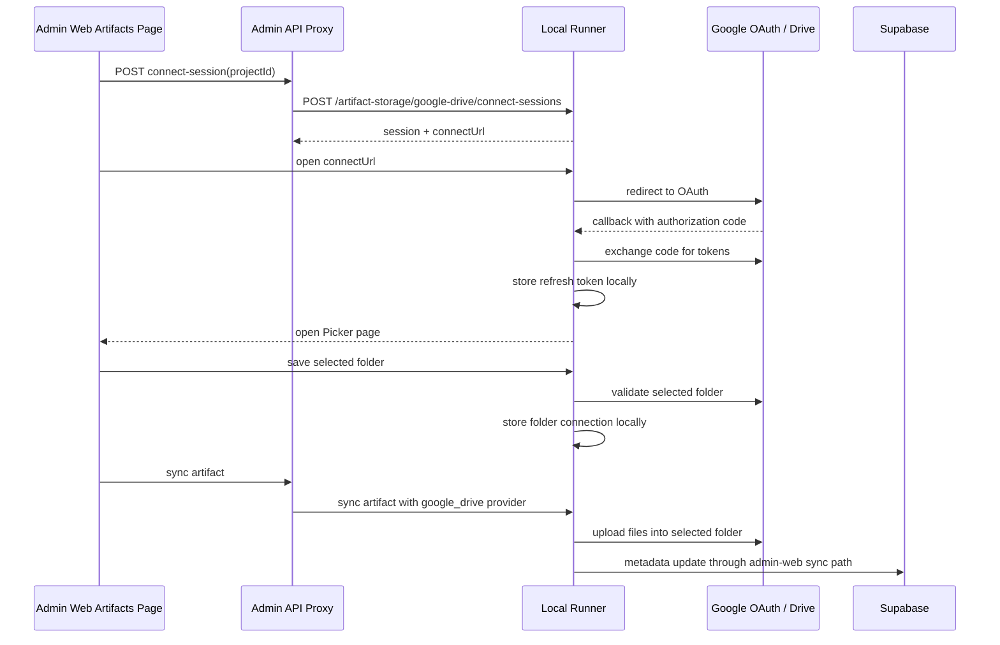

# Task-023: Sync Artifact With Google Drive

## Status

Planning and verification task.

Live runner investigation is now in progress. Real Google OAuth and Picker were tested against the local runner on June 5, 2026.

The core Google Drive artifact sync code already exists. This task defines what must be true after [CP-27: Google Cloud Setting](../07-Coding-Plan/todo/CP-27-Google-Cloud-Setting.md) so the current implementation can actually run end to end, and what gaps should be fixed if validation fails.

---

## 1. Goal

Make Google Drive artifact sync work with the CP-27 setup model:

- one Google Cloud project for FlowPilot app registration
- user authorizes their own Google Drive account
- local runner stores refresh token locally
- project uses `artifact_storage_preference = google_drive`
- artifact bytes upload to the selected Google Drive folder
- shared artifact metadata is updated in Supabase

Also make the artifact list remote tab reflect the currently selected storage provider:

- when the project is synced to Supabase, the remote tab shows the Supabase-backed artifact set only
- when the project storage changes to Google Drive and artifact B is synced there, the remote tab shows B only
- when the project storage changes back to Supabase, the remote tab shows the Supabase-backed artifact set only again

The remote tab should not mix artifacts from different storage providers into one combined remote view.

---

## 2. Current Implementation Summary

Current code already includes:

- admin-web API route to create a Drive connect session
- admin-web API route to poll Drive connection status
- runner OAuth redirect builder
- runner OAuth callback handler
- runner Google Picker page
- runner folder selection save endpoint
- runner project-scoped refresh token storage
- runner artifact upload to Google Drive
- runner artifact open URL resolution

Current improvement still needed:

- token lifecycle recovery should be explicit in product behavior
- if an access token is no longer valid, the runner should use the stored refresh token to acquire a new access token automatically
- if the refresh token is expired, revoked, or otherwise unusable, the UI should move the project back into a reconnect-required state and let the user grant permission again

Current runner env requirements:

```env
GOOGLE_DRIVE_CLIENT_ID=...
GOOGLE_DRIVE_CLIENT_SECRET=...
GOOGLE_DRIVE_REDIRECT_URI=http://127.0.0.1:4317/artifact-storage/google-drive/oauth/callback
GOOGLE_PICKER_API_KEY=...
```

The current flow still uses Google Picker, so CP-27 must provide both OAuth credentials and Picker API key.

---

## 3. Dependency on CP-27

Task-023 depends on CP-27 for:

- Google Cloud project
- OAuth consent screen
- Drive API enabled
- OAuth client ID and secret
- authorized redirect URI
- Picker API key
- explanation of shared app registration vs per-user Drive authorization

Task-023 does not own Google Cloud concepts. It only validates the artifact sync feature against that setup.

---

## 4. Expected End-to-End Flow



---

## 5. Implementation and Verification Plan

### Step 1: Confirm CP-27 environment is loaded by runner

Verify the local runner process receives:

- `GOOGLE_DRIVE_CLIENT_ID`
- `GOOGLE_DRIVE_CLIENT_SECRET`
- `GOOGLE_DRIVE_REDIRECT_URI`
- `GOOGLE_PICKER_API_KEY`

Acceptance:

- creating a Google Drive connect session does not fail with missing env var errors
- redirect URI in Google Cloud exactly matches `GOOGLE_DRIVE_REDIRECT_URI`

### Step 2: Confirm runner base URL and redirect URI match

Current default runner base URL is:

```text
http://127.0.0.1:4317
```

Current callback path is:

```text
/artifact-storage/google-drive/oauth/callback
```

Expected default redirect URI:

```text
http://127.0.0.1:4317/artifact-storage/google-drive/oauth/callback
```

Acceptance:

- admin-web `FLOWPILOT_RUNNER_URL` and runner OAuth redirect URI point to the same host and port
- Google Cloud authorized redirect URI is exact
- no `redirect_uri_mismatch` occurs

### Step 3: Confirm project storage preference

Set the target project to:

```text
artifact_storage_preference = google_drive
```

Acceptance:

- artifact sync service resolves provider as `google_drive`
- Supabase remains default for projects not explicitly switched

### Step 4: Connect Google Drive on the current runner

Use the artifacts page connection panel:

1. select project
2. press Connect Google Drive
3. complete Google OAuth
4. select destination folder through Picker
5. return to artifacts page
6. confirm connected state shows account and folder metadata

Acceptance:

- runner stores refresh token locally for the project
- runner stores folder ID and folder name locally
- admin-web status route mirrors connection metadata into Supabase best-effort

### Step 5: Sync one artifact

Use a workflow-backed artifact that already exists locally under `.flowpilot/artifacts`.

Acceptance:

- runner creates folder path under selected Drive folder
- runner uploads snapshot files
- runner uploads canonical artifact file
- artifact sync status becomes `synced`
- `artifact_runs.storage_provider` becomes `google_drive`
- `artifact_runs.remote_path` is populated
- `artifact_runs.remote_object_id` contains the Drive file ID

### Step 6: Open synced artifact

Open the artifact from admin-web after sync.

Acceptance:

- Google Drive-backed open flow resolves a URL
- selected file is accessible through the connected account
- revoked token or missing local connection returns a clear error

### Step 7: Handle token refresh and reconnect flow

Artifact sync already stores project-scoped refresh tokens, so this task must also harden the lifecycle behavior:

1. when a Drive API call fails because the access token is stale, the runner should use the stored refresh token to request a new access token automatically
2. when refresh succeeds, the original operation should continue without requiring the user to reconnect manually
3. when refresh token exchange fails because the refresh token is expired, revoked, or invalid, the connection should be marked reconnect-required
4. the artifact UI should show a clear reconnect action so the user can grant Drive permission again

Acceptance:

- stale access token does not immediately break sync or open flows if refresh token is still valid
- expired or revoked refresh token moves the project into an actionable reconnect-required state
- reconnect flow allows the user to grant permission again and continue syncing

### Step 8: Validate multi-PC semantics

Repeat connection from a second PC or clean runner state if available.

Acceptance:

- second runner must complete its own Google Drive connection flow
- second runner can target the same shared Drive folder
- refresh token is not copied through Supabase
- Supabase metadata can be shared, but local Drive auth remains per runner

---

## 6. Missing Expectations to Check Against Current Code

The current code should run after CP-27 setup if all of these are true:

- runner env vars are present before runner startup
- Google Cloud redirect URI uses runner port `4317`, not admin-web port
- Google Picker API key is valid
- selected Google account has permission to write to the selected folder
- project has `artifact_storage_preference = google_drive`
- artifact is workflow-backed so shared `artifact_runs` metadata can be updated
- local artifact directory exists and contains the expected output file

Likely gaps to verify:

- setup guide may still mention admin-web port `3000`; it should use the runner callback URI
- UI copy may imply MCP connection is enough for artifact sync; it is not
- code may not expose a manual recovery path if Picker succeeds but folder save fails
- code may not yet surface refresh-token-expired as a reconnect-required UI state
- tests may mock Drive but not prove real CP-27 env wiring
- there may be no explicit preflight endpoint that reports all missing Google env vars at once

---

## 6.1 Live Investigation Notes (June 5, 2026)

### Verified working pieces

- Google OAuth callback on the runner works with the configured redirect URI:

```text
http://127.0.0.1:4317/artifact-storage/google-drive/oauth/callback
```

- the runner successfully stores a project-scoped refresh token after OAuth
- Google Picker API key is accepted when key application restriction is temporarily set to `None`
- folder list renders inside Google Picker and the user can highlight a folder

### Real issues found during live test

See BUG-023

## 7. Test Plan

Runner tests:

- missing `GOOGLE_DRIVE_CLIENT_ID`
- missing `GOOGLE_DRIVE_CLIENT_SECRET`
- missing `GOOGLE_DRIVE_REDIRECT_URI`
- missing `GOOGLE_PICKER_API_KEY`
- OAuth callback stores refresh token by project
- Picker token uses stored refresh token
- folder selection validates folder MIME type
- sync uploads snapshot and canonical files
- stale access token is recovered automatically through refresh token flow
- revoked refresh token marks sync failed
- expired or revoked refresh token marks connection as reconnect-required

Admin-web tests:

- connect-session proxies project ID and runner base URL
- status route mirrors connected state to Supabase
- sync route sends `google_drive` when project preference is set
- errors from runner are surfaced without being swallowed

Manual tests:

- real Google OAuth connect
- real Picker folder selection
- real Picker folder selection after relay/origin patch
- real artifact upload
- real artifact open
- revoked Google access recovery
- expired refresh token reconnect flow

---

## 8. Acceptance Criteria

Task-023 is complete when:

- CP-27 setup is documented and available
- runner starts with required Google env vars
- Google Drive connection succeeds from admin-web
- folder selection succeeds through Picker
- artifact sync uploads to Drive
- Supabase artifact metadata is updated
- artifact open works for Google Drive-backed artifact
- artifact list remote tab shows only artifacts for the currently selected storage provider
- switching a project from Supabase to Google Drive updates the remote tab to the Google Drive-backed artifact set only
- switching the project back to Supabase updates the remote tab back to the Supabase-backed artifact set only
- stale access tokens are recovered automatically when refresh token is still valid
- expired or revoked refresh tokens produce a reconnect-required state instead of a silent permanent failure
- failure modes are understandable in UI/logs
- automated tests cover the main code paths already implemented

---
