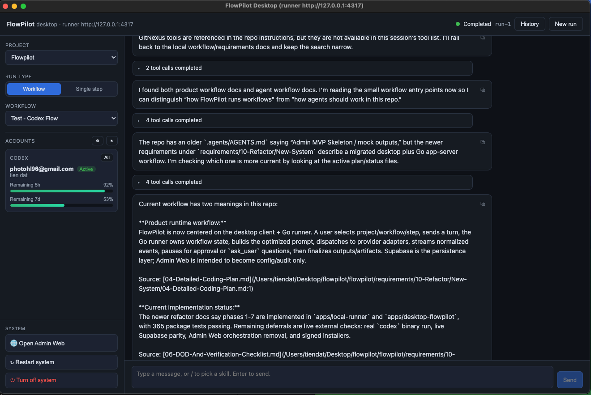
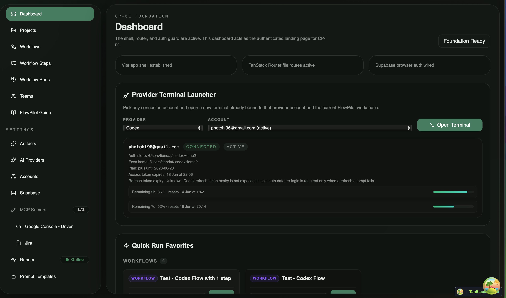

# Usecase

when we did the refactor to desktop in /New-System folder

we think that

- Keep all config pages stay in web
- move the chat part to desktop app (this one previously in web page /workflow-runs/$runId)

This was the previous strategy. It is superseded by the new strategy below.

# New strategies

i want to move all from old web -> current desktop app

# Detail feature

## Phase 1: migrate selected Admin Web pages into Desktop

Current desktop app UI like this:


Target setting/config UI should mirror the current Admin Web shell shape:


### Phase 1 goal

Move the selected Admin Web routes listed in this document into the Electron desktop
app while keeping Admin Web as a temporary reference implementation. After desktop
reaches parity for these routes, Admin Web can be deleted in a later cleanup phase.

Important clarification:

- We are not migrating every Admin Web route in Phase 1.
- We migrate only the routes listed below.
- Admin Web code stays in the repo during Phase 1 so implementation can compare
  behavior, tests, data mapping, and edge cases.
- The desktop app becomes the primary product UI for both chat and configuration.
- The new architecture must allow a future VS Code extension or other UI client to
  reuse the same domain/data logic and only rebuild the UI layer.
- Do not del code in web ver.

### Phase 1 non-goals

- Do not delete Admin Web in Phase 1.
- Do not redesign business behavior while migrating UI.
- Do not add unsupported routes such as Dashboard, Guide, Accounts, Prompt Templates,
  AI Runs, or full project sub-pages unless they are explicitly listed here.
- Do not couple shared business logic to Electron, React DOM, TanStack Router, or
  browser-only APIs.

### Target product layout

The desktop app has two top-level UI areas:

1. Main Chat area
   - Chat/interact with AI.
   - Select project, workflow, step, model/provider options, YOLO mode, and MCP tools
     needed for a run.
   - Show artifacts generated by the current chat/run session.
   - Existing "Open Admin Web" button is replaced by a "Settings" entry.

2. Settings/Configuration area
   - Opened from the desktop shell.
   - Independent desktop UI layer with a left sidebar and detail page on the right.
   - Hosts the migrated Admin Web pages listed below.
   - Uses desktop visual style and common components, not raw web styling.

### Clean Architecture target

Phase 1 must not copy page logic directly into desktop screens. First extract or
rebuild the Admin Web domain/data logic into a shared client core package, then make
desktop presentation call that shared core.

Target structure:

```text
packages/flowpilot-client-core/
  src/
    domain/
      model/
      repository/
      usecase/
      error/
    data/
      dto/
      mapper/
      datasource/
      repository/
    app/
      contract/
      composition/
      platform/

apps/desktop-flowpilot/
  src/
    presentation/
      shell/
      auth/
      projects/
      workflows/
      workflowSteps/
      teams/
      artifacts/
      settings/
    platform/
      electron/
    state/

apps/admin-web/
  src/
    ...
```

Package wiring rules:

- Add `packages/flowpilot-client-core` as a real package, imported as
  `@flowpilot/client-core`.
- If the repo has no workspace setup when implementation starts, add npm workspaces
  for `apps/*` and `packages/*` or use explicit local `file:` dependencies as an
  interim step.
- Add TypeScript project references or equivalent build wiring so desktop and Admin
  Web can typecheck against the shared package.
- Define one composition root per client:
  - desktop composition wires Electron platform adapters, runner URL, auth storage,
    and shared repositories.
  - Admin Web composition temporarily wires browser platform adapters and existing
    runtime config behavior.
  - future VS Code composition wires VS Code secrets, file picker, and webview-safe
    transport.
- Dependency direction is always:

```text
desktop presentation -> client core domain/data
admin-web presentation -> client core domain/data
future vscode presentation -> client core domain/data
client core domain -> no app dependency
client core data -> domain interfaces + platform adapters
```

- Admin Web migration is gradual: move one route's domain/data logic into shared
  core, update Admin Web to import it, then build the desktop screen from the same
  use cases. This avoids a big-bang copy and proves the shared core still preserves
  current web behavior.

Layer rules:

- `domain` contains entities, repository interfaces, and use cases only.
- `domain` has no dependency on React, Electron, browser globals, router, Supabase SDK,
  fetch, localStorage, or Node APIs.
- `data` implements domain repository interfaces using Supabase, runner HTTP APIs,
  and local runtime config APIs.
- `data` maps DTOs into domain models before returning data to use cases.
- `presentation` exists per UI client. Desktop, Admin Web, and future VS Code clients
  can each have different screens while sharing the same domain/data contracts.
- Platform-specific behavior is hidden behind interfaces, for example directory
  picker, open external URL, secure secret storage, runner base URL, and current time.

Desktop presentation pattern:

```text
FeatureScreen       -> binds use cases and owns screen lifecycle
FeatureContent      -> routes Loading/Error/Success state
FeatureSuccessView  -> renders concrete UI
feature components  -> UI-only components for that feature
```

For this TypeScript desktop app, a "ViewModel" can be a screen controller/hook/store,
but the same rule applies: it exposes screen state and accepts intents. It must not
contain Supabase queries, runner request shaping, or platform-specific file APIs.

Required shared domain repository interfaces:

```text
AuthRepository
RuntimeConfigRepository
RunnerRepository
DirectoryRepository
ProjectRepository
WorkflowRepository
WorkflowStepRepository
TeamRepository
ArtifactRepository
AiProviderRepository
McpRepository
```

Required platform adapter interfaces:

```text
HttpClient
DirectoryPicker
ExternalUrlOpener
SecureSecretStore
AuthSessionStore
RunnerEndpointProvider
Clock
```

Platform adapter rules:

- `HttpClient` is injected so shared data repositories do not depend on browser
  globals. Desktop can use `fetch`, VS Code can use its runtime-compatible transport,
  and tests can use an in-memory fake.
- `AuthSessionStore` owns token/session persistence. Desktop can back it with secure
  Electron storage; future VS Code can back it with VS Code secrets; Admin Web can
  keep browser/Supabase storage while it exists.
- `DirectoryPicker` is UI-client-specific. Desktop uses Electron APIs, VS Code uses
  VS Code APIs, and Admin Web keeps its current browser/runner bridge during
  migration.
- `DirectoryRepository` validates paths through the local runner contract. UI code
  never calls `/directories/validate` directly.
- `RunnerEndpointProvider` provides the local runner base URL per client. Shared data
  repositories receive it through composition, never from globals.

Secret and auth boundary rules:

- Supabase service-role keys are never used by UI presentation and are never exposed
  as ordinary domain state.
- The desktop Supabase setup form may collect a service-role key only to save it into
  the local runner or secure runtime config. After save, screens should receive only
  status fields such as `hasServiceRoleKey`.
- Supabase app-data repositories use the active user session or anon key according to
  the existing web behavior. Privileged local config operations go through
  `RuntimeConfigRepository` and runner endpoints.
- `AuthSession` in domain is a logical session state. Storage and token refresh are
  delegated to `AuthRepository` plus `AuthSessionStore`.

Acceptance rule for every migrated screen:

- React screen calls a use case or screen controller, not Supabase directly.
- UI-specific state stays in desktop presentation.
- Business validation stays in shared domain/use cases.
- Supabase/runner HTTP request details stay in shared data repositories.
- Unit tests can execute the same use cases without rendering desktop UI.

### Shared contracts to extract first

Extract these from Admin Web before building the desktop screens:

- Domain models:
  - `Project`
  - `ProjectWorkspaceBinding`
  - `Team`
  - `Workflow`
  - `WorkflowStep`
  - `WorkflowRunHistoryItem`
  - `ArtifactDefinition`
  - `GeneratedArtifact`
  - `ArtifactStorageConnection`
  - `AiSupportedModel`
  - `AiProviderConfig`
  - `SupabaseRuntimeConfig`
  - `McpServerConfig`
  - `RunnerHealth`
  - `DirectoryValidationResult`
  - `AuthSession`
  - `DesktopBootstrapState`

- Use cases:
  - `LoadDesktopBootstrapUseCase`
  - `LoginUseCase`
  - `LogoutUseCase`
  - `RefreshAuthSessionUseCase`
  - `LoadSupabaseConfigUseCase`
  - `ValidateSupabaseConfigUseCase`
  - `SaveSupabaseConfigUseCase`
  - `ListProjectsUseCase`
  - `CreateProjectUseCase`
  - `GetProjectDetailUseCase`
  - `UpdateProjectUseCase`
  - `ListProjectTeamsUseCase`
  - `ListProjectRunHistoryUseCase`
  - `ListProjectDirectoryBindingsUseCase`
  - `SaveProjectDirectoryBindingsUseCase`
  - `ResolveUsableProjectDirectoryUseCase`
  - `SaveProjectSessionIdleTtlUseCase`
  - `ListWorkflowsUseCase`
  - `SaveWorkflowUseCase`
  - `ListWorkflowStepsUseCase`
  - `SaveWorkflowStepUseCase`
  - `ListTeamsUseCase`
  - `ListGeneratedArtifactsUseCase`
  - `ListArtifactStorageSettingsUseCase`
  - `SaveArtifactStorageSettingsUseCase`
  - `ListArtifactDefinitionsUseCase`
  - `SaveArtifactDefinitionUseCase`
  - `ListAiSupportedModelsUseCase`
  - `SaveAiSupportedModelUseCase`
  - `LoadGoogleDriveSetupUseCase`
  - `SaveGoogleDriveSetupUseCase`
  - `LoadJiraMcpConfigUseCase`
  - `SaveJiraMcpConfigUseCase`
  - `CheckRunnerHealthUseCase`

- Data repositories:
  - Supabase-backed repositories for app data CRUD.
  - Runner HTTP repositories for local config, directory validation, provider account
    actions, MCP setup, Google Drive setup, and runner health.
  - Demo/in-memory repositories only where needed to keep development usable without
    Supabase.

### Selected route migration matrix

| Source route                                                                                                                                      | Desktop destination                                                     | Scope in Phase 1                                                                    | Source logic to preserve                                                                      |
| ------------------------------------------------------------------------------------------------------------------------------------------------- | ----------------------------------------------------------------------- | ----------------------------------------------------------------------------------- | --------------------------------------------------------------------------------------------- |
| `/login`                                                                                                                                          | `Auth/LoginScreen`                                                      | First desktop screen after app boot unless an active session exists                 | Supabase runtime status check, block login when Supabase is missing, database settings action |
| `/settings/supabase` and `/setup/supabase`                                                                                                        | `Settings/SupabaseScreen` plus pre-auth `Bootstrap/SupabaseSetupScreen` | Configure DB and storage connection used by login and app data                      | Validate/save local runner Supabase config, support first-run setup and reconfigure           |
| `/projects`                                                                                                                                       | `Settings/Projects/ListScreen`                                          | List projects and create new project                                                | Project CRUD, required directory binding on create                                            |
| `/projects/$projectId`, `/projects/$projectId/directory-bindings`, `/projects/$projectId/settings`                                                | `Settings/Projects/DetailScreen`                                        | Edit project attrs, linked teams, run history, directory bindings, idle TTL         | Project detail loader, team links, run history, binding fallback, idle TTL                    |
| `/workflows` and `/workflows/create`                                                                                                              | `Settings/Workflows/ListScreen`                                         | List/create workflows                                                               | Web workflow repository/use cases                                                             |
| `/workflows/$workflowId`                                                                                                                          | `Settings/Workflows/DetailScreen`                                       | Edit workflow                                                                       | Web workflow detail behavior                                                                  |
| `/workflow-steps` and `/workflow-steps/create`                                                                                                    | `Settings/WorkflowSteps/ListScreen`                                     | List/create workflow steps                                                          | Step definitions and supported model mapping                                                  |
| `/workflow-steps/$stepType`                                                                                                                       | `Settings/WorkflowSteps/DetailScreen`                                   | Edit workflow step                                                                  | Step detail behavior                                                                          |
| `/teams`                                                                                                                                          | `Settings/TeamsScreen`                                                  | List/create/edit teams                                                              | Team gateway/use cases                                                                        |
| `/artifacts?tab=generated`                                                                                                                        | `Settings/Artifacts/GeneratedTab`                                       | List generated artifacts by project/run                                             | Existing artifact listing/filtering                                                           |
| `/artifacts?tab=storage`                                                                                                                          | `Settings/Artifacts/StorageTab`                                         | Select remote sync provider per project                                             | Drive/Supabase sync configuration                                                             |
| `/artifacts?tab=catalog` and `/artifacts/create`                                                                                                  | `Settings/Artifacts/CatalogTab`                                         | List/create/edit artifact types                                                     | Artifact definition CRUD                                                                      |
| `/settings/ai-providers`                                                                                                                          | `Settings/AiProvidersScreen`                                            | Add/edit supported models and provider settings                                     | Supported model CRUD and provider mapping                                                     |
| `/settings/google-drive-setup`                                                                                                                    | `Settings/Mcp/GoogleDriveScreen`                                        | Google console and Drive MCP setup                                                  | Runner Google Drive config endpoints and validation                                           |
| `/settings/mcp-servers/jira-link`, plus helper flows from `/settings/mcp-servers/create` and `/settings/mcp-servers/mcp-connect-test` when needed | `Settings/Mcp/JiraScreen`                                               | Jira MCP config                                                                     | Existing MCP server config behavior, create flow, connection test                             |
| `/settings/runner`                                                                                                                                | Header runner-health modal plus `Settings/RunnerScreen`                 | Status dot in desktop header opens runner modal; full page still exists in settings | Runner health details and local runner status                                                 |

### Phase 1 implementation milestones

#### P1.0 - Inventory and contracts

Output:

- Route inventory for only the routes in the migration matrix.
- For each route, list source files, source use cases, repositories, domain models,
  runner endpoints, Supabase tables, and tests.
- Mark each source behavior as one of:
  - move to shared core
  - desktop presentation only
  - keep web-only until deletion
  - delete later

Acceptance:

- No desktop screen implementation starts until its shared domain/data contract is
  identified.
- Every migrated route has a written acceptance checklist.

#### P1.1 - Shared client core scaffold

Output:

- Create `packages/flowpilot-client-core`.
- Move or recreate shared domain models, repository interfaces, use cases, DTOs,
  mappers, and data repositories.
- Add package exports for domain and app composition.
- Desktop and Admin Web can import from this package during migration.

Acceptance:

- Shared core has no React/Electron/router imports.
- Shared use case tests pass without rendering UI.
- Shared data repositories can be tested with fake `HttpClient`, fake auth store, and
  fake runner endpoint provider.
- Existing Admin Web behavior still works while routes are being migrated.

#### P1.2 - Desktop shell, routing, bootstrap, and login

Output:

- Add desktop route/screen state model for:
  - bootstrap loading
  - runner offline
  - Supabase missing
  - Supabase invalid
  - login form
  - authenticated app shell
- Supabase settings must be reachable before authentication because first-run setup
  happens before login.
- The same Supabase configuration use cases are reused by pre-auth bootstrap setup
  and post-auth settings. Only the shell/navigation wrapper differs.
- Replace "Open Admin Web" with "Settings".
- Login screen includes "Database Settings".
- If Supabase is not configured, login is blocked and user is routed to Supabase
  settings.
- If Supabase is configured, login form is shown and database settings remains
  available.
- Logout and session refresh are handled through shared auth use cases, not desktop
  component logic.

Acceptance:

- Fresh desktop install can configure Supabase before login.
- Invalid Supabase config cannot silently enter the app.
- Desktop can recover from expired auth session by returning to login without losing
  local Supabase settings.
- Auth/session state is owned by shared use cases and desktop presentation only
  renders state.

#### P1.3 - Project migration

Output:

- Project list and create screen.
- Project detail screen with:
  - edit project attributes
  - linked teams read section
  - run history section
  - directory bindings editor
  - provider session idle TTL setting

Directory binding rule:

- One project can bind many local paths.
- Bindings are checked in configured order.
- The first usable local path is selected for execution.
- Validation may run in parallel for speed, but fallback selection must still preserve
  configured binding order.
- If no binding works, show all checked paths and reasons.
- This must match the existing web `ensureProjectHasUsableBinding` behavior.

Idle TTL rule:

- Keep the setting, but redefine it as `Provider session idle TTL` or
  `Interactive run idle timeout`.
- In the App-Server system, this controls inactive provider session/thread lifetime,
  pending approval/question expiry, resumability window, and runner cleanup.
- Killing a subprocess is only an adapter detail for providers that still own a
  local process.

Acceptance:

- Project create requires at least one directory binding.
- Duplicate binding paths are rejected.
- Fallback path selection is covered by unit tests.
- Idle TTL save/load is covered by unit tests.
- Desktop chat launch uses the resolved usable binding path instead of the old single
  `Project.path` display field.

#### P1.4 - Workflow and workflow step migration

Output:

- Workflow list/create/detail screens.
- Workflow step list/create/detail screens.
- Preserve current web model/provider/step mapping behavior.
- Desktop UI style should match the existing desktop app, not copy web styling
  blindly.

Acceptance:

- Existing workflow and step tests are ported or reused through shared use cases.
- Desktop can create/edit workflow data used later by chat run selection.

#### P1.5 - Team migration

Output:

- Team list/create/edit screen.
- Preserve existing team member and project link behavior required by project detail.

Acceptance:

- Project detail can show linked teams using shared use cases.
- Team changes are reflected after reload.

#### P1.6 - Artifact migration

Output:

- Artifacts screen with 3 tabs:
  - Generated
  - Storage
  - Catalog
- Generated tab lists artifacts by project/run.
- Storage tab configures remote sync for each project: Google Drive or Supabase.
- Catalog tab lists, creates, and edits artifact definitions/types.

Acceptance:

- Existing artifact provider switch and auto-sync logic is preserved in shared core.
- Storage tab validates required config before enabling sync.
- Generated artifacts from chat/run sessions are visible in desktop.

#### P1.7 - AI provider migration

Output:

- AI Providers settings screen.
- Add/edit supported models.
- Preserve provider key/model mapping:
  - `gpt-*` -> Codex
  - `gemini-*` and `auto-gemini-*` -> Gemini
  - `claude-*` -> Claude

Acceptance:

- New supported model can be added and used by workflow/step config.
- Provider mapping logic lives in shared core, not desktop UI.

#### P1.8 - MCP and Google Drive migration

Output:

- Google Drive setup screen.
- Jira MCP setup screen.
- Use runner endpoints for local validation, OAuth/config upload, backend config,
  and connection testing.

Acceptance:

- Google Drive setup can validate and save config from desktop.
- Jira MCP config can be created/edited from desktop.
- MCP config can be selected later from chat/workflow run setup.

#### P1.9 - Runner status migration

Output:

- Add a small runner status dot/circle in the desktop header.
- Clicking it opens a modal with full runner health data.
- Keep a full Runner settings page for detailed diagnostics.
- Do not confuse runner health with active run status. The existing chat run status
  remains separate from the runner online/offline indicator.

Acceptance:

- Header shows online/offline state.
- Modal shows base URL, version, workspace, platform, started time, and error.
- Offline runner state blocks operations that require runner APIs and gives a clear
  recovery message.

#### P1.10 - Phase 1 verification and cutover readiness

Output:

- Desktop parity checklist for every migrated route.
- Shared core unit tests.
- Desktop UI tests for route/screen state transitions.
- Runner API contract tests where desktop calls local runner endpoints.
- Import-boundary checks or tests prove `packages/flowpilot-client-core/domain` has no
  presentation, Electron, router, Supabase SDK, or browser-global dependency.
- Migrated Admin Web routes that already moved to shared core still pass their current
  tests until Admin Web deletion.
- Manual smoke checklist using real Supabase and runner.

Acceptance:

- All selected routes in the migration matrix are usable from desktop.
- Admin Web is no longer required for the selected routes.
- Admin Web is still present only as a temporary reference and fallback.
- A later phase can delete Admin Web route-by-route after parity signoff.

## Phase 2: improve the chat location

move to 08-Desktop-Chat-New-Plan.md