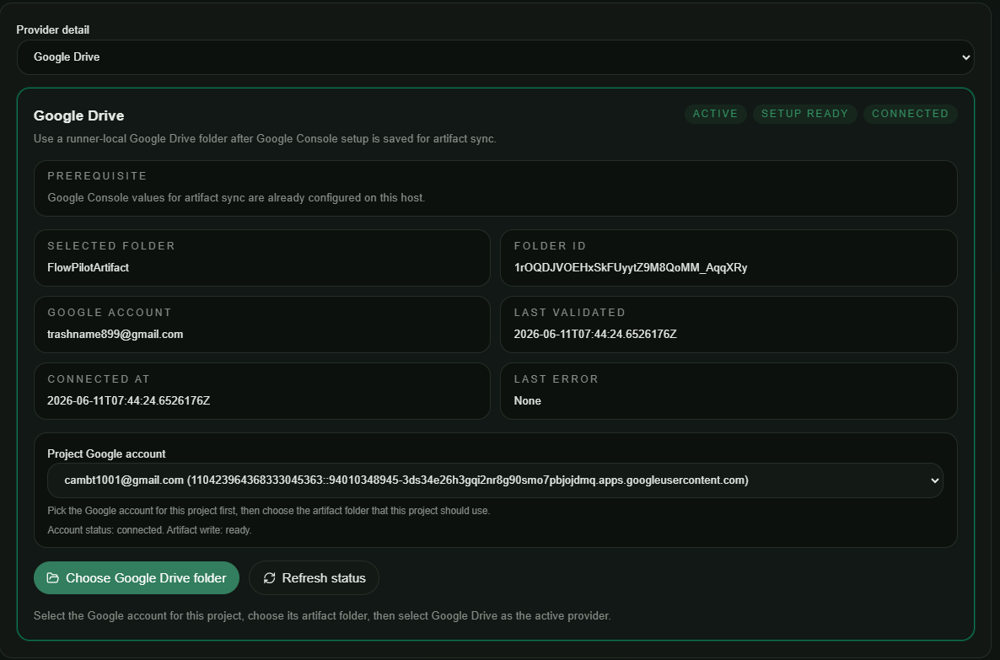
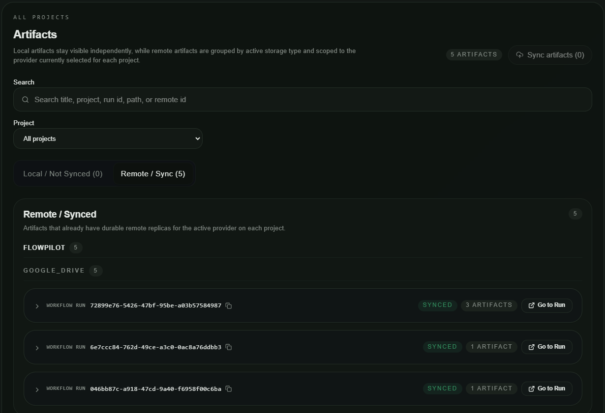

This doc keep all issues i found after test the desktop app
after PHASE 1 of R3-Migrate-Web-To-Desktop.md + R3-Phase1-Checklist.md was implemented

1. Move the tab supabase to the bottom, above Runner tab
2. Runner tab must have 1 circle idicator right next to the text Runner in the menu
3. Page Project: /projects in web
  1. Should NOT Show the create form -> use 1 Create cirle button -> press nav to new route in this menu tab for creating new project
  2. The main page of this tab needs has 2 sides: left side shows a list of project, the righ side is the detail of that project
  3. In detail page, each item should be a collapsible list, Default is exapand 1st item
  4. Change item name:Integrations to MCP
  5. Missing Artifact item to show a list of artifact gen in this project
  6. Each item: Teams,Run History, MCP, Artifact: must 1 button to nav to that page. for example i can see the team list now. but i want to create more or see detail members before link to this project
  7. Missing the button to DEl current project. When del, show 1 form that request User input exactly "the text : delete to enable the DEL button in that modal form
4. Workflows page: refer: /workflows + /workflow-steps in web
  1. Update the menu name from Workflows -> Workflows/Steps
  2. Missing button del workflow + step
  3. Pressing Create workflow auto create new empty workflow is not correct
    1. The form for all page like this is: main page show current data: left side is list. right side is detail. 1 del + create button. Create button shows another page in this tab for creating form. Detail page for current item can show in edit mode. But only enable/highligh the SAVE button when we change the data
    2. Update for both workflow and step
  4. Workflow Detail missed: Reasoning effort + YOLO mode setting
  5. Step detail missed: Required MCPs + Required skills + Prompt base + Subagent + Reasoning + Input artifact definitions + Ouput artifact definitions
5. Page Teams: ref /teams?teamId=id in web
- same above when we miss: del team, missing creating new team in another page
- missing member detail page
6. Google Driver tab: refer /settings/google-drive-setup in web
- BIG BUG: completely missing comparing with web. Check again
7. Artifacts page: refer /artifacts?tab=generated in web
7.1 Tab Catalog: refer /artifacts?tab=catalog
- Same issue with create in new page + missinge del button
7.2 Tab Storage: refer /artifacts?tab=storage
Completely wrong with web version
This page show project list in left side. Right side show storate of this project
We have supabase or googdrive. If suspabase is active then do not show driver setup
If googlder is active or change by user -> show driver config like this
 (Follow the concept, UI can be adapt in style of desktop app)
7.3 Tab Generated
/artifacts?tab=generated

You missed local/remote tab concept
You missed Sync artifact button
Missed concept of collapsible with level group by project, supabase/driver. step,...